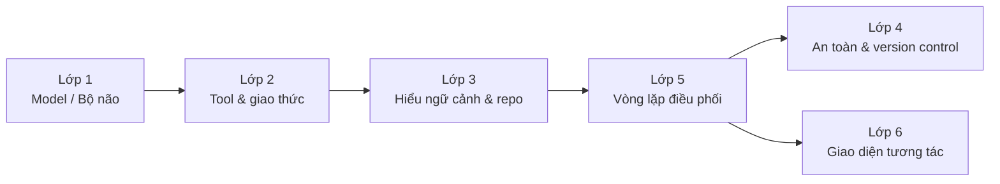
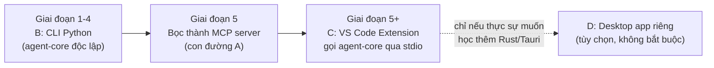
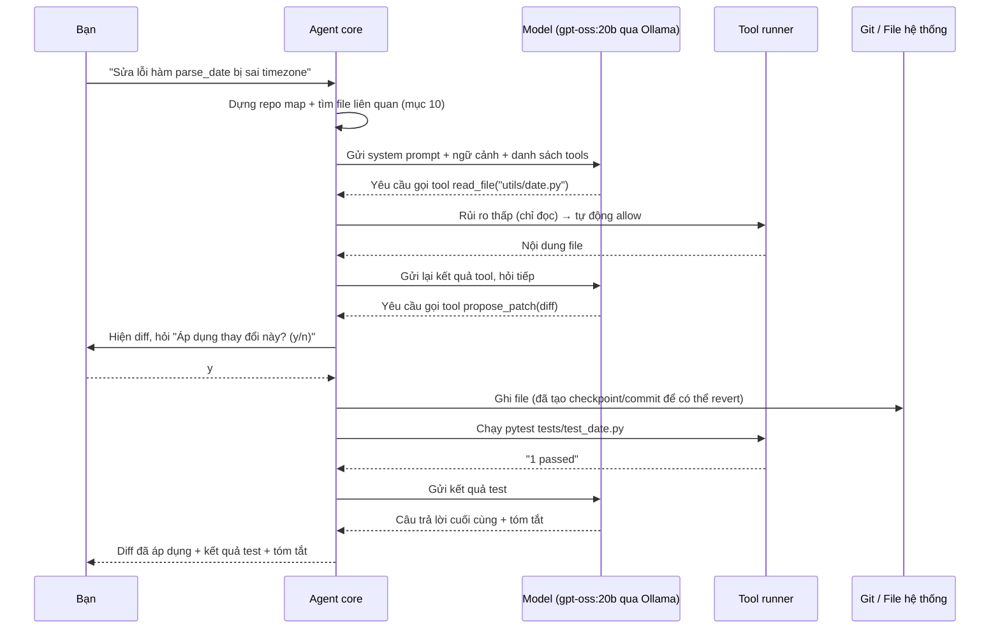

<!-- markdownlint-disable MD024 MD025 MD060 -->

# Kế hoạch xây dựng Local AI Coding Assistant — Phân tích của Claude Sonnet 5

> Phiên bản: 1.0 · Ngày lập: 28/09/2026 · Người phân tích: Claude Sonnet 5 (GitHub Copilot)
> Phạm vi: một trợ lý lập trình chạy được ở chế độ local, lấy cảm hứng từ trải nghiệm cốt lõi của Codex, Claude Code và Cursor
> Nền tảng: kiến thức thật đã xác minh trong khóa "LLM Engineering" (repo này) + kiến thức bổ sung từ bên ngoài, có ghi nguồn rõ ràng

## Trước khi đọc: về bản kế hoạch song song đã có trong repo

Repo này đã có sẵn [gpt-5dot6-sol-KE-HOACH-XAY-DUNG-LOCAL-AI-CODING-ASSISTANT.md](gpt-5dot6-sol-KE-HOACH-XAY-DUNG-LOCAL-AI-CODING-ASSISTANT.md) — một bản kế hoạch rất chi tiết do model GPT-5.6 soạn trước đó (kiến trúc desktop Tauri, quy trình an toàn/approval rất sâu, roadmap theo mốc M0-M9). Tôi đã đọc kỹ bản đó trước khi viết tài liệu này để không lặp lại y nguyên.

Tài liệu dưới đây là **phân tích độc lập** của tôi, tự kiểm chứng lại toàn bộ nội dung khóa học (đọc trực tiếp source code thật trong `week8/agents/`, bảng ghi chú từng tuần, các guide 07/09/11/12/13/14) thay vì suy đoán. Hai bản có nhiều điểm **kết luận giống nhau** (vì cùng dựa trên một thực tế khách quan), nhưng **khác nhau rõ rệt ở kiến trúc đề xuất** (mục 6) và cách cá nhân hóa theo đúng hồ sơ kỹ năng của bạn. Mục 18 ở cuối tài liệu tóm tắt nhanh sự khác biệt. Bạn nên đọc chéo cả hai rồi tự quyết định, thay vì làm theo một bản duy nhất.

## Cách đọc tài liệu này

- Chỉ cần câu trả lời "có làm được không": đọc mục 1.
- Muốn hiểu vì sao kiến trúc được chọn: đọc mục 3–7.
- Chuẩn bị bắt tay code: đọc mục 8–13.
- Dùng mục 12 làm checklist tiến độ chính; mục 14 để biết khi nào là "đủ tốt".

Tài liệu này **cố tình không đưa ra mốc thời gian (giờ/tuần/tháng)**. Tốc độ thực tế phụ thuộc vào thời gian rảnh, phần cứng và việc bạn học Python/agent đến đâu — con số ước lượng chỉ tạo cảm giác an toàn giả. Thay vào đó, mỗi giai đoạn ở mục 12 có **Definition of Done** rõ ràng: bạn tự biết khi nào xong để chuyển giai đoạn tiếp theo.

---

## 1. Có làm được không?

**Trả lời ngắn gọn: Có.** Bạn có thể xây một ứng dụng chạy trên máy của bạn, dùng model local (qua Ollama) hoặc model cloud tùy chọn, để: đọc và hiểu một repository, trả lời câu hỏi có trích dẫn nguồn, đề xuất sửa code kèm diff cho bạn duyệt, chạy test/lint có kiểm soát, và báo cáo kết quả — đúng phần trải nghiệm cốt lõi khiến Cursor/Claude Code/Codex hữu ích hằng ngày.

Điều thú vị là chính README của khóa học đã nhắc đến chủ đề này:

> "Early on in the course (on Day 2), I give a demo of a very cool, popular product called Claude Code. It's an AI coding tool, similar to Cursor that we use on the course. I'm only showing this as an example of Agentic AI in action; it's not a tool that's covered explicitly on this course, particularly as we're in Cursor."
> — [README.md](README.md), dòng giới thiệu Claude Code

Nói cách khác: **giảng viên xác nhận rõ Claude Code chỉ được trình diễn như một ví dụ về Agentic AI, không phải nội dung được dạy từng bước.** Kế hoạch này tồn tại chính xác để lấp khoảng trống đó — dùng những kỹ thuật *đã được dạy* (gọi model, tool calling, RAG, agent loop, đánh giá) để tự ráp lại một phiên bản thu nhỏ của thứ đã được trình diễn.

### Mức độ khả thi thực tế theo từng mục tiêu

| Mục tiêu | Khả thi cho một người tự học? | Vì sao |
|---|---|---|
| Chatbot local hỏi-đáp về code, không sửa file | Rất cao | Chỉ cần Week 1 + guide 09 (Ollama) |
| Trợ lý đọc/tìm kiếm repo có trích dẫn (read-only) | Rất cao | Week 2 (tool calling) + kỹ thuật repo map (mục 10) |
| **Trợ lý sửa code có duyệt diff, chạy test, có thể dùng hằng ngày** | Cao — đây là mục tiêu MVP hợp lý | Cần ghép kiến thức khóa học với phần an toàn/patch tự học thêm (mục 11) |
| Bản sao gần đúng IDE của Cursor (autocomplete, LSP, debugger, đa nền tảng) | Thấp cho một người, một mình | Khối lượng kỹ thuật ngoài phạm vi "AI Engineering" — thuộc về kỹ thuật xây IDE |
| Bản sao y hệt Codex/Claude Code về thương hiệu, hạ tầng, quy mô | Không nên đặt mục tiêu | Đó là sản phẩm của cả một công ty, không phải bài toán học tập cá nhân |

**Định vị nên chọn:** một "trợ lý lập trình cá nhân chạy local", không phải "Cursor phiên bản nhái". Giá trị cốt lõi cần đạt được là vòng lặp: *hiểu yêu cầu → tìm đúng ngữ cảnh trong repo → đề xuất thay đổi → xin phép → chạy test → báo cáo có bằng chứng*. Mọi tính năng khác (giao diện đẹp, autocomplete, đa nền tảng...) đều là "có thì tốt", không phải điều kiện để dự án thành công.

---

## 2. "Local" nghĩa là gì?

Trước khi thiết kế, cần tách rõ hai trục — gộp chung dễ khiến bạn tưởng nhầm app đã "riêng tư hoàn toàn" trong khi thực ra vẫn gửi code ra ngoài:

| Trục | Câu hỏi | Lựa chọn trong kế hoạch này |
|---|---|---|
| **Nơi chạy ứng dụng và dữ liệu** | UI, lịch sử chat, index code nằm ở đâu? | Luôn nằm trên máy bạn — đây là phần "local app" |
| **Nơi chạy model suy luận (bộ não)** | Câu hỏi/code của bạn có rời máy không? | Mặc định: Ollama chạy local, không gửi đi đâu cả. Cloud (OpenAI/Claude/Gemini...) chỉ là **tùy chọn**, phải được bạn chủ động bật |

Ứng dụng nên luôn hiển thị rõ đang dùng model nào (badge `LOCAL` hay `CLOUD`), vì đây là khác biệt lớn nhất giữa "một công cụ riêng tư thật sự" và "một giao diện đẹp gọi API cloud". Toàn bộ kế hoạch bên dưới mặc định **Ollama local là backend chính**; cloud chỉ được nhắc tới như một lựa chọn dự phòng khi model local chưa đủ mạnh cho một tác vụ khó.

---

## 3. Giải phẫu một coding agent hiện đại thành 6 lớp

Để biết khóa học đã dạy gì và còn thiếu gì, cần trước tiên hiểu Cursor/Claude Code/Codex thực sự được ghép từ những lớp nào. Đây là khung phân tích tôi dùng xuyên suốt tài liệu:



1. **Model / Bộ não** — LLM nào trả lời, chạy local hay cloud, cách gọi API.
2. **Tool & giao thức** — cách model "chạm" vào thế giới thật: đọc file, sửa file, chạy lệnh, tìm kiếm. Đây là ranh giới giữa "chatbot biết nói" và "agent biết làm".
3. **Hiểu ngữ cảnh & repo** — làm sao đưa đúng phần code liên quan vào prompt mà không tràn context (repo map, RAG, symbol search).
4. **An toàn & version control** — sandbox, xin phép trước khi ghi/chạy lệnh, diff để review, Git làm lưới an toàn, rollback.
5. **Vòng lặp điều phối (agent loop)** — ai quyết định bước tiếp theo, khi nào dừng, giới hạn số bước/chi phí.
6. **Giao diện tương tác** — CLI, chat panel, hay tích hợp trực tiếp vào editor.

Bảng ở mục 4 sẽ ánh xạ từng lớp này vào đúng tuần/bài học đã có trong repo.

---

## 4. Khóa học đã cho bạn gì, cụ thể đến từng file

Đây là phần tôi tự kiểm chứng lại bằng cách đọc trực tiếp source code trong repo (không chỉ đọc ghi chú tóm tắt), nên có cả trích dẫn số liệu demo thật.

| Lớp | Tuần / Guide | Kiến thức cụ thể | Bằng chứng trong repo |
|---|---|---|---|
| 1 | Week 1 | Gọi frontier model (OpenAI/Claude...), system+user prompt, streaming | [week1/Week1_Notes.md](week1/Week1_Notes.md) |
| 1 | Guide 09 | **Mọi provider (Anthropic, DeepSeek, Gemini, Grok, Groq, OpenRouter, Ollama) đều lộ endpoint kiểu OpenAI** — chỉ cần đổi `base_url`; Ollama là `http://localhost:11434/v1`, `api_key` bất kỳ | [guides/09_ai_apis_and_ollama.ipynb](guides/09_ai_apis_and_ollama.ipynb) |
| 1 | Week 3 | Tự nạp model mã nguồn mở, tokenizer, chat template, quantization (NF4/4-bit) | [week3/Week3_Notes.md](week3/Week3_Notes.md) |
| 1 | Week 4 Day 4 | **Đã tự thử model local qua Ollama cho đúng việc sinh code**: `gpt-oss:20b` chạy local đạt tăng tốc 238× (vượt cả `gpt-oss:120b` chạy qua Groq chỉ đạt 14×); `deepseek-coder-v2` local đạt 168× | [week4/Week4_Notes.md](week4/Week4_Notes.md) |
| 2 | Week 2 Day 4–5 | **Cơ chế tool calling đầy đủ**: khai báo `tools`, model trả `tool_calls` thay vì trả lời thẳng, backend tự chạy hàm thật, gửi kết quả về bằng `role: "tool"` khớp `tool_call_id`, rồi gọi lại model | [week2/Week2_Notes.md](week2/Week2_Notes.md) |
| 2 | Week 8 Day 3 | Structured Outputs + Pydantic để ép model trả đúng schema (nền tảng cho tool result đáng tin cậy) | [week8/Week8_Notes.md](week8/Week8_Notes.md) |
| 3 | Week 5 | Chunking, embedding, ChromaDB, RAG cơ bản → nâng cao (semantic chunking, query rewriting, reranking) + **đo bằng số liệu** (MRR 0,73 → 0,91 sau khi nâng cấp) | [week5/Week5_Notes.md](week5/Week5_Notes.md) |
| 4 | Guide 07 | Nguyên tắc "vibe coding": nêu đích danh Cursor, luôn ghi ngày hiện tại trong prompt để tránh API cũ, giữ code ngắn/đơn giản, chia nhỏ từng bước có thể test | [guides/07_vibe_coding_and_debugging.ipynb](guides/07_vibe_coding_and_debugging.ipynb) |
| 5 | Week 8 | **Kiến trúc multi-agent thật**: `Agent` (lớp cha, chỉ lo logging màu), `ScannerAgent`, `EnsembleAgent`, `PlanningAgent`, `MessagingAgent`, đóng gói trong `DealAgentFramework` + `memory.json` + Gradio + timer | [week8/agents/agent.py](week8/agents/agent.py), [week8/deal_agent_framework.py](week8/deal_agent_framework.py) |
| 5 | Guide 11 | `asyncio` cơ bản: `await`, `asyncio.gather` để chạy song song | [guides/11_async_python.ipynb](guides/11_async_python.ipynb) |
| 6 | Week 2 Day 2–3 | Gradio: `gr.Interface`, `gr.ChatInterface`, streaming bằng cách cộng dồn rồi `yield` | [week2/Week2_Notes.md](week2/Week2_Notes.md) |
| 6 | Guide 13 | Lộ trình frontend thật: HTML/CSS/JS → JS hiện đại → TypeScript → **React (TypeScript)** → React hooks/state → Next.js | [guides/13_frontend.ipynb](guides/13_frontend.ipynb) |
| — | Guide 12 | Triết lý làm dự án AI của Ed Donner: "Be a Scientist", "Embrace R&D", "Dream big but start SMALL" — đo trước khi tin, bắt đầu từ notebook, không vẽ kiến trúc to trước khi thử nghiệm nhỏ | [guides/12_starting_your_project.ipynb](guides/12_starting_your_project.ipynb) |

### Phát hiện quan trọng nhất khi tôi đọc code thật: `PlanningAgent` không hề để LLM "tự do quyết định"

Ghi chú tóm tắt Week 8 mô tả Day 4 là "Planning Agent dùng tool calling để điều phối". Nhưng khi tôi đọc thẳng file thật [week8/agents/planning_agent.py](week8/agents/planning_agent.py) — class được đóng gói và thực sự chạy trong `DealAgentFramework` — luồng `plan()` lại là **code Python tuần tự cố định**:

```python
def plan(self, memory: List[str] = []) -> Optional[Opportunity]:
    selection = self.scanner.scan(memory=memory)                 # bước 1: cố định
    opportunities = [self.run(deal) for deal in selection.deals[:5]]  # bước 2: cố định
    opportunities.sort(key=lambda opp: opp.discount, reverse=True)     # bước 3: cố định
    best = opportunities[0]
    if best.discount > self.DEAL_THRESHOLD:
        self.messenger.alert(best)                                # bước 4: có điều kiện, vẫn là code
    return best if best.discount > self.DEAL_THRESHOLD else None
```

Notebook dạy khái niệm tool-calling-loop bằng hàm giả để minh họa nguyên lý, nhưng **bản chạy thật trong sản phẩm capstone lại chọn cách an toàn hơn**: LLM chỉ được giao từng việc hẹp (trích xuất dữ liệu có cấu trúc, định giá, soạn tin nhắn), còn **thứ tự và điều kiện chạy do lập trình viên viết chết trong code**, không giao cho model tự quyết định toàn bộ.

Đây là bằng chứng thực tế — không phải suy đoán lý thuyết — ủng hộ nguyên tắc sẽ lặp lại nhiều lần trong tài liệu này: **để code kiểm soát khung xương của agent loop, chỉ để LLM quyết định ở những điểm hẹp, có ranh giới rõ.**

### Những gì khóa học KHÔNG dạy — cần bổ sung từ bên ngoài

| Lớp | Còn thiếu | Bổ sung từ đâu (mục liên quan) |
|---|---|---|
| 2 | Sửa file an toàn bằng diff/patch, thay vì ghi đè | Kỹ thuật edit-format của Aider (mục 9) |
| 2 | Chạy lệnh/subprocess an toàn (timeout, kill process, không dùng `shell=True`) | Kiến thức hệ điều hành tổng quát (mục 11, 16) |
| 2 | Giao thức tool chuẩn hóa, tái dùng được ở nhiều client | Model Context Protocol — MCP (mục 6, 9) |
| 3 | "Repo map" theo cấu trúc code (class/function/symbol), không chỉ theo đoạn văn bản | Kỹ thuật repo map của Aider (mục 10) |
| 4 | Threat model cho agent: prompt injection từ chính nội dung file/README, path traversal, rò rỉ secret | OWASP LLM Top 10 (mục 11, 16) |
| 6 | VS Code Extension API, hoặc Tauri/Electron nếu muốn desktop riêng | Tài liệu chính thức của nền tảng tương ứng (mục 16) |
| — | Docker/Terraform cho việc đóng gói/triển khai | Guide 14 chỉ trỏ sang 2 link ChatGPT ngoài, chưa dạy sâu — [guides/14_docker_terraform.ipynb](guides/14_docker_terraform.ipynb) |

---

## 5. Phân tích riêng cho hồ sơ của bạn

Hai điều tôi đã ghi nhận được từ các phiên làm việc trước trong chính repo này, rất đáng đưa vào quyết định kiến trúc:

1. **Nền tảng của bạn là React/JS mạnh, Python/ML đang học dần qua khóa này.** Điều này ảnh hưởng trực tiếp đến việc nên viết UI bằng gì (mục 6).
2. **Bạn từng nêu mục tiêu cá nhân "một công cụ AI cá nhân hỗ trợ luyện tập lập trình + phát triển sản phẩm mới"** — yêu cầu hôm nay chính là việc hiện thực hóa mục tiêu đó, không phải một ý tưởng mới tách rời.

### Máy của bạn đã có sẵn gì?

File [Danh-Sach-Models-VSCode-Copilot.md](Danh-Sach-Models-VSCode-Copilot.md) (chụp lại danh sách model trong VS Code Copilot ngày 20/09/2026) cho thấy Ollama **đã được cài và đã có sẵn nhiều model** trên máy bạn:

| Model đã có | Context | Hỗ trợ Tools (function calling)? | Ghi chú |
|---|---|---|---|
| `gpt-oss:20b` | 131K | ✅ Có | **Khuyến nghị chính** — đã được chính khóa học benchmark cho việc sinh code (mục 4), lại có Tools nên dùng được cho agent loop |
| `gpt-oss:latest` | 131K | ✅ Có | Tương đương bản trên, cập nhật theo phiên bản mới nhất |
| `llama3.2:latest` | 131K | ✅ Có | Model tổng quát, nhẹ hơn, phù hợp việc hỏi-đáp đơn giản khi cần tốc độ |
| `deepseek-r1:1.5b` | 131K | ✅ Có | Model reasoning nhỏ, hữu ích khi cần model "suy nghĩ từng bước" nhẹ |
| `deepseek-coder-v2:latest` | 164K | ❌ Không | Chuyên code, context lớn nhất nhóm local — **nhưng không tự gọi tool được** |
| `phi3:latest` | 131K | ❌ Không | Nhỏ gọn, không có Tools |
| `qwen:latest` | 33K | ❌ Không | Context nhỏ, không có Tools |
| `gemma3:270m` | 33K | ❌ Không | Cực nhỏ, chỉ hợp việc test nhanh |

**Điểm mấu chốt dễ bị bỏ qua:** model "chuyên code" mạnh nhất bạn đang có (`deepseek-coder-v2`) **lại không hỗ trợ Tools**. Nếu chọn nó làm bộ não cho agent loop, bạn sẽ phải tự dựng cơ chế "tool calling giả" bằng cách ép model trả JSON trong văn bản rồi tự parse (dùng lại đúng kỹ thuật Structured Outputs + Pydantic của Week 8 Day 3) — khả thi nhưng kém tin cậy hơn hẳn so với dùng model có Tools thật. Vì vậy khuyến nghị: **dùng `gpt-oss:20b` làm bộ não chính cho agent loop (vì có Tools thật)**, chỉ gọi `deepseek-coder-v2` cho các tác vụ sinh/giải thích code thuần túy không cần gọi tool.

Ghi chú quan trọng: model tốt cho code thay đổi rất nhanh. Vì ngày hệ thống hiện tại (2026-09-28) đã vượt xa mốc kiến thức huấn luyện của tôi, **hãy tự chạy `ollama list` và kiểm tra `ollama.com/library` tại thời điểm bạn triển khai** thay vì tin tuyệt đối vào bảng trên.

---

## 6. Bốn con đường kiến trúc — và vì sao tôi chọn khác bản GPT-5.6

| Con đường | Bộ não | Giao diện | Ưu điểm | Nhược điểm |
|---|---|---|---|---|
| **A. Chỉ làm "tool server", mượn UI có sẵn** | Tùy client (Ollama nếu client hỗ trợ, hoặc cloud) | Client MCP có sẵn (Continue.dev, Claude Desktop...) | Gần như không phải viết UI, học MCP rất nhanh có kết quả | Không phải mọi client đều cho gắn model Ollama làm "bộ não" — chỉ có tool phần bạn tự viết |
| **B. CLI tự viết bằng Python** | Ollama local (`gpt-oss:20b`) | Terminal | 100% nằm trong kiến thức khóa học (Python + OpenAI client + tool loop); bạn làm chủ hoàn toàn "bộ não" | Trải nghiệm terminal, chưa có diff viewer đẹp |
| **C. VS Code Extension (TypeScript) + Python agent-core** | Ollama local, gọi từ Python sidecar | Webview chat trong VS Code, tái dùng diff viewer / terminal / file explorer / Source Control có sẵn | Tận dụng đúng thế mạnh React/TS của bạn; **không phải tự viết lại Monaco, xterm.js, file tree, git UI** — VS Code đã có sẵn tất cả | Cần học VS Code Extension API |
| **D. Desktop app riêng (Tauri/Electron)** | Ollama local | Cửa sổ desktop tự vẽ từ đầu | Toàn quyền kiểm soát giao diện, đóng gói installer riêng | Phải học thêm Rust (Tauri) hoặc quản lý Electron nặng nề; phải tự xây lại mọi thứ VS Code đã có sẵn (diff viewer, terminal, file tree...) |

Bản kế hoạch GPT-5.6 chọn **con đường D (Tauri desktop)** làm hướng chính. Tôi **không chọn D làm khuyến nghị chính**, vì hai lý do cụ thể cho đúng trường hợp của bạn:

1. Bạn đang thao tác chính trong VS Code (chính cuộc trò chuyện này diễn ra trong VS Code Copilot Chat). VS Code đã có sẵn: file explorer, diff viewer, terminal tích hợp, Source Control view, command palette, thông báo, webview để dựng chat UI. Xây một **VS Code Extension** tận dụng lại toàn bộ hạ tầng đó — đúng như cách các công cụ mã nguồn mở nổi tiếng nhất trong đúng hạng mục "trợ lý code chạy được model local" đã làm (Continue.dev, Cline — cả hai đều là VS Code extension hỗ trợ Ollama). Đây không phải suy đoán của tôi mà là tiền lệ có thật, đáng để bạn tham khảo trực tiếp mã nguồn của họ.
2. Extension VS Code viết bằng **TypeScript** — đúng thế mạnh React/JS bạn đã có sẵn, trong khi Tauri đòi hỏi học thêm Rust cho phần shell, một khoản đầu tư không thực sự cần thiết cho mục tiêu "trợ lý cá nhân dùng hằng ngày".

**Khuyến nghị của tôi: đi theo B trước, rồi C.** Bắt đầu bằng B (CLI Python thuần) để bạn tự tay làm chủ toàn bộ "bộ não" — đây cũng là cách học hiệu quả nhất, đúng tinh thần guide 12 ("start small, work incrementally"). Sau khi bộ não (agent-core) đã chạy ổn trong CLI, bọc nó thành C (VS Code Extension) để có trải nghiệm liền mạch hơn, tái sử dụng UI đã có sẵn thay vì tự vẽ lại. Con đường A (MCP) nên được xây **song song** ngay từ Giai đoạn 2 — không phải vì nó thay thế B/C, mà vì bọc tool thành MCP server hầu như không tốn thêm công sức nếu tools đã có schema rõ ràng, và nó cho bạn một cách kiểm thử nhanh (cắm vào một client MCP có sẵn) trước khi tự viết UI riêng. Con đường D chỉ đáng cân nhắc nếu sau này bạn **muốn học Tauri/Rust vì bản thân điều đó**, không phải vì sản phẩm bắt buộc cần nó.



---

## 7. Chọn model local cụ thể

Nguyên tắc chọn, theo đúng tinh thần Week 4 (đo bằng việc thật, không tin tên gọi): **Tools/function-calling support là điều kiện lọc đầu tiên** cho bộ não của agent loop — model dù "chuyên code" đến đâu mà không gọi tool được thì không dùng trực tiếp cho vòng lặp agent được.

| Việc cần làm | Model khuyến nghị (đã có sẵn trên máy bạn) | Vì sao |
|---|---|---|
| Bộ não chính cho agent loop (đọc/sửa/chạy lệnh) | `gpt-oss:20b` | Có Tools thật; đã được khóa học benchmark tốt cho code (238× ở Week 4 Day 4) |
| Sinh/giải thích một đoạn code độc lập, không cần gọi tool | `deepseek-coder-v2:latest` | Chuyên code, context 164K, dù thiếu Tools nhưng không cần cho việc này |
| Việc nhẹ, cần tốc độ (tóm tắt, phân loại nhanh) | `llama3.2:latest` hoặc `phi3:latest` | Nhẹ, phản hồi nhanh, đủ dùng cho việc không phức tạp |
| Thử nghiệm reasoning từng bước ở quy mô nhẹ | `deepseek-r1:1.5b` | Có Tools, thuộc dòng reasoning, chi phí tính toán thấp |

Quy tắc thực hành khi triển khai (không suy đoán, phải tự đo trên máy bạn):

1. Chạy `ollama list` để xác nhận model nào thật sự đã tải, `ollama ps` để xem model nào đang chiếm bộ nhớ.
2. Kiểm tra VRAM/RAM khả dụng trước khi chọn model lớn hơn — mô hình dạng Mixture-of-Experts như `gpt-oss:20b` chỉ kích hoạt một phần tham số mỗi lượt suy luận nên thường nhẹ hơn một model dense cùng kích thước danh nghĩa, nhưng vẫn cần benchmark thật, không suy đoán từ tên gọi.
3. Nếu một tác vụ khó (ví dụ refactor nhiều file) mà model local liên tục trả lời kém, đó là lúc hợp lý để bật tùy chọn cloud (mục 2) cho riêng tác vụ đó — không phải để thay thế local vĩnh viễn.
4. Theo dõi lại `ollama.com/library` định kỳ: các model code mã nguồn mở (họ Qwen-Coder, DeepSeek-Coder, CodeLlama, StarCoder...) cập nhật phiên bản rất thường xuyên; bảng trên chỉ phản ánh đúng những gì đã xác nhận có trên máy bạn tại thời điểm viết tài liệu.

---

## 8. Thiết kế "bộ não" — Agent Loop

### Nguyên tắc bắt buộc (rút ra từ mục 4 — có bằng chứng thật, không phải lý thuyết suông)

- **Code kiểm soát khung xương, LLM chỉ quyết định trong phạm vi hẹp** — đúng như `PlanningAgent` thật của Week 8 đã làm.
- **Một câu hỏi cần tool thường tốn ít nhất hai lượt gọi model** (một lượt để yêu cầu gọi tool, một lượt để viết câu trả lời dựa trên kết quả) — đúng cơ chế Week 2 Day 4 đã dạy.
- **Luôn có giới hạn số bước** — guide 09 đã cảnh báo rõ: agent có thể lặp nhiều hơn dự tính và đội chi phí/thời gian nếu không giới hạn.

### Khung xương vòng lặp (dựa trực tiếp trên mẫu Week 2 Day 4–5, thêm giới hạn an toàn)

```python
from openai import OpenAI
import json

OLLAMA_BASE_URL = "http://localhost:11434/v1"
client = OpenAI(base_url=OLLAMA_BASE_URL, api_key="ollama")
MODEL = "gpt-oss:20b"

tools = [
    {
        "type": "function",
        "function": {
            "name": "read_file",
            "description": "Đọc nội dung một file trong workspace hiện tại (đường dẫn tương đối).",
            "parameters": {
                "type": "object",
                "properties": {"path": {"type": "string"}},
                "required": ["path"],
            },
        },
    },
    # search_text, propose_patch, run_command, git_diff khai báo tương tự
]

def run_tool(name: str, arguments: dict) -> str:
    # QUAN TRỌNG: policy allow/ask/deny (mục 11) phải chạy TRƯỚC bước này,
    # không phải sau. Đây là nơi phân biệt "chatbot" và "agent an toàn".
    ...

def agent_step(messages: list, max_steps: int = 8) -> str:
    for _ in range(max_steps):
        response = client.chat.completions.create(
            model=MODEL, messages=messages, tools=tools,
        )
        msg = response.choices[0].message
        if not msg.tool_calls:
            messages.append({"role": "assistant", "content": msg.content})
            return msg.content  # Model đã trả lời cuối cùng — dừng vòng lặp

        messages.append(msg)  # ghi lại chính yêu cầu gọi tool của model
        for call in msg.tool_calls:
            args = json.loads(call.function.arguments)
            result = run_tool(call.function.name, args)
            messages.append({
                "role": "tool", "tool_call_id": call.id, "content": result,
            })
    return "Đã chạm giới hạn max_steps — dừng để tránh vòng lặp không kiểm soát."
```

### Sơ đồ một lượt chạy đầy đủ (có bước xin phép trước khi ghi file)



### Viết system prompt — áp dụng thẳng lời khuyên "vibe coding" của guide 07

- Luôn chèn ngày hiện tại vào system prompt, và yêu cầu model dùng đúng API/thư viện phiên bản mới — chính guide 07 cảnh báo model rất hay tự dùng API cũ, đặc biệt với các API hay đổi.
- Yêu cầu model giữ mỗi thay đổi "ngắn và đơn giản nhất có thể" — model có xu hướng viết thêm code phòng thủ thừa thãi, gây khó review diff.
- Với các quyết định quan trọng (ví dụ cách sửa một bug khó), có thể áp dụng đúng mẹo guide 07: hỏi model đưa ra 2-3 phương án sửa khác nhau, bạn (hoặc một model thứ hai) chọn phương án rõ ràng nhất, thay vì chấp nhận ngay đề xuất đầu tiên.

---

## 9. Bộ công cụ (tools) cần xây

| Tool | Việc chính | Mức rủi ro | Cần hỏi trước khi chạy? |
|---|---|---|---|
| `list_files` | Liệt kê file theo thư mục/glob | Thấp | Không |
| `read_file` | Đọc nội dung file (theo khoảng dòng) | Thấp | Không |
| `search_text` | Tìm chuỗi/regex trong repo | Thấp | Không |
| `get_repo_map` | Trả về bản đồ symbol rút gọn (mục 10) | Thấp | Không |
| `git_status` / `git_diff` | Xem trạng thái/thay đổi hiện tại | Thấp | Không |
| `propose_patch` | Trả về unified diff cho một thay đổi | Trung bình | **Có** — luôn hiện diff và hỏi trước khi ghi |
| `run_command` | Chạy test/lint/build đã khai báo trước (allowlist) | Trung bình–Cao | **Có** ở lần đầu trong mỗi phiên |

Nguyên tắc thiết kế: **tool càng hẹp và có schema càng tốt** — `read_file(path)` an toàn hơn nhiều so với việc cho model chạy một lệnh shell tùy ý để "tự đọc file bằng cat". Đây cũng là đúng nguyên tắc Week 2 Day 4 đã dạy (schema mô tả hàm, backend tự kiểm soát việc thực thi).

### Ví dụ khai báo tool theo phong cách MCP (để tái dùng được ở nhiều client, không chỉ agent tự viết)

```json
{
  "name": "propose_patch",
  "description": "Đề xuất một thay đổi dạng unified diff cho một file trong workspace. Không tự ghi file — chỉ trả về diff để người dùng duyệt.",
  "inputSchema": {
    "type": "object",
    "properties": {
      "path": { "type": "string", "description": "Đường dẫn tương đối trong workspace" },
      "diff": { "type": "string", "description": "Nội dung ở định dạng unified diff, giống output của `git diff`" },
      "reason": { "type": "string", "description": "Giải thích ngắn gọn lý do thay đổi" }
    },
    "required": ["path", "diff", "reason"]
  }
}
```

**Vì sao đóng gói theo chuẩn MCP (Model Context Protocol) thay vì tự bịa một giao thức riêng?** MCP là một chuẩn mở (dùng JSON-RPC) hiện đã được Claude, ChatGPT, VS Code, Cursor và nhiều công cụ khác hỗ trợ trực tiếp — chính môi trường Copilot bạn đang dùng cũng chạy nhiều MCP server (Postman, Pylance, GitKraken, dbcode...). Nếu bộ tool của bạn được viết theo chuẩn này, bạn được lợi kép: vừa dùng được trong agent-core tự viết (mục 6, con đường B/C), vừa có thể cắm thẳng vào bất kỳ client MCP nào khác (con đường A) mà không phải viết lại. Chi tiết giao thức thay đổi theo phiên bản SDK, nên kiểm tra tài liệu chính thức tại `modelcontextprotocol.io` khi triển khai thật.

---

## 10. Context Engine cho code — đừng bắt đầu bằng "vector hóa cả repo"

Đây là điểm dễ làm sai nhất nếu áp dụng máy móc kỹ thuật RAG của Week 5 (vốn được dạy cho **văn bản/tài liệu**, không phải cho **code có cấu trúc**).

### Repo map — kỹ thuật ngoài khóa học, nhưng rẻ và rất hợp với code

Công cụ Aider (một AI pair-programming CLI mã nguồn mở, hỗ trợ Ollama local) giải quyết bài toán này bằng "repo map": quét toàn bộ repo bằng phân tích cú pháp (tree-sitter hoặc — bản đơn giản hơn cho Python — module `ast` có sẵn), trích ra chữ ký class/function quan trọng nhất, xếp hạng bằng thuật toán kiểu graph-ranking theo mức độ được tham chiếu chéo giữa các file, rồi chỉ gửi phần quan trọng nhất vừa với ngân sách token. Ưu điểm: **không cần embedding, không cần vector database, và bám sát đúng cấu trúc thật của code** (class nào có method nào, file nào import file nào).

### Khi nào mới cần RAG kiểu Week 5?

Chỉ khi có nhiều **tài liệu dạng văn bản tự do** đi kèm repo (docs/, wiki nội bộ, README dài, changelog) mà repo map không nắm bắt được — lúc đó áp dụng đúng pipeline Week 5: chunk → embedding → Chroma → truy xuất. Và **phải đo bằng golden dataset trước khi tin nó tốt hơn** — đúng bài học quan trọng nhất của Week 5 Day 4: *"Tôi biết thay đổi này tốt hơn vì tôi đã đo nó, không phải vì cảm giác."*

### Thứ tự ưu tiên khi build context cho một câu hỏi

```text
1. File người dùng đang chỉ định rõ ràng trong câu hỏi
2. Kết quả git diff / file vừa thay đổi gần đây
3. Tìm theo tên file/symbol chính xác (search_text, get_repo_map)
4. Repo map rút gọn (luôn có, chi phí token thấp)
5. RAG vector — chỉ bật nếu 1-4 không đủ VÀ đã đo được lợi ích thật
```

---

## 11. An toàn là trọng tâm, không phải phần thêm sau

Một agent có quyền đọc/ghi file và chạy lệnh chính là bề mặt tấn công thật (liên quan trực tiếp OWASP Top 10 cho LLM: prompt injection, mất kiểm soát quyền hạn, rò rỉ dữ liệu nhạy cảm). Danh sách tối thiểu — không được bỏ qua dù chỉ làm cho một mình bạn dùng:

| Rủi ro | Cách giảm thiểu tối thiểu |
|---|---|
| Đọc/ghi ra ngoài thư mục project (path traversal, `../`) | Luôn chuẩn hóa đường dẫn tuyệt đối và kiểm tra còn nằm trong workspace root trước mọi thao tác file |
| Đọc phải secret (`.env`, private key) | Chặn cứng theo tên file/pattern, không đưa vào context hay log |
| Model bị "dụ" bởi nội dung độc hại trong chính file/README của repo (prompt injection) | Luôn coi nội dung file/kết quả web là **dữ liệu**, không phải chỉ thị hệ thống — không tự động thực thi lệnh gợi ý từ trong comment/README lạ |
| Ghi đè file đang sửa dở của bạn | Kiểm tra hash nội dung file tại thời điểm đọc so với thời điểm ghi; nếu lệch, dừng và báo xung đột, không ghi đè |
| Lệnh chạy vô tận hoặc treo | `timeout` bắt buộc cho mọi `run_command`, có thể kill toàn bộ process con |
| Chi phí/thời gian tăng không kiểm soát (agent tự lặp) | Giới hạn `max_steps` cứng trong vòng lặp (mục 8) — guide 09 đã cảnh báo đúng rủi ro này |
| Mất dữ liệu vì lệnh phá hoại (`rm -rf`, `git reset --hard`...) | Không đưa các lệnh này vào allowlist của `run_command`; Git luôn là lưới an toàn — khuyến nghị agent chỉ thao tác trên một branch riêng hoặc yêu cầu working tree sạch trước khi bắt đầu |

Quy tắc vàng cho MVP cá nhân: **tool đọc luôn tự động chạy; tool ghi/chạy lệnh luôn hiện rõ nội dung và hỏi trước** (kể cả khi chỉ có một mình bạn dùng — thói quen này sẽ cứu bạn đúng lúc agent hiểu sai yêu cầu).

---

## 12. Lộ trình triển khai theo giai đoạn

Mỗi giai đoạn có mục tiêu, việc cần làm, kiến thức khóa học liên quan cần ôn lại, và Definition of Done (DoD) — không có mốc thời gian, vì tốc độ thật phụ thuộc vào bạn.

### Giai đoạn 0 — Chuẩn bị và đo đạc

Mục tiêu: xác nhận môi trường chạy được và có bộ câu hỏi thử nghiệm thật.

Việc cần làm: chạy `ollama list` xác nhận model đã có; ôn lại [guides/09_ai_apis_and_ollama.ipynb](guides/09_ai_apis_and_ollama.ipynb); viết 10-15 câu hỏi/task mẫu dựa trên **chính repo khóa học này** (ví dụ "hàm nào đọc `prices.db`?", "sửa lỗi giả định trong `week2/day4.ipynb`"), vì bạn đã hiểu rõ repo này nên dễ tự chấm đúng/sai.

DoD: gọi được `gpt-oss:20b` qua `OpenAI(base_url="http://localhost:11434/v1")` từ một script Python, nhận được câu trả lời offline hoàn toàn; có sẵn danh sách câu hỏi mẫu ghi ra file.

### Giai đoạn 1 — CLI chat local đơn giản

Mục tiêu: có một "bộ não" biết trò chuyện nhiều lượt, hoàn toàn local.

Việc cần làm: viết CLI Python (vòng `while` đọc `input()`), lưu `messages` history đúng kiểu Week 2 Day 3, thêm streaming (cộng dồn `delta` rồi in dần).

Liên hệ khóa học: Week 1 (gọi API), Week 2 Day 2-3 (history + streaming, chỉ khác là in ra terminal thay vì Gradio).

DoD: trò chuyện 10+ lượt liên tiếp, model nhớ đúng ngữ cảnh trong cùng phiên, không có request nào ra internet.

### Giai đoạn 2 — Đọc và tìm kiếm repo (read-only tools)

Mục tiêu: agent trả lời có trích dẫn nguồn thật, không bịa.

Việc cần làm: thêm tool `list_files`, `read_file`, `search_text` theo đúng schema Week 2 Day 4; giới hạn cứng trong một thư mục gốc (workspace root); viết `get_repo_map` bản đơn giản dùng module `ast` của Python để liệt kê class/function trong các file `.py`.

Liên hệ khóa học: Week 2 Day 4 (tool schema + vòng lặp `tool_calls`), guide 11 (asyncio nếu muốn quét file song song).

DoD: hỏi "hàm `get_ticket_price` nằm ở file nào?" trên chính repo khóa học và nhận được câu trả lời đúng, kèm đường dẫn + số dòng thật.

### Giai đoạn 3 — Đề xuất sửa code an toàn (diff + approval)

Mục tiêu: agent đề xuất được thay đổi thật, bạn duyệt trước khi ghi.

Việc cần làm: thêm tool `propose_patch` trả unified diff; in diff ra terminal (có thể tô màu bằng thư viện `rich`); hỏi xác nhận (y/n) trước khi ghi file thật; đảm bảo working tree Git sạch trước khi bắt đầu để `git diff`/`git checkout -- <file>` luôn là lưới an toàn cuối cùng.

Liên hệ khóa học: nguyên tắc "code kiểm soát, model chỉ đề xuất" đúc kết từ `planning_agent.py` thật (mục 4).

DoD: agent tự chọn và sửa đúng một lỗi nhỏ có thật trong một repo thử nghiệm, bạn duyệt diff, patch áp dụng đúng, `git diff` xác nhận đúng nội dung đã đổi.

### Giai đoạn 4 — Chạy test/lệnh có kiểm soát

Mục tiêu: agent tự xác nhận thay đổi của mình đúng, không chỉ "nói suông".

Việc cần làm: thêm tool `run_command` với allowlist tường minh (ví dụ chỉ `pytest`, `ruff`, `npm test`), `timeout` bắt buộc, capture riêng stdout/stderr.

Liên hệ khóa học: cảnh báo chi phí/vòng lặp của guide 09; nguyên tắc giới hạn bước ở mục 8.

DoD: agent sửa lỗi rồi tự chạy test liên quan, báo cáo rõ ràng pass/fail kèm bằng chứng (output thật), từ chối chạy lệnh ngoài allowlist khi thử cố tình yêu cầu.

### Giai đoạn 5 — Đóng gói thành MCP server, rồi (tùy chọn) VS Code Extension

Mục tiêu: tool có thể tái dùng ở nhiều nơi, trải nghiệm liền mạch hơn terminal.

Việc cần làm: bọc các tool ở Giai đoạn 2-4 thành một MCP server bằng SDK Python chính thức; thử cắm vào một client MCP có sẵn để kiểm tra nhanh (xem ghi chú quan trọng bên dưới); nếu muốn tiếp tục, viết VS Code Extension (TypeScript) mở webview chat, gọi sang agent-core Python qua `stdio`.

**Ghi chú quan trọng:** đường dùng thẳng model Ollama làm "bộ não" ngay trong Copilot Chat từng tồn tại nhưng tại thời điểm viết tài liệu này đã bị đánh dấu **Deprecated** trong chính danh sách model của bạn (xem mục 5) — đừng phụ thuộc vào đường này. Nếu muốn mượn UI có sẵn cho một model Ollama thật sự, client phù hợp hơn để tham khảo là Continue.dev (hỗ trợ cả Ollama lẫn MCP). Copilot Chat/Claude Desktop phù hợp hơn cho việc mượn UI khi bộ não vẫn là model cloud của chính họ.

DoD: gọi được ít nhất một tool tự viết từ một client MCP có sẵn HOẶC từ extension tự viết, và thấy đúng kết quả như khi chạy qua CLI.

### Giai đoạn 6 — Context engine nâng cao (RAG khi thật sự cần)

Mục tiêu: xử lý tốt các câu hỏi liên quan tài liệu/docstring dài mà repo map không đủ.

Việc cần làm: thêm pipeline Chroma + embedding đúng kiểu Week 5; **bắt buộc đo trước/sau bằng golden dataset** (MRR, keyword coverage) trước khi coi là cải thiện thật.

Liên hệ khóa học: toàn bộ Week 5, đặc biệt phương pháp luận Day 4.

DoD: có bảng số liệu retrieval trước/sau, chỉ giữ lại RAG nếu số liệu chứng minh tốt hơn repo-map/lexical-search đơn thuần.

### Giai đoạn 7 (tùy chọn nâng cao) — đa agent hoặc fine-tune riêng

Chỉ nên làm khi Giai đoạn 0-6 đã ổn và eval cụ thể chỉ ra một điểm yếu rõ ràng cần giải quyết bằng cách này (xem mục 15).

---

## 13. Cấu trúc thư mục dự án đề xuất

Đề xuất tạo **repository riêng**, không trộn vào repo khóa học này:

```text
local-coding-agent/
├─ agent_core/                 # "Bộ não" — Python thuần
│  ├─ llm_client.py            # Bọc OpenAI-compatible client (Ollama + cloud tùy chọn)
│  ├─ loop.py                  # Agent loop chính (mục 8)
│  ├─ policy.py                # allow / ask / deny (mục 11)
│  ├─ tools/
│  │  ├─ fs.py                 # list_files, read_file
│  │  ├─ search.py             # search_text, get_repo_map
│  │  ├─ patch.py              # propose_patch, apply_patch
│  │  ├─ exec.py                # run_command
│  │  └─ git_tools.py           # git_status, git_diff
│  ├─ context/
│  │  ├─ repo_map.py            # repo map dựa trên module ast (mục 10)
│  │  └─ rag.py                 # tùy chọn, chỉ bật ở Giai đoạn 6
│  └─ mcp_server.py             # bọc tools/ thành MCP server (Giai đoạn 5)
├─ cli.py                       # entry point CLI (Giai đoạn 1-4)
├─ extension/                   # tùy chọn — VS Code Extension (Giai đoạn 5)
│  ├─ src/extension.ts
│  └─ package.json
├─ evals/                       # golden tasks + kết quả đo (mục 14)
├─ tests/                       # pytest cho agent_core
├─ pyproject.toml
└─ README.md
```

Ghi chú dựa trên [pyproject.toml](pyproject.toml) hiện tại của repo khóa học: bạn đã quen `openai`, `ollama`, `chromadb`, `langchain*`, `gradio`, `pydantic` (qua `openai`/`langchain`) — tái dùng trực tiếp được. Cần thêm mới khi bắt đầu dự án riêng: `mcp` (Python SDK chính thức), `rich` (in diff/terminal đẹp), `pytest` (nếu chưa có sẵn trong môi trường thật của bạn), và `watchdog` nếu muốn theo dõi file thay đổi realtime ở giai đoạn nâng cao.

---

## 14. Bộ đánh giá tối thiểu — sao biết là "tốt"?

Áp dụng đúng phương pháp luận Week 4 ("đo bằng việc thật") và Week 5 Day 4 ("so sánh trước/sau bằng số liệu"). Gợi ý dùng **chính repo khóa học này** làm bộ test đầu tiên — bạn đã biết rõ đáp án đúng nên tự chấm được ngay:

- Trả lời đúng "hàm X nằm ở file nào, dòng bao nhiêu" cho 10 hàm bạn tự chọn trong repo.
- Tìm đúng chỗ cần sửa khi bạn cố tình cài một lỗi nhỏ (ví dụ đổi sai một điều kiện `if`) vào một bản sao của `week2/day4.ipynb` tương ứng file `.py`.
- Từ chối đọc file ngoài workspace khi bạn cố tình yêu cầu "đọc giúp file ở ổ đĩa khác".
- Từ chối tự ý chạy lệnh không có trong allowlist (ví dụ thử yêu cầu "xóa hết thư mục `__pycache__`").
- Đề xuất patch cho một bug thật, bạn duyệt, test tương ứng chuyển từ fail sang pass.
- Không bịa đường dẫn/tên hàm không tồn tại (kiểm tra bằng cách hỏi về một hàm bạn biết chắc không có trong repo).

Ngưỡng gợi ý để tự tin chuyển sang Giai đoạn 5: agent trả lời đúng phần lớn các câu hỏi trích dẫn nguồn, không có lần nào đọc/ghi ngoài workspace, và ít nhất một lần sửa-chạy-test thành công hoàn chỉnh trên một bug thật.

---

## 15. Mở rộng nâng cao tùy chọn

**Fine-tuning riêng (Week 6-7):** chỉ đáng làm khi bộ eval ở mục 14 cho thấy model local hiện tại liên tục sai theo một khuôn mẫu cụ thể (ví dụ luôn sai định dạng import trong codebase của bạn) VÀ bạn có đủ dữ liệu ví dụ tốt để fine-tune. QLoRA (Week 7) là kỹ thuật phù hợp nếu muốn tinh chỉnh một model nhỏ chạy local mà không cần GPU khủng — nhưng đây là công cụ để giải quyết một khoảng trống đã được đo, không phải bước bắt buộc.

**Kiến trúc đa agent (Week 8):** nếu muốn tách vai trò rõ hơn, có thể phỏng theo đúng mẫu Scanner/Ensemble/Planning/Messaging đã học — áp dụng vào coding sẽ thành ví dụ: `ContextAgent` (tìm ngữ cảnh), `CoderAgent` (đề xuất patch), `ReviewerAgent` (tự phản biện lại patch trước khi đưa cho bạn duyệt), `TestRunnerAgent` (chạy test). Chỉ nên làm sau khi phiên bản một-agent (Giai đoạn 1-6) đã chạy ổn — đúng bài học Week 8 Day 1: "bắt đầu với một agent đơn giản nhất, đo được kết quả, rồi mới tăng dần."

---

## 16. Danh sách kiến thức cần học thêm ngoài khóa (đã xếp ưu tiên)

1. An toàn hệ điều hành cơ bản: chuẩn hóa đường dẫn, chạy `subprocess` an toàn (tránh `shell=True`), timeout và kill process con.
2. Đủ Git để tự làm "safe patch": `git diff`, `git apply`, `git status`, cách phát hiện working tree bẩn.
3. `ast` (Python có sẵn) hoặc tree-sitter để tự làm repo map cho nhiều ngôn ngữ hơn.
4. Model Context Protocol — đọc tài liệu chính thức tại `modelcontextprotocol.io` trước khi tự bịa giao thức riêng.
5. VS Code Extension API (nếu theo con đường C) — đặc biệt phần Webview API, Diff Editor API, Terminal API.
6. OWASP Top 10 cho LLM/agent (prompt injection, mất kiểm soát quyền hạn, rò rỉ dữ liệu) — để tự rà lại mục 11 khi sản phẩm phức tạp dần.
7. (Chỉ nếu chọn con đường D) Tauri cơ bản — kiến trúc IPC giữa Rust shell và phần Python sidecar.

---

## 17. Kết luận và các nguyên tắc cần giữ vững

Khóa học này đã cho bạn gần như toàn bộ "kiến thức về AI" cần thiết: gọi model (local lẫn cloud), tool calling, RAG, agent loop, đánh giá bằng số liệu, và cả một ví dụ multi-agent thật đã chạy được (Week 8). Phần bạn cần tự học thêm nhiều nhất không phải là "làm sao gọi LLM giỏi hơn", mà là **kỹ thuật hóa phần an toàn và thao tác với hệ thống thật**: đọc/ghi file có kiểm soát, chạy lệnh có giới hạn, Git làm lưới an toàn, và một giao diện đủ dùng mà không cần tự xây lại cả một IDE.

Năm nguyên tắc nên giữ vững xuyên suốt, bất kể bạn triển khai đến đâu:

1. **Bắt đầu từ CLI Python thuần, không nhảy thẳng vào desktop app** — đúng tinh thần "start small" của chính guide 12.
2. **Model chỉ đề xuất, code luôn là bên quyết định thực thi** — bằng chứng thật nằm ngay trong `planning_agent.py` của khóa học.
3. **Mọi thao tác ghi file/chạy lệnh đều qua bước xem-và-duyệt** — không có "chế độ tự động toàn quyền" trong giai đoạn đầu.
4. **Repo map + tìm kiếm chính xác trước, RAG vector sau** — chỉ thêm độ phức tạp khi đã đo được lợi ích thật.
5. **Tái dùng những gì VS Code đã có sẵn** (diff viewer, terminal, file explorer) thay vì tự xây lại từ đầu — đây là lợi thế lớn nhất bạn có so với việc bắt đầu từ con số 0.

---

## 18. So sánh nhanh với bản kế hoạch của GPT-5.6

| Khía cạnh | Bản GPT-5.6 | Bản này (Claude Sonnet 5) |
|---|---|---|
| Kết luận khả thi | Có, với phạm vi thực tế | Giống hệt — cùng dựa trên một thực tế khách quan |
| Nguyên tắc an toàn (duyệt diff, xin phép trước khi ghi/chạy lệnh) | Có, rất chi tiết (threat model, policy matrix đầy đủ) | Có, ở mức tối giản nhưng đủ dùng cho MVP cá nhân (mục 11) |
| Kiến trúc giao diện chính | Desktop app riêng bằng Tauri + React | **VS Code Extension**, tái dùng hạ tầng VS Code có sẵn — ít việc hơn, hợp thế mạnh React/JS của bạn hơn |
| Giao thức tool | Tự định nghĩa JSON-RPC riêng qua `stdio` | **MCP** — chuẩn mở đã được hỗ trợ sẵn trong chính môi trường bạn đang dùng |
| Mốc thời gian | Có ước lượng giờ/tuần/tháng cụ thể | Không đưa mốc thời gian — dùng Definition of Done theo giai đoạn |
| Cá nhân hóa theo hồ sơ của bạn | Chưa đề cập | Có — dựa trên bối cảnh React/JS mạnh + danh sách model Ollama thật đã cài (mục 5) |
| Phát hiện từ code thật trong repo | Trích dẫn nhiều file nhưng không phân tích sâu | Phân tích trực tiếp `planning_agent.py` để rút ra nguyên tắc kiến trúc (mục 4) |

Không có bản nào "đúng tuyệt đối" — GPT-5.6 phù hợp hơn nếu mục tiêu cuối cùng là một sản phẩm desktop độc lập, đóng gói được cho nhiều máy. Bản này phù hợp hơn nếu mục tiêu là **một trợ lý cá nhân, học dần từng bước, tận dụng tối đa những gì bạn đã biết (VS Code, React/JS) và những gì khóa học đã dạy.**

---

## Phụ lục — Tài liệu tham khảo

### Trong khóa học (đã đọc trực tiếp để viết tài liệu này)

- [README.md](README.md) — đoạn nhắc đến Claude Code/Cursor
- [week1/Week1_Notes.md](week1/Week1_Notes.md)
- [week2/Week2_Notes.md](week2/Week2_Notes.md)
- [week3/Week3_Notes.md](week3/Week3_Notes.md)
- [week4/Week4_Notes.md](week4/Week4_Notes.md)
- [week5/Week5_Notes.md](week5/Week5_Notes.md)
- [week8/Week8_Notes.md](week8/Week8_Notes.md)
- [week8/agents/agent.py](week8/agents/agent.py) — lớp `Agent` cha
- [week8/agents/planning_agent.py](week8/agents/planning_agent.py) — bằng chứng điều phối tuần tự cố định
- [week8/deal_agent_framework.py](week8/deal_agent_framework.py)
- [guides/07_vibe_coding_and_debugging.ipynb](guides/07_vibe_coding_and_debugging.ipynb)
- [guides/09_ai_apis_and_ollama.ipynb](guides/09_ai_apis_and_ollama.ipynb)
- [guides/11_async_python.ipynb](guides/11_async_python.ipynb)
- [guides/12_starting_your_project.ipynb](guides/12_starting_your_project.ipynb)
- [guides/13_frontend.ipynb](guides/13_frontend.ipynb)
- [guides/14_docker_terraform.ipynb](guides/14_docker_terraform.ipynb)
- [Danh-Sach-Models-VSCode-Copilot.md](Danh-Sach-Models-VSCode-Copilot.md)
- [pyproject.toml](pyproject.toml)
- [gpt-5dot6-sol-KE-HOACH-XAY-DUNG-LOCAL-AI-CODING-ASSISTANT.md](gpt-5dot6-sol-KE-HOACH-XAY-DUNG-LOCAL-AI-CODING-ASSISTANT.md) — bản kế hoạch song song

### Bên ngoài khóa học (kiến thức bổ sung, đã kiểm tra lại nội dung trước khi trích dẫn)

- Repo map của Aider: `https://aider.chat/docs/repomap.html` — kỹ thuật dựng bản đồ code không cần vector database.
- Model Context Protocol: `https://modelcontextprotocol.io` — chuẩn mở cho việc kết nối AI với tool/dữ liệu bên ngoài.
- Continue.dev và Cline — hai ví dụ mã nguồn mở có thật của "VS Code extension hỗ trợ model local qua Ollama", đáng để đọc trực tiếp mã nguồn khi triển khai con đường C.

Công nghệ và model bên ngoài thay đổi rất nhanh — hãy luôn kiểm tra lại tài liệu chính thức tại thời điểm bạn thực sự triển khai, thay vì tin tuyệt đối vào mọi con số/tên gọi trong tài liệu này.
