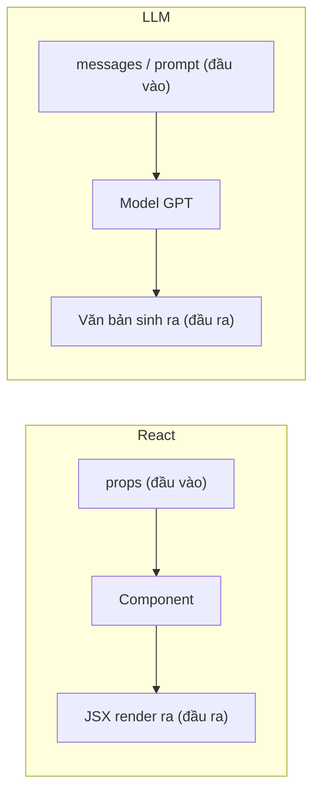
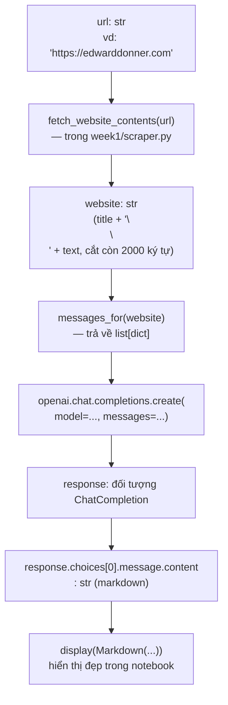

# Bài 01 — Gọi API LLM lần đầu tiên & Prompting cơ bản (Chi tiết)

> **Nguồn chính:** [week1/day1.ipynb](../week1/day1.ipynb), [week1/scraper.py](../week1/scraper.py)
> **Nguồn phụ:** [week1/week1 EXERCISE.ipynb](../week1/week1%20EXERCISE.ipynb), [setup/SETUP-new.md](../setup/SETUP-new.md), [guides/09_ai_apis_and_ollama.ipynb](../guides/09_ai_apis_and_ollama.ipynb)

### Quy ước ký hiệu dùng trong bài này

- **[Từ nguồn]** — nội dung/code lấy trực tiếp từ notebook hoặc file trong repo.
- **[Bổ sung]** — giải thích, ví dụ hoặc khái niệm do tôi thêm vào để bạn dễ hiểu hơn, không có sẵn trong khóa học gốc.
- **[Đã kiểm chứng]** — tôi đã tự chạy/lấy thực tế trong phiên này (ví dụ: gọi công cụ đọc trang web) và xác nhận đúng.
- **[Minh hoạ/dự kiến]** — kết quả tôi **không** tự chạy được (vì cần gọi API trả phí thay bạn, điều tôi không tự ý làm), chỉ là dự đoán hợp lý dựa trên cách API hoạt động.

Ghi chú minh bạch: notebook `day1.ipynb` khi tôi đọc **không có output đã lưu sẵn** để đối chiếu (các cell chỉ có code, không có kết quả chạy kèm theo). Vì vậy mọi kết quả gọi API trong bài này đều là **[Minh hoạ/dự kiến]**, trừ khi ghi chú khác.

---

## 1. Mục tiêu học tập

Sau bài này, bạn có thể:

1. Giải thích được LLM (Large Language Model), prompt, system/user message là gì — bằng lời của chính bạn, không cần thuộc lòng định nghĩa.
2. Thiết lập và kiểm tra API key an toàn bằng file `.env` + thư viện `python-dotenv`.
3. Gọi được Chat Completions API của OpenAI bằng Python để lấy phản hồi từ một model.
4. Đọc hiểu và tự giải thích luồng xử lý của một chương trình nhỏ: lấy nội dung website → xây prompt → gọi model → hiển thị kết quả dạng Markdown.
5. Nêu được ít nhất 2-3 giới hạn thực tế của cách tiếp cận này (web JavaScript, chặn bot, cắt bớt nội dung...).
6. Phân biệt rõ: bạn đang **dùng** một model đã huấn luyện sẵn (inference — suy luận), **không phải** đang huấn luyện (training) model.

---

## 2. Kiến thức cần biết trước

- Đã đọc mục 1.1-1.4 trong [00-lo-trinh-hoc.md](00-lo-trinh-hoc.md) (Jupyter Notebook, Python rất cơ bản, biến môi trường, khái niệm HTTP API).
- Không cần biết trước bất kỳ điều gì về Machine Learning/AI — bài này xây từ số 0.
- Nếu muốn tự chạy code thật (không bắt buộc để hiểu bài), bạn cần: đã cài đặt môi trường theo [setup/SETUP-new.md](../setup/SETUP-new.md) (`uv sync`) và có file `.env` chứa `OPENAI_API_KEY` — **đây là API trả phí (rất rẻ, vài cent), tôi sẽ không tự ý gọi hộ bạn.**

---

## 3. Bài toán đang giải quyết & vị trí trong khóa học

**[Từ nguồn]** Theo đúng nội dung mở đầu `day1.ipynb`, đây là **"BÀI LAB ĐẦU TIÊN"** của toàn khóa 8 tuần — mục tiêu là tạo cảm giác "instant gratification" (thấy kết quả ngay lập tức) để bạn có động lực học tiếp. Dự án cụ thể: viết một chương trình **"Web Summarizer"** — nhận vào một URL, tự động lấy nội dung trang web đó, rồi dùng một frontier model (mô hình AI tiên phong, mạnh nhất hiện có) để tóm tắt nội dung theo giọng văn hài hước/châm biếm (snarky).

**Vị trí trong khóa học:** đây là điểm khởi đầu của **mọi thứ** bạn sẽ làm trong 8 tuần tiếp theo. Kỹ thuật cốt lõi ở đây — "xây một `messages` list rồi gọi `chat.completions.create`" — sẽ được tái sử dụng ở hầu hết các tuần sau, kể cả khi bài toán phức tạp hơn nhiều (RAG ở Tuần 5, Agent ở Tuần 8). Nhóm chủ đề: **gọi API model + prompting** — nhóm kỹ năng nền tảng nhất của "LLM Engineering".

**Ứng dụng kinh doanh (nêu trong chính notebook):** Summarization (tóm tắt) là một use case Gen AI kinh điển — có thể áp dụng cho tóm tắt tin tức, báo cáo tài chính, hồ sơ ứng tuyển...

---

## 4. Giải thích khái niệm từ cơ bản

### 4.1. LLM (Large Language Model — mô hình ngôn ngữ lớn) là gì?

**[Bổ sung]** Ví dụ đời thường: hãy tưởng tượng một người đã đọc một phần rất lớn của internet (sách, bài báo, diễn đàn, code...). Người này không "tra cứu" từng câu — mà đã hình thành trực giác cực mạnh về "sau đoạn văn này, phần tiếp theo hợp lý thường là gì". LLM hoạt động theo nguyên lý tương tự nhưng bằng thống kê/toán học: nó được huấn luyện để dự đoán "từ/mảnh từ tiếp theo" (gọi là **token**) hợp lý nhất, hết lần này đến lần khác, dựa trên toàn bộ đoạn văn bản trước đó (kể cả prompt của bạn).

> **Giới hạn quan trọng cần nhớ ngay:** LLM không "tra cứu sự thật" như một cơ sở dữ liệu — nó sinh (generate) văn bản có xác suất cao là hợp lý. Vì vậy nó có thể tự tin nói sai (hiện tượng gọi là "hallucination" — ảo giác/bịa đặt). Bài học này chưa đi sâu vào đánh giá độ chính xác, nhưng cần biết trước để không hiểu nhầm output của model luôn đúng.

### 4.2. "Frontier model" (mô hình tiên phong) là gì?

**[Từ nguồn, diễn giải lại]** Notebook gọi GPT của OpenAI là một "Frontier model" — tức nhóm các model mạnh nhất, hiện đại nhất tại một thời điểm (GPT của OpenAI, Claude của Anthropic, Gemini của Google...). Đối lập với các model mã nguồn mở nhỏ hơn mà bạn sẽ gặp ở Tuần 3 (chạy trực tiếp trên máy/HuggingFace).

### 4.3. Prompt, System prompt, User prompt

**[Từ nguồn]** Trích nguyên văn từ `day1.ipynb`:

> "Các model như GPT đã được huấn luyện để nhận instruction theo một cách cụ thể. Chúng kỳ vọng nhận: **System prompt** — cho biết đang thực hiện nhiệm vụ gì và nên dùng giọng điệu nào; **User prompt** — phần mở đầu hội thoại mà chúng cần trả lời."

**[Bổ sung]** Ví dụ đời thường: hình dung bạn thuê một nhân viên trực tổng đài.
- **System prompt** giống như **bản mô tả công việc** bạn đưa cho nhân viên đó trước ca làm: "Bạn là nhân viên hỗ trợ khách hàng, luôn lịch sự, trả lời ngắn gọn." Khách hàng không nhìn thấy bản mô tả công việc này.
- **User prompt** giống như **câu hỏi cụ thể của một khách hàng** gọi tới: "Đơn hàng của tôi bao giờ tới?"

Trong bài, `system_prompt` được định nghĩa **[Từ nguồn]**:

```python
system_prompt = """
You are a snarky assistant that analyzes the contents of a website,
and provides a short, snarky, humorous summary, ignoring text that might be navigation related.
Respond in markdown. Do not wrap the markdown in a code block - respond just with the markdown.
"""
```

Và `user_prompt_prefix` **[Từ nguồn]**:

```python
user_prompt_prefix = """
Here are the contents of a website.
Provide a short summary of this website.
If it includes news or announcements, then summarize these too.

"""
```

### 4.4. Cấu trúc `messages` — tại sao lại là list of dict?

**[Từ nguồn]** OpenAI (và phần lớn API tương thích) yêu cầu gửi lên một **list các message**, mỗi message là một `dict` có 2 khóa `role` và `content`:

```python
[
    {"role": "system", "content": "system message goes here"},
    {"role": "user", "content": "user message goes here"}
]
```

**[Bổ sung — đối chiếu React/JS]** Đây thực chất chính là **JSON body** bạn vẫn gửi trong `fetch`/`axios` khi gọi REST API — chỉ khác là ở Python nó là `list`/`dict` (tương đương Array/Object trong JS), và khi gửi qua mạng, thư viện sẽ tự chuyển thành JSON y hệt cách `JSON.stringify` hoạt động. Giá trị `role` chỉ có 3 lựa chọn chính trong bài này: `system`, `user` (và sau này bạn sẽ gặp `assistant` khi lưu lại lịch sử hội thoại).

### 4.5. Bạn đang làm "Inference", không phải "Training"

**[Bổ sung — làm rõ theo yêu cầu phân biệt khái niệm]**

| Khái niệm | Trong Bài 01, nó là gì? |
|---|---|
| **Dữ liệu (data)** | Nội dung văn bản của website (do `fetch_website_contents` lấy về) — đây là dữ liệu **đầu vào cho 1 lần gọi**, không phải dữ liệu huấn luyện. |
| **Model** | GPT (ví dụ `gpt-4.1-mini`) — đã được OpenAI huấn luyện sẵn từ trước; bạn chỉ "thuê" quyền dùng nó qua API. |
| **Tham số của model (parameters)** | Hàng tỷ con số bên trong GPT quyết định cách nó dự đoán token tiếp theo. Bạn **không thấy và không chỉnh sửa** được chúng qua API — đây là điểm khác biệt lớn so với việc bạn tự huấn luyện 1 model (sẽ gặp ở Tuần 6-7). |
| **Hyperparameter (siêu tham số)** | Ví dụ `temperature` (độ "sáng tạo/ngẫu nhiên" của câu trả lời). Bài `day1.ipynb` **không truyền tham số này** trong lời gọi API (chỉ truyền `model` và `messages`) — nghĩa là dùng giá trị mặc định của OpenAI. |
| **Training (huấn luyện)** | **Không xảy ra ở bài này.** Không có bước nào trong `day1.ipynb` chỉnh sửa tham số model. |
| **Inference (suy luận)** | **Đây là việc bạn đang làm**: đưa prompt vào một model đã huấn luyện xong, nhận văn bản trả về. |
| **Evaluation (đánh giá)** | Trong bài này, đánh giá hoàn toàn **bằng mắt người** (bạn tự đọc và nhận xét bản tóm tắt có hợp lý/đúng giọng văn không) — chưa có phép đo tự động. |

> Ghi nhớ: **không phải cứ "dùng AI" là đang "train AI"**. Rất nhiều công việc trong 5-6 tuần đầu của khóa học (bao gồm cả bài này) chỉ là **inference** — gọi model có sẵn. Việc **training/fine-tuning** thật sự chỉ xuất hiện từ Tuần 6-7.

### 4.6. So sánh với React component — và giới hạn của phép so sánh

**[Bổ sung]** Để dễ hình dung, bạn có thể tạm liên tưởng:



Cả hai đều là "đưa input vào, nhận output ra". **Nhưng giới hạn của phép so sánh này rất quan trọng:**

- Component React là **hàm thuần (pure function)** xác định (deterministic) theo code bạn viết: cùng `props` → luôn cùng JSX (trừ khi có side-effect). LLM thì **sinh output theo xác suất** — cùng một prompt, chạy 2 lần có thể ra 2 câu trả lời khác nhau về câu chữ (dù ý nghĩa thường tương tự).
- Component React chạy theo logic `if/else` bạn viết tường minh. LLM **không có nhánh if/else nào bạn nhìn thấy được** — toàn bộ "quyết định" nằm trong hàng tỷ tham số đã huấn luyện, con người không đọc hiểu trực tiếp được logic đó.
- Vì vậy: **đừng** áp dụng tư duy "test 1 input, chắc chắn output luôn giống vậy" từ React sang cho LLM. Bạn sẽ học cách đánh giá (evaluate) output LLM theo tiêu chí khác ở các tuần sau (Tuần 4, Tuần 5), không giống unit test thông thường.

---

## 5. Luồng xử lý và dữ liệu đầu vào/đầu ra

**[Từ nguồn, tôi vẽ lại thành sơ đồ]** Toàn bộ pipeline của "Web Summarizer":



**Kiểu dữ liệu đáng chú ý ở từng bước:**

| Biến | Kiểu dữ liệu | Ghi chú |
|---|---|---|
| `url` | `str` | Một chuỗi URL, ví dụ `"https://edwarddonner.com"` |
| kết quả `fetch_website_contents(url)` | `str` | Chuỗi văn bản thô, **luôn ≤ 2000 ký tự** vì bị cắt bằng `[:2_000]` |
| `messages_for(website)` | `list[dict[str, str]]` | Danh sách 2 phần tử: 1 system message, 1 user message |
| `response` | Đối tượng `ChatCompletion` (do thư viện `openai` định nghĩa) | Không phải `dict` hay `str` thường — là một object có thuộc tính `.choices` |
| `response.choices[0].message.content` | `str` | Đây mới là văn bản trả lời thật sự, ở dạng Markdown theo yêu cầu trong `system_prompt` |

---

## 6. Phân tích code thực tế

### 6.1. Nhập thư viện (imports)

**[Từ nguồn]** — cell đầu tiên của `day1.ipynb`:

```python
import os
from dotenv import load_dotenv
from scraper import fetch_website_contents
from IPython.display import Markdown, display
from openai import OpenAI
```

- `os`: thư viện chuẩn của Python để đọc biến môi trường (`os.getenv`).
- `load_dotenv`: hàm từ thư viện `python-dotenv`, đọc file `.env` và nạp các dòng `KEY=value` vào biến môi trường của tiến trình Python đang chạy.
- `fetch_website_contents`: hàm **tự viết**, nằm trong [week1/scraper.py](../week1/scraper.py) (cùng thư mục `week1/`), xem mục 6.3.
- `Markdown, display`: công cụ của Jupyter để hiển thị chuỗi Markdown thành văn bản có định dạng đẹp (in đậm, tiêu đề...) thay vì in ra chữ thô.
- `OpenAI`: class chính của thư viện `openai`, dùng để tạo một "client" (đối tượng đại diện cho kết nối tới OpenAI).

### 6.2. Nạp và kiểm tra API key

**[Từ nguồn]**:

```python
load_dotenv(override=True)
api_key = os.getenv('OPENAI_API_KEY')

if not api_key:
    print("No API key was found - please head over to the troubleshooting notebook in this folder to identify & fix!")
elif not api_key.startswith("sk-proj-"):
    print("An API key was found, but it doesn't start sk-proj-; please check you're using the right key - see troubleshooting notebook")
elif api_key.strip() != api_key:
    print("An API key was found, but it looks like it might have space or tab characters at the start or end - please remove them - see troubleshooting notebook")
else:
    print("API key found and looks good so far!")
```

Giải thích từng nhánh:
- `load_dotenv(override=True)`: đọc file `.env` ở thư mục gốc project; `override=True` nghĩa là nếu biến đó đã tồn tại sẵn trong môi trường hệ điều hành, giá trị trong `.env` sẽ **ghi đè** lên.
- `if not api_key`: nếu không tìm thấy biến `OPENAI_API_KEY` (giá trị `None` hoặc chuỗi rỗng) → báo chưa có key.
- `elif not api_key.startswith("sk-proj-")`: kiểm tra tiền tố chuỗi — đây là cách tác giả khóa học nhận diện định dạng key kiểu mới của OpenAI. **[Bổ sung]** Lưu ý: đây là kiểm tra dựa trên quy ước đặt tên key tại thời điểm viết khóa học; nếu OpenAI đổi định dạng key trong tương lai, điều kiện này có thể báo sai dù key vẫn hợp lệ — đây là giới hạn của cách kiểm tra "hardcode tiền tố", không phải lỗi của bạn nếu gặp cảnh báo này.
- `elif api_key.strip() != api_key`: `strip()` bỏ khoảng trắng đầu/cuối chuỗi; nếu chuỗi sau khi `strip()` khác chuỗi gốc, nghĩa là key có dính khoảng trắng/tab thừa (lỗi hay gặp khi copy-paste).
- `else`: mọi kiểm tra cơ bản đều qua.

### 6.3. Hàm `fetch_website_contents` — trong `week1/scraper.py`

**[Từ nguồn — trích nguyên hàm]**:

```python
from bs4 import BeautifulSoup
import requests

headers = {
    "User-Agent": "Mozilla/5.0 (Windows NT 10.0; Win64; x64) AppleWebKit/537.36 (KHTML, like Gecko) Chrome/117.0.0.0 Safari/537.36"
}


def fetch_website_contents(url):
    response = requests.get(url, headers=headers)
    soup = BeautifulSoup(response.content, "html.parser")
    title = soup.title.string if soup.title else "No title found"
    if soup.body:
        for irrelevant in soup.body(["script", "style", "img", "input"]):
            irrelevant.decompose()
        text = soup.body.get_text(separator="\n", strip=True)
    else:
        text = ""
    return (title + "\n\n" + text)[:2_000]
```

Giải thích theo khối logic:

1. **`headers = {"User-Agent": ...}`**: nhiều website từ chối phục vụ request không có `User-Agent` (chuỗi tự nhận diện "tôi là trình duyệt gì") vì nghi ngờ đó là bot. Ở đây giả vờ là trình duyệt Chrome thật.
2. **`requests.get(url, headers=headers)`**: gửi HTTP GET request — **[Bổ sung, đối chiếu frontend]** tương đương `fetch(url, { headers: {...} })` hoặc `axios.get(url, { headers })` bạn từng dùng.
3. **`BeautifulSoup(response.content, "html.parser")`**: dựng cây DOM (Document Object Model) từ chuỗi HTML thô — giống cách trình duyệt dựng DOM từ HTML, nhưng ở đây chỉ để **đọc/truy vấn**, không render hình ảnh.
4. **`soup.title.string if soup.title else "No title found"`**: toán tử 3 ngôi (ternary) của Python — lấy text trong thẻ `<title>` nếu có.
5. **`soup.body(["script", "style", "img", "input"])`** rồi **`.decompose()`**: tìm tất cả thẻ `<script>`, `<style>`, ``, `<input>` bên trong `<body>` rồi **xóa hẳn** khỏi cây DOM — vì đây là mã/định dạng/ảnh, không phải nội dung văn bản đọc được.
6. **`soup.body.get_text(separator="\n", strip=True)`**: lấy toàn bộ text còn lại, nối các đoạn bằng ký tự xuống dòng, bỏ khoảng trắng thừa.
7. **`return (title + "\n\n" + text)[:2_000]`**: ghép tiêu đề + 2 dòng trống + nội dung, rồi **cắt lấy 2000 ký tự đầu tiên** bằng cú pháp slicing `[:2_000]` (dấu `_` chỉ giúp dễ đọc số, Python bỏ qua nó — `2_000` = `2000`).

> **[Bổ sung]** Vì sao giới hạn 2000 ký tự? Đây là cách đơn giản để tránh gửi quá nhiều text vào model (tốn thời gian, tốn phí tính theo token) — đổi lại, nếu trang web dài, phần nội dung phía sau sẽ bị bỏ qua hoàn toàn.

### 6.4. Xây `messages` bằng hàm `messages_for`

**[Từ nguồn]**:

```python
def messages_for(website):
    return [
        {"role": "system", "content": system_prompt},
        {"role": "user", "content": user_prompt_prefix + website}
    ]
```

Hàm này chỉ đơn giản **ghép** `system_prompt` (cố định) với `user_prompt_prefix + website` (thay đổi theo từng trang), trả về đúng cấu trúc list-of-dict mà API cần (xem mục 4.4).

### 6.5. Gọi API và trả về summary — hàm `summarize`

**[Từ nguồn]**:

```python
def summarize(url):
    website = fetch_website_contents(url)
    response = openai.chat.completions.create(
        model = "gpt-4.1-mini",
        messages = messages_for(website)
    )
    return response.choices[0].message.content
```

Đây là hàm gộp toàn bộ luồng ở mục 5 thành 1 lời gọi duy nhất: scrape → tạo messages → gọi model → lấy `.content`.

### 6.6. Hiển thị đẹp — hàm `display_summary`

**[Từ nguồn]**:

```python
def display_summary(url):
    summary = summarize(url)
    display(Markdown(summary))
```

`display(Markdown(summary))` render chuỗi Markdown thành HTML ngay trong notebook (tiêu đề, in đậm... hiển thị đúng định dạng thay vì in ký tự `#`, `**` thô).

### 6.7. Theo dõi một mẫu dữ liệu nhỏ đi qua các bước

Để bạn thấy rõ dữ liệu thực sự trông như thế nào, tôi đã tự lấy (không qua `scraper.py`, mà qua công cụ đọc trang web riêng của tôi — nên định dạng đầu ra có khác đôi chút, nhưng nội dung là thật) trang `https://edwarddonner.com` — đúng URL mà `day1.ipynb` dùng làm ví dụ đầu tiên.

**[Đã kiểm chứng]** Một phần nội dung thật lấy được từ trang này (rút gọn):

```text
Well, hi there.

I'm Ed. I like writing code and experimenting with LLMs...
I'm the co-founder and CTO of AI startup Nebula.io...
My friends got fed up with my impromptu lectures, and convinced me
to make some Udemy courses...
```

Nếu đi qua đúng `fetch_website_contents` trong `scraper.py`, kết quả sẽ có dạng **[Minh hoạ]** (tôi dựng lại theo đúng công thức `title + "\n\n" + text`, cắt 2000 ký tự — không phải chạy thật bằng BeautifulSoup):

```text
Edward Donner

Well, hi there.
I'm Ed. I like writing code and experimenting with LLMs, and hopefully you're
here because you do too...
[...tiếp tục cho tới đủ 2000 ký tự rồi bị cắt...]
```

Chuỗi này (biến `website`) sẽ được nhét vào `messages_for(website)`, cho ra **[Minh hoạ]**:

```python
[
    {"role": "system", "content": "\nYou are a snarky assistant...\n"},
    {"role": "user", "content": "\nHere are the contents of a website...\n\nEdward Donner\n\nWell, hi there.\n..."}
]
```

Và cuối cùng, gọi `openai.chat.completions.create(model="gpt-4.1-mini", messages=...)` sẽ trả về **[Minh hoạ/dự kiến — tôi không gọi API thật]** một đoạn Markdown đại loại: một bản tóm tắt ngắn, giọng văn châm biếm, nói rằng đây là trang cá nhân của một người thích code và LLM, có mục thông báo bài viết mới... — **đây chỉ là dự đoán dựa trên system prompt, không phải output đã kiểm chứng.** Khi bạn tự chạy, output thật có thể khác nhiều về câu chữ.

---

## 7. Hướng dẫn thực hành

Làm theo thứ tự — **đây là việc bạn tự làm**, tôi không chạy hộ vì bước gọi OpenAI API tốn phí (dù rất nhỏ):

1. **Chuẩn bị:** đảm bảo đã hoàn tất [setup/SETUP-new.md](../setup/SETUP-new.md) — đã chạy `uv sync`, đã tạo file `.env` với dòng `OPENAI_API_KEY=sk-proj-...`.
2. Mở [week1/day1.ipynb](../week1/day1.ipynb) trong VS Code/Cursor.
3. Chọn Kernel: góc trên bên phải → "Select Kernel" → "Python Environments..." → chọn `.venv` (được đánh dấu Recommended).
4. Chạy **lần lượt từng cell từ trên xuống** bằng `Shift+Enter`. Không nhảy cóc.
5. Ở cell kiểm tra API key, quan sát dòng in ra — phải thấy `"API key found and looks good so far!"`. Nếu không, dừng lại và xử lý theo gợi ý trong thông báo lỗi trước khi tiếp tục.
6. Chạy cell gọi thử `"Hello, GPT!..."` — đây là lần gọi API đầu tiên của bạn. Đọc kỹ output trả về.
7. Chạy các cell định nghĩa `system_prompt`, `user_prompt_prefix`, `messages_for`, `summarize`, `display_summary`.
8. Chạy `display_summary("https://edwarddonner.com")` — quan sát bản tóm tắt.
9. Thử với ít nhất 1 website khác bạn chọn (tránh trang nặng JavaScript như các SPA React/Vue nội bộ công ty bạn — xem mục 9 để biết vì sao).
10. **Tự thử nghiệm nhỏ:** đổi câu cuối trong `system_prompt` thành `"Respond in markdown in Vietnamese."`, chạy lại `display_summary` với cùng 1 URL, so sánh kết quả.

---

## 8. Cách đọc và đánh giá kết quả

- **Không có "đáp án đúng duy nhất".** Khác với việc test 1 hàm JavaScript (input → output cố định), bản tóm tắt hợp lệ có thể có hàng chục cách diễn đạt khác nhau.
- Tiêu chí đánh giá hợp lý cho bài này:
  - **Đúng nội dung:** bản tóm tắt có phản ánh đúng nội dung chính của trang không (không bịa thông tin không có trên trang)?
  - **Đúng giọng điệu:** có "snarky/humorous" (châm biếm, hài hước) như `system_prompt` yêu cầu không?
  - **Đúng định dạng:** có phải Markdown thuần (không bọc trong code block ```` ```markdown ````) như yêu cầu cuối `system_prompt` không?
- Nếu chạy lại nhiều lần cùng 1 URL, bạn sẽ thấy câu chữ khác nhau ít nhiều mỗi lần — đây là bản chất xác suất của LLM (xem mục 4.6), **không phải lỗi**.
- Nếu `display_summary("https://openai.com")` cho ra kết quả rỗng/lỗi hoặc summary vô nghĩa — đây là giới hạn đã biết trước (xem mục 9), không phải bạn làm sai.

---

## 9. Lỗi thường gặp và hiểu nhầm cần tránh

1. **`NameError`** khi chạy 1 cell giữa notebook trước khi chạy các cell phía trên: **[Từ nguồn]** chính notebook cảnh báo điều này — nguyên nhân gần như luôn là chưa chạy hết các cell từ đầu theo thứ tự. Sửa: chạy lại từ cell đầu tiên.
2. **API key sai định dạng/thiếu/dính khoảng trắng**: đã có cell tự kiểm tra (mục 6.2) — đọc kỹ thông báo in ra.
3. **Website dùng JavaScript để render nội dung (Single Page Application như nhiều app React)**: `requests.get` chỉ lấy **HTML gốc do server trả về**, không chạy JavaScript như trình duyệt thật → nội dung chính (do JS render ra sau) sẽ **không có trong HTML lấy được**, dẫn tới summary rỗng hoặc vô nghĩa. **[Từ nguồn]** Chính notebook nêu rõ điều này và gợi ý dùng Selenium/Playwright (công cụ điều khiển trình duyệt thật) nếu muốn xử lý được các trang loại này.
4. **Website có bảo vệ kiểu CloudFront** có thể trả lỗi **403 Forbidden** — **[Từ nguồn]** được ghi chú trực tiếp trong notebook.
5. **Hiểu nhầm phổ biến: "package `openai` chứa sẵn model GPT bên trong máy tôi"** — **SAI**. **[Từ nguồn — guide 9]** khẳng định rõ: thư viện `openai` chỉ là một **HTTP client** (lớp bọc gọi mạng), mã nguồn của model GPT không hề nằm trong máy bạn hay trong package này. Mọi "trí tuệ" nằm ở server của OpenAI; máy bạn chỉ gửi văn bản đi và nhận văn bản về.
6. **Lưu ý (không hẳn là lỗi) về việc notebook dùng 3 tên model khác nhau** trong cùng 1 bài: cell xem trước dùng `"gpt-5-nano"`, cell ví dụ "2+2" dùng `"gpt-4.1-nano"`, còn hàm `summarize` chính thức dùng `"gpt-4.1-mini"`. **[Bổ sung]** Đây nhiều khả năng là chủ đích của tác giả (ưu tiên bản "nano/mini" rẻ, nhanh, đủ dùng cho ví dụ ngắn) chứ không phải lỗi gõ nhầm — nhưng bạn nên **chủ động nhận ra** sự khác biệt này khi đọc code, tránh ngộ nhận rằng cả bài chỉ dùng đúng 1 model. **[Điểm chưa kiểm chứng]** tôi không có cách xác nhận các tên model này còn khả dụng ở phía OpenAI tại thời điểm bạn học — nếu gặp lỗi "model not found", hãy kiểm tra danh sách model hiện hành trên tài liệu chính thức của OpenAI.
7. **Hiểu nhầm: "chạy lại cùng input thì AI phải trả lời y hệt như lần trước"** — như đã giải thích ở mục 4.6 và mục 8, đây là kỳ vọng sai khi áp dụng tư duy hàm thuần (pure function) của lập trình truyền thống sang cho LLM.

---

## 10. Câu hỏi tự giải thích bằng lời của bạn

Viết câu trả lời của riêng bạn (không cần dài, nhưng phải bằng lời bạn, không copy định nghĩa):

1. System prompt và user prompt khác nhau ở điểm nào? Cho một ví dụ **không phải** ví dụ tóm tắt website.
2. Vì sao phải để API key trong file `.env` thay vì gõ thẳng vào code?
3. `fetch_website_contents` trả về kiểu dữ liệu gì? Vì sao lại cắt còn 2000 ký tự thay vì giữ nguyên toàn bộ?
4. Nếu ai đó nói "tôi vừa train một con AI bằng cách gọi API OpenAI" — câu đó có chỗ nào chưa chính xác theo những gì bạn học ở mục 4.5?
5. Kể 2 loại website mà cách scraping trong bài này sẽ thất bại hoặc cho kết quả rỗng.

---

## 11. Bài tập nhỏ

### Bài 11.1 — Dự đoán kết quả (làm trước khi chạy code)

Cho đoạn code sau (dựa trên `messages_for`, đã sửa 1 chỗ):

```python
system_prompt = "You are a helpful assistant that replies only with 'YES' or 'NO'."
messages = [
    {"role": "system", "content": system_prompt},
    {"role": "user", "content": "Is Python a compiled language?"}
]
```

Hãy dự đoán: (a) output có khả năng ở dạng gì (một câu dài hay chỉ 1 từ)? (b) nếu bạn chạy lại 5 lần, output có luôn giống hệt nhau không? Viết dự đoán ra trước, rồi (nếu có điều kiện) tự chạy thử để so sánh.

### Bài 11.2 — Thay đổi code

Trong `day1.ipynb`, hãy:
1. Đổi câu cuối của `system_prompt` thành `"Respond in markdown in Vietnamese."`.
2. Chạy lại `display_summary` với 1 URL bất kỳ bạn chọn (không phải `edwarddonner.com`).
3. Ghi lại: kết quả có thực sự bằng tiếng Việt không? Giọng văn "snarky" còn giữ được không?

### Bài 11.3 — Vận dụng

**[Từ nguồn — chính là gợi ý "tự thử ngay" trong notebook]** Viết một cặp `system_prompt` + `user_prompt` mới cho bài toán: *nhận nội dung một email, gợi ý một dòng tiêu đề (subject) ngắn gọn phù hợp*. Gợi ý khung sẵn có trong notebook (cell cuối phần thực hành):

```python
system_prompt = "something here"
user_prompt = """
    Lots of text
    Can be pasted here
"""
messages = []  # điền vào đây
```

Hãy tự điền đầy đủ `system_prompt`, `user_prompt`, `messages`, và (nếu có điều kiện chạy) gọi `openai.chat.completions.create` để thử.

---

## 12. Gợi ý và đáp án tham khảo

> Chỉ đọc phần này **sau khi** đã tự làm mục 10 và 11.

<details>
<summary>Gợi ý cho mục 10 (câu hỏi tự giải thích)</summary>

1. System prompt = "luật chơi/vai trò" cố định cho model trong suốt cuộc gọi; User prompt = nội dung/yêu cầu cụ thể thay đổi mỗi lần. Ví dụ khác: system = "Bạn là gia sư Toán cấp 2, giải thích từng bước"; user = "Giải phương trình x + 5 = 12".
2. Để tránh lộ key khi chia sẻ code (ví dụ đẩy lên GitHub) — file `.env` thường được thêm vào `.gitignore` nên không bị commit; code chỉ đọc key từ biến môi trường lúc chạy, không "in cứng" (hardcode) key vào file nguồn.
3. Trả về `str` (chuỗi), luôn dài tối đa 2000 ký tự vì bị cắt bằng `[:2_000]`. Lý do cắt: giới hạn dung lượng gửi cho model (tiết kiệm thời gian xử lý và chi phí tính theo token), chấp nhận đánh đổi có thể mất phần nội dung phía sau.
4. Chưa chính xác: gọi API là **inference** (dùng model có sẵn), không phải **training** (chỉnh sửa tham số bên trong model). Không có tham số nào của GPT bị thay đổi khi bạn gọi API.
5. Ví dụ: (a) trang web dạng Single Page Application dùng React/Vue mà nội dung được JavaScript render sau khi tải trang (HTML gốc gần như rỗng); (b) trang có cơ chế chống bot kiểu CloudFront, trả về lỗi 403 khi phát hiện request không giống trình duyệt thật.

</details>

<details>
<summary>Gợi ý cho Bài 11.1 (dự đoán kết quả)</summary>

(a) Nhiều khả năng output chỉ là `"YES"` hoặc `"NO"` (hoặc rất gần như vậy) vì `system_prompt` yêu cầu rõ chỉ trả lời 1 trong 2 từ đó — nhưng LLM **không đảm bảo tuyệt đối 100%** sẽ tuân theo định dạng, đôi khi vẫn thêm chữ thừa.
(b) Không đảm bảo giống hệt nhau ở mọi lần chạy — nội dung ý nghĩa (YES/NO) thường ổn định vì câu hỏi có tính sự kiện rõ ràng, nhưng cách trình bày (có thêm dấu chấm, viết hoa/thường...) có thể khác nhau giữa các lần gọi.

</details>

<details>
<summary>Gợi ý cho Bài 11.2 (thay đổi code)</summary>

Không có "đáp án" cố định vì kết quả phụ thuộc website bạn chọn và lần gọi API thực tế. Điều cần quan sát: model **thường** tuân theo yêu cầu ngôn ngữ trong system prompt khá tốt, nhưng không phải lúc nào cũng giữ được **toàn bộ** sắc thái "snarky" khi chuyển ngôn ngữ — đây là điểm bạn tự ghi nhận qua quan sát thực tế, không suy đoán trước.

</details>

<details>
<summary>Gợi ý cho Bài 11.3 (vận dụng)</summary>

Khung gợi ý:

```python
system_prompt = "You are an assistant that reads an email and suggests one short, clear subject line for it. Reply with only the subject line, nothing else."
user_prompt = """
Dear team, our server will be down for maintenance this Saturday from 10pm to 2am.
Please save your work before then. Contact IT if you have questions.
"""
messages = [
    {"role": "system", "content": system_prompt},
    {"role": "user", "content": user_prompt}
]
```

</details>

---

## 13. Checklist tự đánh giá

- [ ] Tôi giải thích được (bằng lời riêng) sự khác nhau giữa system prompt và user prompt.
- [ ] Tôi biết vì sao API key phải để trong `.env`, không hardcode trong code.
- [ ] Tôi đọc hiểu được toàn bộ hàm `fetch_website_contents` trong `scraper.py`, giải thích được từng dòng chính.
- [ ] Tôi giải thích được vì sao gọi API ở đây là "inference", không phải "training".
- [ ] Tôi kể ra được ít nhất 2 giới hạn thực tế của cách scraping/gọi API trong bài.
- [ ] Tôi đã (hoặc biết chính xác cách) tự chạy `day1.ipynb` từ đầu đến cuối trên máy mình.
- [ ] Tôi đã thử ít nhất 1 thay đổi nhỏ (đổi system prompt hoặc đổi URL) và quan sát kết quả thay đổi ra sao.

---

## 14. Nguồn tham khảo và những điểm chưa kiểm chứng

**Nguồn đã đọc trực tiếp trong phiên này:**
- [week1/day1.ipynb](../week1/day1.ipynb) — toàn bộ nội dung notebook.
- [week1/scraper.py](../week1/scraper.py) — toàn bộ file.
- [week1/week1 EXERCISE.ipynb](../week1/week1%20EXERCISE.ipynb) — đọc để biết bài tập cuối tuần (chưa phải nội dung Bài 01, sẽ dùng lại ở bài sau).
- [setup/SETUP-new.md](../setup/SETUP-new.md) — phần hướng dẫn cài đặt, API key, `.env`.
- [guides/09_ai_apis_and_ollama.ipynb](../guides/09_ai_apis_and_ollama.ipynb) — phần đầu, xác nhận bản chất "HTTP client wrapper" của package `openai`.
- Nội dung thật của `https://edwarddonner.com` — lấy qua công cụ đọc trang web của tôi (không phải qua `scraper.py`), dùng để dựng ví dụ ở mục 6.7.

**Những điểm chưa kiểm chứng / giới hạn cần biết:**
- Tôi **không tự gọi OpenAI API** trong phiên này (tránh phát sinh chi phí thay bạn) — mọi output của `summarize()`/`display_summary()` trong bài là **dự đoán minh hoạ**, không phải kết quả đã chạy thật.
- Notebook `day1.ipynb` không có output đã lưu sẵn để tôi đối chiếu khi đọc file.
- Tôi chưa xác nhận được các model `gpt-5-nano`, `gpt-4.1-nano`, `gpt-4.1-mini` có còn khả dụng ở thời điểm bạn thực hành hay không — đây là các tên model xuất hiện trong code tại thời điểm khảo sát (2026-09-22); nếu lỗi "model not found", hãy kiểm tra tài liệu/dashboard chính thức của OpenAI.
- Nội dung file `week1/solutions/day1_with_ollama.ipynb` (bản thay thế miễn phí bằng Ollama) **chưa được tôi đọc** trong phiên này — chỉ biết tên file qua danh sách thư mục.
