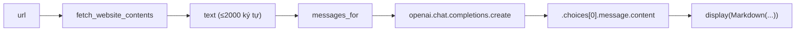

# Bài 01 — Tóm tắt: Gọi API LLM lần đầu tiên & Prompting cơ bản

> Bản đầy đủ: [01-goi-api-va-prompt-co-ban-chi-tiet.md](01-goi-api-va-prompt-co-ban-chi-tiet.md) · Nguồn: [week1/day1.ipynb](../week1/day1.ipynb), [week1/scraper.py](../week1/scraper.py)

## Ý chính cần nhớ

- Bài này xây một **"Web Summarizer"**: đưa URL → lấy nội dung web → gọi model AI tóm tắt → hiển thị Markdown.
- Gọi API model = **inference** (suy luận, dùng model có sẵn), **không phải training** (huấn luyện). Không tham số nào của model bị thay đổi.
- Prompt gửi lên model luôn có dạng `list` các `dict` gồm `role` (`system`/`user`) và `content`.
- Output của LLM **không xác định (non-deterministic)** — khác với hàm thuần trong lập trình truyền thống, cùng input có thể ra output khác nhau về câu chữ.

## Thuật ngữ quan trọng

| Thuật ngữ | Nghĩa ngắn gọn |
| --- | --- |
| LLM (Large Language Model) | Mô hình đã học cách dự đoán văn bản tiếp theo hợp lý, từ lượng lớn dữ liệu văn bản |
| Frontier model | Nhóm model AI mạnh/hiện đại nhất tại một thời điểm (GPT, Claude, Gemini...) |
| System prompt | "Vai trò/luật chơi" cố định đưa cho model, người dùng cuối không thấy |
| User prompt | Yêu cầu/nội dung cụ thể của người dùng trong lần hỏi đó |
| Token | Đơn vị nhỏ model xử lý văn bản (không hẳn = 1 từ) |
| Inference | Dùng model đã huấn luyện sẵn để tạo câu trả lời |
| Client library (`openai`) | Lớp bọc Python quanh việc gọi HTTP — **không chứa** model bên trong |

## Luồng xử lý chính



## Code cốt lõi

```python
def messages_for(website):
    return [
        {"role": "system", "content": system_prompt},
        {"role": "user", "content": user_prompt_prefix + website}
    ]

def summarize(url):
    website = fetch_website_contents(url)
    response = openai.chat.completions.create(model="gpt-4.1-mini", messages=messages_for(website))
    return response.choices[0].message.content
```

`fetch_website_contents` (trong `scraper.py`): `requests.get` (kèm `User-Agent` giả lập trình duyệt) → `BeautifulSoup` dựng DOM → xóa `script/style/img/input` → lấy text → cắt còn 2000 ký tự.

## Những nhầm lẫn dễ mắc

1. Nghĩ package `openai` chứa sẵn model GPT trong máy → **sai**, nó chỉ gọi HTTP tới server OpenAI.
2. Nghĩ cùng input phải luôn ra cùng output y hệt như hàm thuần → **sai với LLM**, output có tính xác suất.
3. Quên chạy cell theo thứ tự từ trên xuống → gây `NameError`.
4. Nghĩ cách scraping đơn giản này chạy được với mọi website → **sai**: site JS-render (SPA React/Vue) hoặc có chặn bot (403) sẽ thất bại.
5. Không để ý bài dùng 3 tên model khác nhau (`gpt-5-nano`, `gpt-4.1-nano`, `gpt-4.1-mini`) ở 3 cell khác nhau — không phải lỗi, nhưng dễ gây bối rối nếu đọc lướt.

## Vài câu hỏi gợi nhớ

1. System prompt khác user prompt ở điểm nào?
2. Vì sao gọi API không phải là "huấn luyện AI"?
3. `fetch_website_contents` trả về tối đa bao nhiêu ký tự, và vì sao có giới hạn đó?
4. Kể 2 loại website khiến cách scraping trong bài này thất bại.
5. API key nên đặt ở đâu, và vì sao không nên hardcode trong code?

Chưa trả lời được câu nào → quay lại đọc phần tương ứng trong bản chi tiết trước khi làm bài tập.
