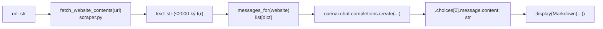
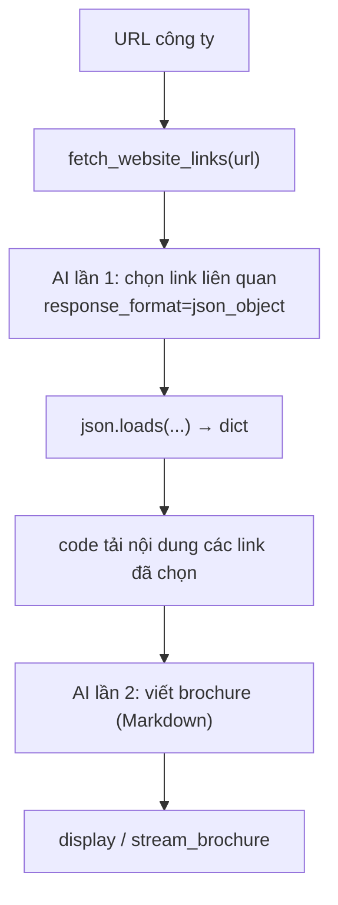
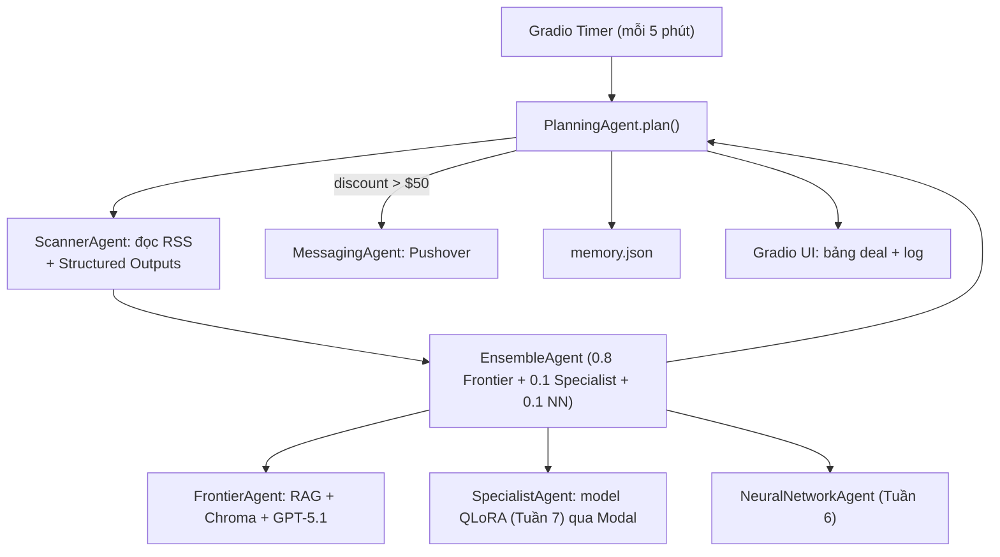
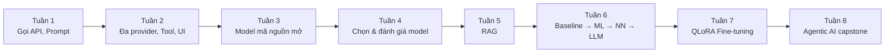

<!-- markdownlint-disable MD060 MD033 MD022 MD024 MD025 MD031 MD032 MD036 MD029 -->
<!-- Ghi chú kỹ thuật: tài liệu dùng thẻ <a id="..."> làm điểm neo (anchor) để liên kết nội bộ ổn định
     giữa các file .md trong bộ tài liệu này, không phụ thuộc cách mỗi renderer tự sinh slug từ tiêu đề
     tiếng Việt có dấu. Mỗi tuần dùng tiêu đề H1 riêng vì đây là 8 phần lớn ngang cấp trong 1 tài liệu dài. -->
# LLM Engineering — 8 tuần đầy đủ (bản biên tập lại, không lặp)

> Tài liệu này biên soạn lại toàn bộ 8 tuần của khóa **LLM Engineering** (Ed Donner) từ notebook gốc, source code và các ghi chú tiếng Việt đã có trong repo, theo yêu cầu: **học lại đầy đủ, có thứ tự, không trùng lặp**. Đây là tài liệu tổng hợp — mỗi khái niệm chỉ được giảng đầy đủ ở **một nơi**; khi khái niệm cũ xuất hiện lại ở tuần sau, tài liệu chỉ nhắc ngắn và liên kết ngược lại.

## Cách đọc tài liệu này

1. Đọc theo thứ tự Tuần 1 → Tuần 8 — các dự án nối tiếp nhau (Tuần 6 → 7 → 8 dùng lại cùng một bài toán "dự đoán giá sản phẩm").
2. Mỗi tuần có mục **"Khái niệm mới"** (giảng đầy đủ) và có thể có mục **"Nhắc lại"** (chỉ 1-2 câu, trỏ về nơi đã giảng).
3. Cần bản ngắn để ôn? Dùng [LLM-Engineering-8-tuan-tom-tat.md](LLM-Engineering-8-tuan-tom-tat.md).
4. Muốn biết bài học nào lấy từ file nguồn nào? Xem [coverage-map.md](coverage-map.md).
5. Bài giảng gốc Tuần 1 – Ngày 1 (bản cũ, chi tiết hơn) vẫn còn ở [01-goi-api-va-prompt-co-ban-chi-tiet.md](01-goi-api-va-prompt-co-ban-chi-tiet.md) nếu bạn muốn đối chiếu — tài liệu này đã gộp lại phần cốt lõi của nó vào Tuần 1.

## Quy ước ký hiệu

| Ký hiệu | Ý nghĩa |
|---|---|
| **[Từ nguồn]** | Nội dung/code lấy trực tiếp từ notebook, file `.py`, hoặc ghi chú cũ đã có trong repo |
| **[Bổ sung]** | Giải thích/ví dụ do tôi (agent) thêm để làm rõ, không có sẵn trong khóa học gốc |
| **Đã đọc trực tiếp** | Tôi tự mở file `.ipynb`/`.py` gốc trong phiên làm việc này để xác nhận |
| **Qua ghi chú cũ** | Dựa trên ghi chú tiếng Việt có sẵn (biên soạn từ phụ đề video ở một phiên trước), tôi **chưa** tự mở lại notebook gốc để đối chiếu 100% |
| ⚠️ | Cảnh báo về giới hạn, hiểu nhầm thường gặp, hoặc số liệu chỉ đúng trong bối cảnh cụ thể |

> Toàn bộ tài liệu **không khẳng định đã chạy hoặc gọi API** trừ khi ghi rõ. Các số liệu benchmark/kết quả (MAE, tốc độ, %...) là **kết quả của một lần chạy cụ thể trong khóa học tại thời điểm ghi hình**, không đại diện cho mọi model, mọi phần cứng hay mọi thời điểm.

---

<a id="tuan1"></a>
# TUẦN 1 — Nền tảng: gọi API, prompt, kiến trúc LLM

## Mục tiêu cả tuần

Sau Tuần 1, bạn cần:
- Gọi được Chat Completions API bằng Python, hiểu cấu trúc `messages` (system/user).
- Biết `openai` chỉ là **client library** (lớp gọi HTTP), không chứa model bên trong.
- Hiểu ở mức khái niệm: GPT là gì, token là gì, context window là gì, vì sao chatbot "quên" nếu không gửi lại lịch sử.
- Tự nối được 2 lời gọi AI thành một pipeline nhỏ (ví dụ: chọn dữ liệu → sinh nội dung).

## Kiến thức cần biết trước

Không cần biết AI/ML. Cần: Python rất cơ bản (import, hàm, dict/list, f-string — xem `guides/06_python_foundations.ipynb`), khái niệm HTTP request/response (bạn đã biết từ `fetch`/`axios` ở frontend), biến môi trường `.env` (giống Node, nhưng Python đọc bằng `python-dotenv`).

---

<a id="tuan1-ngay1"></a>
## Tuần 1 — Ngày 1: Gọi API LLM lần đầu tiên & Prompting cơ bản

**Nguồn:** [week1/day1.ipynb](../week1/day1.ipynb), [week1/scraper.py](../week1/scraper.py) — **Đã đọc trực tiếp**

### Bài toán & vị trí trong khóa

Đây là bài lab đầu tiên toàn khóa — "instant gratification". Bài toán: viết một **Web Summarizer** — đưa vào URL, chương trình tự lấy nội dung trang, rồi dùng một *frontier model* (model AI tiên phong, mạnh nhất hiện có — như GPT) để tóm tắt theo giọng văn châm biếm. Kỹ thuật cốt lõi ở đây (`messages` + `chat.completions.create`) được tái sử dụng ở **mọi tuần sau**.

### Khái niệm mới

**LLM (Large Language Model — mô hình ngôn ngữ lớn)** [Bổ sung]: một chương trình đã được huấn luyện trước (pretrained) trên khối lượng văn bản khổng lồ, học cách dự đoán phần văn bản tiếp theo hợp lý nhất. Ví dụ đời thường: giống một người đã đọc rất nhiều sách và hình thành trực giác mạnh về "câu tiếp theo thường là gì", chứ không "tra cứu" một cơ sở dữ liệu sự thật. ⚠️ Vì vậy LLM có thể tự tin nói sai (gọi là *hallucination* — ảo giác/bịa đặt).

**System prompt vs User prompt** [Từ nguồn]: model được huấn luyện để nhận 2 loại chỉ dẫn — **system prompt** (vai trò/giọng điệu cố định, người dùng cuối không thấy) và **user prompt** (yêu cầu cụ thể của lượt hỏi này). Ví dụ đời thường: system prompt giống bản mô tả công việc đưa cho nhân viên tổng đài trước ca làm; user prompt là câu hỏi cụ thể của khách gọi tới.

**Cấu trúc `messages`** [Từ nguồn]: API yêu cầu một `list` các `dict`, mỗi dict có khóa `role` (`system`/`user`/`assistant`) và `content`:
```python
[
    {"role": "system", "content": "system message goes here"},
    {"role": "user", "content": "user message goes here"}
]
```
[Bổ sung — đối chiếu frontend] Đây chính là JSON body bạn từng gửi qua `fetch`/`axios`; `list`/`dict` trong Python tương đương Array/Object trong JS.

**Inference vs Training** [Bổ sung — khái niệm dễ nhầm, giải thích đầy đủ 1 lần tại đây]:

| Khái niệm | Trong bài này |
|---|---|
| Dữ liệu | Nội dung website (đầu vào 1 lần gọi, KHÔNG phải dữ liệu huấn luyện) |
| Model | GPT — đã huấn luyện sẵn, bạn chỉ "thuê" quyền dùng qua API |
| Tham số model | Hàng tỷ con số bên trong GPT — bạn **không thấy, không chỉnh sửa** qua API |
| Hyperparameter | Ví dụ `temperature` — bài này KHÔNG truyền, dùng mặc định |
| Training | **Không xảy ra** trong bài này |
| Inference | **Đây là việc bạn đang làm**: đưa prompt vào model có sẵn, nhận văn bản trả về |

> Ghi nhớ: gọi API = inference (suy luận), không phải training (huấn luyện). Việc training/fine-tuning thật sự chỉ xuất hiện từ Tuần 6-7.

### Luồng xử lý



### Code thực tế

**Nạp API key an toàn** [Từ nguồn]:
```python
load_dotenv(override=True)
api_key = os.getenv('OPENAI_API_KEY')
if not api_key:
    print("No API key was found...")
elif not api_key.startswith("sk-proj-"):
    print("...doesn't start sk-proj-...")
elif api_key.strip() != api_key:
    print("...space or tab characters...")
else:
    print("API key found and looks good so far!")
```
`load_dotenv(override=True)` đọc file `.env` và nạp vào biến môi trường tiến trình; `override=True` = giá trị trong `.env` ghi đè giá trị hệ thống nếu trùng tên.

**Lấy nội dung website** [Từ nguồn, `scraper.py`]:
```python
def fetch_website_contents(url):
    response = requests.get(url, headers=headers)  # headers giả User-Agent trình duyệt
    soup = BeautifulSoup(response.content, "html.parser")
    title = soup.title.string if soup.title else "No title found"
    if soup.body:
        for irrelevant in soup.body(["script", "style", "img", "input"]):
            irrelevant.decompose()  # xóa hẳn khỏi cây DOM
        text = soup.body.get_text(separator="\n", strip=True)
    else:
        text = ""
    return (title + "\n\n" + text)[:2_000]  # cắt còn 2000 ký tự
```

**Xây prompt & gọi model** [Từ nguồn]:
```python
def messages_for(website):
    return [
        {"role": "system", "content": system_prompt},
        {"role": "user", "content": user_prompt_prefix + website}
    ]

def summarize(url):
    website = fetch_website_contents(url)
    response = openai.chat.completions.create(model="gpt-4.1-mini", messages=messages_for(website))
    return response.choices[0].message.content
```

### Lựa chọn kỹ thuật & lý do

- **Cắt 2000 ký tự**: tránh gửi quá nhiều text (tốn thời gian + phí tính theo token); đánh đổi là mất nội dung phía sau nếu trang dài.
- **`User-Agent` giả trình duyệt**: nhiều site chặn request không có header này.
- **`response.choices[0].message.content`**: `choices` là list vì API có thể trả nhiều phương án; `[0]` lấy phương án đầu tiên.

### Lỗi thường gặp & hiểu nhầm

- `NameError` do chưa chạy hết cell từ trên xuống theo thứ tự.
- Website dùng JavaScript render (SPA React/Vue) → `requests.get` chỉ lấy HTML gốc, không chạy JS → nội dung rỗng.
- Website có chặn bot (CloudFront...) → lỗi 403.
- ⚠️ Hiểu nhầm phổ biến: nghĩ package `openai` chứa sẵn model GPT trong máy — **sai**, nó chỉ là HTTP client (xem Ngày 2).
- Notebook dùng 3 tên model khác nhau ở 3 cell (`gpt-5-nano`, `gpt-4.1-nano`, `gpt-4.1-mini`) — nhiều khả năng có chủ đích (ưu tiên bản rẻ/nhanh cho ví dụ ngắn), không phải lỗi gõ nhầm.

---

<a id="tuan1-ngay2"></a>
## Tuần 1 — Ngày 2: Chat Completions API "dưới nắp ca-pô" & endpoint tương thích OpenAI

**Nguồn:** [week1/day2.ipynb](../week1/day2.ipynb) — **Đã đọc trực tiếp**

### Bài toán & vị trí

Ngày 1 bạn đã gọi API qua package `openai`. Ngày 2 lật ngược lớp vỏ đó lên: gọi **thẳng HTTP request** bằng `requests` để thấy rằng `openai` chỉ là tiện ích bọc quanh một endpoint web bình thường. Đây là nền tảng để Tuần 2 mở rộng ra gọi Anthropic/Gemini/DeepSeek/Ollama bằng **cùng một đoạn code**.

### Khái niệm mới

**Client library là gì** [Từ nguồn]: package `openai` không chứa "trí tuệ" gì cả — nó chỉ chuyển lời gọi Python thành HTTP request tới `https://api.openai.com/v1/chat/completions`, rồi chuyển JSON trả về thành object Python. Bằng chứng trực tiếp từ notebook:
```python
headers = {"Authorization": f"Bearer {api_key}", "Content-Type": "application/json"}
payload = {"model": "gpt-5-nano", "messages": [{"role": "user", "content": "Tell me a fun fact"}]}
response = requests.post("https://api.openai.com/v1/chat/completions", headers=headers, json=payload)
response.json()["choices"][0]["message"]["content"]
```
So với cách gọi bằng package:
```python
openai = OpenAI()
response = openai.chat.completions.create(model="gpt-5-nano", messages=[...])
response.choices[0].message.content
```
Hai đoạn code trên tạo ra **cùng một lời gọi mạng** — chỉ khác cách bạn viết code Python.

**Endpoint tương thích OpenAI** [Từ nguồn]: vì API của OpenAI quá phổ biến, các hãng khác (Anthropic, Google, DeepSeek...) xây endpoint theo đúng "hợp đồng" JSON đó, để bạn chỉ cần đổi `base_url` + `api_key`:
```python
anthropic = OpenAI(api_key=anthropic_api_key, base_url="https://api.anthropic.com/v1/")
gemini = OpenAI(api_key=google_api_key, base_url="https://generativelanguage.googleapis.com/v1beta/openai/")
ollama = OpenAI(api_key="ollama", base_url="http://localhost:11434/v1")  # model chạy ngay trên máy bạn, miễn phí
```
⚠️ Dù dòng code viết `OpenAI(...)`, khi `base_url` trỏ nơi khác thì **không có model OpenAI nào tham gia** — chỉ dùng chung "hình dạng" lời gọi.

**Ollama** [Từ nguồn]: chạy model mã nguồn mở ngay trên máy bạn (miễn phí, không cần API key thật — chuỗi `"ollama"` chỉ để SDK không báo thiếu key). Đây là lựa chọn thay thế miễn phí cho các bài cần gọi API trả phí.

### Lỗi thường gặp

- Nhầm "vì dùng code `OpenAI(...)` nên chắc chắn đang gọi model của OpenAI" — sai khi đã đổi `base_url`.
- Quên chạy lại `load_dotenv(override=True)` sau khi sửa `.env`.

---

<a id="tuan1-ngay4"></a>
## Tuần 1 — Ngày 4: Kiến trúc LLM, tham số, token, context window (lý thuyết)

**Nguồn:** [week1/ngay-4-ai-video-026-032-tieng-viet.md](../week1/ngay-4-ai-video-026-032-tieng-viet.md) — **Qua ghi chú cũ** (không có notebook cho ngày này; ghi chú cũ tự đối chiếu với bài báo *Attention Is All You Need* và model card DeepSeek-V3)

### Bài toán & vị trí

Ngày 1-2 bạn đã gọi model như một "hộp đen". Ngày 4 mở hộp đen đó ra ở mức khái niệm — không code, không toán chi tiết — để bạn hiểu **vì sao** GPT hoạt động được, tránh hiểu sai máy móc khi học các tuần sau (đặc biệt Tuần 6-7 về fine-tuning).

### Khái niệm mới

**GPT = Generative Pre-trained Transformer**: *Generative* (biết sinh nội dung), *Pre-trained* (đã huấn luyện trước bằng dữ liệu lớn), *Transformer* (tên kiến trúc mạng nơ-ron). Ba tầng cần phân biệt:

| Tầng | Ví dụ |
|---|---|
| Kiến trúc (cách thiết kế mạng) | Transformer |
| Model đã huấn luyện (kiến trúc + tham số đã học) | Một bản GPT/Llama cụ thể |
| Ứng dụng (model + giao diện + dữ liệu + công cụ) | Chatbot trên website |

**Attention (cơ chế chú ý)**: cho phép mỗi vị trí trong câu "tham khảo" các vị trí liên quan khác để hiểu ngữ cảnh (ví dụ từ "nó" chỉ vào cái gì trong câu). Đây là ý tưởng cốt lõi của bài báo *Attention Is All You Need* (2017), thay cơ chế tuần tự (recurrence) của **LSTM** bằng cơ chế có thể tính song song khi huấn luyện — giúp huấn luyện hiệu quả ở quy mô lớn.

**Parameters (tham số)** [Từ nguồn]: giá trị số bên trong model được học qua huấn luyện — ví dụ `y = w1×x1 + w2×x2 + b`, `w1, w2, b` là tham số. Ký hiệu M/B/T = Triệu/Tỷ/Nghìn tỷ. ⚠️ "8B" **không phải** 8 GB hay 8 tỷ token — và **nhiều tham số hơn không đảm bảo thông minh hơn**, còn phụ thuộc dữ liệu, kiến trúc, cách huấn luyện.

**Dense vs Mixture of Experts (MoE)**: Dense model dùng gần hết mạng cho mỗi token; MoE có nhiều "nhánh chuyên gia", bộ định tuyến chỉ kích hoạt một phần cho mỗi token (ví dụ DeepSeek-V3: tổng 671B tham số nhưng chỉ ~37B "active" mỗi token — phân biệt **total parameters** vs **active parameters**).

**Training vs Inference** (nhắc lại, xem giải thích đầy đủ ở [Tuần 1 — Ngày 1](#tuan1-ngay1)): RLHF (Reinforcement Learning from Human Feedback) là bước huấn luyện bổ sung giúp model trả lời theo phong cách "trợ lý hữu ích" — đây vẫn thuộc giai đoạn **training**, xảy ra trước khi bạn gọi API, không phải mỗi lần bạn chat.

**Copilot / Tool / Agent** — ba khái niệm hay bị lẫn:

| Khái niệm | Vai trò |
|---|---|
| Copilot | Trợ lý hỗ trợ người dùng, người vẫn ra quyết định cuối |
| Tool | Chức năng phần mềm thực thi (đọc file, gọi API...) |
| Agent | Hệ thống để model tự quyết định bước tiếp theo trong một vòng lặp |

⚠️ Model **không** tự thực thi hành động trên máy — nó chỉ sinh ra "yêu cầu gọi tool"; chương trình bên ngoài mới thực sự chạy tool đó (xem chi tiết cơ chế thật ở [Tuần 2 — Ngày 4-5](#tuan2-ngay4-5)).

**Token & Context window** (video 029-032): Token là đơn vị nhỏ mà model xử lý văn bản (không hẳn = 1 từ — có thể là 1 phần từ). **Context window** là giới hạn tổng số token model có thể "nhìn thấy" trong 1 lần gọi (gồm cả prompt + lịch sử + câu trả lời). ⚠️ Model **không có trí nhớ thật** giữa các lần gọi API riêng biệt — "cảm giác nhớ" trong 1 cuộc chat chỉ vì ứng dụng **gửi lại toàn bộ lịch sử hội thoại** làm context mỗi lần gọi (gọi là hội thoại **stateless** — bản thân API không lưu trạng thái, ứng dụng phía client mới quản lý lịch sử). Chi phí API được tính theo số token (đầu vào + đầu ra), nên context window càng lớn / lịch sử càng dài thì chi phí mỗi lượt gọi càng cao.

### Lỗi thường gặp & hiểu nhầm

- Nhầm "tham số" của model (hàng tỷ trọng số) với "tham số" (argument) khi gọi hàm/API như `temperature`.
- Nhầm "model nhớ tên bạn" là do bộ nhớ thật — thực ra là do lịch sử được gửi lại mỗi lần (xem thêm phân biệt Context vs Memory ở [Tuần 8 — Ngày 5](#tuan8-ngay5)).
- ⚠️ Số liệu giá/tốc độ trong video là tại thời điểm ghi hình, không phải bảng giá hiện hành.

---

<a id="tuan1-ngay5"></a>
## Tuần 1 — Ngày 5: Nối nhiều lời gọi AI thành ứng dụng — Brochure Generator

**Nguồn:** [week1/day5.ipynb](../week1/day5.ipynb) — **Đã đọc trực tiếp**; diễn giải dựa thêm trên [week1/AI-Day-5-033-037-Day-du.md](../week1/AI-Day-5-033-037-Day-du.md) — **Qua ghi chú cũ**

### Bài toán & vị trí

Dự án: **Sales Brochure Generator** — nhập tên công ty + URL, chương trình tự viết một tài liệu giới thiệu công ty (Markdown). Đây là bài đầu tiên **ghép 2 lời gọi AI** với code xử lý dữ liệu ở giữa — mầm mống đầu tiên của các "agentic AI design pattern" mà khóa học sẽ đào sâu ở Tuần 2 và Tuần 8.

### Khái niệm mới

**Vì sao gọi AI hai lần?** Trang chủ thường chỉ có thông điệp chung; thông tin cần thiết (sản phẩm, tuyển dụng...) nằm ở các trang con. Nhưng tải hết mọi liên kết là lãng phí. Giải pháp: gọi AI lần 1 để **chọn liên kết liên quan** (trả JSON), code tải các trang đó, rồi gọi AI lần 2 để **viết brochure** từ nội dung đã tải.



**Structured output đơn giản qua JSON mode** [Từ nguồn]:
```python
response = openai.chat.completions.create(
    model=MODEL,
    messages=[...],
    response_format={"type": "json_object"}
)
links = json.loads(response.choices[0].message.content)
```
⚠️ **Đúng định dạng (format) ≠ đúng nội dung (content)**: `{"hello": "world"}` là JSON hợp lệ nhưng sai vì thiếu khóa `links` mà chương trình cần — JSON mode chỉ đảm bảo cú pháp JSON, không đảm bảo đúng "hợp đồng dữ liệu" bạn cần (khái niệm này quay lại đầy đủ hơn ở Tuần 8 với Structured Outputs schema Pydantic).

**One-shot prompting**: đưa 1 ví dụ mẫu ngay trong prompt để model biết đúng "hình dạng" câu trả lời:
```python
link_system_prompt = """... Bạn nên respond bằng JSON như example này:
{
    "links": [
        {"type": "about page", "url": "https://full.url/goes/here/about"}
    ]
}
"""
```

**Streaming** [Từ nguồn]: nhận và hiển thị câu trả lời từng phần thay vì chờ toàn bộ:
```python
stream = openai.chat.completions.create(model="gpt-4.1-mini", messages=[...], stream=True)
response = ""
for chunk in stream:
    response += chunk.choices[0].delta.content or ''
    update_display(Markdown(response), display_id=display_handle.display_id)
```
⚠️ Streaming chỉ giúp **thấy kết quả sớm hơn**, không làm cả pipeline (bước chọn link + tải trang) nhanh hơn.

**Agentic AI design pattern (mầm mống đầu tiên)** [Từ nguồn — chính notebook gọi tên]: kết hợp nhiều lời gọi LLM với code ở giữa. ⚠️ Đây **chưa phải** một agent tự lập kế hoạch/tự quyết định số bước — là một **workflow cố định** (chọn link → tải → viết). Khái niệm agent "thật" (tự quyết định, có vòng lặp) xuất hiện ở [Tuần 2 — Ngày 4-5](#tuan2-ngay4-5) và đầy đủ nhất ở Tuần 8.

### Code thực tế

```python
def select_relevant_links(url):
    response = openai.chat.completions.create(
        model=MODEL, messages=[...], response_format={"type": "json_object"}
    )
    return json.loads(response.choices[0].message.content)

def get_brochure_user_prompt(company_name, url):
    user_prompt = f"Bạn đang xem một công ty tên: {company_name}\n..."
    user_prompt += fetch_page_and_all_relevant_links(url)
    return user_prompt[:5_000]  # cắt 5000 ký tự — khác giới hạn 2000 của Ngày 1 vì gộp nhiều trang

def create_brochure(company_name, url):
    response = openai.chat.completions.create(
        model="gpt-4.1-mini",
        messages=[{"role": "system", "content": brochure_system_prompt},
                  {"role": "user", "content": get_brochure_user_prompt(company_name, url)}]
    )
    display(Markdown(response.choices[0].message.content))
```

### Lỗi thường gặp & hiểu nhầm

- Gọi `get_brochure_user_prompt(...)` tưởng chỉ "tạo chuỗi prompt" nhưng bên trong nó **đã gọi AI lần 1** (`select_relevant_links`) → phát sinh phí API ngoài dự kiến.
- ⚠️ Cắt 5.000 ký tự đầu chuỗi có thể bỏ mất nội dung các trang tải sau cùng (dù đã tốn thời gian tải).
- Nhầm việc "đưa ví dụ JSON mẫu vào prompt" với việc "huấn luyện lại model" — model không được cập nhật tham số, chỉ dùng ví dụ trong ngữ cảnh của riêng lượt gọi đó.
- Bảo mật [Bổ sung]: nếu để người dùng nhập URL tùy ý trên một server thật, cần chặn địa chỉ nội bộ (SSRF) và giới hạn redirect — nội dung website cũng cần được coi là **dữ liệu**, không phải chỉ dẫn có quyền thay đổi nhiệm vụ của hệ thống (prompt injection qua nội dung web).

### Bài tập Tuần 1

1. **Dự đoán trước khi chạy:** nếu đổi câu cuối `system_prompt` ở Ngày 1 thành "Respond in markdown in Vietnamese", bạn dự đoán điều gì giữ nguyên và điều gì thay đổi?
2. **Thay đổi code:** thêm một lời gọi AI thứ 3 vào pipeline Ngày 5 để dịch brochure sang tiếng Việt (gợi ý: dùng lại brochure vừa tạo làm input, không cần scrape lại).
3. **Vận dụng:** viết `system_prompt` + `user_prompt` cho bài toán "gợi ý tiêu đề email" (đã gợi ý sẵn trong `day1.ipynb`).

### Checklist tự đánh giá Tuần 1

- [ ] Giải thích được system prompt khác user prompt ở điểm nào.
- [ ] Giải thích được vì sao `openai` không "chứa" model GPT.
- [ ] Phân biệt được training và inference bằng ví dụ của chính bạn.
- [ ] Giải thích được vì sao chatbot "nhớ" tên bạn dù model không có bộ nhớ thật.
- [ ] Đọc hiểu được toàn bộ hàm `fetch_website_contents` và luồng 2-lần-gọi-AI của Brochure Generator.
- [ ] Nêu được ít nhất 2 giới hạn của cách scraping đơn giản (JS-render, chặn bot).

---

<a id="tuan2"></a>
# TUẦN 2 — Nhiều nhà cung cấp, Gradio, Chatbot, Tool Calling, Multimodal

## Mục tiêu cả tuần & vị trí trong khóa

Tuần 1 bạn gọi 1 model, 1 lần, không giao diện. Tuần 2 mở rộng theo 3 hướng: **(1)** gọi nhiều nhà cung cấp khác nhau, **(2)** đóng gói thành giao diện web bằng Gradio, **(3)** cho phép model **gọi hàm** (tool calling) và xử lý ảnh/âm thanh (multimodal). Đây là bước từ "notebook thử nghiệm" sang "ứng dụng có thể dùng thật".

## Kiến thức cần biết trước

Đã xong Tuần 1 (đặc biệt khái niệm client library + endpoint tương thích OpenAI ở [Ngày 2](#tuan1-ngay2)).

<a id="tuan2-ngay1"></a>
## Tuần 2 — Ngày 1: Nhiều nhà cung cấp & Reasoning effort

**Nguồn:** [week2/day1.ipynb](../week2/day1.ipynb) — **Đã đọc trực tiếp**

Áp dụng lại đúng kỹ thuật "endpoint tương thích OpenAI" đã học ở [Tuần 1 — Ngày 2](#tuan1-ngay2), nhưng lần này khởi tạo **nhiều client cùng lúc** để so sánh:
```python
anthropic = OpenAI(api_key=anthropic_api_key, base_url="https://api.anthropic.com/v1/")
gemini = OpenAI(api_key=google_api_key, base_url="https://generativelanguage.googleapis.com/v1beta/openai/")
deepseek = OpenAI(api_key=deepseek_api_key, base_url="https://api.deepseek.com")
groq = OpenAI(api_key=groq_api_key, base_url="https://api.groq.com/openai/v1")
openrouter = OpenAI(base_url="https://openrouter.ai/api/v1", api_key=openrouter_api_key)
```

**Khái niệm mới — `reasoning_effort` (test-time scaling)** [Từ nguồn]: một số model (dòng "reasoning" như GPT-5) cho phép chọn mức độ "suy nghĩ" trước khi trả lời:
```python
response = openai.chat.completions.create(model="gpt-5-nano", messages=easy_puzzle, reasoning_effort="minimal")
```
Ý tưởng **"training-time scaling vs inference-time scaling"** [Từ nguồn]: thay vì chỉ làm model mạnh hơn lúc huấn luyện (tốn nhiều dữ liệu/tham số hơn), một số model được thiết kế để "suy nghĩ" nhiều bước hơn ngay lúc trả lời (tốn nhiều token/thời gian hơn mỗi câu trả lời) — đây là một hướng cải thiện chất lượng khác, đánh đổi bằng chi phí/độ trễ mỗi lần gọi.

⚠️ Giới hạn quan sát: bài học chỉ minh họa bằng 1-2 câu đố cụ thể (ví dụ đố xác suất, đố sâu ăn sách) — không phải benchmark chuẩn hóa, nên không suy rộng "reasoning_effort cao luôn cho câu trả lời đúng hơn".

<a id="tuan2-ngay2"></a>
## Tuần 2 — Ngày 2: Gradio cơ bản

**Nguồn:** [week2/day2.ipynb](../week2/day2.ipynb) — Đã đọc trực tiếp (qua subagent)

**Gradio là gì** [Bổ sung]: thư viện Python dựng giao diện web nhanh từ 1 hàm Python — bạn viết hàm `def f(input): return output`, Gradio tự vẽ form nhập liệu + hiển thị kết quả, không cần viết HTML/CSS/JS. [Bổ sung — đối chiếu React] Khác biệt lớn nhất với React: bạn **không** tự dựng component/state — chỉ khai báo input/output, Gradio quán xuyến toàn bộ UI.

```python
gr.Interface(fn=stream_chat, inputs="text", outputs="markdown").launch()
```

**Streaming trong Gradio bằng `yield`** [Từ nguồn]: hàm callback dùng `yield` (generator — hàm "tạm dừng và trả dần" nhiều lần thay vì `return` 1 lần) để đẩy nội dung tích lũy dần lên giao diện, cùng ý tưởng streaming đã học ở [Tuần 1 — Ngày 5](#tuan1-ngay5) nhưng lần này hiển thị trên web UI thay vì trong notebook.

<a id="tuan2-ngay3"></a>
## Tuần 2 — Ngày 3: Chatbot có lịch sử hội thoại

**Nguồn:** [week2/day3.ipynb](../week2/day3.ipynb) — **Đã đọc trực tiếp**

### Khái niệm mới

**Hợp đồng callback của `gr.ChatInterface`** [Từ nguồn]: Gradio tự quản lý việc hiển thị hội thoại, bạn chỉ cần viết hàm nhận `(message, history)` và trả về câu trả lời:
```python
def chat(message, history):
    history = [{"role": h["role"], "content": h["content"]} for h in history]
    messages = [{"role": "system", "content": system_message}] + history + [{"role": "user", "content": message}]
    response = openai.chat.completions.create(model=MODEL, messages=messages)
    return response.choices[0].message.content

gr.ChatInterface(fn=chat, type="messages").launch()
```
Đây chính là cách áp dụng thực tế của khái niệm "hội thoại stateless, lịch sử được gửi lại" đã giới thiệu ở [Tuần 1 — Ngày 4](#tuan1-ngay4): mỗi lần gọi, code **tự ghép lại** system + toàn bộ history + message mới thành 1 `messages` list mới — bản thân API không nhớ gì giữa các lần gọi.

**One-shot prompting cho persona** [Từ nguồn]: đưa ví dụ cách trả lời mong muốn ngay trong system prompt (ví dụ nhân viên bán hàng luôn gợi ý sản phẩm đang sale) — cùng kỹ thuật one-shot đã gặp ở Tuần 1 Ngày 5, áp dụng cho việc định hình *tính cách* thay vì định dạng JSON.

**"RAG kiểu từ khóa" (tiền đề, chưa phải RAG thật)** [Từ nguồn]: kiểm tra đơn giản `if "belt" in message` để chèn thêm dữ kiện (ví dụ giá khuyến mãi) vào system prompt trước khi gọi model. ⚠️ Đây **không phải** RAG thật (chưa có embedding/vector search) — chỉ là so khớp chuỗi con. RAG đúng nghĩa (semantic search bằng vector) học ở [Tuần 5](#tuan5-ngay1).

<a id="tuan2-ngay4-5"></a>
## Tuần 2 — Ngày 4-5: Tool Calling, SQLite, Multimodal

**Nguồn:** [week2/day4.ipynb](../week2/day4.ipynb), [week2/day5.ipynb](../week2/day5.ipynb) — **Đã đọc trực tiếp**

### Bài toán: Airline AI Assistant

Xây trợ lý hỗ trợ khách hàng hàng không, có khả năng tra giá vé thật từ database thay vì bịa số.

### Khái niệm mới

**Tool calling (function calling) — phân biệt "model YÊU CẦU gọi tool" và "code THỰC THI tool"** [Bổ sung — cặp khái niệm dễ nhầm, giải thích đầy đủ 1 lần tại đây]:

1. Bạn mô tả cho model một "hợp đồng hàm" bằng JSON schema — model **không thấy code Python thật** của hàm, chỉ thấy mô tả:
```python
price_function = {
    "name": "get_ticket_price",
    "description": "Lấy giá vé khứ hồi đến thành phố đích...",
    "parameters": {
        "type": "object",
        "properties": {"destination_city": {"type": "string", "description": "..."}},
        "required": ["destination_city"], "additionalProperties": False
    }
}
tools = [{"type": "function", "function": price_function}]
```
2. Khi model "muốn" tra giá, nó **không tự chạy code** — nó trả về `finish_reason == "tool_calls"` kèm tên hàm + tham số nó đề xuất.
3. **Code của bạn** (không phải model) mới thực sự thực thi hàm Python thật, lấy kết quả, rồi gửi kết quả đó **quay lại** cho model ở lượt gọi tiếp theo:
```python
def get_ticket_price(city):
    with sqlite3.connect(DB) as conn:
        cursor = conn.cursor()
        cursor.execute('SELECT price FROM prices WHERE city = ?', (city.lower(),))  # ? tránh SQL injection
        result = cursor.fetchone()
        return f"Giá vé đến {city} là ${result[0]}" if result else "Không có dữ liệu"

while True:
    response = openai.chat.completions.create(model=MODEL, messages=messages, tools=tools)
    if response.choices[0].finish_reason != "tool_calls":
        return response.choices[0].message.content
    for call in response.choices[0].message.tool_calls:
        result = get_ticket_price(**json.loads(call.function.arguments))
        messages.append({"role": "tool", "tool_call_id": call.id, "content": str(result)})
```
> Vòng lặp `while` này là **agent loop cơ bản** đầu tiên trong khóa — mô hình nhắc ở [Tuần 1 — Ngày 4](#tuan1-ngay4) ("agent = model quyết định bước tiếp theo trong 1 vòng lặp") nay đã có code cụ thể. Bản đầy đủ, phức tạp hơn (nhiều agent phối hợp) học ở [Tuần 8](#tuan8-ngay4).

**Multimodal (đa phương thức)** [Qua ghi chú cũ]: Ngày 5 mở rộng trợ lý với DALL-E (sinh ảnh minh họa thành phố), Text-to-Speech (đọc câu trả lời thành giọng nói), và sinh SVG. ⚠️ Phần Speech-to-Text (nhận dạng giọng nói làm đầu vào) chưa xuất hiện ở đây — xuất hiện ở [Tuần 3 — Ngày 5](#tuan3-ngay5) (Whisper).

### Lỗi thường gặp

- Nhầm rằng model tự "chạy" hàm Python — thực chất model chỉ **đề xuất** lời gọi, code của bạn quyết định có thực thi hay không (điểm này quan trọng cho bảo mật: đừng thực thi mù quáng bất cứ gì model đề xuất).
- Quên giới hạn số vòng lặp `while True` → có thể chạy vô hạn nếu model liên tục yêu cầu tool.
- Dùng nối chuỗi trực tiếp thay vì `?` khi truy vấn SQL → rủi ro SQL injection.

### Bài tập Tuần 2

1. **Dự đoán:** nếu bỏ tham số `tools=tools` khỏi lời gọi `chat()`, model có còn "tra được giá vé thật" không? Vì sao?
2. **Thay đổi code:** thêm 1 tool mới `get_flight_duration(city)` (trả về số cố định), đăng ký vào `tools`, viết logic xử lý `tool_calls` cho nó.
3. **Vận dụng:** nếu muốn "RAG từ khóa" ở Ngày 3 tổng quát hơn (không hardcode `"belt"`), bạn sẽ thiết kế thế nào bằng kiến thức hiện có (chưa cần embedding)?

### Checklist tự đánh giá Tuần 2

- [ ] Giải thích được vì sao cùng 1 dòng code `OpenAI(base_url=...)` có thể gọi được 7 nhà cung cấp khác nhau.
- [ ] Phân biệt được "model yêu cầu gọi tool" và "code thực thi tool".
- [ ] Giải thích được vì sao `get_ticket_price` dùng `?` thay vì f-string nối chuỗi SQL.
- [ ] Biết Gradio `ChatInterface` tự quản lý phần nào của UI, và bạn phải tự quản lý phần nào (ghép `messages`).

---

<a id="tuan3"></a>
# TUẦN 3 — Mô hình mã nguồn mở với Hugging Face

## Mục tiêu cả tuần & vị trí trong khóa

Tuần 1-2 bạn luôn gọi model qua API trả phí của một hãng khác (OpenAI, Anthropic...). Tuần 3 chuyển sang **tự tải và tự chạy** model mã nguồn mở (open-source) — không qua API, chạy trực tiếp bằng thư viện `transformers` của Hugging Face, thường trên GPU miễn phí của Google Colab.

⚠️ **Giới hạn khảo sát quan trọng của cả tuần này:** các file `week3/day1.ipynb` → `day4.ipynb` trong repo **chỉ là "vỏ" 11-13 dòng**, chủ yếu chứa 1-2 link Google Colab — nội dung thực sự (code chạy được) nằm trên Google Colab, tôi **không truy cập được** từ môi trường làm việc hiện tại. Phần giải thích khái niệm bên dưới dựa trên các ghi chú tiếng Việt có sẵn (biên soạn từ phụ đề video ở một phiên trước) — tôi **chưa tự chạy hoặc tự đối chiếu** các đoạn code này với Colab gốc. Riêng **Ngày 5** có file `visualizer.py` + code thật chạy local, nên phần đó được đọc trực tiếp.

## Kiến thức cần biết trước

Không cần thêm gì đặc biệt ngoài Tuần 1-2. Khái niệm "token" đã giới thiệu sơ ở [Tuần 1 — Ngày 4](#tuan1-ngay4) sẽ được đào sâu ở đây.

<a id="tuan3-ngay1"></a>
## Tuần 3 — Ngày 1: Hugging Face Hub & Google Colab

**Nguồn:** [week3/day1.ipynb](../week3/day1.ipynb) (chỉ trỏ Colab) + ghi chú cũ — **Qua ghi chú cũ**

**Hugging Face Hub** [Qua ghi chú cũ]: một kho lưu trữ công khai chứa hàng trăm nghìn model, dataset đã huấn luyện sẵn (tương tự "npm/GitHub cho model AI"). Mỗi model có một **model card** — trang mô tả khả năng, cách dùng, giới hạn.

**Vì sao cần Google Colab**: chạy model mã nguồn mở cần GPU (bộ xử lý đồ họa, tính toán ma trận nhanh) — hầu hết máy cá nhân không đủ mạnh hoặc không có GPU phù hợp. Colab cho mượn GPU miễn phí (có giới hạn) qua trình duyệt.

<a id="tuan3-ngay2"></a>
## Tuần 3 — Ngày 2: `pipeline()` — API cấp cao

**Nguồn:** [week3/day2.ipynb](../week3/day2.ipynb) (chỉ trỏ Colab) + ghi chú cũ — **Qua ghi chú cũ**

**`pipeline()` là gì** [Qua ghi chú cũ]: hàm cấp cao của `transformers`, gói gọn 3 bước (tokenize → chạy model → hậu xử lý) thành 1 lời gọi:
```python
from transformers import pipeline
analyzer = pipeline(task="sentiment-analysis", model="distilbert/distilbert-base-uncased-finetuned-sst-2-english")
analyzer(["I am excited to learn AI.", "This lesson is frustrating."])
# → [{"label": "POSITIVE", "score": 0.99}, {"label": "NEGATIVE", "score": 0.99}]
```
⚠️ Đây là chạy model **cục bộ trên Colab** (local inference), khác hẳn việc gọi HTTP tới Hugging Face — không có request mạng nào tới máy chủ Hugging Face khi bạn gọi `pipeline(...)` (model đã tải về máy/Colab trước đó).

<a id="tuan3-ngay3"></a>
## Tuần 3 — Ngày 3: Tokenizer & Chat template

**Nguồn:** [week3/day3.ipynb](../week3/day3.ipynb) (chỉ trỏ Colab) + ghi chú cũ — **Qua ghi chú cũ**

**Tokenizer (bộ tách từ)** — đào sâu khái niệm "token" đã nêu ở [Tuần 1 — Ngày 4](#tuan1-ngay4):
```python
from transformers import AutoTokenizer
tokenizer = AutoTokenizer.from_pretrained("meta-llama/Llama-3.1-8B")
ids = tokenizer.encode("I'm excited to show Tokenizers in action.")
tokenizer.decode(ids)                      # ghép lại thành câu
tokenizer.convert_ids_to_tokens(ids)       # xem từng mảnh token
```
Mỗi model có tokenizer **riêng** — ⚠️ không dùng tokenizer của model A để mã hóa cho model B (bộ từ vựng và cách tách khác nhau).

**Chat template** [Qua ghi chú cũ]: mỗi model mã nguồn mở có một định dạng chuỗi đặc thù để đánh dấu vai trò hội thoại (system/user/assistant), dùng các *special token* riêng (ví dụ `<|begin_of_text|>`, `<|eot_id|>` của Llama). Thay vì tự ghép chuỗi bằng tay, dùng:
```python
formatted_text = tokenizer.apply_chat_template(messages, tokenize=False, add_generation_prompt=True)
```
Đây chính là "bản dịch" của khái niệm `messages` list (đã học ở [Tuần 1 — Ngày 1](#tuan1-ngay1)) sang định dạng chuỗi thô mà model mã nguồn mở thực sự nhận vào — khi gọi qua API OpenAI, việc này được ẩn đi; khi tự chạy model cục bộ, bạn phải tự làm bước này.

<a id="tuan3-ngay4"></a>
## Tuần 3 — Ngày 4: Model inference cấp thấp & Quantization

**Nguồn:** [week3/day4.ipynb](../week3/day4.ipynb) (chỉ trỏ Colab) + ghi chú cũ — **Qua ghi chú cũ**

**Từ `pipeline()` xuống cấp thấp hơn** [Qua ghi chú cũ]:
```python
from transformers import AutoTokenizer, AutoModelForCausalLM
import torch
tokenizer = AutoTokenizer.from_pretrained(base_id)
model = AutoModelForCausalLM.from_pretrained(base_id, torch_dtype=torch.float16, device_map="auto")
input_ids = tokenizer.encode(formatted_text, return_tensors="pt").to("cuda")
output_ids = model.generate(input_ids, max_new_tokens=100, temperature=0.7, do_sample=True)
tokenizer.decode(output_ids[0], skip_special_tokens=True)
```

**Quantization (lượng tử hóa)** [Qua ghi chú cũ]: kỹ thuật giảm độ chính xác số học khi lưu tham số model (ví dụ từ 32-bit xuống 4-bit) để tiết kiệm bộ nhớ GPU (VRAM). **NF4** (Normalized Float 4) là kiểu lượng tử hóa 4-bit phù hợp với phân bố giá trị tham số thường gặp; **double quantization** lượng tử hóa cả phần "hệ số điều chỉnh" để tiết kiệm thêm.

| Độ chính xác | Bộ nhớ ước tính (model ~7-8B tham số) |
|---|---|
| FP32 (32-bit) | ~12,9 GB |
| 8-bit | ~3,6 GB |
| 4-bit (NF4) | ~2,2 GB |

⚠️ Đây là đánh đổi: giảm bộ nhớ + tăng tốc độ, nhưng có thể giảm nhẹ độ chính xác câu trả lời. Kỹ thuật quantization này được dùng lại trực tiếp ở **QLoRA** ([Tuần 7 — Ngày 1](#tuan7-ngay1)) — chữ "Q" trong QLoRA chính là Quantization.

<a id="tuan3-ngay5"></a>
## Tuần 3 — Ngày 5: Ứng dụng thực tế — Meeting Minutes & Token Visualizer

**Nguồn:** [week3/day5.ipynb](../week3/day5.ipynb), [week3/visualizer.py](../week3/visualizer.py) — **Đã đọc trực tiếp** (notebook DUY NHẤT của tuần có code thật chạy local, không phải "vỏ" Colab)

### Bài toán

Ứng dụng "Meeting Minutes Generator": ghi âm cuộc họp → **Whisper** (model nhận dạng giọng nói của OpenAI, chạy qua `pipeline("automatic-speech-recognition")`) chuyển thành bản chép lời (transcript) → đưa transcript cho một LLM để viết biên bản họp có cấu trúc (tóm tắt, chủ đề, quyết định, việc cần làm).

```python
whisper_pipe = pipeline("automatic-speech-recognition", model="openai/whisper-medium.en")
transcript = whisper_pipe("/path/to/meeting.mp3")["text"]
# rồi đưa transcript vào 1 lời gọi LLM khác với system prompt yêu cầu viết biên bản
```
⚠️ `whisper-medium.en` chỉ xử lý tiếng Anh — cần bản đa ngôn ngữ (ví dụ `openai/whisper-small`) nếu xử lý tiếng Việt.

### Code thực tế — Token Predictor Visualizer

**[Từ nguồn, đọc trực tiếp]** `week3/visualizer.py` dùng chính API OpenAI (không phải model local) để trực quan hóa cách model chọn token tiếp theo từng bước — nối lại đúng ý tưởng "dự đoán token tiếp theo" đã giới thiệu lý thuyết ở [Tuần 1 — Ngày 4](#tuan1-ngay4), lần này **nhìn thấy bằng biểu đồ thật**:
```python
from visualizer import TokenPredictor, create_token_graph, visualize_predictions
predictor = TokenPredictor("gpt-4.1-mini")
predictions = predictor.predict_tokens("Hãy mô tả màu xanh dương...")  # mỗi bước: token + xác suất + top-2 lựa chọn khác
G = create_token_graph("gpt-4.1-mini", predictions)
visualize_predictions(G).show()
```

**Dữ liệu tổng hợp (synthetic data)** [Qua ghi chú cũ]: bài tập cuối tuần yêu cầu tự xây "Synthetic Data Generator" bằng Gradio — dùng LLM để sinh dữ liệu giả phục vụ thử nghiệm khi chưa có dữ liệu thật.

### Lỗi thường gặp & hiểu nhầm

- ⚠️ Nhầm rằng mọi thứ trong Tuần 3 đều chạy được ngay trong repo — thực ra phần lớn code thật nằm ở Colab, cần tài khoản Google + đăng nhập Hugging Face token riêng.
- Nhầm quantization là "nén dữ liệu" kiểu zip — thực chất là giảm **độ chính xác biểu diễn số** của tham số, không phải nén có thể giải nén về y hệt.
- Nhầm token = 1 từ tiếng Anh luôn luôn — số token phụ thuộc ngôn ngữ, dấu câu, từ hiếm (từ hiếm/tiếng Việt có dấu thường bị tách thành nhiều token hơn).

### Bài tập Tuần 3

1. **Dự đoán:** cùng một câu tiếng Anh và câu tiếng Việt có nghĩa tương đương, bạn dự đoán câu nào sẽ có nhiều token hơn khi tokenize? Vì sao?
2. **Vận dụng:** nếu muốn Meeting Minutes Generator xử lý cuộc họp tiếng Việt, bạn cần đổi những gì trong pipeline (gợi ý: cả model Whisper lẫn system prompt của bước viết biên bản)?

### Checklist tự đánh giá Tuần 3

- [ ] Phân biệt được `pipeline()` (cấp cao) và `AutoModelForCausalLM`+`AutoTokenizer` (cấp thấp).
- [ ] Giải thích được chat template dùng để làm gì và vì sao mỗi model có template riêng.
- [ ] Giải thích được quantization đánh đổi điều gì lấy điều gì.
- [ ] Biết rõ phần nào của Tuần 3 mình đã xác nhận qua code thật (Ngày 5) và phần nào chỉ dựa trên ghi chú diễn giải (Ngày 1-4).

---

<a id="tuan4"></a>
# TUẦN 4 — Chọn và đánh giá model

## Mục tiêu cả tuần & vị trí trong khóa

Sau khi biết gọi API (Tuần 1-2) và chạy model mã nguồn mở (Tuần 3), câu hỏi tự nhiên là: **model nào phù hợp cho bài toán của tôi?** Tuần 4 trả lời bằng một quy trình thực dụng: liệt kê ứng viên từ benchmark/leaderboard → tự làm prototype nhỏ → **đo trên chính bài toán của bạn** → chọn.

## Kiến thức cần biết trước

Tuần 1-2 (gọi API nhiều nhà cung cấp).

<a id="tuan4-ngay1-2"></a>
## Tuần 4 — Ngày 1-2: Benchmark, Leaderboard & giới hạn của điểm số

**Nguồn:** không có notebook — **Qua ghi chú cũ** ([week4/Day1_001-005...md](../week4/Day1_001-005_Chon_va_danh_gia_LLM_Bai_giang_day_du.md), [week4/Day2_006-010...md](../week4/Day2_006-010_Bang_xep_hang_va_chon_model_Bai_giang_day_du.md))

⚠️ Không tồn tại `day1.ipynb`/`day2.ipynb` trong `week4/` — đây là 2 ngày lý thuyết thuần, không có bài thực hành đi kèm trong repo.

### Khái niệm mới

**Quy trình chọn model** [Qua ghi chú cũ]: yêu cầu ứng dụng → xác định tiêu chí (chất lượng, tốc độ, chi phí) → tra benchmark để lọc ứng viên → tự làm prototype → đo trên bài toán thật → chọn.

**Benchmark là gì**: bộ câu hỏi/bài kiểm tra chuẩn hóa để so sánh model, ví dụ (nêu trong ghi chú): GPQA (câu hỏi khoa học khó), MMLU-Pro (kiến thức đa lĩnh vực), AIME (toán), LiveCodeBench (lập trình), MuSR (suy luận đa bước), Humanity's Last Exam.

**Chinchilla Scaling Law** [Qua ghi chú cũ]: nhận định rằng chất lượng model phụ thuộc cân bằng giữa **số tham số** và **lượng dữ liệu huấn luyện** — tăng riêng một trong hai mà không tăng cái còn lại sẽ kém hiệu quả.

⚠️ **Giới hạn của benchmark** (rất quan trọng, tránh hiểu nhầm "điểm cao = luôn tốt nhất cho việc của tôi"):

| Giới hạn | Ý nghĩa |
|---|---|
| Data contamination | Đề bài benchmark có thể đã "lọt" vào dữ liệu huấn luyện của model → điểm cao ảo |
| Overfitting benchmark | Model được tinh chỉnh để làm tốt riêng benchmark đó, không phản ánh năng lực tổng quát |
| Cấu hình khác nhau | Các nhà cung cấp có thể đo bằng cấu hình (reasoning effort, số lần thử) khác nhau, khó so sánh công bằng |
| Saturation (bão hòa) | Khi hầu hết model đạt điểm gần tuyệt đối, benchmark mất khả năng phân biệt |
| Evaluation awareness | Model có thể "nhận ra" đang bị kiểm tra và phản hồi khác lúc dùng thật |

> Đây chính là lý do khóa học chuyển ngay sang thực hành đo trên bài toán cụ thể ở Ngày 3-5, thay vì chỉ dựa vào bảng xếp hạng.

<a id="tuan4-ngay3"></a>
## Tuần 4 — Ngày 3: Code Generator — Python sang C++

**Nguồn:** [week4/day3.ipynb](../week4/day3.ipynb) — **Đã đọc trực tiếp**

### Bài toán

Yêu cầu 4 frontier model (GPT-5, Claude Sonnet 4.5, Grok 4, Gemini 2.5 Pro) chuyển 1 đoạn Python (tính xấp xỉ π bằng 200 triệu vòng lặp — cố ý chậm) sang C++ tối ưu, rồi **thực sự biên dịch và chạy** để đo tốc độ thật — không chỉ tin lời model.

### Code thực tế

```python
system_prompt = """Nhiệm vụ của bạn là chuyển mã Python thành mã C++ hiệu năng cao...
Mã C++ phải cho ra output giống hệt, trong thời gian ngắn nhất có thể."""

def port(client, model, python):
    reasoning_effort = "high" if 'gpt' in model else None
    response = client.chat.completions.create(model=model, messages=messages_for(python), reasoning_effort=reasoning_effort)
    reply = response.choices[0].message.content.replace('```cpp', '').replace('```', '')
    write_output(reply)

# Biên dịch & đo thời gian thật (KHÔNG chỉ tin lời model)
subprocess.run(compile_command, check=True, text=True, capture_output=True)
result = subprocess.run(run_command, check=True, text=True, capture_output=True)
```

### Kết quả (một lần chạy cụ thể, không phải benchmark chuẩn hóa)

| Model | Tăng tốc so với Python |
|---|---|
| GPT-5 | 233× |
| Claude Sonnet 4.5 | 148× |
| Grok 4 | 1.060× |
| Gemini 2.5 Pro | 1.440× |

⚠️ Đây là **kết quả của đúng 1 bài toán, 1 lần chạy, trên máy cụ thể của giảng viên** — không đại diện cho "model nào luôn viết C++ nhanh nhất". Claude trong lần chạy này không dùng chế độ suy luận cao → code kém tối ưu hơn; đây là ví dụ cụ thể cho bài học "cấu hình gọi model ảnh hưởng lớn tới kết quả" đã nêu ở Ngày 1-2.

<a id="tuan4-ngay4"></a>
## Tuần 4 — Ngày 4: Mở rộng sang model mã nguồn mở

**Nguồn:** [week4/day4.ipynb](../week4/day4.ipynb) — **Đã đọc trực tiếp**

Lặp lại thí nghiệm Ngày 3 nhưng thêm model mã nguồn mở chạy qua Ollama (local, miễn phí — xem lại [Tuần 1 — Ngày 2](#tuan1-ngay2)), Groq, OpenRouter, và thêm giao diện Gradio để đổi model bằng dropdown thay vì sửa code:
```python
models = ["gpt-5", "claude-sonnet-4-5-20250929", "grok-4", "gemini-3.1-pro-preview",
          "qwen2.5-coder", "deepseek-coder-v2", "gpt-oss:20b", "openai/gpt-oss-120b"]
clients = {"gpt-5": openai, "qwen2.5-coder": ollama, "openai/gpt-oss-120b": groq, ...}
```

**Kết quả (bổ sung vào bảng Ngày 3, cùng bối cảnh 1 lần chạy):**

| Model | Nguồn chạy | Tăng tốc |
|---|---|---|
| GPT-OSS 20B | Ollama (local, miễn phí) | **238×** — cao nhất |
| GPT-5 | OpenAI | 233× |
| Qwen 3 Coder 30B | OpenRouter | 168× |
| GPT-OSS 120B | Groq | 14× (chậm hơn hẳn — có pragma ngoài ý muốn) |
| Qwen 2.5 Coder | Ollama | FAIL (lỗi biên dịch) |

> Bài học chính: **model mã nguồn mở chạy local (miễn phí) đạt kết quả tốt nhất** trong thí nghiệm này — minh chứng trực tiếp cho cảnh báo ở Ngày 1-2 rằng thứ hạng leaderboard chung không quyết định kết quả trên bài toán cụ thể của bạn.

<a id="tuan4-ngay5"></a>
## Tuần 4 — Ngày 5: Bài toán khó hơn (Rust) & Technical vs Business Metrics

**Nguồn:** [week4/day5.ipynb](../week4/day5.ipynb) — Qua ghi chú cũ (subagent đã đối chiếu các cell chính)

### Khái niệm mới — Technical metrics vs Business metrics

| Loại | Ví dụ | Đo cái gì |
|---|---|---|
| Technical (kỹ thuật) | Loss, MSE, perplexity, precision/recall, F1, ROC-AUC | Model dự đoán "khớp" dữ liệu huấn luyện/kiểm tra tới mức nào |
| Business (kinh doanh) | KPI, doanh thu, thời gian tiết kiệm, mức hài lòng người dùng | Giá trị thực tế mang lại |

⚠️ Đây là cặp khái niệm dễ nhầm quan trọng: **điểm kỹ thuật tốt không tự động nghĩa là giá trị kinh doanh tốt** — ví dụ Ngày 3-4 cho thấy "AI viết code nhanh (2 phút)" không liên quan tới "code đó chạy nhanh (0,08 giây)"; đây là 2 phép đo hoàn toàn khác nhau (thời gian AI suy nghĩ vs thời gian chương trình thực thi).

### Bài toán: Max Subarray Sum (Python → Rust)

Đổi bài toán khó hơn: tìm tổng dãy con lớn nhất, dùng bộ sinh số giả ngẫu nhiên tự cài (LCG — Linear Congruential Generator) để kết quả tái lập được. Thuật toán tối ưu là **Kadane O(n)** thay vì vét cạn O(n²).

**Kết quả:** chỉ **3/9 model thành công** khi chuyển sang Rust (GPT-OSS 120B, Grok 4, GPT-OSS 20B) — 6 model còn lại lỗi biên dịch hoặc lỗi định dạng. Claude Sonnet 4.5 thất bại vì dùng kiểu `u32` (32-bit) cho phép tính LCG `(a × value + c) % m` — tích `a × value` tràn khỏi phạm vi `u32` (lỗi số học thật, không phải lỗi cú pháp).

> ⚠️ So sánh với Ngày 3-4 (C++): tỉ lệ thành công thấp hơn hẳn (3/9 so với gần như 100%) cho thấy Rust (với ràng buộc kiểu số nghiêm ngặt, quản lý bộ nhớ) là bài kiểm tra khó hơn nhiều cho khả năng sinh code của model — một minh chứng nữa cho việc **không thể suy rộng** kết quả từ 1 ngôn ngữ/bài toán sang ngôn ngữ/bài toán khác.

### Lỗi thường gặp & hiểu nhầm Tuần 4

- Tin ngay code do AI sinh ra "chắc chắn nhanh" mà không tự biên dịch + chạy để đo — bài học xuyên suốt cả tuần là **luôn đo thật**.
- Nhầm "leaderboard chung" với "phù hợp cho bài toán của tôi" — GPT-OSS 20B (local, miễn phí) thắng cả GPT-5 và Claude trong đúng bài toán này.
- Quên rằng benchmark/kết quả đo ở đây phụ thuộc máy, thời điểm, phiên bản model cụ thể.

### Bài tập Tuần 4

1. **Dự đoán:** nếu đổi bài toán từ "tính xấp xỉ π" (Ngày 3) sang một bài toán liên quan tới xử lý chuỗi tiếng Việt có dấu, bạn dự đoán tỉ lệ thành công của các model có thay đổi không? Vì sao?
2. **Vận dụng:** với dự án cá nhân của bạn, hãy liệt kê 3 tiêu chí cụ thể (không phải "tốt nhất chung chung") bạn sẽ dùng để chọn model, theo đúng quy trình Ngày 1-2.

### Checklist tự đánh giá Tuần 4

- [ ] Kể được ít nhất 3 giới hạn của benchmark/leaderboard.
- [ ] Giải thích được vì sao phải tự biên dịch+chạy code thay vì chỉ đọc code AI sinh ra.
- [ ] Phân biệt được technical metric và business metric bằng ví dụ của chính bạn.
- [ ] Giải thích được vì sao kết quả Ngày 3-5 không phải "bảng xếp hạng model tốt nhất tuyệt đối".

---

<a id="tuan5"></a>
# TUẦN 5 — RAG (Retrieval-Augmented Generation)

## Mục tiêu cả tuần & vị trí trong khóa

**[Từ nguồn]** Chính notebook Ngày 1 khẳng định: *"RAG có lẽ là kỹ thuật có khả năng ứng dụng tức thì cao nhất trong tất cả những nội dung chúng ta học trong khóa này!"* — đã có sản phẩm thương mại thực hiện chính xác những gì tuần này xây dựng: trả lời câu hỏi dựa trên tài liệu riêng của một tổ chức (hợp đồng, thông số sản phẩm...) với chi phí thấp.

## Kiến thức cần biết trước

Tuần 1 (system/user prompt), Tuần 2 Ngày 3 ("RAG kiểu từ khóa" — tiền đề của tuần này).

<a id="tuan5-ngay1"></a>
## Tuần 5 — Ngày 1: RAG là gì, vấn đề nó giải quyết

**Nguồn:** [week5/day1.ipynb](../week5/day1.ipynb) — **Đã đọc trực tiếp**

### Bài toán

Xây trợ lý hỏi-đáp cho nhân viên công ty giả định "Insurellm" — cần trả lời **chính xác** dựa trên tài liệu nội bộ (hồ sơ nhân viên, mô tả sản phẩm), với chi phí thấp.

### Khái niệm mới

**RAG (Retrieval-Augmented Generation — Sinh tăng cường truy xuất)** [Bổ sung]: thay vì hy vọng model "biết sẵn" thông tin riêng của bạn (nó không thể biết — dữ liệu riêng không nằm trong dữ liệu huấn luyện), bạn **tự tìm** đoạn tài liệu liên quan rồi **nhét vào prompt** trước khi gọi model. Hai bước: **Retrieval** (truy xuất — tìm tài liệu liên quan) rồi **Generation** (sinh — model viết câu trả lời dựa trên tài liệu đó).

⚠️ **RAG vs Training/Fine-tuning — cặp khái niệm dễ nhầm, giải thích đầy đủ tại đây:**

| | RAG | Fine-tuning |
|---|---|---|
| Điều gì thay đổi | Không gì trong model — chỉ thêm ngữ cảnh vào prompt mỗi lần gọi | Tham số model được cập nhật qua huấn luyện |
| Cập nhật dữ liệu mới | Chỉ cần thêm/sửa tài liệu nguồn — tức thì | Phải huấn luyện lại — chậm, tốn kém |
| Chi phí & tốc độ triển khai | Thấp, nhanh | Cao hơn, cần dữ liệu huấn luyện + GPU |
| Nguồn thông tin trả lời | Có thể trỏ ngược về tài liệu gốc | "Ẩn" trong tham số, khó truy vết |

> Đây là lý do khóa học giới thiệu RAG trước Fine-tuning (Tuần 6-7): với hầu hết bài toán "trả lời dựa trên dữ liệu riêng", RAG là lựa chọn triển khai nhanh hơn, rẻ hơn.

**RAG kiểu từ khóa (naive/đơn giản)** [Từ nguồn] — mở rộng ý tưởng đã gặp ở [Tuần 2 — Ngày 3](#tuan2-ngay3):
```python
def get_relevant_context(message):
    text = ''.join(ch for ch in message if ch.isalpha() or ch.isspace())
    words = text.lower().split()
    return [knowledge[word] for word in words if word in knowledge]  # so khớp từ khóa trực tiếp

def chat(message, history):
    system_message = SYSTEM_PREFIX + additional_context(message)  # chèn ngữ cảnh tìm được vào system prompt
    messages = [{"role": "system", "content": system_message}] + history + [{"role": "user", "content": message}]
    return openai.chat.completions.create(model=MODEL, messages=messages).choices[0].message.content
```
⚠️ Giới hạn: chỉ khớp được khi từ khóa xuất hiện **đúng chính tả** trong câu hỏi (không xử lý được từ đồng nghĩa, viết khác, hay câu hỏi diễn đạt khác ý nhưng cùng nghĩa) — đây chính là lý do cần **embedding** (Ngày 2) để so khớp theo **ý nghĩa** thay vì so khớp chuỗi ký tự.

<a id="tuan5-ngay2"></a>
## Tuần 5 — Ngày 2: Chunking, Embedding, Chroma

**Nguồn:** [week5/day2.ipynb](../week5/day2.ipynb) — Đã đọc trực tiếp (qua subagent)

### Khái niệm mới

**Chunking (chia đoạn)** [Từ nguồn]: tài liệu dài phải được cắt thành các đoạn nhỏ (chunk) trước khi xử lý — model/embedding có giới hạn độ dài đầu vào, và đoạn nhỏ giúp truy xuất chính xác hơn (chỉ lấy đúng phần liên quan, không kéo theo cả tài liệu dài):
```python
from langchain.text_splitter import RecursiveCharacterTextSplitter
text_splitter = RecursiveCharacterTextSplitter(chunk_size=1000, chunk_overlap=200)
chunks = text_splitter.split_documents(documents)  # 76 file → 413 chunk
```
`chunk_overlap=200`: mỗi đoạn "chồng lấn" 200 ký tự với đoạn trước để không cắt đứt ý ngay ranh giới.

**Embedding (vector hóa văn bản)** [Bổ sung, ví dụ đời thường]: một model riêng biệt (không phải LLM sinh văn bản) chuyển đoạn text thành một **vector số** (ví dụ 384 chiều) sao cho các đoạn có **ý nghĩa gần nhau** thì vector của chúng cũng "gần nhau" trong không gian nhiều chiều (đo bằng cosine similarity). Ví dụ: "giá vé máy bay" và "chi phí chuyến bay" dù không chung từ nào vẫn có thể cho vector gần nhau.
```python
from langchain_huggingface import HuggingFaceEmbeddings
embeddings = HuggingFaceEmbeddings(model_name="all-MiniLM-L6-v2")  # mỗi đoạn → vector 384 chiều
```

**Vector store — Chroma** [Từ nguồn]: cơ sở dữ liệu chuyên lưu và tìm kiếm vector hiệu quả:
```python
from langchain_chroma import Chroma
vectorstore = Chroma.from_documents(documents=chunks, embedding=embeddings, persist_directory=db_name)
# 413 chunk → 413 vector, mỗi vector 384 chiều, lưu trong Chroma
```

**Trực quan hóa bằng t-SNE** [Từ nguồn]: vector 384 chiều không thể "nhìn" trực tiếp — t-SNE (thuật toán giảm chiều) nén xuống còn 2D/3D để vẽ biểu đồ, giúp quan sát trực giác các chunk cùng chủ đề có tụ lại gần nhau không.

<a id="tuan5-ngay3"></a>
## Tuần 5 — Ngày 3: Ghép Retriever + Generation hoàn chỉnh

**Nguồn:** [week5/day3.ipynb](../week5/day3.ipynb) — Đã đọc trực tiếp (qua subagent)

```python
def answer_question(question: str, history):
    docs = retriever.invoke(question)  # Retrieval: tìm chunk gần nghĩa nhất với câu hỏi
    context = "\n\n".join(doc.page_content for doc in docs)
    system_prompt = SYSTEM_PROMPT_TEMPLATE.format(context=context)  # nhét context vào system prompt
    response = llm.invoke([SystemMessage(content=system_prompt), HumanMessage(content=question)])  # Generation
    return response.content
```
`temperature=0` được đặt cho `ChatOpenAI` ở bước này [Từ nguồn] — nhắc lại khái niệm hyperparameter từ [Tuần 1 — Ngày 1](#tuan1-ngay1): temperature thấp → câu trả lời ổn định/ít "sáng tạo" hơn, phù hợp cho trợ lý tra cứu thông tin cần chính xác.

Kết hợp lịch sử hội thoại (đã học ở [Tuần 2 — Ngày 3](#tuan2-ngay3)) với retrieval: câu hỏi hiện tại + lịch sử đều có thể ảnh hưởng tới việc chọn chunk nào liên quan.

<a id="tuan5-ngay4"></a>
## Tuần 5 — Ngày 4: Đánh giá RAG (RAG Evaluation)

**Nguồn:** [week5/day4.ipynb](../week5/day4.ipynb) — Đã đọc trực tiếp (qua subagent)

### Khái niệm mới

Đánh giá RAG cần tách 2 phần: **retrieval** (có tìm đúng tài liệu không?) và **generation** (có viết câu trả lời đúng/đủ không?) — không chỉ nhìn câu trả lời cuối để đánh giá cả hệ thống.

| Phần đánh giá | Cách đo |
|---|---|
| Retrieval | MRR (Mean Reciprocal Rank — tài liệu đúng xuất hiện ở vị trí bao nhiêu), nDCG, keyword coverage |
| Generation | **LLM-as-a-Judge** — dùng chính 1 LLM khác để chấm điểm Accuracy/Completeness/Relevance (1-5) theo schema cố định |

Bộ **golden dataset** (dữ liệu chuẩn để test, ~150 câu hỏi kèm đáp án tham khảo) được chuẩn bị trước — mỗi câu có `question`/`keywords`/`reference_answer`/`category`. ⚠️ Con số "150" lấy từ ghi chú cũ, tôi chưa tự đếm lại trong file dữ liệu thật.

<a id="tuan5-ngay5"></a>
## Tuần 5 — Ngày 5: Advanced RAG

**Nguồn:** [week5/day5.ipynb](../week5/day5.ipynb) — Đã đọc trực tiếp (qua subagent)

Ba kỹ thuật nâng cao **thực sự xuất hiện trong source** (không suy đoán thêm kỹ thuật khác):

**1. Semantic chunking bằng LLM** (thay vì cắt theo số ký tự cố định như Ngày 2): dùng LLM đọc và tự chia tài liệu theo ý nghĩa, mỗi đoạn có `headline` + `summary` + `original_text`:
```python
class Chunk(BaseModel):
    headline: str = Field(description="Tiêu đề ngắn gọn cho đoạn này")
    summary: str = Field(description="Vài câu tóm tắt nội dung")
    original_text: str = Field(description="Nguyên văn của đoạn")
```

**2. Reranking (xếp hạng lại)**: sau khi lấy một danh sách chunk ứng viên bằng vector search, dùng thêm 1 lời gọi LLM để **xếp hạng lại** theo mức độ liên quan thật với câu hỏi — vector search nhanh nhưng có thể chưa tinh; reranking chậm hơn nhưng chính xác hơn cho bước lọc cuối.

**3. Query rewriting (viết lại câu hỏi)**: viết lại câu hỏi gốc (đặc biệt khi có ngữ cảnh hội thoại trước đó, câu hỏi có thể mơ hồ) thành một truy vấn rõ ràng hơn trước khi đưa vào bước retrieval.

Cũng đổi model embedding sang `text-embedding-3-large` (API OpenAI, không phải chạy local như `all-MiniLM-L6-v2` ở Ngày 2) — đánh đổi: chất lượng embedding tốt hơn nhưng có phí API.

### Lỗi thường gặp & hiểu nhầm Tuần 5

- ⚠️ Nhầm RAG với fine-tuning — xem bảng phân biệt ở [Ngày 1](#tuan5-ngay1).
- Nhầm "đã đọc nhiều tài liệu" đồng nghĩa "không thể bịa" — model vẫn có thể suy diễn ngoài tài liệu; luôn cần đối chiếu dữ kiện quan trọng.
- Nhầm "chunk nhỏ hơn luôn tốt hơn" — chunk quá nhỏ mất ngữ cảnh, quá lớn thì truy xuất kém chính xác + tốn token.
- Nhầm reranking là bước bắt buộc cho mọi hệ RAG — đây là kỹ thuật *nâng cao*, RAG cơ bản (Ngày 1-3) vẫn hoạt động được mà không cần.

### Bài tập Tuần 5

1. **Dự đoán:** với "RAG kiểu từ khóa" ở Ngày 1, câu hỏi "Ai phụ trách bộ phận bảo hiểm?" (không chứa đúng tên riêng nào trong `knowledge`) có được trả lời đúng không? Vì sao embedding (Ngày 2) giải quyết được vấn đề này?
2. **Vận dụng:** với dự án cá nhân của bạn (nếu có tài liệu riêng cần tra cứu — ví dụ ghi chú code cá nhân), bạn sẽ chọn `chunk_size` lớn hay nhỏ hơn 1000? Vì sao?

### Checklist tự đánh giá Tuần 5

- [ ] Giải thích được RAG khác fine-tuning ở điểm nào, và vì sao RAG thường triển khai nhanh hơn.
- [ ] Giải thích được vì sao cần chunking trước khi embedding.
- [ ] Giải thích được embedding khác với việc so khớp từ khóa như thế nào.
- [ ] Phân biệt được đánh giá "retrieval" và đánh giá "generation" trong RAG.
- [ ] Kể được ít nhất 1 kỹ thuật Advanced RAG và lý do nó cải thiện so với RAG cơ bản.

---

<a id="tuan6"></a>
# TUẦN 6 — Dự án dự đoán giá: từ Baseline tới Fine-tuning

<a id="tuan6-tong-quan"></a>
## Tổng quan cả tuần & vị trí trong khóa

**Nguồn:** [week6/Week6_Notes.md](../week6/Week6_Notes.md) — Qua ghi chú cũ

Từ tuần này, khóa học chuyển hẳn sang một bài toán **duy nhất, xuyên suốt 3 tuần (6-7-8)**: dự đoán giá một sản phẩm Amazon từ mô tả văn bản của nó (bài toán *regression* — hồi quy, dự đoán 1 con số liên tục, khác với các bài toán sinh văn bản ở Tuần 1-5). Tuần 6 đi qua **toàn bộ quy trình Data Science truyền thống** trước khi chạm tới fine-tuning thật ở Tuần 7 — mục đích: có **đường mốc so sánh (baseline)** đáng tin cậy, để sau này biết fine-tuning có thực sự đáng công hay không.

**Quy trình 5 ngày:** Ngày 1 tuyển chọn dữ liệu → Ngày 2 tiền xử lý bằng LLM → Ngày 3 baseline + ML truyền thống → Ngày 4 mạng nơ-ron tự huấn luyện + so sánh frontier LLM → Ngày 5 thử fine-tuning GPT + mạng nơ-ron chuyên biệt.

⚠️ **Giới hạn khảo sát:** toàn bộ Tuần 6 dưới đây dựa trên ghi chú cũ (`Week6_Day1-5_Full.md`), tôi **chưa tự mở lại** `week6/day1-5.ipynb` trong phiên này để đối chiếu từng dòng code.

## Kiến thức cần biết trước

Không cần kiến thức ML trước đó — tuần này **dạy từ đầu** các khái niệm ML truyền thống. Cần: khái niệm token/context đã học ở Tuần 1, và tinh thần "luôn đo bằng số liệu thật" đã học ở Tuần 4.

<a id="tuan6-ngay1"></a>
## Tuần 6 — Ngày 1: Data Curation (tuyển chọn dữ liệu)

**Nguồn:** [week6/day1.ipynb](../week6/day1.ipynb) — Qua ghi chú cũ

### Khái niệm mới

**Vì sao phải lọc dữ liệu, không dùng hết**: dữ liệu thô (2,9 triệu sản phẩm Amazon) chứa nhiều nhiễu — giá quá cao/thấp bất thường, mô tả quá ngắn/dài, trùng lặp. Quy tắc lọc cụ thể [Qua ghi chú cũ]: giá trong khoảng 0.5–999.49 USD, độ dài text 600–4.000 ký tự, loại bỏ mã sản phẩm (part number) không mang ý nghĩa mô tả.

**Weighted sampling (lấy mẫu có trọng số)**: sau khi lọc, dữ liệu vẫn lệch (ví dụ quá nhiều sản phẩm giá rẻ) — kỹ thuật lấy mẫu có trọng số (ưu tiên theo bình phương giá đã chuẩn hóa) giúp tập dữ liệu cuối cùng cân bằng hơn theo khoảng giá.

**Train/Validation/Test split**: chia 820.000 sản phẩm đã lọc thành 800K train (dữ liệu để học), 10K validation (dữ liệu để tinh chỉnh/theo dõi trong lúc phát triển, không dùng để học trực tiếp), 10K test (dữ liệu **chỉ dùng 1 lần cuối cùng** để đánh giá, không được nhìn trước). [Bổ sung] Đây là quy ước chuẩn của Data Science/ML: test set phải "chưa từng thấy" để đánh giá công bằng khả năng **tổng quát hóa (generalization)** — khả năng model làm tốt trên dữ liệu mới, chứ không chỉ "học thuộc" dữ liệu train (hiện tượng ngược lại gọi là **overfitting** — quá khớp, model chỉ giỏi trên dữ liệu đã thấy).

<a id="tuan6-ngay2"></a>
## Tuần 6 — Ngày 2: Tiền xử lý dữ liệu bằng LLM (Batch API)

**Nguồn:** [week6/day2.ipynb](../week6/day2.ipynb) — Qua ghi chú cũ

**5 bước chiến lược áp dụng AI** [Qua ghi chú cũ]: Understand (hiểu bài toán) → Prepare (chuẩn bị dữ liệu) → Select (chọn phương pháp: prompting/RAG/fine-tuning) → Customize (tùy chỉnh) → Productionize (đưa vào sản xuất).

**Batch API là gì**: thay vì gọi API từng sản phẩm một (chậm, tốn), gom hàng nghìn yêu cầu vào 1 file JSONL, gửi xử lý **hàng loạt, bất đồng bộ (asynchronous)** — rẻ hơn nhưng không trả kết quả ngay lập tức:
```python
# Mỗi dòng JSONL có 1 custom_id để khớp lại kết quả (kết quả trả về KHÔNG theo đúng thứ tự gửi)
{"custom_id": str(item.id), "method": "POST", "url": "...", "body": {"model": "...", "messages": [...]}}
```
⚠️ Điểm dễ nhầm: phải khớp kết quả bằng `custom_id`, không phải theo thứ tự — vì xử lý bất đồng bộ có thể trả về không đúng thứ tự gửi đi.

<a id="tuan6-ngay3"></a>
## Tuần 6 — Ngày 3: Baseline & Machine Learning truyền thống

**Nguồn:** [week6/day3.ipynb](../week6/day3.ipynb) — Qua ghi chú cũ

### Khái niệm mới

**Baseline (đường mốc cơ sở)** [Bổ sung]: kết quả của phương pháp *đơn giản nhất có thể* — dùng để biết "phương pháp phức tạp hơn có thực sự đáng công không". Nếu model phức tạp không vượt được baseline đơn giản, nó chưa đáng dùng.

**MAE (Mean Absolute Error — sai số tuyệt đối trung bình)**: trung bình của trị tuyệt đối (giá dự đoán − giá thật) trên toàn bộ tập test, tính bằng USD trong bài này — số càng nhỏ càng tốt, đơn vị **giống hệt đơn vị bài toán** (dễ diễn giải hơn nhiều so với các chỉ số kỹ thuật trừu tượng như MSE).

**Kết quả từng phương pháp (một lần chạy cụ thể, trên đúng bộ test 10K sản phẩm của khóa học):**

| Phương pháp | MAE (USD) | Ghi chú |
|---|---|---|
| Đoán ngẫu nhiên | 382 | Baseline thấp nhất — mốc "tệ nhất có thể" |
| Đoán hằng số (giá trung bình) | 106 | Baseline đơn giản |
| Linear Regression (hồi quy tuyến tính, chỉ dùng đặc trưng số như trọng lượng) | 101,56 | Chưa dùng nội dung text mô tả |
| NLP + Linear Regression (thêm đặc trưng Bag-of-Words từ text) | 76,81 | Thêm thông tin văn bản cải thiện rõ |
| Random Forest (nhiều cây quyết định độc lập) | 72,28 | |
| XGBoost (nhiều cây quyết định nối tiếp, sửa lỗi cây trước — kỹ thuật *boosting*) | 68,23 | Tốt nhất trong nhóm ML truyền thống |

**Bag of Words / `CountVectorizer`** [Từ nguồn, khái niệm mới — vector hóa văn bản kiểu cổ điển, khác hẳn embedding ngữ nghĩa ở Tuần 5]: đếm tần suất xuất hiện của N từ phổ biến nhất trong mỗi mô tả, biến mỗi sản phẩm thành 1 vector N chiều (N=2000 trong bài) chỉ gồm **số đếm từ**, không mang ý nghĩa ngữ nghĩa như embedding:
```python
vectorizer = CountVectorizer(max_features=2000, stop_words="english")
X_train = vectorizer.fit_transform(train_documents)   # HỌC bộ từ vựng từ train
X_test = vectorizer.transform(test_documents)          # DÙNG LẠI bộ từ vựng đó cho test — không học lại
```
⚠️ Điểm dễ nhầm quan trọng: `fit_transform` (học + biến đổi) chỉ dùng cho **train**; test phải dùng `transform` (chỉ biến đổi, dùng lại từ vựng đã học) — nếu học từ vựng riêng từ test, kết quả đánh giá sẽ **lạc quan giả tạo** (data leakage — rò rỉ dữ liệu).

> Bài học chính của Ngày 3: **thay đổi dữ liệu đầu vào (thêm Bag-of-Words) cải thiện kết quả nhiều hơn thay đổi thuật toán** (Linear → Random Forest → XGBoost chỉ cải thiện thêm ít) — nhắc lại tinh thần "dữ liệu quan trọng hơn thuật toán" sẽ gặp lại ở Tuần 7.

<a id="tuan6-ngay4"></a>
## Tuần 6 — Ngày 4: Mạng nơ-ron & So sánh Frontier LLM

**Nguồn:** [week6/day4.ipynb](../week6/day4.ipynb) — Qua ghi chú cũ

### Khái niệm mới — Neural Network (mạng nơ-ron), nhắc lại và làm cụ thể từ [Tuần 1 — Ngày 4](#tuan1-ngay4)

4 bước huấn luyện 1 mạng nơ-ron bằng PyTorch [Qua ghi chú cũ]:
```python
for epoch in range(2):
    for batch_X, batch_y in train_loader:
        predictions = model(batch_X)             # 1. Forward pass — tính dự đoán
        loss = criterion(predictions, batch_y)    # 2. Tính loss (sai số so với nhãn thật)
        loss.backward()                           # 3. Backward pass — tính gradient (đạo hàm) cho từng tham số
        optimizer.step()                          # 4. Cập nhật tham số theo hướng giảm loss
        optimizer.zero_grad()
```
⚠️ **Loss vs MAE — cặp khái niệm dễ nhầm, quan trọng bậc nhất từ đây tới Tuần 7:** `loss` (ở đây là MSE — Mean Squared Error, bình phương sai số) là con số nội bộ dùng để **hướng dẫn quá trình huấn luyện** (bước 3-4 ở trên); `MAE` là **chỉ số bạn thật sự quan tâm** (sai số tính bằng USD). Hai con số có công thức khác nhau — loss giảm trong lúc huấn luyện **không tự động nghĩa là** MAE (chất lượng dự đoán giá thực tế) cũng giảm tương ứng. Ghi chú cũ nhấn mạnh: *"Loss giảm ≠ MAE giảm"*.

**Kết quả so sánh (200 mẫu test mỗi model, trừ Gemini 50 mẫu — một lần chạy cụ thể):**

| Phương pháp | MAE (USD) |
|---|---|
| Con người (giảng viên tự đoán) | 87,62 |
| Mạng nơ-ron PyTorch tự huấn luyện | 63,97 |
| GPT-4.1 nano (chỉ inference, không fine-tune) | 62,51 |
| Grok 4.1 Fast | 57,62 |
| Gemini 3 Pro | 50,54 |
| Claude Opus 4.5 | 47,10 |
| GPT-5.1 | 44,74 — tốt nhất nhóm này |

⚠️ Các frontier LLM ở đây **chỉ dùng inference thuần** (đưa mô tả sản phẩm vào prompt, hỏi giá) — không có bước huấn luyện/fine-tuning nào, nhắc lại phân biệt training/inference từ [Tuần 1 — Ngày 1](#tuan1-ngay1). Kết quả cho thấy: **frontier LLM chưa fine-tune** đã vượt qua cả con người lẫn mạng nơ-ron tự huấn luyện trên bài toán này — một quan sát thú vị sẽ được thử thách tiếp ở Ngày 5.

<a id="tuan6-ngay5"></a>
## Tuần 6 — Ngày 5: Fine-tuning GPT & Mạng nơ-ron chuyên biệt

**Nguồn:** [week6/day5.ipynb](../week6/day5.ipynb) — Qua ghi chú cũ

### Thí nghiệm 1: Fine-tune GPT-4.1 nano bằng SFT (Supervised Fine-Tuning)

```python
job = client.fine_tuning.jobs.create(
    model="gpt-4.1-nano", training_file=train_file.id, validation_file=val_file.id,
    epochs=1, batch_size=16
)
# ... theo dõi tới khi status == "succeeded" ...
```
**Kết quả: MAE = 75,91 USD** — **TỆ HƠN** model gốc chưa fine-tune (62,51 USD)!

⚠️ Đây là bằng chứng trực tiếp, quan trọng nhất của cả khóa học cho nguyên tắc: **fine-tuning không đảm bảo luôn cải thiện model.** Ghi chú cũ đưa ra 2 giả thuyết (không khẳng định chắc chắn nguyên nhân): (1) chỉ 20.000 mẫu huấn luyện là rất ít so với dữ liệu pretrain gốc của GPT, (2) model có thể chỉ học **định dạng** câu trả lời (```"$XX.XX"```) mà không thực sự học thêm khả năng ước lượng giá.

### Thí nghiệm 2: Deep Neural Network chuyên biệt (289M tham số)

Huấn luyện một mạng nơ-ron **thiết kế riêng cho đúng bài toán này** (không phải LLM tổng quát), trên toàn bộ 800K dữ liệu, 5 epoch.

**Kết quả: MAE = 46,49 USD** — tốt hơn nhiều so với mạng nơ-ron nhỏ ở Ngày 4 (63,97), gần bằng nhóm frontier LLM tốt nhất.

### Bảng tổng kết toàn Tuần 6 (xếp theo MAE, thấp = tốt hơn)

| Hạng | Phương pháp | MAE (USD) |
|---|---|---|
| 1 | GPT-5.1 (inference thuần) | 44,74 |
| 2 | Deep Neural Network 289M (huấn luyện riêng, 800K dữ liệu) | 46,49 |
| 3 | Claude Opus 4.5 (inference thuần) | 47,10 |
| ... | (Grok, Gemini, GPT-4.1 nano...) | 50-63 |
| ... | Fine-tuned GPT-4.1 nano (SFT, 20K dữ liệu) | 75,91 |
| ... | XGBoost (ML truyền thống tốt nhất) | 68,23 |
| Cuối | Đoán ngẫu nhiên | 382 |

> **Kết luận quan trọng nhất Tuần 6** [Từ nguồn, diễn giải]: không có phương pháp nào "luôn thắng" — frontier LLM inference thuần thắng ở đây, nhưng fine-tuning làm *tệ đi* trong thí nghiệm cụ thể này, trong khi 1 mạng nơ-ron nhỏ được thiết kế + huấn luyện đúng cách lại cạnh tranh ngang ngửa các frontier model đắt tiền. **Không suy rộng** "fine-tuning luôn vô ích" — Tuần 7 sẽ thử một cách fine-tuning khác (QLoRA trên model mã nguồn mở, không phải SFT qua API đóng) và cho kết quả khác hẳn.

### Lỗi thường gặp & hiểu nhầm Tuần 6

- ⚠️ Nhầm loss giảm trong lúc huấn luyện = mô hình chắc chắn tốt hơn — phải luôn kiểm tra bằng metric thật (MAE) trên tập test.
- Nhầm `fit_transform`/`transform` — học từ vựng riêng cho test gây đánh giá lạc quan giả.
- Kết luận vội "fine-tuning không có tác dụng" từ 1 thí nghiệm — Tuần 7 phản chứng điều này.
- Nhầm MAE=X USD nghĩa là "mọi dự đoán đều sai X USD" — thực chất là **trung bình** trên nhiều mẫu, từng mẫu có thể sai nhiều/ít hơn.

### Bài tập Tuần 6

1. **Dự đoán:** nếu huấn luyện mạng nơ-ron Ngày 4 thêm 10 epoch thay vì 2, bạn dự đoán MAE trên **test set** sẽ luôn giảm thêm hay có thể có điểm bắt đầu tăng lại? Vì sao (gợi ý: liên hệ overfitting)?
2. **Vận dụng:** nếu bạn có 1 bài toán dự đoán số (không phải giá) từ text, bạn sẽ bắt đầu bằng phương pháp nào trong bảng trên? Vì sao?

### Checklist tự đánh giá Tuần 6

- [ ] Giải thích được vì sao cần baseline trước khi thử phương pháp phức tạp.
- [ ] Giải thích được sự khác nhau giữa `loss` và `MAE`, cho ví dụ của chính bạn.
- [ ] Giải thích được vì sao XGBoost lại tốt hơn Linear Regression trong bài toán này (gợi ý: dùng nhiều đặc trưng hơn/mô hình phi tuyến).
- [ ] Nêu được bằng chứng cụ thể rằng "fine-tuning không đảm bảo luôn tốt hơn".

---

<a id="tuan7"></a>
# TUẦN 7 — Fine-tuning có giám sát và QLoRA

<a id="tuan7-tong-quan"></a>
## Tổng quan cả tuần & vị trí trong khóa

**Nguồn:** [week7/Week-07-QLoRA-Ghi-note.md](../week7/Week-07-QLoRA-Ghi-note.md) — Qua ghi chú cũ

Tuần 6 fine-tune GPT qua API đóng (không thấy bên trong) và thất bại (MAE tệ hơn). Tuần 7 thử một cách **khác hẳn**: tự fine-tune một model **mã nguồn mở** (Llama 3.2 3B) bằng kỹ thuật **QLoRA**, có toàn quyền kiểm soát cấu hình huấn luyện — và lần này **thắng mọi phương pháp trước đó**.

## Kiến thức cần biết trước

Tuần 3 (tokenizer, quantization), Tuần 6 (loss vs MAE, train/val/test, baseline).

⚠️ **Giới hạn khảo sát:** `week7/day1.ipynb` chỉ có markdown (không code); `week7/day3 and 4.ipynb` và `week7/day5.ipynb` chỉ là "vỏ" trỏ Google Colab (giống Tuần 3) — chỉ **Ngày 2** có code thật đọc trực tiếp được. Các đoạn code LoraConfig/SFTConfig dưới đây là ví dụ minh họa dựa trên ghi chú cũ, **chưa xác nhận chạy được nguyên văn**.

<a id="tuan7-ngay1"></a>
## Tuần 7 — Ngày 1: LoRA & QLoRA (lý thuyết)

**Nguồn:** [week7/day1.ipynb](../week7/day1.ipynb) (chỉ markdown) — Đã đọc trực tiếp phần markdown; khái niệm chi tiết qua ghi chú cũ

### Khái niệm mới

**LoRA (Low-Rank Adaptation)** [Qua ghi chú cũ]: thay vì cập nhật **toàn bộ** hàng tỷ tham số của model khi fine-tune (rất tốn bộ nhớ + tính toán), LoRA **đóng băng** model gốc và chỉ thêm một cặp ma trận nhỏ ("adapter") có **hạng thấp (low-rank)** vào một số lớp — chỉ huấn luyện phần adapter nhỏ này.

| Tham số | Ý nghĩa | Ví dụ trong bài |
|---|---|---|
| `r` (rank — hạng) | Kích thước "trung gian" của adapter — càng lớn càng nhiều khả năng biểu diễn, càng tốn bộ nhớ | r=32 (bản nhẹ) hoặc r=256 (bản đầy đủ) |
| `alpha` | Hệ số nhân cho phần điều chỉnh của adapter | Quy ước α = 2×r |
| `target_modules` | Những lớp nào của model được gắn adapter | `q_proj, k_proj, v_proj, o_proj` (attention), có thể thêm MLP |

**Quantization (nhắc lại từ [Tuần 3 — Ngày 4](#tuan3-ngay4), áp dụng cụ thể ở đây)**: model gốc được nén xuống 4-bit (NF4) trước khi gắn adapter — giảm bộ nhớ từ ~12,9GB (FP32) xuống ~2,2GB (4-bit).

**QLoRA = Quantization + LoRA**: kết hợp cả hai — model nền 4-bit (đóng băng, không huấn luyện) + adapter LoRA hạng thấp (huấn luyện được) → có thể fine-tune model vài tỷ tham số trên GPU phổ thông (T4 miễn phí của Colab), thay vì cần cụm GPU đắt tiền.

**Adapter chiếm bao nhiêu phần trăm model gốc:**

| Cấu hình | Kích thước adapter | % so với model 3B tham số |
|---|---|---|
| r=32, chỉ attention | ~73,4 MB (18,35M tham số) | ~0,6% |
| r=256, attention + MLP | ~1,56 GB (389M tham số) | ~13% |

⚠️ **Prompt vs Fine-tuning — cặp khái niệm dễ nhầm:** viết prompt tốt hơn (Tuần 1) không thay đổi gì bên trong model; fine-tuning (QLoRA ở đây) thực sự **cập nhật tham số** (dù chỉ phần adapter nhỏ). Nhắc lại: RAG (Tuần 5) và prompting (Tuần 1) đều không đụng vào tham số; chỉ fine-tuning (Tuần 6-7) mới cập nhật tham số.

<a id="tuan7-ngay2"></a>
## Tuần 7 — Ngày 2: Chuẩn bị dữ liệu cho fine-tuning

**Nguồn:** [week7/day2.ipynb](../week7/day2.ipynb) — **Đã đọc trực tiếp** (notebook có code thật)

### Khái niệm mới

**Định dạng prompt/completion**: mỗi mẫu huấn luyện gồm 2 phần — `prompt` (mô tả sản phẩm + câu hỏi "Price is $") và `completion` (đáp án — giá, ví dụ `"80.00"`). Khác với Tuần 1 (prompt để *hỏi*), ở đây prompt+completion là **1 cặp ví dụ để model học**.

```python
from transformers import AutoTokenizer
tokenizer = AutoTokenizer.from_pretrained("meta-llama/Llama-3.2-3B")  # tokenizer của ĐÚNG model sẽ fine-tune
token_counts = [item.count_tokens(tokenizer) for item in items]  # đếm token THẬT, không đếm ký tự
CUTOFF = 110  # chọn ngưỡng cắt sau khi xem histogram phân bố độ dài
for item in train + val:
    item.make_prompts(tokenizer, CUTOFF, do_round=True)   # train/val: làm tròn giá cho đơn giản hoá bài toán
for item in test:
    item.make_prompts(tokenizer, CUTOFF, do_round=False)  # test: GIỮ giá thật để đánh giá chính xác
```
⚠️ Đếm bằng **token thật** của tokenizer, không dùng số ký tự (nhắc lại từ [Tuần 3 — Ngày 3](#tuan3-ngay3): số token khác số ký tự tùy ngôn ngữ/từ hiếm).

### Lỗi thường gặp

- Nhầm lẫn dùng tokenizer của model khác để đếm token — phải dùng đúng tokenizer của model sẽ fine-tune.
- Không giữ giá thật ở test set (nếu làm tròn cả test) → đánh giá cuối kém chính xác.

<a id="tuan7-ngay3-4"></a>
## Tuần 7 — Ngày 3-4: Cấu hình huấn luyện, Loss & Overfitting

**Nguồn:** [week7/day3 and 4.ipynb](../week7/day3%20and%204.ipynb) (chỉ "vỏ" trỏ Colab) — Qua ghi chú cũ

### Khái niệm mới

```python
from peft import LoraConfig
lora_config = LoraConfig(r=32, lora_alpha=64, target_modules=["q_proj","v_proj","k_proj","o_proj"],
                          lora_dropout=0.1, bias="none", task_type="CAUSAL_LM")

from trl import SFTConfig, SFTTrainer
sft_config = SFTConfig(num_train_epochs=1, per_device_train_batch_size=32, learning_rate=1e-4,
                        lr_scheduler_type="cosine", warmup_ratio=0.01, max_seq_length=128,
                        eval_strategy="steps", eval_steps=100, save_steps=100)
trainer = SFTTrainer(model=model, args=sft_config, train_dataset=train_data,
                     eval_dataset=val_data, peft_config=lora_config, processing_class=tokenizer)
trainer.train()
```

**Các hyperparameter chính và ý nghĩa** [Qua ghi chú cũ]:

| Hyperparameter | Ý nghĩa | Hệ quả nếu thay đổi |
|---|---|---|
| `learning_rate` | Tốc độ cập nhật tham số mỗi bước | Quá cao → huấn luyện bất ổn; quá thấp → học rất chậm |
| `num_train_epochs` | Số lần đi qua toàn bộ dữ liệu train | Nhiều epoch hơn không đảm bảo luôn tốt hơn — xem overfitting bên dưới |
| `warmup_ratio` + `lr_scheduler_type="cosine"` | Tăng dần learning rate lúc đầu rồi giảm dần theo đường cosine | Giúp huấn luyện ổn định hơn ngay từ đầu |
| `per_device_train_batch_size` | Số mẫu xử lý cùng lúc mỗi bước | Lớn hơn → cần nhiều VRAM hơn, có thể huấn luyện ổn định hơn |

**Training loss vs Validation loss — cặp khái niệm dễ nhầm, quan trọng nhất tuần này:**

| | Training loss | Validation loss |
|---|---|---|
| Tính trên | Dữ liệu train (model đang học từ đó) | Dữ liệu validation (model KHÔNG học trực tiếp từ đó) |
| Xu hướng bình thường | Luôn giảm dần khi huấn luyện tiếp | Giảm lúc đầu, rồi có thể **tăng trở lại** |
| Nếu val loss tăng trong khi train loss vẫn giảm | → dấu hiệu **overfitting** (model "học thuộc" dữ liệu train, mất khả năng tổng quát hóa) | |

⚠️ **Checkpoint (điểm lưu mô hình)**: hệ thống lưu lại nhiều checkpoint trong lúc huấn luyện (ví dụ mỗi 100 bước). Cấu hình Full trong ghi chú cũ ghi nhận: epoch 1-2 validation loss giảm tốt, sang epoch 3 validation loss **tăng lên** dù training loss vẫn giảm → **chọn checkpoint tốt nhất theo validation loss (ví dụ bước 6.200), không lấy checkpoint cuối cùng**.

<a id="tuan7-ngay5"></a>
## Tuần 7 — Ngày 5: Đánh giá — Loss vs MAE, kết quả cuối

**Nguồn:** [week7/day5.ipynb](../week7/day5.ipynb) (chỉ "vỏ" trỏ Colab) — Qua ghi chú cũ

### Khái niệm mới

Nhắc lại và làm rõ hơn phân biệt **loss vs metric tác vụ** đã nêu ở [Tuần 6 — Ngày 4](#tuan6-ngay4): loss huấn luyện ở đây là **cross-entropy** — đo xác suất model gán cho *đúng token tiếp theo* (`−ln(P(token_đúng))`), hoàn toàn khác công thức với MAE (`|giá_dự_đoán − giá_thật|`). Loss thấp nghĩa là model tự tin đúng ở mức **token**, không trực tiếp đo sai số **tiền tệ**.

```python
from peft import PeftModel
base_model = AutoModelForCausalLM.from_pretrained("meta-llama/Llama-3.2-3B", quantization_config=bnb_config)
model = PeftModel.from_pretrained(base_model, "ed-donner/llama-qlora-pricer", revision="<checkpoint_tốt_nhất>")
# sinh câu trả lời, rồi post-process trích số ra khỏi chuỗi để tính MAE
```

### Kết quả cuối cùng (một lần chạy cụ thể, cùng bộ test 10K/200 mẫu như Tuần 6)

| Phương pháp | MAE (USD) |
|---|---|
| **QLoRA Full (r=256, attention+MLP, 800K dữ liệu)** | **39,85 — TỐT NHẤT TOÀN BỘ 3 TUẦN (6-7-8)** |
| GPT-5.1 (inference thuần, Tuần 6) | 44,74 |
| Deep Neural Network 289M (Tuần 6) | 46,49 |
| QLoRA Lite (r=32, chỉ attention, 20K dữ liệu) | 65,40 ± 13,49 |
| Fine-tuned GPT-4.1 nano qua API (SFT, Tuần 6) | 75,91 |
| Model Llama 3.2 3B gốc, CHƯA fine-tune | 110,72 |

> **Kết luận quan trọng, đối lập trực tiếp với Tuần 6:** lần này fine-tuning (QLoRA) **thắng mọi phương pháp khác**, kể cả frontier LLM inference thuần. ⚠️ Điều này **không mâu thuẫn** với bài học ở Tuần 6 rằng "fine-tuning không đảm bảo luôn tốt hơn" — mà **bổ sung** cho nó: kết quả phụ thuộc vào *cách* fine-tune (QLoRA trên model mở, kiểm soát toàn bộ cấu hình, huấn luyện đủ lâu trên đủ dữ liệu) khác hẳn với SFT qua API đóng ở Tuần 6 (ít kiểm soát hơn, chỉ 20K mẫu, 1 epoch).

### Lỗi thường gặp & hiểu nhầm Tuần 7

- ⚠️ Nhầm loss (cross-entropy) và MAE là "cùng một thứ, chỉ đơn vị khác" — chúng đo 2 việc khác nhau (xác suất token vs sai số USD).
- Chọn checkpoint cuối cùng thay vì checkpoint tốt nhất theo validation loss.
- Dùng **test set** để chọn cấu hình/checkpoint — phải luôn dùng **validation set** cho việc này, test set chỉ dùng 1 lần cuối để báo cáo kết quả.
- Kết luận "QLoRA luôn thắng" từ đúng 1 bài toán/1 lần thử — kết quả này áp dụng cho bài toán dự đoán giá cụ thể của khóa học.

### Bài tập Tuần 7

1. **Dự đoán:** nếu bạn thấy training loss tiếp tục giảm nhưng validation loss đã tăng liên tục 3 lần đánh giá gần nhất, bạn nên làm gì tiếp theo?
2. **Tự giải thích bằng lời riêng:** vì sao QLoRA (Tuần 7) thắng còn SFT qua API (Tuần 6) thua, dù cả hai đều gọi là "fine-tuning"?

### Checklist tự đánh giá Tuần 7

- [ ] Giải thích được LoRA tiết kiệm gì so với fine-tune toàn bộ tham số.
- [ ] Giải thích được QLoRA = LoRA + kỹ thuật gì (nhắc lại từ Tuần 3).
- [ ] Phân biệt được training loss và validation loss, giải thích overfitting bằng ví dụ riêng.
- [ ] Giải thích được vì sao loss thấp không tự động nghĩa là MAE thấp.
- [ ] Không khẳng định "fine-tuning luôn tốt hơn" hay "luôn tệ hơn" — nêu được nó phụ thuộc gì.

---

<a id="tuan8"></a>
# TUẦN 8 — Agentic AI: dự án capstone "The Price Is Right"

## Mục tiêu cả tuần & vị trí trong khóa

Tuần 8 là **dự án tổng hợp cuối khóa**, dùng lại gần như mọi kỹ thuật đã học: gọi API nhiều nhà cung cấp (Tuần 1-2), tool calling (Tuần 2), RAG (Tuần 5), model đã fine-tune ở Tuần 7, và framework nhiều-agent phối hợp. Bài toán: xây hệ thống **tự động quét deal giảm giá trên mạng, tự định giá "đúng" bằng nhiều phương pháp, và tự thông báo khi tìm thấy deal hời** — chạy định kỳ, không cần người bấm nút mỗi lần.

## Kiến thức cần biết trước

Tuần 2 (tool calling), Tuần 5 (RAG/embedding/Chroma), Tuần 6-7 (model dự đoán giá đã có sẵn — `SpecialistAgent` sẽ gọi lại chính model QLoRA của Tuần 7).

<a id="tuan8-ngay1"></a>
## Tuần 8 — Ngày 1: Triển khai model lên Modal & SpecialistAgent

**Nguồn:** [week8/day1.ipynb](../week8/day1.ipynb) — Đã đọc trực tiếp (một phần) + qua subagent

### Khái niệm mới

**Modal.com**: nền tảng "serverless" (không cần tự quản lý server) để triển khai hàm/model Python lên cloud, gọi được từ xa — model QLoRA đã fine-tune ở Tuần 7 được đóng gói thành 1 dịch vụ chạy trên GPU đám mây, gọi qua Python bình thường:
```python
Pricer = modal.Cls.from_name("pricer-service-class", "Pricer")
pricer = Pricer()
result = pricer.price.remote(description)  # .remote() = gọi hàm chạy TRÊN Modal, không phải trên máy bạn
```
⚠️ "Cold start" (khởi động nguội): lần gọi đầu tiên sau một thời gian không dùng có thể mất ~30 giây để Modal cấp phát GPU — các lần gọi tiếp theo nhanh hơn nhiều.

**SpecialistAgent** [Từ nguồn]: lớp bọc gọi lại chính model đã fine-tune QLoRA (Tuần 7) như một dịch vụ từ xa — đây là lúc bạn "thu hoạch" thành quả huấn luyện của Tuần 7 vào hệ thống thật.

<a id="tuan8-ngay2"></a>
## Tuần 8 — Ngày 2: RAG (FrontierAgent) & Ensemble

**Nguồn:** [week8/day2.ipynb](../week8/day2.ipynb), `agents/frontier_agent.py`, `agents/ensemble_agent.py` — Qua ghi chú cũ + đọc trực tiếp file `.py`

**FrontierAgent**: áp dụng lại đúng quy trình RAG đã học ở [Tuần 5](#tuan5-ngay1) cho bài toán định giá — encode mô tả sản phẩm bằng `all-MiniLM-L6-v2` (384 chiều, giống hệt Tuần 5), tìm 5 sản phẩm tương tự nhất trong Chroma (kèm giá thật của chúng), rồi đưa cả 5 ví dụ đó vào prompt cho GPT-5.1 để ước lượng giá sản phẩm mới — đây là "RAG cho một bài toán số" thay vì "RAG cho câu hỏi-đáp văn bản" như Tuần 5.

**EnsembleAgent (kết hợp có trọng số)** [Từ nguồn]:
```python
def price(self, description: str) -> float:
    specialist = self.specialist.price(rewrite)       # Model QLoRA (Tuần 7) qua Modal
    frontier = self.frontier.price(rewrite)           # RAG + GPT-5.1
    neural_network = self.neural_network.price(rewrite)  # Mạng nơ-ron nhỏ (Tuần 6)
    combined = frontier * 0.8 + specialist * 0.1 + neural_network * 0.1  # trọng số cố định
    return combined
```
[Bổ sung] Ý tưởng ensemble (tổ hợp): kết hợp nhiều phương pháp dự đoán độc lập thường **ổn định hơn** dùng riêng 1 phương pháp — nếu 1 phương pháp dự đoán lệch bất thường cho 1 trường hợp cụ thể, trọng số của các phương pháp khác giúp "kéo" kết quả về gần hơn.

<a id="tuan8-ngay3"></a>
## Tuần 8 — Ngày 3: Structured Outputs, ScannerAgent, Pushover

**Nguồn:** [week8/day3.ipynb](../week8/day3.ipynb), `agents/scanner_agent.py`, `agents/messaging_agent.py` — Qua ghi chú cũ + đọc trực tiếp file `.py`

### Khái niệm mới

**Structured Outputs (đầy đủ hơn JSON mode ở [Tuần 1 — Ngày 5](#tuan1-ngay5))**: thay vì chỉ yêu cầu "trả JSON hợp lệ", định nghĩa **schema Pydantic cụ thể** — model bị ràng buộc (*constrained decoding*) chỉ có thể sinh ra kết quả đúng đúng cấu trúc đó:
```python
class Deal(BaseModel):
    product_description: str = Field(description="...")
    price: float = Field(description="Giá thật; ví dụ giảm $100 từ $300 → trả 200, không phải 100")
    url: str = Field(description="...")

class DealSelection(BaseModel):
    deals: List[Deal] = Field(description="5 deal có mô tả chi tiết và giá rõ ràng nhất")

result = openai.chat.completions.parse(model=MODEL, messages=[...], response_format=DealSelection)
```
Đây là câu trả lời cụ thể cho khái niệm "đúng định dạng vs đúng nội dung" đã nêu ở Tuần 1 Ngày 5: Structured Outputs giải quyết triệt để phần "đúng định dạng" (schema được đảm bảo bởi kỹ thuật constrained decoding, không chỉ "hy vọng" model tuân theo như JSON mode) — nhưng vẫn **không đảm bảo đúng nội dung** (ví dụ giá có được tính đúng theo mô tả hay không vẫn phụ thuộc khả năng suy luận của model).

**ScannerAgent**: đọc RSS feed (nguồn tin deal giảm giá), dùng Structured Outputs để trích ra danh sách deal có mô tả + giá rõ ràng, lọc bỏ deal không có giá hợp lệ (`deal.price > 0`).

**Pushover**: dịch vụ gửi thông báo đẩy (push notification) tới điện thoại — dùng để cảnh báo ngay khi tìm thấy deal hời, không cần người dùng mở ứng dụng liên tục.

<a id="tuan8-ngay4"></a>
## Tuần 8 — Ngày 4: PlanningAgent — Agent loop & Tool calling

**Nguồn:** [week8/day4.ipynb](../week8/day4.ipynb), `agents/planning_agent.py` — Qua ghi chú cũ + đọc trực tiếp

### Khái niệm mới — Agent loop hoàn chỉnh, so với Tuần 2

```python
def plan(self, memory: List[str] = []) -> Optional[Opportunity]:
    selection = self.scanner.scan(memory=memory)                          # 1. Quét deal mới
    if selection:
        opportunities = [self.run(deal) for deal in selection.deals[:5]]   # 2. Định giá từng deal (Ensemble)
        opportunities.sort(key=lambda opp: opp.discount, reverse=True)
        best = opportunities[0]
        if best.discount > self.DEAL_THRESHOLD:                           # 3. Quyết định: đủ hời thì mới báo
            self.messenger.alert(best)
        return best if best.discount > self.DEAL_THRESHOLD else None
    return None
```
So với tool calling đơn giản ở [Tuần 2 — Ngày 4-5](#tuan2-ngay4-5) (model gọi 1 hàm, nhận kết quả, trả lời): ở đây `PlanningAgent` **điều phối cả một chuỗi agent khác** (Scanner → Ensemble/Frontier/Specialist → Messaging) theo một kịch bản nhiều bước, có **ngưỡng quyết định** (`DEAL_THRESHOLD = 50`) để tự quyết "có đáng thông báo hay không" — đây là sự khác biệt giữa "gọi 1 tool" và "một agent loop điều phối nhiều agent con".

<a id="tuan8-ngay5"></a>
## Tuần 8 — Ngày 5: Giao diện, Memory, Timer

**Nguồn:** [week8/day5.ipynb](../week8/day5.ipynb), `deal_agent_framework.py`, `price_is_right.py` — Qua ghi chú cũ + đọc trực tiếp

### Khái niệm mới — Context vs Memory (cặp khái niệm dễ nhầm, giải thích đầy đủ tại đây)

| | Context (ngữ cảnh) | Memory (bộ nhớ) |
|---|---|---|
| Phạm vi | Trong **1 lần gọi** API (prompt + lịch sử gửi kèm — xem [Tuần 1 — Ngày 4](#tuan1-ngay4)) | **Giữa nhiều lần chạy** của cả hệ thống (có thể cách nhau hàng giờ/ngày) |
| Lưu ở đâu | Chỉ tồn tại trong `messages` của lượt gọi đó | File `memory.json` trên đĩa, đọc lại mỗi lần khởi động |
| Trong bài này | `messages` gửi cho từng agent | `deal_agent_framework.py` đọc/ghi danh sách `Opportunity` đã tìm thấy trước đó, để Scanner không báo trùng deal cũ |

```python
def read_memory(self) -> List[Opportunity]:
    with open(self.MEMORY_FILENAME, "r") as file:
        data = json.load(file)
    return [Opportunity(**item) for item in data]

def write_memory(self) -> None:
    data = [opportunity.model_dump() for opportunity in self.memory]
    with open(self.MEMORY_FILENAME, "w") as file:
        json.dump(data, file, indent=2)
```
⚠️ Đây là bộ nhớ **lưu dữ liệu**, không phải "model học thêm" — không có tham số nào bị thay đổi khi ghi `memory.json` (nhắc lại phân biệt training/inference từ Tuần 1).

**Giao diện & Timer**: `gr.Blocks()` hiển thị bảng deal + log stream màu theo từng agent; Gradio Timer kích hoạt `PlanningAgent.plan()` chạy lại tự động mỗi 5 phút — biến hệ thống từ "chạy 1 lần khi bấm nút" thành "dịch vụ chạy nền liên tục".

### Kiến trúc tổng thể Tuần 8



### Lỗi thường gặp & hiểu nhầm Tuần 8

- ⚠️ Nhầm "memory.json giúp model học thêm" — nó chỉ là dữ liệu lưu trạng thái, không phải huấn luyện.
- Nhầm Pydantic (thư viện xác thực dữ liệu Python) là một loại model AI — nó chỉ định nghĩa và kiểm tra cấu trúc dữ liệu.
- Nhầm "RAG (FrontierAgent) tốt hơn fine-tuning (SpecialistAgent) nói chung" — trong hệ thống này chúng được **kết hợp có trọng số**, không phải chọn 1 trong 2; trọng số 80/10/10 là lựa chọn cụ thể của giảng viên cho bài toán này.
- Coi 7 agent (Planning/Scanner/Specialist/Frontier/Ensemble/Messaging/NeuralNetwork) là 7 "AI khác nhau có ý thức riêng" — thực chất phần lớn là các lớp Python gọi lại đúng những kỹ thuật đã học (API call, RAG, model đã fine-tune), được tổ chức thành các "vai trò" rõ ràng để dễ quản lý code.

### Bài tập Tuần 8

1. **Dự đoán:** nếu `DEAL_THRESHOLD` giảm từ 50 xuống 10, hệ thống sẽ gửi thông báo thường xuyên hơn hay ít hơn? Có đánh đổi gì không?
2. **Tự giải thích bằng lời riêng:** vẽ lại sơ đồ kiến trúc ở trên nhưng bằng lời của bạn — agent nào gọi agent nào, và dữ liệu gì đi qua từng mũi tên?
3. **Vận dụng:** nếu muốn thêm 1 agent mới "kiểm tra deal có phải lừa đảo không", nó nên nhận input gì và trả output gì để cắm vào đúng vị trí trong `PlanningAgent.plan()`?

### Checklist tự đánh giá Tuần 8

- [ ] Vẽ/kể lại được toàn bộ luồng: Scanner → Ensemble (Frontier+Specialist+NN) → Planning → Messaging.
- [ ] Giải thích được Context và Memory khác nhau ở điểm nào.
- [ ] Giải thích được Structured Outputs (Tuần 8) đầy đủ hơn JSON mode (Tuần 1) ở điểm nào.
- [ ] Nhận ra được agent nào trong hệ thống đang tái sử dụng kỹ thuật của tuần nào (Tuần 1, 2, 5, 6, 7).

---

# Tổng kết toàn khóa

## Bức tranh toàn cảnh



## Bảng thuật ngữ tổng hợp (glossary)

| Thuật ngữ | Giải thích ngắn | Học đầy đủ ở |
|---|---|---|
| LLM, prompt, system/user message | Mô hình ngôn ngữ lớn; chỉ dẫn vai trò/yêu cầu gửi cho model | [Tuần 1 — Ngày 1](#tuan1-ngay1) |
| Client library, endpoint tương thích OpenAI | Package chỉ gọi HTTP, không chứa model; nhiều hãng dùng chung "hợp đồng" API | [Tuần 1 — Ngày 2](#tuan1-ngay2) |
| Token, context window | Đơn vị văn bản model xử lý; giới hạn tổng token 1 lần gọi | [Tuần 1 — Ngày 4](#tuan1-ngay4) |
| Training vs Inference | Huấn luyện (cập nhật tham số) vs dùng model có sẵn để suy luận | [Tuần 1 — Ngày 1](#tuan1-ngay1), [Ngày 4](#tuan1-ngay4) |
| Structured output / JSON mode | Ép model trả lời theo cấu trúc xác định | [Tuần 1 — Ngày 5](#tuan1-ngay5), đầy đủ ở [Tuần 8 — Ngày 3](#tuan8-ngay3) |
| Tool calling / function calling | Model đề xuất gọi hàm; code thực thi hàm thật | [Tuần 2 — Ngày 4-5](#tuan2-ngay4-5) |
| Agent / Agent loop | Vòng lặp model tự quyết định bước tiếp theo | [Tuần 1 — Ngày 4](#tuan1-ngay4) (khái niệm), [Tuần 2](#tuan2-ngay4-5) (code cơ bản), [Tuần 8](#tuan8-ngay4) (đầy đủ) |
| Pipeline, Tokenizer, Chat template | Công cụ Hugging Face để chạy model mã nguồn mở | [Tuần 3](#tuan3-ngay2) |
| Quantization, LoRA, QLoRA | Kỹ thuật giảm bộ nhớ + fine-tune tiết kiệm tài nguyên | [Tuần 3 — Ngày 4](#tuan3-ngay4), [Tuần 7 — Ngày 1](#tuan7-ngay1) |
| Benchmark, Leaderboard, giới hạn của điểm số | Cách so sánh model chuẩn hóa và giới hạn của nó | [Tuần 4 — Ngày 1-2](#tuan4-ngay1-2) |
| RAG, Embedding, Chunking, Vector store | Truy xuất tài liệu liên quan rồi mới sinh câu trả lời | [Tuần 5](#tuan5-ngay1) |
| Baseline, MAE, Overfitting, Train/Val/Test | Quy trình đánh giá Data Science truyền thống | [Tuần 6](#tuan6-ngay1) |
| Training loss vs Validation loss vs Metric tác vụ | 3 con số khác nhau, không suy diễn lẫn nhau | [Tuần 6 — Ngày 4](#tuan6-ngay4), [Tuần 7 — Ngày 3-4](#tuan7-ngay3-4) |
| Ensemble, Structured Outputs (schema), Memory vs Context | Kết hợp nhiều phương pháp; ràng buộc đầu ra; bộ nhớ giữa các lần chạy | [Tuần 8](#tuan8-ngay2) |

## Những phần chưa kiểm chứng của toàn tài liệu (tổng hợp)

- **Tuần 3 (Ngày 1-4)** và **Tuần 7 (Ngày 3-5)**: notebook gốc trong repo chỉ là "vỏ" trỏ Google Colab — nội dung dựa trên ghi chú cũ (biên soạn từ phụ đề video), chưa tự chạy/đối chiếu trực tiếp với Colab.
- **Tuần 4 (Ngày 1-2)**: không tồn tại notebook — toàn bộ dựa trên ghi chú cũ.
- **Mọi số liệu benchmark/MAE/tốc độ** trong tài liệu: kết quả của **một lần chạy cụ thể** trong khóa học, tại một thời điểm, trên một bộ dữ liệu/máy cụ thể — không đại diện cho mọi model, mọi phần cứng, mọi thời điểm bạn tự chạy lại.
- Tôi (agent) **không tự gọi bất kỳ API trả phí, không tự chạy training/fine-tuning nào** trong quá trình biên soạn tài liệu này — mọi ví dụ code được trình bày dựa trên đọc source, không phải kết quả tôi tự thực thi.
