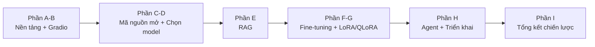
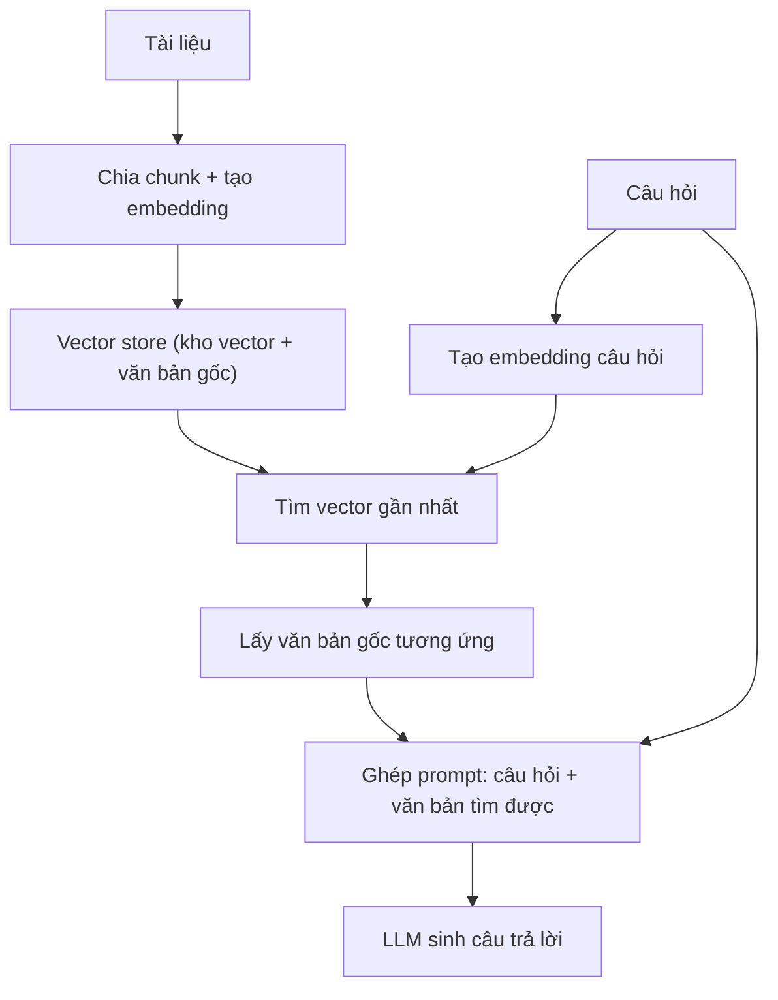

<!-- markdownlint-disable MD024 MD025 MD060 -->

# Q&A Ôn Tập — LLM Engineering (bản hệ thống hóa)

> **Mục tiêu học tập của bạn:** hiểu toàn bộ quá trình xây dựng và ứng dụng LLM — từ gọi API model có sẵn, chạy model mã nguồn mở tại local/Colab, RAG, đến tự fine-tune (LoRA/QLoRA) và ghép thành hệ agent hoàn chỉnh — để phục vụ việc viết code và phát triển sản phẩm (ReactJS, Node.js, NestJS, Python).
>
> Tài liệu này viết lại từ bản ghi chú thô ban đầu của bạn để dùng **ôn tập và luyện phỏng vấn**: các câu hỏi trùng ý hoặc liên quan chặt chẽ đã được **gộp lại thành một câu hỏi lớn hơn**, sắp xếp lại **theo đúng mạch tiến trình khóa học** (nền tảng → gọi API → model mã nguồn mở → chọn model → RAG → fine-tuning → LoRA/QLoRA → agent/triển khai → tổng kết), và bổ sung số liệu/ví dụ thật từ các dự án trong khóa để trả lời phỏng vấn có dẫn chứng cụ thể thay vì chỉ nói lý thuyết suông. Một số câu trả lời gốc chưa chính xác (ví dụ định nghĩa `parameters`) cũng đã được sửa lại.
>
> Ký hiệu dùng trong bài: 🔑 = ý quan trọng nhất cần nhớ nằm lòng · ⚠️ = điểm rất hay bị hiểu nhầm, cẩn thận khi trả lời phỏng vấn.



## Mục lục

- [Phần A — Nền Tảng LLM](#phần-a--nền-tảng-llm)
- [Phần B — Gradio Và Chat](#phần-b--gradio-và-chat)
- [Phần C — Hugging Face Và Model Mã Nguồn Mở](#phần-c--hugging-face-và-model-mã-nguồn-mở)
- [Phần D — Chọn Và Đánh Giá Model](#phần-d--chọn-và-đánh-giá-model)
- [Phần E — RAG](#phần-e--rag)
- [Phần F — Fine-tuning Cơ Bản](#phần-f--fine-tuning-cơ-bản)
- [Phần G — LoRA Và QLoRA](#phần-g--lora-và-qlora)
- [Phần H — Agent Và Triển Khai](#phần-h--agent-và-triển-khai)
- [Phần I — Tổng Kết](#phần-i--tổng-kết)

---

## Phần A — Nền Tảng LLM

### 1. LLM (Large Language Model) là gì?

Về bản chất kỹ thuật: LLM là một mạng nơ-ron (thường theo kiến trúc Transformer) được huấn luyện trên khối lượng văn bản khổng lồ với một mục tiêu rất đơn giản — **đoán token (mảnh từ) tiếp theo** trong một đoạn văn. Chỉ từ việc lặp lại nhiệm vụ "đoán chữ tiếp theo" hàng nghìn tỷ lần, model học được ngữ pháp, kiến thức thế giới và một phần khả năng suy luận.

Về góc nhìn người dùng: LLM là công cụ nhận vào một đoạn văn bản (prompt) và trả về một đoạn văn bản phản hồi phù hợp ngữ cảnh, dựa trên mọi thứ nó học được lúc huấn luyện.

⚠️ Điểm cần sửa so với ghi chú gốc: LLM tự nó **không** "hành động" hay "gọi công cụ" — đó là việc của tầng Tool/Agent bên ngoài (câu 7-10). LLM một mình chỉ sinh văn bản.

🔑 Chốt lại: LLM = bộ não sinh văn bản dựa trên xác suất, được huấn luyện trước (pre-trained); mọi "khả năng hành động" đều đến từ hệ thống bao quanh nó.

### 2. Prompt, System prompt, User prompt, và vai trò Assistant khác nhau ra sao?

Một cuộc hội thoại với LLM luôn được gửi dưới dạng danh sách `messages`, mỗi phần tử có một `role` (vai trò):

| Vai trò | Vai trò trong hội thoại | Ví dụ |
|---|---|---|
| `system` | Quy tắc/bối cảnh cố định do lập trình viên đặt ra, áp dụng cho toàn bộ hội thoại | "Bạn là kỹ sư AI chuyên nghiệp, luôn trả lời ngắn gọn." |
| `user` | Nội dung người dùng thật sự gõ vào | "Tôi muốn biết vòng đời trong lập trình ReactJS." |
| `assistant` | Câu trả lời trước đó của chính model, gửi lại để model "nhớ" mình đã nói gì | Câu trả lời ở lượt trước |

🔑 Chốt lại: `system` định hình **cách** model trả lời, `user` là **nội dung** cần trả lời, `assistant` là **lịch sử** giúp model nhất quán qua nhiều lượt. Xem câu 12 để hiểu vì sao phải gửi lại toàn bộ 3 loại này mỗi lần gọi.

### 3. AI có những loại nào? Mã nguồn mở khác mã nguồn đóng ra sao?

| Loại | Đặc điểm | Ví dụ |
|---|---|---|
| Mã nguồn đóng (closed) | Chỉ dùng qua API/web, không tải được, không biết đầy đủ kiến trúc/trọng số | GPT-4o/5, Claude, Gemini |
| Mã nguồn mở (open) | Có thể tải trọng số về, tự chạy trên máy/cloud riêng | Llama, Mistral, Qwen, DeepSeek, Gemma |

⚠️ Bổ sung quan trọng: phần lớn model "mã nguồn mở" trong AI thực ra chỉ là **open-weight** (mở trọng số) — bạn tải file trọng số về dùng/tinh chỉnh được, nhưng dữ liệu huấn luyện gốc và toàn bộ code huấn luyện thường **không** công bố đầy đủ. "Mở" ở đây khác với mã nguồn mở kiểu phần mềm thông thường (như Linux), nơi toàn bộ source có thể xem được.

### 4. Ollama là gì?

Ollama là công cụ giúp tải và chạy các model mã nguồn mở (Llama, Mistral, Qwen...) ngay trên máy cá nhân, miễn phí, chỉ bằng vài lệnh đơn giản (`ollama run llama3.2`). Nó tự lo tải model, quản lý bộ nhớ, và cung cấp một API cục bộ có cấu trúc giống hệt API của OpenAI để code cũ dễ chuyển đổi qua lại.

### 5. Parameters (tham số) trong LLM là gì?

⚠️ Đây là câu cần sửa lại so với ghi chú gốc. Parameters **không phải** là "tổng kiến thức cộng dồn theo từng chủ đề" (ví dụ JS=15 + React=10 + Anh văn=20 = 45 chỉ là phép ví von, không phải cách tính thật).

Về bản chất: parameters là **các con số (trọng số) bên trong mạng nơ-ron** được điều chỉnh dần trong quá trình huấn luyện để model dự đoán token tiếp theo chính xác hơn. Một model vài tỷ tham số nghĩa là nó có vài tỷ con số như vậy để lưu lại "kinh nghiệm" đã học.

Cách hiểu gần đúng cho phỏng vấn: càng nhiều tham số → model càng có **năng lực (capacity)** biểu diễn các mẫu hình phức tạp hơn. Nhưng nhiều tham số hơn **không tự động** đồng nghĩa "thông minh hơn" — còn phụ thuộc model có được huấn luyện với đủ lượng dữ liệu tương ứng hay không (xem Chinchilla Scaling Law — câu 28).

### 6. RLHF (Reinforcement Learning from Human Feedback) là gì?

RLHF là bước huấn luyện **bổ sung, xảy ra trong giai đoạn training** (trước khi bạn gọi API, không phải mỗi lần chat): con người xếp hạng nhiều câu trả lời khác nhau của model cho cùng một câu hỏi, rồi dùng thứ hạng đó để huấn luyện model có xu hướng trả lời theo phong cách "trợ lý hữu ích, an toàn, đúng định dạng" hơn.

🔑 Chốt lại: RLHF là lý do một model "thô" (chỉ mới học đoán chữ tiếp theo) trở thành một trợ lý biết trả lời đúng trọng tâm câu hỏi, thay vì chỉ viết tiếp văn bản ngẫu nhiên.

### 7. Một hệ thống LLM hoàn chỉnh gồm những thành phần nào? Model, Tool, Agent khác nhau ra sao?

| Thành phần | Vai trò | Có tự thực thi hành động thật không? |
|---|---|---|
| **Model** | "Bộ não" — nhận prompt, sinh văn bản hoặc sinh **yêu cầu gọi tool** | Không — chỉ đề xuất, không tự chạy |
| **Tool** | Chức năng phần mềm cụ thể máy có thể thực hiện: đọc file, gọi API, truy vấn database, chạy phép tính... | Có — nhưng chỉ chạy khi được chương trình bên ngoài cấp phép và gọi |
| **Agent** | Hệ thống điều phối để model **tự quyết định bước tiếp theo**, lặp lại theo vòng lặp tới khi xong việc | Không tự thực thi — vẫn là code Python gọi model rồi gọi tool |

Ví dụ cụ thể (dự án capstone Week 8): `SpecialistAgent` không "tự nghĩ" ra việc gì cả — nó chỉ nhận mô tả sản phẩm rồi gọi đúng một dịch vụ định giá đã fine-tune. Ngược lại `PlanningAgent` (Ngày 4 Week 8) mới thực sự thể hiện "tính agentic": nó dùng **tool calling** để tự quyết định gọi Scanner, Ensemble hay Messenger theo đúng thứ tự, thay vì lập trình viên viết cứng luồng xử lý.

🔑 Chốt lại: "tính agentic" nằm ở việc **model được quyền quyết định bước tiếp theo và công cụ cần dùng**; việc **thực thi hành động thật luôn nằm trong tay code** do lập trình viên viết, không phải do model tự ý làm.

### 8. Model (ví dụ gpt-4.1-mini, claude-sonnet-4.5) khác nhau ở điểm gì?

Mỗi tên model (`gpt-4.1-mini`, `claude-sonnet-4.5`, `gpt-5-nano`...) là một phiên bản AI cụ thể, có thể cùng hãng hoặc khác hãng, thường được tối ưu cho một điểm mạnh riêng (tốc độ, chi phí, khả năng suy luận sâu...). Model không tự thực thi hành động trên máy — nó chỉ sinh ra "yêu cầu gọi tool"; chương trình bên ngoài mới thực sự chạy tool đó.

### 9. Tool (công cụ) là gì?

Tool là các chức năng phần mềm cụ thể mà chương trình có thể thực hiện trên máy: mở/đọc/thêm/xóa/sửa file, gọi API ngoài, truy vấn cơ sở dữ liệu, chạy phép tính... Model chỉ có thể **đề xuất** gọi tool nào với tham số gì (dưới dạng dữ liệu có cấu trúc); code của lập trình viên quyết định có thực thi hay không.

### 10. Agent là gì?

Agent là hệ thống để model **tự quyết định bước tiếp theo trong một vòng lặp** (tự quyết định + có vòng lặp), thay vì đi theo một luồng xử lý viết cứng sẵn. Vòng lặp thường là: model nhận thông tin → quyết định gọi tool nào → code chạy tool → kết quả tool được đưa lại cho model đọc → model quyết định bước kế tiếp (gọi tool khác hoặc trả lời cuối cùng).

### 11. Training và Inference khác nhau thế nào? Vì sao chữ "P" trong GPT lại quan trọng?

| | Training (huấn luyện) | Inference (suy luận) |
|---|---|---|
| Đang làm gì | Cho model xem dữ liệu để nó **cập nhật tham số/trọng số nội bộ**, học tốt hơn cho một tác vụ | Dùng một model **đã huấn luyện xong** để tạo đầu ra mới từ đầu vào mới |
| Có đổi tham số không | Có | Không |
| Tên gọi khác | Nếu huấn luyện tiếp một model đã huấn luyện một phần → gọi là **fine-tuning** | Còn gọi là "Execution" hoặc "Running a model" |
| Ví dụ trong khóa học | Week 6-7 (fine-tuning GPT, QLoRA cho Llama) | Week 1-5 và Week 8 (gọi API GPT/Claude/Gemini, chạy pipeline HuggingFace, RAG, agent) |

🔑 Chữ **P** trong **GPT** là viết tắt của **Pre-trained** (đã huấn luyện trước) — khi bạn gọi API GPT, bạn đang dùng một model đã hoàn tất training từ trước, mọi lần gọi API chỉ là **inference**, không hề huấn luyện lại gì cả. Các API `pipeline()` của HuggingFace (câu 18) cũng chỉ dùng cho inference.

⚠️ Điểm hay hỏi phỏng vấn: viết prompt tốt hơn **không phải** là training — prompt chỉ thay đổi đầu vào, không đụng đến tham số model. Chỉ có fine-tuning (Phần F-G) hoặc training from scratch mới thực sự cập nhật tham số.

### 12. LLM có "nhớ" cuộc trò chuyện hay biết mình là ai không? Vì sao gọi là "stateless"?

Không. Bản thân API/model **không lưu trạng thái** giữa các lần gọi (gọi là **stateless**) — nó không có bộ nhớ liên tục kiểu con người. Mỗi lần gọi API là một lượt hoàn toàn độc lập.

Cảm giác model "nhớ" cuộc trò chuyện đến từ việc **ứng dụng bên ngoài** (giao diện chat, Gradio...) tự động ghép lại **system prompt + toàn bộ lịch sử hội thoại trước đó (các message `user`/`assistant`) + tin nhắn mới** thành một danh sách `messages` hoàn chỉnh, rồi gửi lại **từ đầu** cho model ở mỗi lượt gọi. Model chỉ "biết mình là ai ngay lúc đó" vì nó vừa đọc lại toàn bộ đoạn hội thoại được gửi kèm, không phải vì nó có trí nhớ riêng.

🔑 Chốt lại: không có "bộ nhớ" nào nằm trong model giữa hai lần gọi — toàn bộ "trí nhớ hội thoại" thực chất nằm ở phía ứng dụng, được gửi lại đầy đủ mỗi lần. Xem câu 15 để thấy cơ chế này thể hiện cụ thể trong code Gradio ra sao.

### 13. Streaming là gì?

Streaming là cơ chế hiển thị câu trả lời **dần dần từng phần** ngay khi model vừa sinh ra, thay vì bắt người dùng chờ tới khi toàn bộ câu trả lời hoàn tất mới hiển thị một lúc — giống xem video vừa tải vừa phát thay vì phải tải xong cả file.

⚠️ Điểm cần nhớ: streaming chỉ giúp **người dùng thấy kết quả sớm hơn** (trải nghiệm tốt hơn), nó **không** làm cả pipeline xử lý phía sau (ví dụ bước chọn link + tải trang trong một tác vụ scraping) chạy nhanh hơn về tổng thời gian.

---

## Phần B — Gradio Và Chat

### 14. Gradio là gì? Khác gì so với React?

Gradio là thư viện Python giúp dựng giao diện web nhanh chỉ từ một hàm Python: bạn viết `def f(input): return output`, Gradio tự vẽ form nhập liệu và hiển thị kết quả — không cần viết HTML/CSS/JS.

⚠️ Khác biệt lớn nhất so với React: với React, bạn tự dựng component, tự quản lý state, tự vẽ UI chi tiết. Với Gradio, bạn **chỉ khai báo input/output**, còn Gradio tự quán xuyến toàn bộ giao diện — đổi lại bạn có ít quyền tùy biến chi tiết hơn.

### 15. `gr.ChatInterface` hoạt động theo "hợp đồng" (callback) nào?

Đây chính là ví dụ **thực tế trong code** của khái niệm "hội thoại stateless" đã nói ở câu 12: hàm callback bạn viết cho `gr.ChatInterface` có dạng `chat(message, history)`, và ở **mỗi lần gọi**, chính code của bạn phải tự:

1. Lấy `history` (danh sách các lượt hỏi-đáp trước, do Gradio truyền vào).
2. Ghép `system message + history + message mới` thành một `messages` list hoàn chỉnh.
3. Gửi list đó cho API model.

🔑 Chốt lại: bản thân API **không tự nhớ** gì giữa các lần gọi — chính đoạn code `chat(message, history)` mới là nơi "giả lập" cảm giác model có trí nhớ, bằng cách luôn gửi lại toàn bộ ngữ cảnh cần thiết.

---

## Phần C — Hugging Face Và Model Mã Nguồn Mở

> Phần này trả lời câu hỏi: "Nếu không muốn/không thể trả phí API, có thể tự chạy AI trên máy mình không?" — Có, nhưng phải tự lo: tải model, chọn phần cứng (GPU), quản lý bộ nhớ (quantization) và hiểu rõ hơn cơ chế bên trong.

### 16. Hugging Face Hub là gì?

Là kho lưu trữ công khai chứa hàng trăm nghìn model và dataset đã huấn luyện sẵn — giống "npm/GitHub cho model AI". Ba mảng chính: **Models** (model đã huấn luyện), **Datasets** (dữ liệu), **Spaces** (demo đã triển khai sẵn để dùng thử). Mỗi model có một **model card** — trang mô tả khả năng, cách dùng và giới hạn.

Trong các dự án của khóa học, Hugging Face còn đóng vai trò thứ hai: nơi **lưu lại dataset đã xử lý** (ví dụ dataset giá sản phẩm ở Week 6) để dùng lại ở các bước/tuần sau.

### 17. Vì sao cần Google Colab?

Chạy model mã nguồn mở cần **GPU** (bộ xử lý chuyên tính toán ma trận nhanh) — hầu hết máy cá nhân không đủ mạnh hoặc không có GPU phù hợp. Colab cho mượn GPU miễn phí (có giới hạn, nhiều mức từ T4 đến A100 mạnh hơn) ngay trên trình duyệt.

⚠️ Lưu ý quan trọng: **restart session** sẽ xóa toàn bộ biến và model đang nạp trong bộ nhớ (phải nạp lại từ đầu); xóa hẳn runtime còn mất cả môi trường đã cài đặt. **Lưu file notebook không đồng nghĩa với lưu lại trạng thái máy đang chạy.**

### 18. `pipeline()` của thư viện `transformers` là gì?

`pipeline()` là cách dùng "rút gọn" để chạy rất nhiều loại model khác nhau chỉ bằng vài dòng code, không cần hiểu chi tiết bên trong:

```python
from transformers import pipeline

analyzer = pipeline("sentiment-analysis")   # tạo pipeline một lần, chỉ định tác vụ
result = analyzer("This lesson is useful.") # gọi nhiều lần với dữ liệu khác nhau
```

Chỉ cần đổi tên tác vụ (`"sentiment-analysis"`, `"summarization"`, `"translation"`, `"zero-shot-classification"`, `"text-generation"`...), `pipeline()` tự chọn model mặc định phù hợp, tự lo tokenizer và xử lý đầu ra.

⚠️ Cần hiểu đúng: `pipeline()` **không phải** gửi dữ liệu qua REST API cho Hugging Face xử lý hộ — model thật sự được tải về và chạy ngay trên máy/Colab của bạn. Và **score (độ tin cậy) cao không đồng nghĩa kết quả đúng** — đó chỉ là độ tự tin của model.

🔑 Đây là bước đệm hợp lý trước khi "tháo hộp đen" ở câu 21-22 (tự nạp tokenizer/model thay vì dùng bản đóng gói sẵn).

### 19. Token và Token ID là gì?

- **Token**: một đơn vị văn bản do tokenizer phân chia — có thể là một từ hoàn chỉnh, một mảnh từ, hoặc một dấu câu.
- **Token ID**: số nguyên định danh token đó trong bộ từ vựng (vocabulary) mà model "biết".

⚠️ Điểm hay nhầm: Token ID **không phải là vector** — nó chỉ là một con số tra cứu. Model dùng ID đó để tra ra một **embedding vector** tương ứng rồi mới đưa vào tính toán. ID lớn hơn **không** có nghĩa token đó "quan trọng hơn".

### 20. `AutoTokenizer` là gì? Vì sao cần dùng đúng tokenizer của từng model?

`AutoTokenizer.from_pretrained(model_id)` nạp đúng bộ tokenizer đi kèm một model cụ thể, dùng để:

- `tok.encode(text)` — chuyển văn bản thành danh sách token ID.
- `tok.decode(ids)` — chuyển token ID ngược lại thành văn bản đọc được.

⚠️ Mỗi model (Llama, Phi, DeepSeek, Qwen...) có cách chia token và bộ token ID **khác nhau** — không thể lấy tokenizer của model này dùng cho model khác, vì token ID sẽ bị hiểu sai hoàn toàn. Số token ít hơn cũng không chứng minh model đó "tốt hơn".

### 21. Chat template dùng để làm gì? Vì sao mỗi model có template riêng?

Một cuộc hội thoại có nhiều vai trò (`system`/`user`/`assistant`, câu 2) cần được "gói" lại thành **một chuỗi văn bản duy nhất** có cấu trúc rõ ràng (kèm các **special token** đánh dấu ranh giới lượt nói) trước khi đưa vào model — đây là việc của **chat template**:

```python
tok.apply_chat_template(messages, tokenize=False)             # xem chuỗi văn bản đã định dạng
tok.apply_chat_template(messages, tokenize=True)              # lấy luôn token ID
tok.apply_chat_template(messages, add_generation_prompt=True) # "mở sẵn" lượt trả lời của assistant
```

🔑 Vì sao mỗi model có template riêng: mỗi model được **huấn luyện** để quen với một định dạng hội thoại cụ thể (ký hiệu, thứ tự, special token khác nhau). Dùng sai template (ví dụ lấy template của Llama gán cho Qwen) khiến model nhận một chuỗi đầu vào nó chưa từng thấy dạng đó khi huấn luyện → dễ trả lời lệch lạc, dù bản thân model không hề "kém".

⚠️ Lưu ý: `add_generation_prompt=True` chỉ yêu cầu template chừa sẵn chỗ cho câu trả lời — **nó không tự tạo ra câu trả lời**, model vẫn phải tự sinh phần đó.

### 22. `AutoModelForCausalLM` là gì? Khác `pipeline()` ở điểm nào?

Đây là cách **tự nạp toàn bộ một LLM** để kiểm soát chi tiết quá trình sinh văn bản, thay vì dùng bản đóng gói sẵn của `pipeline()`. Luồng xử lý đầy đủ:

1. **Messages** → **chat template + tokenizer** → token ID (tensor PyTorch, đưa lên GPU bằng `.to("cuda")`).
2. **Embedding**: mỗi token ID được đổi thành một vector số đã học.
3. **Decoder blocks**: nhiều lớp liên tiếp, mỗi lớp có **attention** (kết hợp thông tin từ các token liên quan) và **MLP** (biến đổi phi tuyến).
4. **LM head**: tạo ra điểm số (logits) cho các token ứng viên tiếp theo.
5. `model.generate()` chọn token, lặp lại; `tokenizer.decode()` chuyển kết quả về lại văn bản. `TextStreamer` giúp hiển thị dần từng phần (câu 13).

🔑 Khác biệt cốt lõi với `pipeline()`: `pipeline()` giấu toàn bộ 5 bước trên sau một lệnh gọi duy nhất (nhanh, tiện, ít kiểm soát); `AutoModelForCausalLM` + `generate()` phơi bày từng bước để bạn tự kiểm soát (linh hoạt hơn, phải tự code nhiều hơn) — cần thiết khi muốn tùy biến sâu, ví dụ ở Phần F-G khi tự huấn luyện/fine-tune.

### 23. Autoregressive (tự hồi quy) nghĩa là gì? Model chọn token tiếp theo bằng cách nào?

**Autoregressive**: model sinh **từng token một**, mỗi token mới được chọn dựa trên toàn bộ ngữ cảnh (prompt + các token đã sinh trước đó), rồi lặp lại quá trình cho token kế tiếp — cứ thế tạo thành cả câu trả lời.

Cách chọn token tại mỗi bước có vài chiến lược:

| Chiến lược | Cách chọn |
|---|---|
| **Greedy** | Luôn chọn token có xác suất cao nhất |
| **Sampling** | Chọn ngẫu nhiên theo đúng phân bố xác suất model tính ra |
| **Temperature** | Tham số điều chỉnh mức "ngẫu nhiên" khi sampling (thấp → gần giống greedy; cao → đa dạng/rủi ro hơn) |

⚠️ Xác suất cao **không đảm bảo** câu đúng sự thật, và temperature thấp **cũng không đảm bảo** kết quả giống hệt nhau giữa các lần chạy.

### 24. Quantization (lượng tử hóa) đánh đổi điều gì lấy điều gì?

**Đánh đổi**: giảm **số bit dùng để lưu mỗi trọng số** của model (ví dụ từ 16-bit xuống 4-bit) để **giảm dung lượng bộ nhớ cần thiết**, đổi lại chấp nhận một **sai số tính toán nhỏ** trên mỗi trọng số.

$$\text{Dung lượng lý tưởng} = \text{số tham số} \times \text{số bit} \div 8$$

| Model 1 tỷ tham số | Dung lượng lý tưởng |
|---|---:|
| 32-bit | 4 GB |
| 16-bit | 2 GB |
| 4-bit | 0,5 GB |

⚠️ Ba điểm cần nhớ khi trả lời phỏng vấn:

1. Đây **chưa phải** tổng VRAM cần khi chạy thực tế — còn cache, tensor trung gian... nên số thật luôn cao hơn con số "lý tưởng" trên.
2. Giảm từ 16-bit xuống 4-bit **không đảm bảo chạy nhanh gấp 4 lần** — quantization chủ yếu tiết kiệm bộ nhớ, không phải tốc độ.
3. **NF4** là một cách mã hóa 4-bit phổ biến, **double quantization** giảm thêm dữ liệu phụ trợ — đây chính là kỹ thuật sẽ gặp lại dưới tên **QLoRA** (câu 48).

### 25. Vì sao hệ sinh thái AI/ML chủ yếu dùng Python?

Vài lý do thực tế (không phải vì Python "nhanh" — Python khá chậm so với C++/Rust khi tính thuần CPU):

- Hầu hết thư viện nền tảng AI/ML (`transformers`, PyTorch, `datasets`, `scikit-learn`, `xgboost`, `pydantic`, `gradio`...) được viết bằng Python hoặc có binding Python dễ dùng.
- Phần tính toán nặng (nhân ma trận, chạy GPU) thực chất chạy bằng code C/C++/CUDA bên dưới — Python chỉ là "lớp vỏ" gọi các thư viện đó, vẫn đảm bảo tốc độ mà dễ viết/đọc.
- Cú pháp đơn giản, cộng đồng cực lớn — phần lớn nghiên cứu AI mới công bố đều kèm code mẫu Python.
- Dữ liệu dạng bảng/vector (numpy, pandas) thao tác rất tự nhiên bằng Python.

🔑 Chốt lại: Python thắng nhờ **hệ sinh thái thư viện** và **tốc độ phát triển/thử nghiệm**, không phải vì bản thân ngôn ngữ chạy nhanh.

---

## Phần D — Chọn Và Đánh Giá Model

### 26. Quy trình chọn model trong thực tế gồm những bước nào?

Yêu cầu ứng dụng → xác định tiêu chí (chất lượng, tốc độ, chi phí) → tra benchmark/leaderboard để **lọc** ra một vài ứng viên (không phải để chọn luôn) → tự làm prototype → đo trên chính bài toán thật của bạn → chọn.

🔑 Điểm quan trọng nhất: leaderboard/benchmark chỉ dùng để **thu hẹp danh sách ứng viên**, quyết định cuối cùng phải dựa vào **kết quả đo trên chính bài toán của bạn** (xem câu 43 về baseline).

### 27. Benchmark là gì? Vì sao không nên tin tuyệt đối vào điểm benchmark?

Benchmark là bộ câu hỏi/bài kiểm tra chuẩn hóa dùng để so sánh model:

| Benchmark | Kiểm tra chủ yếu |
|---|---|
| GPQA | Câu hỏi khoa học chuyên sâu |
| MMLU-Pro | Kiến thức và suy luận đa lĩnh vực |
| AIME | Toán thi đấu |
| LiveCodeBench | Bài lập trình, có cập nhật đề mới theo thời gian |
| MuSR | Suy luận nhiều bước từ tình huống/câu chuyện |
| HLE (Humanity's Last Exam) | Câu hỏi học thuật cực khó |

⚠️ Năm lý do không nên tin tuyệt đối điểm số:

1. **Contamination** (nhiễm dữ liệu): đề/đáp án vô tình lọt vào dữ liệu huấn luyện.
2. **Overfitting benchmark**: chọn/chỉnh model quá nhiều lần dựa trên đúng một bộ đề, điểm cao nhưng chưa chắc phản ánh năng lực tổng quát.
3. **Khác điều kiện đo**: model này được cấp nhiều token/tool/số lượt thử hơn model kia khi so sánh.
4. **Phạm vi hẹp**: giỏi toán không đảm bảo giảng dễ hiểu hay viết giao diện tốt.
5. **Saturation** (bão hòa): khi hầu hết model đạt điểm gần tối đa, benchmark khó phân biệt model nào thực sự tốt hơn.

### 28. Chinchilla Scaling Law là gì?

> Trong điều kiện tối ưu tính toán huấn luyện, khi tăng kích thước model (số tham số), lượng token dữ liệu huấn luyện tối ưu cũng phải **tăng tương ứng**. Gấp đôi số tham số không có nghĩa model "thông minh" gấp đôi nếu không tăng đủ dữ liệu huấn luyện đi kèm.

Nói cách khác: chất lượng model phụ thuộc vào **sự cân bằng** giữa số tham số và lượng dữ liệu huấn luyện — tăng riêng một trong hai mà không tăng cái còn lại sẽ kém hiệu quả. Đây cũng là lý do (liên hệ câu 5) "nhiều tham số hơn" không tự động đồng nghĩa "tốt hơn": một ví dụ thực tế trong khóa học là **GPT-OSS 20B** (nhỏ hơn) từng vượt qua **GPT-OSS 120B** (lớn hơn) trong một bài kiểm tra sinh code cụ thể.

Ngoài việc huấn luyện lại (to hơn/nhiều dữ liệu hơn), chất lượng câu trả lời còn có thể cải thiện lúc *sử dụng* bằng prompt tốt hơn, thêm tính toán suy luận (reasoning), RAG (Phần E), hoặc cho model dùng tool — không phải lúc nào cũng cần một model "to hơn".

---

## Phần E — RAG

> RAG (Retrieval-Augmented Generation) được xem là kỹ thuật có khả năng ứng dụng tức thì cao bậc nhất của cả khóa học — giải quyết một giới hạn cốt lõi của LLM: **model không biết dữ liệu riêng/mới của bạn** (dữ liệu đó không nằm trong dữ liệu huấn luyện).

### 29. RAG là gì? Quy trình hoạt động gồm những bước nào?

**RAG (Retrieval-Augmented Generation — Sinh văn bản có tăng cường truy xuất)**: thay vì hy vọng model "biết sẵn" thông tin riêng của bạn, bạn tự tìm đoạn tài liệu liên quan rồi nhét vào prompt **trước khi** gọi model. Hai bước gộp lại: **Retrieval** (truy xuất — tìm tài liệu liên quan) rồi **Generation** (sinh — model viết câu trả lời dựa trên tài liệu đó).

Quy trình đầy đủ tách thành 2 giai đoạn:

**Giai đoạn A — Chuẩn bị tài liệu** (làm trước, cập nhật khi dữ liệu đổi): đọc văn bản trong kho kiến thức → chia nhỏ thành **chunk** (câu 31) → tạo **embedding** cho từng chunk (câu 32) → lưu vector kèm văn bản gốc vào **vector store** (câu 33).

**Giai đoạn B — Khi người dùng hỏi**: tạo embedding của câu hỏi → so sánh với các vector đã lưu để tìm nội dung liên quan nhất → lấy lại **văn bản gốc** của các kết quả được chọn → ghép văn bản đó với câu hỏi thành prompt → gọi LLM sinh câu trả lời.



🔑 Điều quan trọng nhất cần khắc sâu: đưa tài liệu vào prompt **không phải huấn luyện lại model**, và model **không hề "ghi nhớ vĩnh viễn"** kho tài liệu — mỗi lần hỏi, hệ thống phải tìm lại và gửi lại đúng phần tài liệu liên quan. LLM đọc **văn bản gốc** đã tìm được, chứ không đọc dãy số embedding.

### 30. RAG khác System prompt (câu 2) như thế nào?

Đây là câu hay bị nhầm nhất khi mới học RAG. Cả hai đều **không** đụng đến tham số model (khác fine-tuning), nhưng khác nhau ở tính chất:

| | System prompt truyền thống | RAG |
|---|---|---|
| Nội dung | **Cố định**, viết sẵn một lần, giống nhau cho mọi câu hỏi | **Động** — mỗi câu hỏi có nội dung tài liệu khác nhau được chèn vào |
| Nguồn nội dung | Do lập trình viên gõ tay | **Tìm ra tự động** từ một kho tài liệu lớn (có thể hàng triệu trang) qua bước retrieval |
| Giới hạn | Bị giới hạn bởi context window — không thể nhét cả kho tài liệu khổng lồ vào system prompt cho mọi lần gọi (tốn token, tốn chi phí) | Có thể "với tới" kho kiến thức lớn hơn nhiều lần context window, vì mỗi lần chỉ lấy **đúng phần liên quan** |

🔑 Cách hình dung dễ nhớ: RAG giống một **system prompt được tạo động, khác nhau cho từng câu hỏi**, thay vì một đoạn văn bản cố định dùng chung cho mọi câu hỏi.

### 31. Chunking (chia đoạn) là gì? Vì sao phải chunking trước khi tạo embedding?

Tài liệu dài phải được cắt thành các đoạn nhỏ (**chunk**) trước khi tạo embedding, vì hai lý do:

1. Model embedding có **giới hạn độ dài đầu vào** (ví dụ MiniLM mặc định cắt bớt nếu đầu vào vượt quá 256 word-piece) — tài liệu dài nguyên khối có thể bị cắt mất phần cuối nếu không tự chia nhỏ.
2. Đoạn nhỏ giúp **truy xuất chính xác hơn** — hệ thống chỉ trả về đúng phần liên quan thay vì kéo theo cả tài liệu dài, tránh làm loãng ngữ cảnh gửi cho LLM.

Đánh đổi khi chọn kích thước chunk:

| Kích thước chunk | Ưu điểm | Nhược điểm |
|---|---|---|
| Nhỏ | Tập trung vào chi tiết | Dễ mất điều kiện/chủ thể liên quan (ví dụ mất tên người ở đầu đoạn) |
| Lớn | Giữ được ngữ cảnh | Dễ lẫn nhiều ý, tốn context không cần thiết |

**Overlap** (chồng lấn) giữa các chunk liền kề giúp giảm nguy cơ đứt ngữ cảnh ở ranh giới cắt, nhưng lạm dụng sẽ tăng dữ liệu trùng lặp. ⚠️ Công cụ chia chunk phổ biến (`RecursiveCharacterTextSplitter`) chỉ ưu tiên cắt theo ranh giới đoạn văn trước — nó **không tự hiểu ý nghĩa** như biên tập viên con người, nên cấu hình chunk luôn cần thử nghiệm, không có con số "đúng" tuyệt đối cho mọi dữ liệu.

### 32. Embedding là gì? Khác so khớp từ khóa (keyword matching) ra sao?

**Embedding**: một model riêng biệt (không phải LLM sinh văn bản) chuyển một đoạn text thành một **danh sách số (vector)**, sao cho các đoạn có ý nghĩa gần nhau thì vector của chúng cũng "gần nhau" trong không gian nhiều chiều (đo bằng **cosine similarity**).

So sánh với khớp từ khóa:

| | Khớp từ khóa (keyword matching) | Embedding (tìm theo ngữ nghĩa) |
|---|---|---|
| Cách hoạt động | Kiểm tra chữ có trùng nhau không | So sánh khoảng cách vector ý nghĩa |
| Ví dụ | "giá vé máy bay" và "chi phí chuyến bay" → **không khớp** vì không trùng chữ nào | Hai câu trên vẫn có thể cho vector **gần nhau** vì cùng ý nghĩa |
| Điểm yếu | Quá cứng nhắc — đổi cách diễn đạt là tìm sai/không thấy | Cần model embedding đã huấn luyện tốt; không hoàn hảo 100% |

⚠️ Lưu ý quan trọng: các con số trong vector **không do lập trình viên tự gán** (kiểu "nói về bảo hiểm thì cho số 10") — model embedding đã được huấn luyện để tự tạo ra biểu diễn hữu ích. Và **model tạo embedding** (giúp *tìm*) với **LLM sinh văn bản** (giúp *trả lời*) có thể là **hai model hoàn toàn khác nhau**.

### 33. Vector store (ví dụ Chroma) là gì?

Vector store là cơ sở dữ liệu chuyên **lưu và tìm kiếm vector** — lưu embedding kèm văn bản gốc (và metadata) tương ứng, rồi hỗ trợ tìm nhanh các vector "gần" một vector truy vấn cho trước. Chroma là một vector store cụ thể được dùng trong khóa học.

⚠️ Đổi embedding model bắt buộc phải **tạo lại toàn bộ vector** (cả tài liệu lẫn câu hỏi) — hai model có cùng số chiều vector không có nghĩa chúng dùng chung một không gian vector tương thích với nhau.

### 34. Nếu tài liệu không chứa đáp án thì hệ thống nên xử lý thế nào?

Hệ thống cần **thừa nhận thiếu thông tin** thay vì suy đoán rồi trình bày như một sự thật (đây là một dạng **hallucination** — ảo giác/bịa đặt của LLM). Cách phòng tránh phổ biến: viết rõ trong prompt hướng dẫn model "chỉ trả lời dựa trên tài liệu được cung cấp; nếu tài liệu không chứa thông tin liên quan, hãy nói rõ là không tìm thấy/không đủ căn cứ, không tự bịa".

### 35. RAG khác Fine-tuning và "upload dataset" ở điểm nào? Vì sao RAG thường triển khai nhanh hơn?

Ba thao tác này rất hay bị nhầm là "giống nhau" vì đều liên quan tới "dữ liệu", nhưng thực chất khác hẳn nhau:

| Thao tác | Bản chất | Có cập nhật tham số model không? |
|---|---|---|
| **RAG** | Tìm tài liệu liên quan, đưa vào ngữ cảnh **ngay lúc trả lời** | Không |
| **Fine-tuning** | Huấn luyện thêm trên dữ liệu mới, cập nhật tham số (toàn phần hoặc adapter) | Có |
| **Upload dataset** | Chỉ đơn thuần **lưu trữ** dữ liệu ở đâu đó (ví dụ Hugging Face) | Không — chưa hề chạm vào model |

🔑 Vì sao RAG thường triển khai **nhanh hơn** fine-tuning: RAG không cần một quy trình huấn luyện tốn GPU/thời gian — chỉ cần build (hoặc cập nhật thêm) kho vector là dùng được ngay; muốn thêm dữ liệu mới chỉ cần nạp thêm tài liệu vào vector store. Fine-tuning cần thu thập dữ liệu huấn luyện có nhãn, chuẩn bị hạ tầng huấn luyện, và mỗi khi dữ liệu thay đổi đáng kể thường phải huấn luyện lại.

### 36. Đánh giá một hệ RAG: vì sao phải tách riêng "retrieval" và "generation"?

| Phần | Câu hỏi cần kiểm tra | Vài chỉ số dùng đo |
|---|---|---|
| **Retrieval** (truy xuất) | Hệ thống có tìm **đúng và đủ** đoạn tài liệu cần thiết không? | Keyword coverage, **MRR** (đo đoạn đúng xuất hiện sớm/muộn trong danh sách kết quả), **nDCG** (chất lượng sắp xếp toàn bộ danh sách) |
| **Answer / Generation** (câu trả lời) | Dựa trên các đoạn đã tìm, LLM trả lời **đúng, đủ, đúng trọng tâm** không? | Chấm bằng **LLM-as-a-Judge** theo 3 tiêu chí: Accuracy (đúng), Completeness (đủ), Relevance (liên quan) |

Ví dụ thực tế minh họa vì sao phải tách hai phần: đáp án đúng là "Maxine Thompson", nhưng chunk tìm được chỉ ghi "Maxine" (thiếu họ) → LLM trả lời thiếu họ **không phải vì LLM kém**, mà vì bước retrieval đã cung cấp thiếu thông tin ngay từ đầu. Nếu không tách hai phần, rất dễ đổ oan lỗi cho LLM trong khi lỗi thật nằm ở bước tìm kiếm.

⚠️ Vài điểm dễ hiểu sai khi đọc chỉ số: MRR 0,79 **không phải** là "79% câu trả lời đúng" — đó là phép đo về *thứ hạng*; Accuracy 4,21/5 là điểm giám khảo AI chấm, không phải tỷ lệ phần trăm trả lời đúng.

### 37. Kể vài kỹ thuật Advanced RAG và lý do nó cải thiện so với RAG cơ bản?

Mười hướng cải tiến được giới thiệu: chunking nâng cao (semantic chunking), chọn encoder phù hợp, cải thiện prompt, tiền xử lý tài liệu (thêm tiêu đề/tóm tắt), **query rewriting** (viết lại câu hỏi cho rõ nghĩa), query expansion (tìm bằng nhiều biến thể câu hỏi), **re-ranking** (xếp hạng lại kết quả tìm được), Hierarchical RAG, GraphRAG, Agentic RAG.

Ví dụ cụ thể chứng minh **re-ranking** cải thiện thật: câu hỏi "Ai học ở Manchester University?" (hồ sơ gốc ghi "University of Manchester") — sau khi chia đoạn theo ngữ nghĩa, đoạn đúng chỉ xếp hạng 5; sau khi re-rank lại theo câu hỏi gốc, đoạn đó được đẩy lên **hạng 1**.

⚠️ Bài học quan trọng đi kèm: thêm một bước AI vào pipeline (như query rewriting) **không tự động** làm hệ thống tốt hơn. Trong cùng ví dụ trên, bước query rewriting đôi khi tự ý thêm tên công ty vào câu hỏi viết lại, khiến kết quả tìm kiếm bị "kéo lệch" và tệ đi — cách khắc phục là tìm kiếm bằng **cả câu hỏi gốc lẫn câu viết lại**, rồi gộp kết quả và xếp hạng chung. Kết quả đo được trong khóa học: MRR tăng từ 0,73 lên 0,91, Accuracy từ 3,99 lên 4,62/5 — nhưng đây là kết quả của một bộ test cụ thể, nhiều kỹ thuật đổi cùng lúc, không thể quy hết công cho riêng một kỹ thuật.

🔑 Chốt lại cả Phần E: RAG nâng cao thực chất là **tổ chức dữ liệu và tìm kiếm bằng chứng tốt hơn** — nhưng muốn biết nó có thực sự tốt hơn hay không, bắt buộc phải đo bằng số liệu (câu 36), không thể chỉ dựa vào cảm giác "có vẻ trả lời hay hơn".

---

## Phần F — Fine-tuning Cơ Bản

> Dự án xuyên suốt Week 6: đọc mô tả sản phẩm Amazon và **ước lượng giá** — dùng để so sánh nhiều cách tiếp cận khác nhau, từ đơn giản nhất đến phức tạp nhất, cùng trên một bài toán và một cách đánh giá.

### 38. Fine-tuning là gì? So với Prompting/RAG/Tool calling/Training from scratch khác nhau ra sao?

**Fine-tuning**: bắt đầu từ một **pre-trained model** (model đã huấn luyện trước, biết ngôn ngữ nói chung), rồi huấn luyện thêm bằng dữ liệu phục vụ một nhiệm vụ cụ thể — giống tuyển một người đã biết đọc, đào tạo thêm nghiệp vụ định giá, thay vì dạy lại từ đầu cách đọc từng chữ. Cách tận dụng kiến thức cũ cho nhiệm vụ mới gọi là **transfer learning** (học chuyển giao).

Bảng phân biệt 5 cách "dạy" một model làm việc mới — bảng quan trọng nhất để trả lời phỏng vấn về chủ đề này:

| Cách làm | Ví dụ (nhân viên định giá) | Cập nhật tham số? |
|---|---|---|
| **Prompting** | Dặn cách định giá hoặc cho vài ví dụ ngay trong yêu cầu | Không |
| **RAG** | Tìm tài liệu liên quan, đưa cho đọc trước khi trả lời | Không |
| **Tool calling** | Cho phép tra cứu/dùng máy tính qua hệ thống | Không — chỉ là gọi công cụ |
| **Fine-tuning** | Tổ chức đợt đào tạo thêm từ nhiều ví dụ | **Có** (toàn phần hoặc một phần, tùy phương pháp) |
| **Training from scratch** | Xây năng lực model từ điểm khởi tạo ban đầu | **Có**, quy mô/nguồn lực lớn hơn nhiều |

🔑 Ghi nhớ nhanh: chỉ có **fine-tuning** và **training from scratch** mới thực sự thay đổi bên trong model; ba cách còn lại chỉ thay đổi **đầu vào** gửi cho model.

### 39. Vì sao cần "Generalization" (khái quát hóa) khi huấn luyện? Không chỉ là học thuộc lòng?

Model cần học được **quy luật chung** ẩn trong dữ liệu huấn luyện (ví dụ: sản phẩm mô tả "cao cấp, thương hiệu X" thường có giá cao hơn), để áp dụng tốt lên **dữ liệu mới chưa từng thấy** (tập test) — chứ không phải chỉ "nhớ" chính xác giá của từng sản phẩm đã có trong tập train. Nếu model chỉ học thuộc dữ liệu train mà không khái quát hóa được, đó chính là dấu hiệu **overfitting** (câu 49).

### 40. Dữ liệu cho dự án Pricer đến từ đâu và được làm sạch ra sao?

Nguồn dữ liệu: `McAuley-Lab/Amazon-Reviews-2023` trên Hugging Face. Dù tên có chữ "Reviews", phần dùng trong dự án là **thông tin sản phẩm, mô tả và giá** — không dùng nội dung đánh giá khách hàng làm đầu vào chính.

Quy tắc lọc/làm sạch cụ thể (trong `parser.py`):

- Giá phải chuyển được sang số thực, nằm trong khoảng **0,5 – 999,49 USD**.
- Văn bản mô tả sau làm sạch phải có ít nhất **600 ký tự**; mỗi phần mô tả tối đa 3.000 ký tự, tổng tối đa 4.000 ký tự.
- Loại bỏ các trường ít hữu ích (như mã sản phẩm/Part Number, Best Sellers Rank).
- Trọng lượng được quy đổi thống nhất về **pound**.

⚠️ Đây là lựa chọn cụ thể của dự án này, **không phải tiêu chuẩn bắt buộc** cho mọi bài toán — các con số độ dài trên tính bằng **ký tự**, không phải token. `price` cũng chỉ là giá tham chiếu tại thời điểm thu thập dữ liệu, không phải cam kết giá thị trường hiện tại.

(Khái niệm liên quan: **synthetic data** — dữ liệu tổng hợp — là ví dụ được AI tạo ra thay vì thu thập trực tiếp; dùng dữ liệu tổng hợp không tự động đảm bảo nhãn/giá trị đúng, chất lượng vẫn phải được kiểm soát.)

### 41. Vì sao phải quan tâm đến phân bố dữ liệu và loại trùng lặp trước khi chia tập?

Khi gộp nhiều category sản phẩm lại, dự án phát hiện **quá nhiều sản phẩm giá rẻ** và một số category (như phụ tùng ô tô) chiếm ưu thế áp đảo — nếu không xử lý, model sẽ học lệch theo nhóm chiếm đa số thay vì học tốt đều các mức giá/loại sản phẩm.

Loại trùng (dedupe) theo `title` rồi theo `full` (mô tả) trước khi chia tập là bắt buộc — vì nếu một sản phẩm trùng lặp vừa nằm trong tập train vừa nằm trong tập test, model có thể "đã nhìn thấy" sản phẩm đó lúc học, khiến kết quả đánh giá trên test bị **rò rỉ (leakage)** và không còn đáng tin.

### 42. Quy trình lấy mẫu và chia tập train/validation/test diễn ra thế nào?

Sau khi làm sạch và loại trùng, dự án **lấy mẫu có trọng số** (ưu tiên điều chỉnh lại phân bố giá cho cân đối hơn) để chọn ra **820.000 sản phẩm**, sau đó xáo trộn và chia thành hai phiên bản dataset để tiện thực hành: **Full** (đầy đủ) và **Lite** (thu nhỏ, chạy nhanh hơn).

| Tập | Dataset Full | Dataset Lite | Vai trò |
|---|---:|---:|---|
| `train` | 800.000 | 20.000 | Dùng để cập nhật tham số/học |
| `validation` | 10.000 | 1.000 | Theo dõi quá trình và chọn cấu hình/checkpoint |
| `test` | 10.000 | 1.000 | Chỉ dùng để đánh giá cuối cùng |

⚠️ Nguyên tắc quan trọng: **không** dùng tập `test` liên tục để sửa prompt hay chọn model trong lúc phát triển — làm vậy vô tình biến test thành một phần của quá trình phát triển, không còn là phép kiểm tra độc lập.

### 43. Vì sao cần có baseline trước khi thử các phương pháp phức tạp?

Baseline (mốc so sánh đơn giản nhất) giúp trả lời câu hỏi "phương pháp phức tạp hơn có thực sự đáng công sức bỏ ra không, hay chỉ tốt hơn một chút so với đoán đại?". Không có baseline, một con số MAE = 68 USD sẽ **vô nghĩa** vì không biết nó tốt hay tệ so với mức nào.

Ví dụ baseline dùng trong dự án Pricer:

| Baseline | Cách làm | Sai số trung bình (MAE) |
|---|---|---:|
| Random Pricer | Đoán giá hoàn toàn ngẫu nhiên | 382,08 USD |
| Constant Pricer | Luôn đoán bằng giá trung bình của tập train | 106,18 USD |

🔑 Chốt lại: baseline thiết lập một "sàn" để mọi phương pháp phức tạp hơn (Linear Regression, XGBoost, Neural Network, fine-tuning...) phải **vượt qua rõ rệt** thì mới coi là có giá trị thực sự, chứ không phải chỉ "nghe có vẻ hay hơn".

### 44. `loss` khác `MAE` (Mean Absolute Error) như thế nào?

Một trong những điểm **dễ nhầm nhất** khi fine-tuning cho bài toán có con số cụ thể (như dự đoán giá):

| | Loss (trong huấn luyện sinh văn bản) | MAE (đánh giá bài toán định giá) |
|---|---|---|
| Đo cái gì | Khả năng model **dự đoán đúng token tiếp theo** của câu trả lời | Độ lệch tuyệt đối trung bình giữa **giá dự đoán** và **giá thật**, tính bằng USD |
| Đơn vị | Không phải đơn vị tiền tệ | USD (hoặc đơn vị giá) |
| Ý nghĩa khi giảm | Model đang "khớp" tốt hơn với văn bản mẫu | Model đang đoán giá gần đúng hơn |

⚠️ **Loss giảm không đủ để kết luận giá dự đoán tốt hơn** — một model có thể trả lời đúng *định dạng* (ví dụ luôn viết "Price is $...") và vì vậy có loss thấp, nhưng vẫn đoán sai giá trị số rất xa. Phải luôn gọi model trên tập test thật và tự tính sai số giá (MAE) để biết chất lượng thực sự, không thể chỉ nhìn loss.

### 45. Vì sao XGBoost lại cho kết quả tốt hơn Linear Regression trong bài toán này?

Kết quả đo được trong dự án (đơn vị: sai số trung bình MAE):

| Phương pháp | MAE |
|---|---:|
| Linear Regression (đặc trưng đơn giản: `weight`, `text_length`) | 101,56 USD |
| NLP + Linear Regression (đặc trưng từ vựng mô tả) | 76,81 USD |
| Random Forest | 72,28 USD |
| **XGBoost** | **68,23 USD** |

Hai lý do chính:

1. **Nhiều đặc trưng hơn, chất lượng hơn**: chuyển từ vài đặc trưng thô (cân nặng, độ dài text) sang đặc trưng rút ra từ **nội dung từ vựng thật** của mô tả sản phẩm giúp cải thiện rõ rệt — ngay cả khi vẫn dùng Linear Regression (giảm từ 101,56 xuống 76,81 USD).
2. **Mô hình phi tuyến (non-linear)**: Linear Regression chỉ học được quan hệ **tuyến tính** giữa đặc trưng và giá; XGBoost (gradient boosting trên cây quyết định) học được các quan hệ **phi tuyến, phức tạp hơn** giữa nhiều đặc trưng — ví dụ "cân nặng cao chỉ làm giá tăng nếu thuộc nhóm điện tử, còn nhóm khác thì không" là kiểu quan hệ mà mô hình tuyến tính không biểu diễn được.

### 46. Có bằng chứng cụ thể nào cho thấy "fine-tuning/mô hình phức tạp hơn không đảm bảo luôn tốt hơn"?

Bảng tổng hợp toàn bộ các phương pháp đã thử trong dự án Pricer (Week 6) và fine-tuning QLoRA (Week 7), cùng đo trên một dạng bài toán tương tự:

| Phương pháp | Loại | MAE |
|---|---|---:|
| Random Pricer | Baseline | 382,08 USD |
| Constant Pricer | Baseline | 106,18 USD |
| Linear Regression | ML cổ điển | 101,56 USD |
| Human baseline | Con người đoán | 87,62 USD |
| NLP + Linear Regression | ML cổ điển | 76,81 USD |
| Random Forest | ML cổ điển | 72,28 USD |
| XGBoost | ML cổ điển | 68,23 USD |
| QLoRA fine-tune bản **Lite** (Llama 3.2 3B) | Fine-tuning (ít dữ liệu/rank thấp) | 65,40 USD |
| Neural Network tự huấn luyện | Học sâu (từ đầu) | 63,97 USD |
| GPT-4.1 Nano (chỉ prompt, chưa fine-tune) | LLM frontier | 62,51 USD |
| Grok 4.1 Fast (chỉ prompt) | LLM frontier | 57,62 USD |
| Gemini 3 Pro (chỉ prompt) | LLM frontier | 50,54 USD |
| Claude 4.5 Sonnet (chỉ prompt) | LLM frontier | 47,10 USD |
| GPT-5.1 (chỉ prompt) | LLM frontier | 44,74 USD |
| QLoRA fine-tune bản **Full** (Llama 3.2 3B) | Fine-tuning (đủ dữ liệu/tài nguyên) | 39,85 USD |

🔑 Hai bằng chứng rõ ràng nhất từ chính bảng này:

1. **Bản fine-tune "Lite" (65,40 USD) thua** nhiều model frontier **hoàn toàn chưa hề fine-tune** (Grok, Gemini, Claude, GPT-5.1 chỉ dùng prompting) — chứng tỏ fine-tuning **không tự động thắng**; nó phụ thuộc rất nhiều vào **lượng dữ liệu và cấu hình** (rank, epoch...) được đầu tư.
2. Ngược lại, **bản fine-tune "Full" (39,85 USD) lại vượt qua tất cả**, kể cả các model frontier khổng lồ — cho thấy một model nhỏ (3B tham số) được fine-tune **đủ tốt** cho một nhiệm vụ hẹp, cụ thể vẫn có thể thắng model frontier tổng quát khi chỉ dùng prompting.

⚠️ Đây là số liệu của **một lần chạy demo cụ thể** trong khóa học, không phải benchmark chuẩn hay kết luận phổ quát — nên trích dẫn **cách suy luận**: fine-tuning có thể rất mạnh cho nhiệm vụ hẹp, nhưng chất lượng của nó phụ thuộc vào mức đầu tư dữ liệu/cấu hình, không phải cứ fine-tune là tự động tốt hơn.

---

## Phần G — LoRA Và QLoRA

### 47. LoRA (Low-Rank Adaptation) là gì? Tiết kiệm gì so với fine-tune toàn bộ tham số?

**Vấn đề LoRA giải quyết**: fine-tune toàn bộ tham số của một model hàng tỷ tham số đòi hỏi rất nhiều bộ nhớ và tính toán (phải lưu gradient cho từng tham số).

**Cách LoRA giải quyết**: **đóng băng (freeze)** toàn bộ trọng số của model gốc (không cập nhật), rồi chỉ **thêm** một cặp ma trận nhỏ có hạng thấp (low-rank) — gọi là **adapter** — vào một số lớp nhất định. Trong lúc huấn luyện, **chỉ phần adapter nhỏ này được cập nhật**.

Ba tham số cấu hình cần nhớ:

| Tham số | Vai trò |
|---|---|
| `r` (rank) | Kích thước của adapter — càng lớn, adapter càng có nhiều "sức chứa" để học, nhưng càng nặng |
| `alpha` | Mức độ ảnh hưởng của adapter lên kết quả cuối |
| `target_modules` | Adapter được gắn vào những lớp nào của model gốc |

🔑 **Tiết kiệm được gì**: số tham số cần cập nhật/lưu gradient giảm đi rất nhiều lần (chỉ còn phần adapter, thường chưa tới 1% tổng tham số) → giảm mạnh bộ nhớ GPU và thời gian huấn luyện, trong khi model gốc (kiến thức nền) vẫn được giữ nguyên và vẫn tham gia tính toán khi suy luận (chỉ là không bị cập nhật).

### 48. QLoRA = LoRA + kỹ thuật gì?

**QLoRA = Quantization (lượng tử hóa, câu 24) + LoRA (câu 47)**:

- Model nền được **lượng tử hóa xuống 4-bit** trước (giảm mạnh bộ nhớ cần để *nạp* model — quantization không làm giảm số lượng tham số, chỉ giảm số bit lưu mỗi tham số).
- Sau đó, adapter LoRA được **huấn luyện trên nền 4-bit đã đóng băng** đó.

⚠️ Phân biệt rõ hai loại "dung lượng" hay bị gộp nhầm: dung lượng **file model đã lượng tử hóa** (footprint khi nạp) khác với **tổng bộ nhớ cần khi huấn luyện** (còn phải cộng thêm gradient, optimizer state, activation... của riêng phần adapter).

🔑 Nhờ kết hợp cả hai kỹ thuật, QLoRA giúp fine-tune được cả những model tương đối lớn (như Llama 3.2 3B trong dự án Pricer Week 7) trên phần cứng GPU khiêm tốn hơn nhiều so với full fine-tuning.

### 49. Training loss và Validation loss khác nhau thế nào? Overfitting là gì?

| | Training loss | Validation loss |
|---|---|---|
| Đo trên tập nào | Tập `train` (dữ liệu model đang học trực tiếp) | Tập `validation` (dữ liệu model **không** được dùng để cập nhật tham số) |
| Ý nghĩa | Model đang khớp dữ liệu đã học tốt đến đâu | Model có khả năng **áp dụng lên dữ liệu mới** (chưa từng thấy) tốt đến đâu |
| Dùng để làm gì | Theo dõi tiến trình học | Chọn cấu hình/checkpoint tốt nhất |

**Overfitting** (học vẹt/quá khớp): xảy ra khi **training loss tiếp tục giảm** nhưng **validation loss lại tăng trở lại** — dấu hiệu model đang "học thuộc lòng" chi tiết/nhiễu riêng của tập train thay vì học quy luật chung (liên hệ **Generalization** — câu 39), nên càng học thêm càng kém hiệu quả trên dữ liệu thật/mới.

Ví dụ thực tế trong khóa học: một lượt huấn luyện QLoRA đã chọn **checkpoint ở khoảng step 6.200** làm checkpoint cuối cùng, vì validation loss bắt đầu xấu đi từ epoch thứ ba trở đi — dù model vẫn tiếp tục train thêm sau đó. Bằng chứng cho nguyên tắc: **checkpoint mới nhất/cuối cùng chưa chắc là checkpoint tốt nhất**; phải chọn dựa trên validation, không phải dựa trên "train lâu hơn thì chắc tốt hơn".

⚠️ Nhắc lại câu 44: cả training loss lẫn validation loss đều đo việc **dự đoán token**, không phải sai số giá bằng USD — loss giảm/tăng chỉ là tín hiệu gián tiếp, chất lượng thật vẫn phải đo bằng MAE trên tập test sau khi đã chọn xong checkpoint.

### 50. Không nên khẳng định điều gì về fine-tuning? Kết quả phụ thuộc vào đâu?

Không nên khẳng định tuyệt đối "fine-tuning luôn tốt hơn" hay "luôn tệ hơn" so với dùng model frontier có sẵn — bằng chứng cụ thể ở câu 46 (bản Lite thua nhiều model chỉ-prompt, bản Full lại thắng tất cả) cho thấy kết quả phụ thuộc vào:

- **Lượng dữ liệu huấn luyện** (Lite dùng ít dữ liệu hơn Full).
- **Cấu hình adapter** (`r`, `alpha`, `target_modules`) và siêu tham số huấn luyện (epoch, batch size, learning rate...).
- **Chất lượng/độ sạch của dữ liệu** đưa vào (Phần F).
- **Việc có theo dõi validation để chọn đúng checkpoint hay không** (câu 49) — tránh vừa overfitting vừa tránh dừng quá sớm.
- **Bài toán có đủ hẹp/đặc thù để việc chuyên biệt hóa thực sự có lợi thế** so với một model tổng quát rất mạnh hay không.

---

## Phần H — Agent Và Triển Khai

> Week 8 là tuần capstone (tổng kết) — không giới thiệu khái niệm hoàn toàn mới, mà **ghép lại** mọi kỹ thuật đã học (gọi API, RAG, fine-tuning, đánh giá model) thành một hệ nhiều agent phối hợp để tự động "săn" ưu đãi sản phẩm.

### 51. Modal.com là gì?

Modal là nền tảng **"serverless"** (không cần tự quản lý server) để triển khai hàm/model Python lên cloud và gọi được từ xa. "Serverless" không có nghĩa "không có máy chủ thật" — vẫn có server phía sau, chỉ là bạn **không phải tự quản lý** nó (không tự cài hệ điều hành, không tự lo mở rộng/thu hẹp tài nguyên...).

Vài khái niệm đi kèm cần nhớ:

| Từ khóa | Ý nghĩa |
|---|---|
| Deployment (triển khai) | Đưa code/model lên chạy như một dịch vụ có thể gọi lại nhiều lần |
| Secret | Nơi lưu thông tin xác thực (ví dụ `HF_TOKEN`) để container có quyền tải model |
| Volume | Nơi lưu file bền vững giữa các lần chạy — **khác** với việc model đã sẵn sàng trong bộ nhớ RAM/VRAM |
| Cold start (khởi động nguội) | Thời gian cần để khởi động môi trường + nạp model trước khi xử lý được yêu cầu đầu tiên |

Trong dự án Week 8, model định giá đã fine-tune QLoRA ở Week 7 được đóng gói và triển khai lên Modal để chạy trên GPU cloud, gọi được qua Python bình thường (`.local()` để chạy thử tại máy hiện tại, `.remote()` để thực sự chạy trên cloud).

### 52. `SpecialistAgent` là gì?

`SpecialistAgent` là một class Python đơn giản, đóng vai trò lớp bọc (wrapper) gọi lại chính model đã fine-tune QLoRA (Week 7) như một **dịch vụ từ xa** đang chạy trên Modal (câu 51) — đây là lúc thành quả huấn luyện của Week 7 được "thu hoạch" và đưa vào một hệ thống thật.

⚠️ Ba điểm dễ nhầm:

1. `SpecialistAgent` **chưa "tự suy nghĩ"** làm mọi việc — nó chỉ nhận mô tả sản phẩm rồi gọi đúng một dịch vụ định giá, chưa có vòng lặp tự lập kế hoạch (việc đó dành cho `PlanningAgent`, câu 7).
2. Có Volume lưu file **không đồng nghĩa** model luôn sẵn sàng ngay lập tức — container mới khởi động vẫn cần thời gian nạp lại model vào bộ nhớ GPU (cold start).
3. Triển khai xong dịch vụ định giá **không có nghĩa** cả hệ thống lớn đã tự chạy mãi mãi — nếu phần điều phối chính vẫn chạy trên máy cá nhân và máy đó tắt, hệ thống cũng dừng theo.

### 53. Ensemble (kết hợp nhiều cách định giá) hoạt động ra sao trong dự án?

Thay vì chỉ dùng một cách định giá, Week 8 Ngày 2 **kết hợp ba cách khác nhau** đã xây ở các tuần trước, theo trọng số:

$$\text{Giá cuối} = 0{,}8 \times \text{giá RAG (frontier model + sản phẩm tương tự)} + 0{,}1 \times \text{giá Specialist (QLoRA, Week 7)} + 0{,}1 \times \text{giá Neural Network (Week 6)}$$

Nguyên lý: sai số **ngẫu nhiên** của từng model có thể **bù trừ lẫn nhau** khi lấy trung bình có trọng số (ví dụ model A đoán 90, model B đoán 110, giá thật 100 → trung bình lại đúng) — nhưng nếu cả ba cùng lệch theo **một hướng** (sai số hệ thống), kết hợp vẫn có thể sai theo hướng đó.

⚠️ Tỷ lệ 80/10/10 là lựa chọn thủ công của giảng viên trong khóa học, không phải một tỷ lệ tối ưu tuyệt đối cho mọi bài toán ensemble.

### 54. Trong một hệ nhiều Agent thực tế, "tính agentic" thể hiện ở đâu?

Nhắc lại và làm rõ hơn câu 7 trong bối cảnh hệ thống lớn của Week 8: hệ thống gồm `ScannerAgent` (biến tin khuyến mãi thành dữ liệu có cấu trúc bằng Structured Outputs), `EnsembleAgent` (câu 53), và `PlanningAgent` (dùng **tool calling** để tự quyết định gọi Scanner/Ensemble/Messenger theo đúng thứ tự).

🔑 Nguyên lý xuyên suốt: một "agent" **không tự ý làm mọi việc một cách thần kỳ** — nó vẫn chỉ là code Python gọi LLM, nhận về một yêu cầu (gọi tool hoặc trả lời), rồi chính code đó thực thi hành động thật. "Tính agentic" nằm ở việc **model được quyền quyết định bước tiếp theo và công cụ cần dùng**, còn việc thực thi luôn nằm trong tay lập trình viên. Bài học triển khai quan trọng: **bắt đầu với một agent đơn giản nhất** (như `SpecialistAgent` ở Ngày 1), kiểm tra nó chạy đúng, rồi mới tăng dần số bước/số agent — thay vì cố xây cả hệ thống lớn ngay từ đầu.

---

## Phần I — Tổng Kết

### 55. 5 bước chiến lược áp dụng AI vào một bài toán thực tế là gì?

**Understand** (hiểu bài toán thật sự cần gì) → **Prepare** (chuẩn bị dữ liệu) → **Select** (chọn phương pháp: prompting/RAG/fine-tuning...) → **Customize** (tùy chỉnh cấu hình) → **Productionize** (đưa vào sản xuất, triển khai thật — liên hệ Phần H).

🔑 Đây là khung tư duy tổng quát áp dụng được cho mọi dự án AI, không riêng dự án Pricer — nên dùng để trả lời các câu hỏi phỏng vấn kiểu "bạn sẽ tiếp cận bài toán AI này như thế nào?".

### 56. Bảng tổng hợp cuối cùng: khi nào chọn Prompting, RAG, Tool calling, Fine-tuning, hay Training from scratch?

| Cách làm | Cập nhật tham số? | Tốc độ triển khai | Phù hợp khi nào |
|---|---|---|---|
| Prompting | Không | Rất nhanh | Cần thử nghiệm nhanh, tác vụ không quá đặc thù |
| RAG | Không | Nhanh | Cần dữ liệu riêng/mới, dữ liệu hay thay đổi, cần trích dẫn nguồn |
| Tool calling | Không | Nhanh | Cần model thực hiện hành động thật (tra cứu, tính toán, gọi API) |
| Fine-tuning (LoRA/QLoRA) | Có (adapter hoặc toàn phần) | Chậm hơn, cần dữ liệu gắn nhãn + GPU | Tác vụ hẹp, cần phong cách/định dạng đầu ra rất nhất quán, đã thử prompting/RAG chưa đủ |
| Training from scratch | Có, quy mô lớn | Rất chậm, cực tốn nguồn lực | Hầu như chỉ dành cho các tổ chức lớn xây model nền mới |

### 57. Checklist các cặp khái niệm dễ nhầm nhất — dùng để tự kiểm tra trước khi phỏng vấn

- **Prompt tốt hơn ≠ Training**: viết prompt hay hơn (Phần A-B) không thay đổi gì bên trong model; chỉ **fine-tuning** (Phần F-G) mới thực sự cập nhật tham số (dù có thể chỉ là phần adapter nhỏ của LoRA).
- **RAG và Prompting đều không đụng vào tham số** — chỉ fine-tuning (Week 6-7) mới cập nhật tham số model.
- **RAG ≠ System prompt** (câu 30): system prompt cố định, RAG động và tìm kiếm theo từng câu hỏi.
- **Token ID ≠ Vector** (câu 19): token ID chỉ là số tra cứu, phải qua embedding mới thành vector.
- **Loss ≠ MAE** (câu 44): loss đo việc đoán token, MAE đo sai số giá trị thật (USD).
- **Training loss ≠ Validation loss** (câu 49): một cái đo trên dữ liệu đã học, một cái đo khả năng áp dụng lên dữ liệu mới.
- **Quantization ≠ LoRA**: quantization giảm **số bit lưu trữ** mỗi tham số (không đổi số lượng tham số); LoRA giảm **số tham số cần cập nhật** khi huấn luyện. QLoRA = cả hai cộng lại (câu 48).
- **Zero-shot ≠ "model chưa học gì"** (Phần C): chỉ là model không cần ví dụ mẫu riêng cho nhãn/tác vụ đang gọi.
- **Điểm benchmark/leaderboard cao ≠ chắc chắn phù hợp với bài toán của bạn** (Phần D) — luôn phải tự đo trên bài toán thật.
- **Model/Agent/Tool** (câu 7): model chỉ đề xuất, tool mới thực thi, agent là vòng lặp điều phối việc model tự quyết định bước tiếp theo.

🔑 **Ghi nhớ cuối cùng cho toàn bộ khóa học**: mọi kỹ thuật (prompting, RAG, fine-tuning, agent...) đều là **công cụ**, không có kỹ thuật nào "luôn thắng" trong mọi trường hợp — lựa chọn đúng luôn bắt đầu từ việc **hiểu rõ bài toán**, có **baseline** để so sánh công bằng, và **đo lường bằng số liệu** trên chính dữ liệu/nhiệm vụ thật của bạn, thay vì tin vào danh tiếng hay bảng xếp hạng chung.
