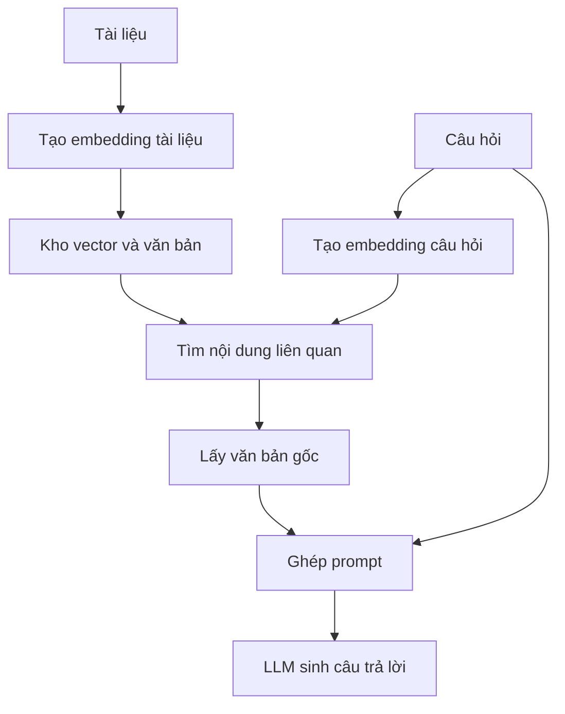

## Quá trình hiểu và xây dựng 1 LLM local từ đầu đến đuôi.
## Mục tiêu là xây dựng 1 AI local tự train để phục vụ cho việc viết code và phát triển sản phẩm với các ngôn ngữ như là reactjs, nodejs,nest, python.

1. LLM (Large Language Model — mô hình ngôn ngữ lớn) là gì?: 
- là công cụ hỗ trợ hành động và tương tác đa chức năng dùng để tra cứu và thực hiện hành động có tư duy đã được đào tạo để cho ra kết quả gần như là tốt nhất mà nó biết ngay tại thời điểm đó

2. Prompt, System prompt, User prompt là gì?: 
- system prompt là quy tắc, bối cảnh được đặt ra cho AI(LLM) để mọi lần tương tác, đối thoại đó đều phải thông qua các quy tắc đó để phản hồi cho user ví dụ: "bạn là kỹ sư AI chuyên nghiệp...", user prompt là câu sự tương tác trực tiếp từ người dùng ví dụ:"tôi muốn biết vòng đời trong lập trình reactjs".

3. Có những loại AI nào: 
- có nhiều hãng nhưng lại có 2 loại là mã nguồn đóng và mã nguồn mở.

4. ollama là loại công cụ chưa nhiều LLM mã nguồn mở, và ta có thể sử dụng để dùng dưới local miễn phí.

5. Parameters(tham số) trong LLM là gì:
- Là kiến thức mà LLM đã được học được hiểu là tham số, tham số càng cao thì chứng tỏ LLM đó được học càng nhiều, ví dụ: "JS=15, Reactjs=10, tiếng anh 20,và LLM đều được học cả 3 cái trên thì tham số của LLM đó sẽ là 45"

6. RLHF (Reinforcement Learning from Human Feedback) là gì:
- là bước huấn luyện bổ sung giúp model trả lời theo phong cách "trợ lý hữu ích" — đây vẫn thuộc giai đoạn training, xảy ra trước khi bạn gọi API, không phải mỗi lần bạn chat

7. trong 1 LLM hoàn chỉnh thì gồm có những thành phần gì:
- Có model, có Tool, có Agent

8. Model là gì:
- là tên cá nhân của 1 con AI cụ thể ví dụ "gpt-4.1-mini", "anthropic/claude-sonnet-4.5", "gpt-5-nano" là 3 con AI khác nhau nhưng trong đó 2 con AI là cùng 1 hãng, mỗi con này sẽ chuyên về 1 tính năng riêng biệt của nó, Model không tự thực thi hành động trên máy — nó chỉ sinh ra "yêu cầu gọi tool"; chương trình bên ngoài mới thực sự chạy tool đó

9. Tool là gì: là các chức năng phần mềm có thể thực hiện trên máy của mình ví dụ như: mở, đọc, thêm, xóa, sửa, chạy bất ứng dụng nào mà ta yêu cầu và cấp phép 

10. Agent là gì: Hệ thống để model tự quyết định bước tiếp theo trong một vòng lặp(tự quyết định, có vòng lặp) 

11. AI có biết mình là ai không: 
-Không, AI chỉ đọc lại được nội dung mà mình đã tổng kết của các lần trước để gửi lại cho lần này để nó hiểu tình hình cuộc trò truyện nên mới biết mình là ai ngay lúc đó và trong cuộc hội thoại đó.
12. Streaming là gì:
- Là cơ chế chỉ giúp thấy kết quả sớm hơn, không làm cả pipeline (bước chọn link + tải trang) nhanh hơn.

13. Inference(suy luận) là gì:
- đơn giản là hỏi từ bạn và AI đáp lại câu hỏi, đưa prompt vào model có sẵn, nhận văn bản trả về

14. Gradio là gì [Bổ sung]: thư viện Python dựng giao diện web nhanh từ 1 hàm Python — bạn viết hàm def f(input): return output, Gradio tự vẽ form nhập liệu + hiển thị kết quả, không cần viết HTML/CSS/JS. [Bổ sung — đối chiếu React] Khác biệt lớn nhất với React: bạn không tự dựng component/state — chỉ khai báo input/output, Gradio quán xuyến toàn bộ UI.

15. Hợp đồng callback của gr.ChatInterface là gì:
- Đây chính là cách áp dụng thực tế của khái niệm "hội thoại stateless
- mỗi lần gọi, code tự ghép lại system + toàn bộ history + message mới thành 1 messages list mới — bản thân API không nhớ gì giữa các lần gọi.

16. Hugging Face Hub [Qua ghi chú cũ]?: 
- một kho lưu trữ công khai chứa hàng trăm nghìn model, dataset đã huấn luyện sẵn (tương tự "npm/GitHub cho model AI"). Mỗi model có một model card — trang mô tả khả năng, cách dùng, giới hạn.

17. Vì sao cần Google Colab?:
- chạy model mã nguồn mở cần GPU (bộ xử lý đồ họa, tính toán ma trận nhanh) — hầu hết máy cá nhân không đủ mạnh hoặc không có GPU phù hợp. Colab cho mượn GPU miễn phí (có giới hạn) qua trình duyệt.

18. Training?:
Training là khi bạn cung cấp dữ liệu cho một mô hình để nó thích nghi và trở nên tốt hơn trong một tác vụ nào đó trong tương lai. Nó thực hiện điều này bằng cách cập nhật các cài đặt nội bộ của nó – các tham số hoặc trọng số của mô hình. Nếu bạn đang huấn luyện một mô hình đã được huấn luyện một phần, hoạt động này được gọi là "fine-tuning" (tinh chỉnh).

19. Inference?:
Inference là khi bạn làm việc với một mô hình đã được huấn luyện. Bạn đang sử dụng mô hình đó để tạo ra các đầu ra mới trên các đầu vào mới, tận dụng mọi thứ nó đã học được trong quá trình huấn luyện. Suy luận đôi khi còn được gọi là "Execution" (thực thi) hoặc "Running a model" (chạy một mô hình).

Tất cả việc chúng ta sử dụng API cho GPT, Claude và Gemini trong vài tuần qua đều là ví dụ về inference. Chữ "P" trong GPT là viết tắt của "Pre-trained", có nghĩa là nó đã được huấn luyện với dữ liệu (rất nhiều!) Trong tuần 6, chúng ta sẽ thử tinh chỉnh GPT của riêng mình.

API pipelines trong HuggingFace chỉ được sử dụng cho inference – chạy một mô hình đã được huấn luyện. Trong tuần 7, chúng ta sẽ huấn luyện mô hình của riêng mình và chúng ta sẽ cần sử dụng các API HuggingFace nâng cao hơn mà chúng ta sẽ tìm hiểu trong bài giảng sắp tới.

20. pipeline là gì?:
21. AutoModelForCausalLM là gì?:
22. AutoTokenizer  là gì?:
23. chat template dùng để làm gì và vì sao mỗi model có template riêng?:
24.  Giải thích được quantization đánh đổi điều gì lấy điều gì?:

25. Quy trình chọn model như thế nào [Qua ghi chú cũ]: yêu cầu ứng dụng → xác định tiêu chí (chất lượng, tốc độ, chi phí) → tra benchmark để lọc ứng viên → tự làm prototype → đo trên bài toán thật → chọn.

26. Benchmark là gì: bộ câu hỏi/bài kiểm tra chuẩn hóa để so sánh model, ví dụ (nêu trong ghi chú): GPQA (câu hỏi khoa học khó), MMLU-Pro (kiến thức đa lĩnh vực), AIME (toán), LiveCodeBench (lập trình), MuSR (suy luận đa bước), Humanity's Last Exam.

27. Chinchilla Scaling Law [Qua ghi chú cũ]: nhận định rằng chất lượng model phụ thuộc cân bằng giữa số tham số và lượng dữ liệu huấn luyện — tăng riêng một trong hai mà không tăng cái còn lại sẽ kém hiệu quả.
28. RAG (Retrieval-Augmented Generation — Sinh tăng cường truy xuất) [Bổ sung]?: 
- thay vì hy vọng model "biết sẵn" thông tin riêng của bạn (nó không thể biết — dữ liệu riêng không nằm trong dữ liệu huấn luyện), bạn tự tìm đoạn tài liệu liên quan rồi nhét vào prompt trước khi gọi model. Hai bước: Retrieval (truy xuất — tìm tài liệu liên quan) rồi Generation (sinh — model viết câu trả lời dựa trên tài liệu đó).
- truy xuất thông tin → bổ sung vào ngữ cảnh → sinh câu trả lời.
- Đây là xây ứng dụng sử dụng model có sẵn. Đưa tài liệu vào prompt không phải huấn luyện model mới hay làm model ghi nhớ vĩnh viễn.
- RAG tìm thông tin trước, cho model đọc rồi mới trả lời; vector giúp bước tìm kiếm linh hoạt hơn cách khớp chữ.
29. vậy RAG khác System prompt như thế nào?:
- 

30. Chunking (chia đoạn) [Từ nguồn]: tài liệu dài phải được cắt thành các đoạn nhỏ (chunk) trước khi xử lý — model/embedding có giới hạn độ dài đầu vào, và đoạn nhỏ giúp truy xuất chính xác hơn (chỉ lấy đúng phần liên quan, không kéo theo cả tài liệu dài):

31. Embedding (vector hóa văn bản) [Bổ sung, ví dụ đời thường]: 
- một model riêng biệt (không phải LLM sinh văn bản) chuyển đoạn text thành một vector số (ví dụ 384 chiều) sao cho các đoạn có ý nghĩa gần nhau thì vector của chúng cũng "gần nhau" trong không gian nhiều chiều (đo bằng cosine similarity). Ví dụ: "giá vé máy bay" và "chi phí chuyến bay" dù không chung từ nào vẫn có thể cho vector gần nhau.
- Danh sách số biểu diễn đầu vào trong một không gian học được

32. Vector store — Chroma [Từ nguồn]: 
- cơ sở dữ liệu chuyên lưu và tìm kiếm vector
- Embedding — biểu diễn nhúng là biểu diễn bằng số mà mô hình tạo ra cho đầu vào. Với tìm kiếm văn bản, mục tiêu là tạo ra các biểu diễn giúp so sánh mức liên quan về ngữ nghĩa.

- Các con số không được lập trình viên tự gán theo kiểu “nói về bảo hiểm thì cho số 10”. Mô hình embedding đã được huấn luyện để tạo biểu diễn có ích. Khi dùng nó trong bài này, bạn gọi mô hình có sẵn để biến văn bản thành vector.
33. Tại sao lại dùng python để viết code

34. Token ID là gì?: 
- Số nguyên định danh token trong bộ từ vựng
- là id của từng token trong dữ liệu

35. Token là gì: 
- Một đơn vị văn bản do tokenizer phân chia, có thể là từ, mảnh từ hoặc dấu câu

36. Embedding model — mô hình tạo biểu diễn nhúng là gì:
- nhận Văn bản câu hỏi hoặc tài liệu và trả vector, Giúp tìm kiếm theo ngữ nghĩa

37. autoregressive — tự hồi quy: mô hình sinh token tiếp theo dựa trên ngữ cảnh và các token đã sinh. Quá trình lặp lại tạo thành câu trả lời.

38. Ghép lại thành RAG dùng vector
Giai đoạn A — Chuẩn bị tài liệu
Thực hiện trước khi phục vụ câu hỏi, rồi cập nhật khi dữ liệu thay đổi:

Đọc văn bản trong kho kiến thức.
Tạo embedding cho các đơn vị văn bản cần tìm kiếm.
Lưu vector cùng văn bản tương ứng hoặc tham chiếu để lấy lại văn bản.
Bổ sung để hình dung bước triển khai tiếp theo: tài liệu dài thường được chia thành chunk — đoạn nhỏ trước khi tạo embedding. Chunking giúp lấy phần liên quan thay vì luôn gửi cả file. Đây chưa phải nội dung được triển khai đầy đủ trong 6 video ngày 1.

Giai đoạn B — Khi người dùng hỏi
Tạo embedding của câu hỏi.
So sánh với các vector đã lưu để tìm nội dung liên quan.
Lấy lại văn bản của các kết quả được chọn.
Ghép văn bản với câu hỏi và chỉ dẫn.
Gọi LLM để viết câu trả lời.

39. Nếu nguồn không chứa đáp án thì sao? Hệ thống cần thừa nhận thiếu thông tin thay vì suy đoán thành sự thật.

40. Giải thích được RAG khác fine-tuning ở điểm nào, và vì sao RAG thường triển khai nhanh hơn.
41. Giải thích được vì sao cần chunking trước khi embedding.
42. Giải thích được embedding khác với việc so khớp từ khóa như thế nào.
43. Phân biệt được đánh giá "retrieval" và đánh giá "generation" trong RAG.
44. Kể được ít nhất 1 kỹ thuật Advanced RAG và lý do nó cải thiện so với RAG cơ bản.
45. Training và Generalization là gì: AI cần học quy luật để làm tốt với dữ liệu mới, không chỉ nhớ ví dụ cũ

46. Fine-tuning và dự án?: Dùng mô hình có sẵn, đào tạo thêm cho nhiệm vụ đoán giá từ mô tả

47. Dữ liệu và đánh giá: Chọn nguồn dữ liệu, xác định sai số giá và tách train/validation/test
48. Làm sạch Amazon là gì: Bỏ dòng thiếu giá, giới hạn phạm vi giá và chuẩn hóa mô tả
49. Phân bố và loại trùng: Phát hiện quá nhiều món rẻ/phụ tùng ô tô; tránh trùng giữa bộ học và bộ kiểm tra
50. Lấy mẫu và lưu: Chọn 820.000 sản phẩm có ưu tiên, chia tập, lưu Full/Lite để dùng tiếp
51. phân biệt RAG, Fine-turing, upload datase?: Phân biệt: RAG tìm tài liệu đưa vào yêu cầu lúc trả lời. Fine-tuning cập nhật các tham số được huấn luyện. Upload dataset chỉ lưu dữ liệu. Đây là ba thao tác khác nhau.

52. Fine-tuning — Tinh chỉnh mô hình là gì?
Hãy hình dung bạn tuyển một người đã biết đọc và có kiến thức chung, rồi đào tạo thêm về định giá. Bạn không phải dạy họ lại từ đầu cách đọc từng chữ.

Tương tự, fine-tuning bắt đầu từ pre-trained model — mô hình đã được huấn luyện trước, sau đó huấn luyện thêm bằng dữ liệu phục vụ nhiệm vụ cụ thể. Cách tận dụng kiến thức đã học để làm nhiệm vụ mới liên quan đến transfer learning — học chuyển giao.

| Cách làm | Ví dụ với nhân viên định giá | Có cập nhật tham số qua bước huấn luyện này không? |
|---|---|---|
| Prompting — Hướng dẫn bằng lời | Dặn cách định giá hoặc cho vài ví dụ ngay trong yêu cầu | Không |
| RAG — Truy xuất tăng cường sinh | Tìm tài liệu liên quan và đưa cho nhân viên đọc trước khi trả lời | Không, trong quy trình RAG thông thường |
| Tool calling — Gọi công cụ | Cho phép tra cứu hoặc dùng máy tính thông qua hệ thống | Không, chỉ việc gọi công cụ không phải huấn luyện |
| Fine-tuning — Tinh chỉnh | Tổ chức đợt đào tạo thêm từ nhiều ví dụ | Có cập nhật tham số được huấn luyện, tùy phương pháp |
| Training from scratch — Huấn luyện từ đầu | Xây dựng năng lực mô hình từ điểm khởi tạo ban đầu | Có, với phạm vi và nguồn lực thường lớn hơn nhiều |

53. Dữ liệu có thể đến từ đâu?
Bài giảng nêu dữ liệu riêng của doanh nghiệp, các bộ dữ liệu trên Kaggle/Hugging Face, dữ liệu tổng hợp và đơn vị cung cấp dữ liệu.

Synthetic data — Dữ liệu tổng hợp là ví dụ được tạo ra thay vì thu thập trực tiếp từ quan sát thực tế. Ví dụ, AI tạo thêm mô tả sản phẩm. Bổ sung: dữ liệu được tạo không tự động có giá đúng; chất lượng nhãn vẫn phải được kiểm soát.

Trong dự án, nguồn được chọn là Amazon Reviews 2023 của McAuley Lab, được truy cập qua Hugging Face. Dù tên chứa “Reviews”, phần này dùng thông tin sản phẩm, mô tả và giá, không dùng đánh giá khách hàng làm đầu vào chính.

Hugging Face trong bài có hai vai trò: nơi lấy bộ dữ liệu và nơi lưu bộ dữ liệu đã xử lý để dùng lại.

54. 5 bước chiến lược áp dụng AI [Qua ghi chú cũ]: Understand (hiểu bài toán) → Prepare (chuẩn bị dữ liệu) → Select (chọn phương pháp: prompting/RAG/fine-tuning) → Customize (tùy chỉnh) → Productionize (đưa vào sản xuất).

55. Giải thích được vì sao cần baseline trước khi thử phương pháp phức tạp.
56.  Giải thích được sự khác nhau giữa loss và MAE, cho ví dụ của chính bạn.
57.  Giải thích được vì sao XGBoost lại tốt hơn Linear Regression trong bài toán này (gợi ý: dùng nhiều đặc trưng hơn/mô hình phi tuyến).
58.  Nêu được bằng chứng cụ thể rằng "fine-tuning không đảm bảo luôn tốt hơn".

59. LoRA (Low-Rank Adaptation) [Qua ghi chú cũ]: thay vì cập nhật toàn bộ hàng tỷ tham số của model khi fine-tune (rất tốn bộ nhớ + tính toán), LoRA đóng băng model gốc và chỉ thêm một cặp ma trận nhỏ ("adapter") có hạng thấp (low-rank) vào một số lớp — chỉ huấn luyện phần adapter nhỏ này.
60. Training loss vs Validation loss là gì:
61. Giải thích được LoRA tiết kiệm gì so với fine-tune toàn bộ tham số:

62. Giải thích được QLoRA = LoRA + kỹ thuật gì:
63. Phân biệt được training loss và validation loss, giải thích overfitting bằng ví dụ riêng:
64. Không khẳng định "fine-tuning luôn tốt hơn" hay "luôn tệ hơn" — nêu được nó phụ thuộc gì.
65. Modal.com: nền tảng "serverless" (không cần tự quản lý server) để triển khai hàm/model Python lên cloud, gọi được từ xa — model QLoRA đã fine-tune ở Tuần 7 được đóng gói thành 1 dịch vụ chạy trên GPU đám mây, gọi qua Python bình thường:
66. SpecialistAgent [Từ nguồn]: lớp bọc gọi lại chính model đã fine-tune QLoRA (Tuần 7) như một dịch vụ từ xa — đây là lúc bạn "thu hoạch" thành quả huấn luyện của Tuần 7 vào hệ thống thật.

=> Prompt vs Fine-tuning — cặp khái niệm dễ nhầm: viết prompt tốt hơn (Tuần 1) không thay đổi gì bên trong model; fine-tuning (QLoRA ở đây) thực sự cập nhật tham số (dù chỉ phần adapter nhỏ). Nhắc lại: RAG (Tuần 5) và prompting (Tuần 1) đều không đụng vào tham số; chỉ fine-tuning (Tuần 6-7) mới cập nhật tham số.

=> thứ hạng leaderboard chung không quyết định kết quả trên bài toán cụ thể của bạn.

