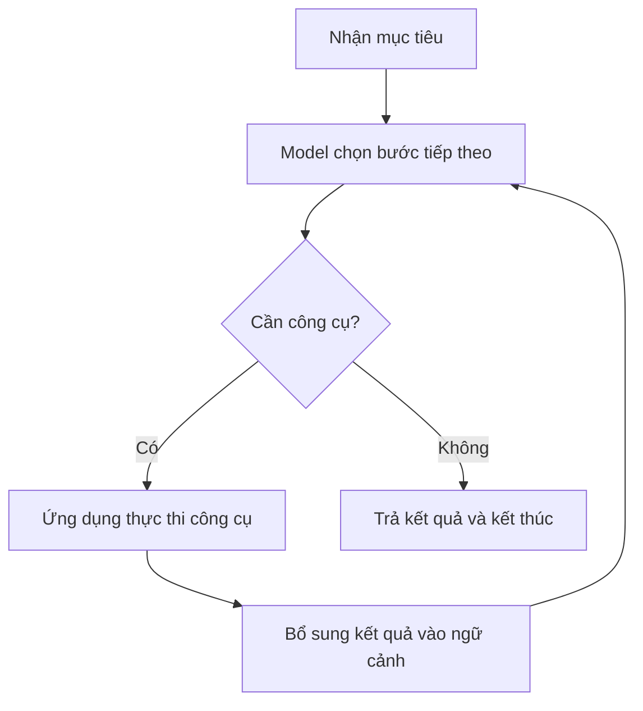

# Day 4 — Ngày 4: Hiểu cách LLM hoạt động để xây dựng ứng dụng AI

**Phạm vi:** Video 026–032, toàn bộ ngày 4.  
**Cách học:** Đi từ mục đích từng video đến giải thích, ví dụ và thực hành. Giữ thuật ngữ tiếng Anh kèm nghĩa tiếng Việt.  
**Đối tượng:** Người mới học AI, đã quen lập trình web nhưng chưa có nền tảng Machine Learning (học máy).

> **Thông điệp chính của ngày 4:** Để xây dựng ứng dụng AI, bạn cần hiểu mô hình nhận dữ liệu gì, xử lý và sinh câu trả lời ra sao, ứng dụng duy trì lịch sử thế nào, và những việc đó tiêu tốn giới hạn cùng chi phí gì.

Tài liệu được biên soạn lại từ toàn bộ bảy file phụ đề SRT, tổng thời lượng theo phụ đề khoảng **64 phút 18 giây**. Đã đối chiếu thêm một số khung hình quan trọng trong video 028, 030 và 031, gồm biểu đồ tham số, cách chia token và code hội thoại. Hai MP4 026 và 032 không truy cập được trong lần xử lý này; nội dung hai bài đó dựa trên phụ đề, chưa đối chiếu hình ảnh.

Đây là bài giảng viết lại, không phải bản dịch từng câu. Các ví dụ về React, backend và chatbot do mình bổ sung. Những phát biểu dễ gây hiểu nhầm trong bài gốc được giải thích lại tại chỗ. Thông số và giá trong video là dữ liệu tại thời điểm ghi hình, không được coi là bảng giá hiện hành.

## 1. Ngày 4 thực sự muốn bạn hiểu điều gì?

Ở những ngày trước, theo lời mở đầu video 026, người học đã thử gọi mô hình qua API và chạy mô hình cục bộ. Lúc này bạn có thể viết code nhận câu trả lời, nhưng chưa chắc hiểu điều gì xảy ra phía sau.

Ngày 4 nối khoảng trống đó bằng các câu hỏi:

| Video | Chủ đề | Câu hỏi thực sự cần trả lời | Sau bài này bạn cần làm được gì? |
| --- | --- | --- | --- |
| 026 | Transformers — Kiến trúc Transformer | GPT là loại hệ thống gì? Vì sao Transformer quan trọng? | Phân biệt kiến trúc, model và ứng dụng chat |
| 027 | Attention, Emergent Intelligence, Agentic AI — Chú ý, năng lực nổi lên và AI tác nhân | Vì sao kiến trúc này mở rộng tốt? Từ model đến trợ lý hành động khác nhau thế nào? | Phân biệt prompt, context, copilot và agent |
| 028 | Parameters — Tham số | Con số 3B, 8B, 70B thể hiện điều gì? Model tốt hơn bằng cách nào? | Phân biệt tham số, dữ liệu huấn luyện và tài nguyên lúc chạy |
| 029 | Tokens — Đơn vị mã hóa văn bản | Vì sao AI không đọc trực tiếp từng từ như con người? | Phân biệt ký tự, từ, token, token ID và vector |
| 030 | Tokenization — Quá trình chia token | Vì sao cùng độ dài văn bản nhưng số token khác nhau? | Hiểu ảnh hưởng của dấu cách, từ hiếm, số và ngôn ngữ |
| 031 | tiktoken và Illusion of Memory — Đếm token và cảm giác có trí nhớ | Đếm token thế nào? Vì sao API quên tên vừa nói? | Hiểu code tokenizer và cách truyền lịch sử hội thoại |
| 032 | Context Window và API Costs — Cửa sổ ngữ cảnh và chi phí API | Có thể gửi bao nhiêu nội dung? Mỗi cuộc trò chuyện tốn gì? | Lập ngân sách token, phân biệt giới hạn và ước tính chi phí |

**Ngày này chưa yêu cầu bạn tự huấn luyện một model như GPT.** Bạn đang học nền tảng để dùng model có sẵn một cách có chủ đích. Giảng viên cũng nói rõ chưa đi sâu vào toán và toàn bộ lớp bên trong Transformer.

Điều khiến bài gốc hơi khó theo dõi là nó chuyển liên tục giữa lịch sử AI, trải nghiệm cá nhân, tên model và chi tiết kỹ thuật. Khi học, hãy giữ một tình huống xuyên suốt: **mình muốn làm một chatbot hỗ trợ người dùng trên website**. Mỗi khái niệm dưới đây giải quyết một phần của chatbot đó.

## 2. Video 026 — Transformers: Hiểu nền tảng phía sau GPT

### 2.1. Mục đích của đoạn mở đầu và cuộc thi giữa các model

Giảng viên bắt đầu bằng kết quả trò chơi Outsmart giữa nhiều model. Đoạn này tiếp nối hoạt động trước đó: cho các model cùng tham gia một tình huống để quan sát cách chúng xử lý và so sánh kết quả.

Bạn không cần thuộc thứ hạng hay tên nhân vật. Bài học hữu ích là **đánh giá model bằng nhiệm vụ cụ thể và nhiều lần thử**. Một model thắng vài ván không chứng minh nó tốt nhất cho mọi công việc; chính giảng viên cũng nhắc đến số lượt chơi khác nhau giữa các model.

Sau phần mở đầu, video chuyển sang mục tiêu chính: giới thiệu trực giác về Transformer và vị trí của nó trong lịch sử LLM.

### 2.2. GPT là gì?

**GPT = Generative Pre-trained Transformer.**

| Thành phần | Nghĩa | Cách hiểu |
| --- | --- | --- |
| Generative | Có khả năng sinh nội dung | Mô hình tạo phần tiếp theo của một chuỗi đầu vào |
| Pre-trained | Đã được tiền huấn luyện | Trước khi bạn dùng, mô hình đã học từ lượng lớn dữ liệu |
| Transformer | Tên một kiến trúc mạng nơ-ron | Cách tổ chức các thành phần tính toán bên trong mô hình |

Ví dụ, khi bạn hỏi “Giải thích React props”, mô hình nhận đầu vào rồi sinh dần các token của câu trả lời. Kiến thức và cách diễn đạt của nó chịu ảnh hưởng từ quá trình huấn luyện, còn câu hỏi hiện tại định hướng nội dung cần trả lời.

“Pre-trained” không có nghĩa dữ liệu chỉ đến từ Internet, cũng không có nghĩa mọi thông tin nó sinh ra đều có một trang nguồn tương ứng để trích dẫn. Nguồn dữ liệu và quy trình huấn luyện phụ thuộc từng model.

### 2.3. Neural Network — Mạng nơ-ron là gì?

Hãy bắt đầu bằng một chương trình dự đoán đơn giản:

```text
điểm dự đoán = w1 × yếu tố A + w2 × yếu tố B + b
```

`w1`, `w2` và `b` là những con số điều chỉnh cách tính. Nếu dự đoán sai nhiều, quá trình học sẽ thay đổi các con số đó để giảm sai số.

Mạng nơ-ron sử dụng nhiều phép biến đổi số học kết nối với nhau, thường tổ chức thành nhiều lớp. Dữ liệu đi qua các lớp và được biến đổi dần thành kết quả. **Deep Learning — Học sâu** là học bằng những mạng có nhiều lớp biến đổi như vậy.

Từ “nơ-ron” lấy cảm hứng từ sinh học, nhưng đừng hình dung đây là một bộ não người thu nhỏ. Đối với lập trình viên, cách nhìn hữu ích hơn là: một hệ thống tính toán có rất nhiều giá trị được học từ dữ liệu.

### 2.4. Architecture — Kiến trúc khác model thế nào?

Bạn có thể phân biệt ba tầng:

| Tầng | Ý nghĩa | Ví dụ |
| --- | --- | --- |
| Kiến trúc | Cách thiết kế mạng tính toán | Transformer |
| Model đã huấn luyện | Mạng với bộ tham số đã được học | Một model GPT hoặc Llama cụ thể |
| Ứng dụng | Sản phẩm dùng model cùng giao diện, dữ liệu và công cụ | Chatbot trên website |

Hai model cùng dựa trên Transformer vẫn có thể khác dữ liệu, kích thước, phương pháp huấn luyện và chất lượng. Một ứng dụng chat cũng có thể thay model mà vẫn giữ nguyên giao diện.

Liên hệ với web: kiến trúc giống cách tổ chức hệ thống; model là thành phần xử lý đã được chuẩn bị; ứng dụng là toàn bộ sản phẩm người dùng tương tác. Đây là phép so sánh về vai trò, không phải sự tương đương kỹ thuật hoàn toàn.

### 2.5. Attention — Cơ chế chú ý giải quyết vấn đề gì?

Xem câu:

> “Cường đặt chiếc laptop lên bàn vì nó đang nóng.”

Để hiểu “nó” có khả năng chỉ laptop, hệ thống cần liên hệ các phần trong câu. Chỉ nhìn từ đứng ngay trước “nó” là chưa đủ.

**Self-attention — Tự chú ý** cho phép biểu diễn tại một vị trí kết hợp thông tin từ các vị trí liên quan trong cùng chuỗi. Bạn có thể hình dung hệ thống tính những mức liên hệ khác nhau rồi tổng hợp thông tin theo các mức đó.

Đây là một phép tính đã được học, không phải hành động có ý thức. Attention cũng không bảo đảm model luôn xác định đúng đại từ hay luôn giải thích đúng lý do mình trả lời.

Bài báo **Attention Is All You Need** năm 2017 trình bày Transformer, dùng attention để thay thế phần xử lý tuần tự dựa trên recurrence trong kiến trúc đề xuất. Khả năng song song hóa tốt khi huấn luyện là một đóng góp quan trọng. Transformer gốc có cả encoder và decoder; GPT dùng hướng decoder-only. [Nguồn: bài báo Transformer](https://arxiv.org/abs/1706.03762)

### 2.6. Từ “dự đoán tiếp theo” đến câu trả lời

Ở mức khái niệm, một mô hình sinh văn bản kiểu GPT làm việc như sau:

1. Nhận nội dung đầu vào đã được mã hóa.
2. Tính phân phối xác suất cho token tiếp theo.
3. Chọn token theo phương pháp sinh đang dùng.
4. Tiếp tục với chuỗi đã có thêm token vừa sinh.
5. Dừng khi gặp điều kiện kết thúc hoặc đạt giới hạn.

“Dự đoán token tiếp theo” mô tả cơ chế, nhưng không có nghĩa hệ thống chỉ nhìn một vài từ gần nhất. Nó có thể dùng thông tin từ phần ngữ cảnh được cung cấp. Nó cũng không nhất thiết luôn chọn token có xác suất cao nhất; cách lấy mẫu có thể làm kết quả thay đổi.

**Cần nhớ sau video 026:** Transformer là kiến trúc giúp xử lý quan hệ trong chuỗi và huấn luyện hiệu quả ở quy mô lớn. GPT là một dòng model dựa trên kiến trúc đó; chatbot hoàn chỉnh còn có nhiều thành phần bên ngoài model.

## 3. Video 027 — Từ LSTM đến trợ lý và Agentic AI

### 3.1. LSTM và Transformer khác nhau ở điểm nào đang được nhấn mạnh?

**LSTM — Long Short-Term Memory** là một dạng mạng nơ-ron hồi tiếp, thường được dùng cho dữ liệu chuỗi. Trạng thái ở bước trước ảnh hưởng bước sau, vì vậy có sự phụ thuộc tuần tự.

Ví dụ dễ hình dung: người đọc từng mẩu giấy, ghi lại phần cần nhớ rồi dùng ghi chú đó để xử lý mẩu tiếp theo. Cách phụ thuộc này khiến nhiều bước khó thực hiện cùng lúc.

Transformer cho phép xử lý nhiều vị trí trong chuỗi song song hơn khi huấn luyện, thay vì phải truyền trạng thái tuần tự theo cùng cách. Nó vẫn cần thông tin về thứ tự các vị trí; “song song” không có nghĩa có thể đảo từ tùy ý mà giữ nguyên nghĩa.

**Hai điều cần làm rõ so với cách nói trong video:**

- Không nên kết luận LSTM luôn mạnh hơn hoặc hiểu sâu hơn Transformer. Cần xác định nhiệm vụ, tài nguyên và cách đánh giá.
- Song song hóa khi huấn luyện không có nghĩa một chatbot GPT thông thường sinh tất cả token đầu ra cùng lúc. Quá trình sinh tự hồi quy vẫn phụ thuộc phần đã sinh.

### 3.2. Emergent Intelligence — Năng lực thông minh nổi lên

Giảng viên muốn giải thích điều gây ngạc nhiên: một hệ thống học dự đoán phần tiếp theo của văn bản lại có thể dịch, viết code, giải một số bài toán và làm theo hướng dẫn.

Trực giác là để dự đoán tốt trên nhiều loại dữ liệu, model phải học được rất nhiều quy luật: cấu trúc câu, quan hệ giữa khái niệm, mẫu lập luận và cấu trúc chương trình. Khi mở rộng dữ liệu, tài nguyên và cách huấn luyện, một số năng lực trở nên rõ hơn.

Tuy nhiên, **“năng lực nổi lên” không đồng nghĩa có ý thức, hiểu biết như con người hoặc luôn nói đúng**. Đó là cách mô tả những năng lực quan sát được; cách đo và cách giải thích vẫn cần thận trọng. Một câu trả lời rất trôi chảy có thể chứa thông tin sai, thường được gọi là **hallucination — nội dung bịa hoặc không có căn cứ**.

Trong video, nhận xét rằng bài phê bình “stochastic parrots” đã không còn phù hợp là quan điểm của giảng viên. Không nên lấy nó làm lý do bỏ qua việc kiểm chứng kết quả AI.

### 3.3. Prompt Engineering và Context Engineering

**Prompt Engineering — Thiết kế lời nhắc:** Viết yêu cầu rõ ràng để model biết phải làm gì.

Ví dụ lời nhắc còn thiếu thông tin:

> “Viết component giúp tôi.”

Ví dụ rõ hơn:

> “Viết component React hiển thị danh sách sản phẩm. Dùng TypeScript, nhận props products, có trạng thái loading và empty. Giải thích ngắn các props.”

**Context Engineering — Thiết kế ngữ cảnh:** Chuẩn bị toàn bộ thông tin hữu ích cho lượt xử lý, gồm yêu cầu, dữ liệu, ví dụ, lịch sử và công cụ có thể dùng.

Với cùng yêu cầu trên, ngữ cảnh có thể bổ sung:

- Kiểu `Product` thực tế của dự án.
- Component Button và quy ước giao diện đang dùng.
- Một component mẫu đúng phong cách của codebase.
- Ràng buộc về accessibility và thư viện được phép sử dụng.

Lời nhắc tốt xác định nhiệm vụ; ngữ cảnh tốt cung cấp những gì model cần để hoàn thành nhiệm vụ đúng với hệ thống của bạn. Hai việc này bổ trợ nhau. Phát biểu trong video rằng nghề prompt engineer “đã qua” là nhận xét về thị trường tại thời điểm nói, không phải kiến thức nền tảng cần học thuộc.

Ví dụ bán vé trong video cũng theo logic này: muốn chatbot trả lời đúng giá vé đang bán, phải cung cấp dữ liệu giá phù hợp. Viết “hãy trả lời chính xác” không tự tạo ra dữ liệu mà model chưa có.

### 3.4. Copilot, Tool và Agent là ba khái niệm gì?

| Khái niệm | Vai trò | Ví dụ trong lập trình web |
| --- | --- | --- |
| Copilot — Trợ lý cộng tác | Giúp người dùng làm việc, thường có người định hướng và đánh giá | Gợi ý code, giải thích lỗi |
| Tool — Công cụ | Chức năng do phần mềm thực thi để đọc dữ liệu hoặc hành động | Đọc file, chạy test, gọi API |
| Agent — Tác nhân | Hệ thống để model tham gia quyết định bước tiếp theo trong một vòng xử lý | Đọc lỗi, sửa code, chạy test, xem kết quả rồi sửa tiếp |

Một hệ thống có thể vừa đóng vai trò copilot cho người dùng, vừa sử dụng cơ chế agent phía sau.

**Agentic AI — AI có khả năng điều phối hành động** thường được hiểu là model kết hợp công cụ và vòng lặp. Ví dụ bạn giao nhiệm vụ “Tìm nguyên nhân test đăng nhập thất bại”:



**Phần bổ sung để tránh hiểu nhầm:** Model không tự biến một câu văn thành hành động trên máy. Nó có thể sinh yêu cầu gọi công cụ; chương trình bên ngoài kiểm tra và thực thi yêu cầu đó. Chương trình cũng quản lý vòng lặp, giới hạn lượt chạy và điều kiện dừng.

“Autonomy — Tính tự chủ” ở đây là mức độ hệ thống được giao quyền lựa chọn bước tiếp theo trong phạm vi được thiết kế, không phải có ý chí riêng. Các ứng dụng agent vẫn cần giới hạn chi phí, quyền truy cập và điều kiện hoàn thành.

**Cần nhớ sau video 027:** Bạn có thể tạo ứng dụng AI tốt hơn bằng cách cung cấp dữ liệu đúng và nối model với công cụ, chứ không chỉ bằng cách đổi sang model lớn hơn.

## 4. Video 028 — Parameters: Con số 3B, 8B, 70B nói lên điều gì?

### 4.1. Mục đích và phần nền tảng còn thiếu trong bài

Video chủ yếu cho thấy quy mô tham số của các model và hai hướng cải thiện chất lượng. Giảng viên dẫn người chưa hiểu parameters sang video tài nguyên khác; những tài nguyên đó không nằm trong các file đã gửi. Vì vậy, phần giải thích căn bản dưới đây được bổ sung để bạn không bị hẫng.

**Parameter — Tham số học được** là giá trị số bên trong model được điều chỉnh trong quá trình huấn luyện, chẳng hạn các trọng số trong phép tính.

Quay lại ví dụ:

```text
y = w1 × x1 + w2 × x2 + b
```

`x1`, `x2` là dữ liệu đầu vào; `w1`, `w2`, `b` là tham số. Trong một model lớn có thể có hàng tỷ giá trị được học như vậy, tổ chức trong nhiều ma trận và thành phần tính toán.

Đừng nhầm với **argument/parameter của hàm lập trình**. Trong lời gọi API, `temperature`, giới hạn output hay tên model là cấu hình bạn truyền vào. Chúng không phải hàng tỷ trọng số được nói đến ở đây.

### 4.2. Training và Inference khác nhau ra sao?

| Giai đoạn | Hoạt động chính | Tham số có thay đổi không? |
| --- | --- | --- |
| Training — Huấn luyện | Cho model học từ dữ liệu và điều chỉnh để giảm lỗi | Có |
| Fine-tuning — Tinh chỉnh | Huấn luyện bổ sung trên model đã có | Có thể cập nhật một phần hoặc toàn bộ tham số, tùy phương pháp |
| Inference — Suy luận/chạy model | Dùng model đã chuẩn bị để tạo kết quả | Trong cách dùng thông thường, trọng số giữ nguyên |

Bạn gửi “Tôi tên Cường” trong một cuộc chat thông thường không có nghĩa hàng tỷ tham số lập tức cập nhật để nhớ Cường. Thông tin đó trước hết nằm trong dữ liệu của cuộc trò chuyện. Bài 031 sẽ giải thích rõ hơn.

### 4.3. Đọc các con số cho đúng

| Ký hiệu | Nghĩa | Ví dụ |
| --- | --- | --- |
| M — Million | Triệu | 270M = 270 triệu tham số |
| B — Billion | Tỷ | 8B = 8 tỷ tham số |
| T — Trillion | Nghìn tỷ | 1T = 1.000 tỷ tham số |

**8B không phải 8 GB, 8 tỷ token hay 8 tỷ câu trả lời được lưu sẵn.** Một tham số cũng không tương ứng một kiến thức riêng lẻ trong cơ sở dữ liệu.

Biểu đồ trong video dùng **logarithmic scale — thang logarit**. Khoảng từ 1B đến 10B tương ứng tăng 10 lần; từ 10B đến 100B cũng tăng 10 lần. Khoảng cách đều trên biểu đồ không phải tăng thêm cùng một số tham số.

Số phiên bản và số tham số cũng khác nhau: `3.3` trong tên Llama 3.3 là phiên bản dòng model; `70B` mới nói về quy mô tham số của model đang được nhắc đến.

### 4.4. Có phải nhiều tham số hơn thì luôn thông minh hơn?

Không. Trong những điều kiện tương đương, tăng quy mô có thể tăng năng lực, nhưng chất lượng còn phụ thuộc dữ liệu, kiến trúc, cách huấn luyện, tài nguyên tính toán và nhiệm vụ đánh giá.

Một model nhỏ hơn nhưng được huấn luyện tốt có thể vượt model lớn cũ ở nhiều bài kiểm tra. Tên “mini”, “nano” hoặc các cấp sản phẩm cho biết cách nhà cung cấp phân nhóm; khi số tham số không được công bố, bạn không thể suy ra chính xác chỉ từ tên hay giá.

Giá API cũng là giá dịch vụ, không phải phép đo trực tiếp số tham số hoặc hóa đơn điện của từng câu trả lời.

### 4.5. Dense và Mixture of Experts — Hai cách dùng tham số

**Dense model — Mô hình dày đặc:** Phần lớn các khối tính toán chính được sử dụng cho mỗi token.

**Mixture of Experts (MoE) — Hỗn hợp chuyên gia:** Một số lớp có nhiều nhánh chuyên gia. Bộ định tuyến chọn một phần nhánh để xử lý từng token, cùng với các phần dùng chung của model.

“Chuyên gia” ở đây là thành phần tính toán được học. Không nên hiểu đơn giản rằng có một bác sĩ AI, một luật sư AI và một lập trình viên AI riêng biệt bên trong, mỗi người nhận cả câu hỏi.

Ví dụ công bố của **DeepSeek-V3**: tổng 671B tham số, khoảng 37B tham số được kích hoạt cho mỗi token. Điều đó giúp phân biệt **total parameters — tổng tham số** với **active parameters — tham số hoạt động**. Tổng trọng số vẫn có ý nghĩa đối với việc lưu trữ và triển khai. [Nguồn: model card DeepSeek-V3](https://huggingface.co/deepseek-ai/DeepSeek-V3)

### 4.6. Phần bổ sung: Tham số liên quan dung lượng model thế nào?

Ước tính thô cho riêng trọng số:

```text
Dung lượng trọng số ≈ số tham số × số byte cho mỗi tham số
```

Với model giả định 8B:

- Lưu 16 bit/tham số: khoảng 16 GB theo đơn vị thập phân.
- Lưu 4 bit/tham số: mức lý tưởng khoảng 4 GB.

Đó chưa phải tổng RAM/VRAM cần chạy. Còn dữ liệu phụ của định dạng lượng tử hóa, bộ nhớ tính toán và bộ nhớ cho ngữ cảnh, chẳng hạn KV cache. **Quantization — Lượng tử hóa** giảm độ chính xác biểu diễn số để tiết kiệm dung lượng, có thể ảnh hưởng chất lượng.

Vì vậy, không thể chỉ nhìn “8B” rồi kết luận chắc chắn một máy sẽ chạy vừa, nhanh hoặc giữ được ngữ cảnh dài đến mức nào.

### 4.7. Hai hướng cải thiện model mà giảng viên muốn phân biệt

| Hướng | Cách làm | Ví dụ dễ hiểu |
| --- | --- | --- |
| Training-time scaling — Mở rộng tài nguyên khi huấn luyện | Cân đối quy mô model, lượng dữ liệu và tính toán huấn luyện | Đầu tư cho quá trình học trước khi đưa model vào sử dụng |
| Inference-time scaling — Tăng tính toán lúc chạy | Cho hệ thống thêm bước xử lý, thử nhiều phương án hoặc kiểm tra kết quả | Một tác vụ được xử lý qua nhiều bước thay vì trả lời ngay |

Giảng viên còn xếp việc thêm dữ liệu ngữ cảnh và RAG vào nhóm cải thiện lúc chạy. Cách gọi chính xác hơn là: **RAG cải thiện thông tin đầu vào tại inference time; còn inference-time scaling thường nhấn mạnh việc tăng tính toán lúc suy luận.** Hai hướng có liên quan nhưng không hoàn toàn đồng nghĩa.

**RAG — Retrieval-Augmented Generation, sinh nội dung có bổ sung truy xuất:** Ứng dụng tìm đoạn dữ liệu liên quan rồi cung cấp cho model để tạo câu trả lời. Ví dụ tìm chính sách đổi trả trong tài liệu cửa hàng, sau đó đưa đoạn đó cho chatbot. Chưa cần học vector database để hiểu mục đích này.

Video nhắc **Chinchilla scaling laws**. Điều nên giữ lại là cần cân đối lượng dữ liệu với quy mô model trong ngân sách tính toán. Nghiên cứu này không nói mỗi tham số là một ô nhớ chứa một lượng kiến thức cố định. [Nguồn: Training Compute-Optimal Large Language Models](https://arxiv.org/abs/2203.15556)

### 4.8. Những số liệu trong video cần đọc thận trọng

| Nội dung | Cách xử lý trong tài liệu này |
| --- | --- |
| GPT-4 có 1,76T tham số | Video/slide nêu con số này, nhưng báo cáo GPT-4 không công bố kích thước. Không coi là thông số chính thức |
| Model hàng đầu có hàng chục nghìn tỷ tham số | Là suy đoán trong bài; không đủ căn cứ để ghi như sự thật |
| Phụ đề nói Llama 3.3 có 3,3B | Khung hình khoảng 07:30 hiển thị 70B, phù hợp model card Llama 3.3 70B |
| Một số câu đọc tên Llama/Gemma không nhất quán | Không dùng các câu đó làm bảng cấu hình triển khai; phải tra đúng model cụ thể |

Đối chiếu: [GPT-4 Technical Report](https://arxiv.org/html/2303.08774v6), [Llama 3.3 70B model card](https://huggingface.co/meta-llama/Llama-3.3-70B-Instruct).

**Cần nhớ sau video 028:** Tham số là những giá trị model học được. Số tham số giúp hiểu quy mô, nhưng không đủ để kết luận chất lượng, dung lượng chạy hay chi phí dịch vụ.

## 5. Video 029 — Tokens: Model nhận văn bản dưới dạng gì?

### 5.1. Mục đích của bài

Video muốn bạn hiểu tại sao “từ”, “ký tự” và “token” không phải cùng một đơn vị. Đây là nền tảng để hiểu code bài 031 và chi phí bài 032.

Văn bản cần được chuyển thành dạng số để mạng tính toán xử lý. **Tokenizer — Bộ mã hóa/chia token** thực hiện bước chuyển đổi đó theo một bộ quy tắc và bộ từ vựng đã xác định.

### 5.2. Vì sao dùng các mảnh văn bản?

| Cách biểu diễn | Ưu điểm trực giác | Khó khăn |
| --- | --- | --- |
| Từng ký tự | Có thể ghép thành nhiều từ khác nhau | Chuỗi dài; model phải học thêm quan hệ từ ký tự đến từ |
| Từng từ hoàn chỉnh | Gần cách người đọc chia văn bản | Từ vựng lớn; khó bao phủ tên riêng, từ mới và nhiều ngôn ngữ |
| Các mảnh dưới mức từ hoặc mảnh văn bản | Cân bằng giữa độ dài chuỗi và độ lớn từ vựng | Ranh giới token không luôn khớp với cách người hiểu từ |

Giảng viên kể ba cách này như một câu chuyện để tạo trực giác. Không cần hiểu rằng toàn bộ lịch sử xử lý ngôn ngữ chỉ đi qua đúng ba bước theo một thứ tự duy nhất.

Một **token văn bản** có thể tương ứng một từ, một phần từ, dấu câu, khoảng trắng hoặc một phần biểu diễn byte. Với một số tokenizer, token cũng có thể chứa chuỗi ký tự trải qua ranh giới mà con người coi là nhiều từ. Không nên đặt quy tắc “một token luôn bằng một từ”.

### 5.3. Token, token ID và vector khác nhau thế nào?

| Khái niệm | Là gì? | Ví dụ minh họa, không phải kết quả tokenizer thực |
| --- | --- | --- |
| Text — Văn bản | Nội dung con người nhập | `Xin chào` |
| Token | Đơn vị sau khi mã hóa/chia chuỗi | Có thể hình dung các mảnh `Xin`, ` chào` |
| Token ID — Mã token | Số nguyên định danh một token trong từ vựng cụ thể | Chẳng hạn `[123, 456]` |
| Embedding vector — Vector biểu diễn | Dãy số dùng để biểu diễn token cho mạng tính toán | Chẳng hạn `[0.12, -0.35, ...]` |

**Các ID và cách chia trong bảng chỉ để minh họa.** Muốn biết ID thật, phải chạy đúng tokenizer.

Phần bổ sung để nối ý: trong một text Transformer thông thường, token ID được chuyển thành vector qua lớp embedding; thông tin vị trí cũng tham gia vào quá trình xử lý. Các lớp tiếp theo biến đổi biểu diễn dựa trên ngữ cảnh. Do đó, token ID không phải vector và cũng không phải “ý nghĩa được mã hóa bằng một số nguyên”.

Hai ID gần nhau không cho phép suy ra hai token có nghĩa gần nhau. Cùng một số ID trong hai tokenizer khác nhau cũng có thể đại diện cho nội dung khác nhau.

### 5.4. Tokenizer có đang “hiểu nghĩa” không?

Không nên hiểu theo cách đó. Tokenizer thực hiện mã hóa theo những quy tắc đã có. Với cách như BPE, các mẫu byte thường gặp có thể được ghép thành đơn vị lớn hơn.

Một từ có thể tình cờ được chia đúng gốc từ và hậu tố, nhưng việc chia không bảo đảm theo ngữ pháp hay ý nghĩa. Khả năng dùng các mảnh đó trong ngữ cảnh đến từ model đã huấn luyện.

**Cần nhớ sau video 029:** Token là đơn vị đầu vào/đầu ra trong quá trình xử lý văn bản; token ID là mã định danh; vector là biểu diễn số để tính toán. Cả ba đều khác số tham số của model.

## 6. Video 030 — Tokenization: Vì sao số token thay đổi?

### 6.1. Giảng viên đang chứng minh điều gì bằng các ví dụ?

Video dùng giao diện tokenizer để quan sát các mảnh được tô màu. Màu phân biệt token, không phải đánh dấu độ quan trọng hoặc độ thông minh của từng từ.

| Ví dụ trong bài | Quan sát mà giảng viên muốn bạn thấy |
| --- | --- |
| Câu tiếng Anh với từ phổ biến | Nhiều từ có thể tương ứng một token trong ví dụ đó |
| Câu có từ hiếm, từ ghép hoặc từ tự tạo | Một từ có thể tách thành nhiều mảnh |
| Số thập phân dài | Chuỗi chữ số được chia thành nhiều token |
| Văn bản code | Tên biến, dấu và cấu trúc có cách mã hóa khác văn xuôi |

Slide từ hiếm có ví dụ “handcrafted” tách thành các phần tương ứng “hand” và “crafted”. Mục đích là cho thấy model vẫn có thể nhận một từ dù từ đó không có riêng một token hoàn chỉnh.

### 6.2. Khoảng trắng, chữ hoa và dấu câu đều có thể ảnh hưởng

Hãy thử so sánh:

```text
hello
 hello
Hello
hello!
```

Các chuỗi khác nhau có thể tạo ID hoặc số token khác nhau. Với nhiều tokenizer kiểu GPT, một token có thể bao gồm khoảng trắng đứng trước từ. Vì vậy, `hello` và ` hello` không nhất thiết là cùng một token.

Khoảng trắng trong trường hợp này là một phần nội dung được mã hóa. Không nên diễn giải rằng mọi tokenizer đều có cùng một loại cờ “bắt đầu từ”, hay mọi token có khoảng trắng luôn tương ứng chính xác một từ theo ngôn ngữ học.

### 6.3. Số, code và tiếng Việt cần đo thực tế

Trong ví dụ của video, các nhóm chữ số được chia theo nhóm tối đa ba chữ số. Đó là hành vi của tokenizer đang được minh họa, không phải quy luật của mọi model.

Tokenization có thể ảnh hưởng mức độ khó của tác vụ số học, nhưng không phải nguyên nhân duy nhất khiến model tính sai. Đối với phép tính cần chính xác, ứng dụng có thể dùng công cụ tính toán thay vì dựa hoàn toàn vào câu trả lời sinh ra.

Quy tắc trong video:

```text
1 token ≈ 4 ký tự
1.000 token ≈ 750 từ
```

**Đây chỉ là ước lượng thường dùng cho tiếng Anh phổ thông.** Không dùng nó như công thức cố định cho tiếng Việt, JSON, code, emoji hoặc văn bản có nhiều ký hiệu.

Ví dụ một chuỗi tên biến `getUserNotificationPreferences` có thể gồm nhiều token, dù người lập trình xem nó là một tên. Ngược lại, đoạn code có nhiều mẫu phổ biến có thể được mã hóa khá hiệu quả. Không thể kết luận mọi code đều gần một token trên một ký tự.

Hai tokenizer có thể cho số lượng khác nhau đáng kể trên một ngôn ngữ. Điều đó ảnh hưởng ngân sách context và giá tính theo token, nhưng số token ít hơn tự nó không chứng minh model trả lời tốt hơn.

### 6.4. Bạn nên thực hành theo cách nào?

Mở [giao diện tokenizer được dùng trong bài](https://platform.openai.com/tokenizer), chọn tokenizer/model phù hợp rồi nhập lần lượt:

1. Một câu tiếng Anh ngắn.
2. Câu tiếng Việt có cùng ý.
3. Một đoạn TypeScript bạn thường viết.
4. Một chuỗi gồm số, emoji và dấu câu.

Quan sát ranh giới các mảnh và tổng token. Không cần học thuộc ID.

Video dùng toàn tập Shakespeare để tạo cảm giác một triệu token là rất nhiều văn bản. Chỉ nên giữ trực giác về quy mô: số token thật phụ thuộc bản văn và tokenizer, không phải một hằng số của tác phẩm.

**Cần nhớ sau video 030:** Số token phải gắn với nội dung thực và tokenizer thực. “Nội dung trông ngắn” không đủ để biết chắc nó tốn ít token.

## 7. Video 031 — Đếm token và hiểu cơ chế “nhớ” hội thoại

Video có hai phần liên quan chặt chẽ: trước hết đo văn bản bằng token, sau đó cho thấy lịch sử chat cũng trở thành văn bản đầu vào cần đo.

### 7.1. tiktoken dùng để làm gì?

**tiktoken** là thư viện Python để mã hóa văn bản thành token và giải mã trở lại cho những encoding được hỗ trợ. Nó không phải LLM, không sinh câu trả lời và không tự đánh giá nội dung đúng hay sai.

Trong video, giảng viên mở notebook `day4.ipynb`, chọn Python kernel của môi trường dự án rồi chạy từng ô. **Kernel** là tiến trình thực thi code Python cho notebook. Với người quen JavaScript, bạn chỉ cần xem mỗi ô như một đoạn code được chạy và giữ lại biến trong phiên hiện tại.

Để thực hành độc lập, cài thư viện trong môi trường Python bạn đang dùng:

```bash
python -m pip install tiktoken
```

Ví dụ dưới đây giữ tên model `gpt-4.1-mini` như video để chọn tokenizer, không gọi model đó qua API:

```python
import tiktoken

encoding = tiktoken.encoding_for_model("gpt-4.1-mini")

text = "Xin chào, tôi là Cường. Tôi đang học về AI."
token_ids = encoding.encode(text)

print("Các token ID:", token_ids)
print("Số token:", len(token_ids))
print("Văn bản khôi phục:", encoding.decode(token_ids))

for token_id in token_ids:
    token_bytes = encoding.decode_single_token_bytes(token_id)
    print(token_id, repr(token_bytes))
```

Giải thích theo điều bạn cần biết để đọc code:

| Code | Ý nghĩa |
| --- | --- |
| `import tiktoken` | Nạp thư viện, tương tự ý tưởng import module trong JavaScript |
| `encoding_for_model(...)` | Tìm encoding tương ứng với tên model |
| `encode(text)` | Chuyển chuỗi thành danh sách ID |
| `len(token_ids)` | Đếm số phần tử, tương tự `.length` của mảng |
| `decode(token_ids)` | Khôi phục cả chuỗi từ danh sách token |
| `decode_single_token_bytes(id)` | Xem bytes của riêng một token |

Một token riêng có thể không kết thúc đúng ranh giới ký tự UTF-8; vì vậy ví dụ dùng bytes khi xem từng token, hữu ích với tiếng Việt. Việc đếm riêng chuỗi chưa bao gồm toàn bộ phần đóng gói messages, tools hoặc dữ liệu đa phương thức của một API request. [Đối chiếu cách dùng tiktoken](https://developers.openai.com/cookbook/examples/how_to_count_tokens_with_tiktoken)

Đoạn này không cần API key và không phát sinh phí gọi model. Cài thư viện hoặc tải dữ liệu encoding lần đầu có thể cần Internet; đừng hiểu “không gọi API model” thành “mọi bước đều chắc chắn không dùng mạng”. Nếu phiên bản thư viện chưa nhận ra tên model, cần cập nhật và kiểm tra mapping, không âm thầm chọn tokenizer bất kỳ để đếm.

### 7.2. Tại sao giảng viên hỏi lại tên mà model không biết?

Tình huống trong bài có thể viết lại như sau.

**Lần gọi thứ nhất:**

```json
[
  { "role": "system", "content": "Bạn là trợ lý hữu ích." },
  { "role": "user", "content": "Xin chào, tôi tên Cường." }
]
```

Model trả lời, chẳng hạn: “Chào Cường, mình có thể giúp gì cho bạn?”

**Lần gọi thứ hai, nếu chỉ gửi:**

```json
[
  { "role": "system", "content": "Bạn là trợ lý hữu ích." },
  { "role": "user", "content": "Tôi tên gì?" }
]
```

Đầu vào lần này không có thông tin tên. Với kiểu gọi độc lập trong video, model không có dữ liệu để biết đó là Cường. Gọi từ cùng chương trình, cùng API key hoặc dùng cùng object client không tự nối lịch sử hai lần gọi.

Muốn tiếp tục theo cách quản lý lịch sử thủ công, gửi:

```json
[
  { "role": "system", "content": "Bạn là trợ lý hữu ích." },
  { "role": "user", "content": "Xin chào, tôi tên Cường." },
  { "role": "assistant", "content": "Chào Cường, mình có thể giúp gì cho bạn?" },
  { "role": "user", "content": "Tôi tên gì?" }
]
```

Lúc này thông tin tên xuất hiện trong ngữ cảnh nên model có căn cứ để trả lời. Những câu trả lời trên chỉ minh họa hành vi mong đợi, không phải cam kết từng lần chạy sẽ có đúng câu chữ đó.

### 7.3. Role — Vai trò của message là gì?

| Role trong ví dụ | Nội dung nó đại diện |
| --- | --- |
| `system` | Chỉ dẫn chung cho trợ lý trong kiểu API được giảng |
| `user` | Lời người dùng |
| `assistant` | Lời model đã trả lời |

Ứng dụng cần giữ đúng thứ tự và vai trò để model phân biệt người dùng đang yêu cầu gì với trợ lý đã nói gì. Một số API còn có vai trò hoặc loại item khác cho developer và công cụ; bài này chỉ cần ba vai trò cơ bản trên.

Trong code Python của video:

- `load_dotenv()` đưa cấu hình từ `.env` vào biến môi trường.
- `OpenAI()` tạo đối tượng client hỗ trợ gửi HTTP request, không tải toàn bộ GPT xuống máy.
- `chat.completions.create(...)` là nơi gửi yêu cầu đến dịch vụ.
- `response.choices[0].message.content` đọc nội dung câu trả lời đầu tiên trong cấu trúc response của ví dụ.

Khác với `tiktoken.encode(...)`, bước gọi API thật cần tài khoản/cấu hình phù hợp và có thể phát sinh chi phí.

### 7.4. Liên hệ cách xây backend chatbot

Đây là **pseudocode TypeScript**, giải thích luồng xử lý; `callModel` là hàm giả định, chưa phải ứng dụng hoàn chỉnh:

```ts
type Message = {
  role: "system" | "user" | "assistant";
  content: string;
};

const history: Message[] = [
  { role: "system", content: "Giải thích bằng tiếng Việt dễ hiểu." },
];

async function chat(userText: string) {
  const requestMessages: Message[] = [
    ...history,
    { role: "user", content: userText },
  ];

  const answer = await callModel(requestMessages);

  history.push(
    { role: "user", content: userText },
    { role: "assistant", content: answer },
  );

  return answer;
}
```

Trong một ứng dụng web thực, lịch sử phải thuộc đúng người dùng và cuộc hội thoại. Không dùng chung mảng toàn cục như trên cho nhiều người; ví dụ chỉ mô tả một hội thoại. API key cần ở phía server. Backend còn phải xử lý lỗi, lưu dữ liệu và giới hạn độ dài.

### 7.5. “Illusion of Memory” nên hiểu chính xác thế nào?

Giảng viên gọi đây là **Illusion of Memory — Cảm giác model có trí nhớ**: người dùng thấy một cuộc hội thoại liên tục, còn thông tin trước đó được hệ thống cung cấp lại cho model.

Phân biệt ba nơi lưu thông tin:

| Nơi lưu | Nó chứa gì? | Có phải trọng số vừa học thêm không? |
| --- | --- | --- |
| Parameters — Tham số | Những gì được hình thành qua huấn luyện | Là trọng số của model |
| Context — Ngữ cảnh hiện tại | Lời nhắc, lịch sử và dữ liệu được cung cấp cho lượt xử lý | Không |
| Application memory — Bộ nhớ ứng dụng | Hội thoại, hồ sơ hoặc ghi chú được lưu ngoài model | Không; ứng dụng cần đưa thông tin liên quan vào quá trình xử lý |

**Điểm cần cập nhật so với câu nói tuyệt đối trong video:** Cách gọi Chat Completions độc lập trong bài yêu cầu bạn quản lý lịch sử. Một số API có cơ chế lưu trạng thái phía dịch vụ, chẳng hạn nối response qua `previous_response_id` hoặc dùng conversation. Khi đó client không nhất thiết gửi lại bằng tay toàn bộ messages; hệ thống vẫn phải cung cấp ngữ cảnh liên quan cho model. [Nguồn: Conversation state](https://developers.openai.com/api/docs/guides/conversation-state)

“Có trí nhớ” ở cấp sản phẩm là một tính năng phần mềm có thật. Điều cần tránh nhầm là cho rằng model tự cập nhật trọng số sau mỗi tin nhắn, hoặc cứ cùng API key là có chung một cuộc hội thoại.

**Cần nhớ sau video 031:** Bạn xây khả năng nhớ bằng cách quản lý trạng thái và ngữ cảnh. Lịch sử được dùng cho lượt tiếp theo trở thành một phần đầu vào của lượt đó.

## 8. Video 032 — Context Window, Token Limits và API Costs

### 8.1. Context Window — Cửa sổ ngữ cảnh là gì?

Đây là ngân sách token mà một model có thể xử lý trong phạm vi được quy định cho một request. Theo cách tính trong tài liệu OpenAI, nó bao gồm input, output và reasoning tokens. Cần đọc thông số của đúng model/API. [Nguồn: quản lý context window](https://developers.openai.com/api/docs/guides/conversation-state)

Hãy hình dung model đang làm việc trên một bàn có diện tích hữu hạn. Bạn đặt lên đó hướng dẫn, đoạn chat trước, tài liệu tham khảo, câu hỏi mới và cần chừa chỗ cho phần trả lời.

Trong một chatbot, input có thể chứa:

- Chỉ dẫn hệ thống/developer.
- Lịch sử hội thoại được giữ lại.
- Tài liệu truy xuất để trả lời.
- Mô tả công cụ và kết quả công cụ.
- Tin nhắn mới nhất cùng phần định dạng mà API sử dụng.

Do đó, **context window không chỉ dành cho câu hỏi bạn vừa gõ**.

### 8.2. Tính ngân sách bằng ví dụ cụ thể

Giả sử một model có context window **32.000 token**, dùng như một con số giả định để học:

| Thành phần | Số token giả định |
| --- | ---: |
| Chỉ dẫn | 1.000 |
| Lịch sử được gửi | 12.000 |
| Tài liệu tham khảo | 8.000 |
| Câu hỏi mới | 1.000 |
| Định dạng, công cụ và phần phụ trợ | 1.000 |
| **Tổng input** | **23.000** |
| Ngân sách output dự kiến | 4.000 |
| **Tổng dự trù** | **27.000** |
| **Khoảng còn lại** | **5.000** |

Trong giả định này, kế hoạch vừa ngân sách. Nhưng nếu model còn cần reasoning tokens không nằm trong 4.000 token đã dự trù, bạn phải tính thêm phần đó. Khi output budget đã bao gồm reasoning, không cộng trùng.

Công thức thực hành tổng quát:

```text
Input + ngân sách sinh đầu ra + khoảng dự phòng ≤ context window
```

Không nên thiết kế sát mép giới hạn vì lượng dữ liệu công cụ và đầu ra có thể thay đổi.

### 8.3. Ba loại giới hạn khác nhau

| Giới hạn | Nó giới hạn gì? | Ví dụ giả định |
| --- | --- | --- |
| Context window | Tổng ngữ cảnh theo quy định model | 128.000 token |
| Maximum output tokens | Độ dài đầu ra tối đa riêng của model/API | 8.000 token |
| Rate limit | Lượng request/token trong một khoảng thời gian | Một hạn mức token mỗi phút |

Có context window 128.000 không có nghĩa model được phép viết ra 128.000 token trong một lần trả lời. Có thể bạn vẫn còn context nhưng đã chạm giới hạn output, hoặc request hợp lệ về độ dài nhưng vượt hạn mức tốc độ.

Khi input quá dài, API có thể báo lỗi hoặc hệ thống có cơ chế cắt/tóm tắt tùy cấu hình. Nếu nội dung đầu cuộc chat bị loại khỏi ngữ cảnh, model có thể không còn dữ kiện cần thiết để trả lời về nó.

**Context dài cũng không bảo đảm tìm và sử dụng hoàn hảo mọi chi tiết.** Gửi vừa một tài liệu rất dài và trả lời chính xác về mọi phần của tài liệu là hai yêu cầu khác nhau.

### 8.4. Vì sao các kỹ thuật khác cũng chiếm context?

Video nhắc **multi-shot prompting — đưa nhiều ví dụ trong lời nhắc**. Ví dụ muốn model phân loại yêu cầu, bạn gửi các cặp mẫu:

```text
Ví dụ: “Không đăng nhập được” → nhóm tài khoản
Ví dụ: “Tôi muốn đổi địa chỉ nhận hàng” → nhóm đơn hàng
Yêu cầu mới: “Tôi quên mật khẩu” → ?
```

Những ví dụ đó cũng là input tokens. Zero-shot là không có ví dụ mẫu; one-shot có một ví dụ; few-shot/multi-shot có vài hoặc nhiều ví dụ. Chúng hướng dẫn qua ngữ cảnh, không tự cập nhật trọng số.

Tương tự, RAG thêm các đoạn tìm được vào ngữ cảnh; agent loop liên tục thêm kết quả công cụ. Chất lượng có thể tốt hơn nhưng cần ngân sách token phù hợp.

Để quản lý hội thoại dài, ứng dụng có thể giữ phần gần nhất, tóm tắt phần cũ và truy xuất lại chi tiết cần thiết. Tóm tắt làm mất một số chi tiết; truy xuất cũng có thể bỏ sót. Đây là lựa chọn kỹ thuật cần cân đối, không phải cách có trí nhớ vô hạn miễn phí.

### 8.5. Sinh từng token không có nghĩa frontend gọi API từng token

Video mô tả chuỗi được đưa lại vào model sau mỗi token để giải thích sự phụ thuộc vào phần đã sinh. Đây là mô tả khái niệm.

Trong triển khai thông thường, dịch vụ thực hiện vòng sinh phía server và có thể dùng **KV cache — bộ nhớ đệm Key/Value** để tái sử dụng kết quả tính toán. Frontend không cần gửi một HTTP request mới cho mỗi token. Streaming là nhận dần dữ liệu của câu trả lời, không phải tự tạo hàng trăm cuộc hội thoại mới.

Khi tính phí một lần gọi, cũng không tự cộng lại toàn bộ prompt cho mỗi token đầu ra theo mô hình kể chuyện này. Hãy dựa trên số liệu usage và quy tắc tính phí của nhà cung cấp.

### 8.6. Subscription và API là hai cách sử dụng khác nhau

**Subscription — Gói thuê bao ứng dụng chat:** Bạn dùng sản phẩm có giao diện và các giới hạn gói tương ứng.

**API usage — Sử dụng qua API:** Chương trình của bạn gọi dịch vụ để tích hợp AI vào sản phẩm. Chi phí API được quản lý theo cơ chế của dịch vụ; không nên giả định có gói chat trả phí thì API được miễn phí.

Video muốn bạn hiểu sự khác nhau này, không yêu cầu học thuộc các mức giá gói chat. Phần dưới dùng đơn giá giả định để bạn nắm được phép tính mà không phụ thuộc bảng giá tại lúc quay.

### 8.7. Input và output được tính thế nào?

**Input tokens** là token của dữ liệu đưa vào lượt xử lý. **Output tokens** là token được sinh ra theo cách hạch toán của model, có thể gồm reasoning.

Điểm dễ nhầm: câu trả lời ở lượt trước từng là output; khi đưa nó vào lịch sử của lượt sau, nó trở thành input của lượt sau.

Ví dụ đơn giản, bỏ qua chỉ dẫn và overhead:

| Lượt | Câu hỏi mới | Lịch sử mang theo | Tổng input |
| --- | ---: | ---: | ---: |
| 1 | 100 | 0 | 100 |
| 2 | 100 | 100 câu hỏi trước + 200 trả lời trước | 400 |
| 3 | 100 | 2 × 100 câu hỏi trước + 2 × 200 trả lời trước | 700 |

Mỗi tin nhắn mới vẫn chỉ có 100 token, nhưng input tăng do lịch sử tích lũy. Nếu tiếp tục gửi toàn bộ lịch sử, tổng input qua nhiều lượt tăng nhanh. Việc chuyển quản lý trạng thái sang phía dịch vụ cũng không tự làm ngữ cảnh cũ hết bị tính phí. [Nguồn: billing khi nối response](https://developers.openai.com/api/docs/guides/conversation-state)

### 8.8. Tính chi phí bằng một ví dụ

Giả sử đơn giá:

- Input: **1 USD / 1.000.000 token**.
- Output: **4 USD / 1.000.000 token**.

Một request có 2.000 input tokens và 500 output tokens:

```text
Phí input  = 2.000 / 1.000.000 × 1 USD = 0,002 USD
Phí output =   500 / 1.000.000 × 4 USD = 0,002 USD
Tổng                                     0,004 USD
```

Nếu có 10.000 request đúng cấu hình token như vậy, tổng là **40 USD**. Đây là phép tính minh họa, chưa tính công cụ, các loại token có giá riêng, cache, thuế hoặc thay đổi độ dài giữa các lượt.

**1 USD trên một triệu token không phải 1 USD mỗi lần hỏi.** Nhưng một thao tác người dùng cũng không nhất thiết chỉ tạo một request: agent có thể gọi model nhiều lần.

Ví dụ một nhiệm vụ cần 8 lần gọi, mỗi lần giả định 0,004 USD, thì phần model là 0,032 USD cho nhiệm vụ đó. Trong thực tế, số token của các bước thường khác nhau và có thể tăng khi tích lũy kết quả công cụ.

### 8.9. Reasoning tokens và caching

**Reasoning tokens — Token phục vụ suy luận nội bộ:** Một số model sinh các token nội bộ trước hoặc trong khi tạo kết quả. Theo tài liệu OpenAI, chúng có thể không hiện trực tiếp cho người dùng nhưng vẫn chiếm context và được tính vào output billing. Vì vậy, câu trả lời nhìn thấy ngắn không bảo đảm tổng token sinh ra cũng ngắn. [Nguồn: Reasoning models](https://developers.openai.com/api/docs/guides/reasoning)

Không cần và cũng không nên giả định có thể xem đầy đủ suy luận nội bộ để đo chi phí. Phần usage do API trả về mới là cơ sở theo dõi.

**Prompt caching — Bộ nhớ đệm lời nhắc:** Dịch vụ có thể tái sử dụng một phần xử lý của tiền tố ngữ cảnh trùng khớp khi đủ điều kiện. Điều này có thể giảm chi phí hoặc thời gian xử lý. Nó không đồng nghĩa trả lại nguyên câu trả lời cũ, không xóa phần context đó khỏi giới hạn và không phải bộ nhớ người dùng lâu dài.

Điều kiện, ngưỡng tối thiểu, thời gian giữ và giá đọc/ghi cache phụ thuộc model, API và nhà cung cấp. Không nên hiểu câu trong video thành “cứ gửi hai câu giống nhau là chắc chắn được giảm giá”. [Nguồn: Prompt caching](https://developers.openai.com/api/docs/guides/prompt-caching)

### 8.10. Đo trước và kiểm tra sau khi gọi

| Thời điểm | Việc cần làm |
| --- | --- |
| Trước request | Ước lượng input bằng tokenizer phù hợp; dành ngân sách output và phần phụ trợ |
| Sau response | Đọc usage thực tế: input, output và các chi tiết reasoning/cache nếu API cung cấp |
| Theo toàn nhiệm vụ | Cộng các lần gọi model, công cụ và retry liên quan |
| Theo người dùng/tháng | Theo dõi tần suất, lịch sử dài và các loại tác vụ để dự báo chi phí |

Không suy ra hóa đơn chính xác chỉ từ số từ trong câu hỏi. Cũng không dùng bảng Vellum hoặc thông số chụp trong video như nguồn giá cố định: khi triển khai, đối chiếu trang của đúng model và nhà cung cấp.

Phần cuối bài 032 giới thiệu những gì sẽ học tiếp như streaming, JSON và giải pháp kinh doanh. Đó là lời dẫn sang ngày sau, không phải những nội dung đã được dạy đầy đủ trong ngày 4.

**Cần nhớ sau video 032:** Ngữ cảnh và chi phí bao gồm nhiều phần ngoài câu hỏi mới. Khi làm ứng dụng, phải quản lý cả độ dài hội thoại, đầu ra, reasoning, công cụ và số lần gọi.

## 9. Ghép cả ngày 4 vào một chatbot hỗ trợ khách hàng

Đây là ví dụ tổng hợp do mình bổ sung để bạn thấy các bài không rời rạc.

Người dùng hỏi trên website:

> “Đơn hàng A123 của tôi đang ở đâu?”

**Bước 1 — Backend nhận câu hỏi và xác định người dùng.** Backend kiểm tra quyền xem đơn hàng. Model không thay thế bước xác thực này.

**Bước 2 — Chuẩn bị dữ liệu.** Ứng dụng đọc trạng thái A123 từ hệ thống đơn hàng. Model không tự có dữ liệu mới nhất chỉ vì đã được pre-trained.

**Bước 3 — Chuẩn bị context.** Backend kết hợp câu hỏi, trạng thái đơn hàng, chỉ dẫn trả lời và lịch sử cần thiết. Đây là context engineering.

**Bước 4 — Kiểm tra token.** Các phần văn bản được mã hóa bằng tokenizer tương ứng. Tổng input và ngân sách sinh phải phù hợp giới hạn model.

**Bước 5 — Model xử lý.** Model dùng các tham số đã học và ngữ cảnh vừa nhận để tạo câu trả lời, chẳng hạn “Đơn hàng đang được giao, dự kiến ngày mai đến nơi” nếu dữ liệu thật có thông tin đó.

**Bước 6 — Lưu kết quả và usage.** Ứng dụng lưu lịch sử cùng số liệu sử dụng để phục vụ câu hỏi tiếp theo và kiểm soát chi phí.

Nếu khách hỏi “Vậy tôi đổi địa chỉ nhận được không?”, lịch sử hoặc dữ liệu đã lưu giúp hệ thống hiểu “tôi” và đơn hàng đang nói tới. Nếu model được phép quyết định gọi công cụ kiểm tra điều kiện đổi địa chỉ, nhận kết quả rồi quyết định bước tiếp theo, đó có thể là một agent loop.

| Kiến thức ngày 4 | Nó nằm ở đâu trong ví dụ? |
| --- | --- |
| Transformer | Kiến trúc bên trong model xử lý yêu cầu |
| Parameters | Các giá trị model đã học để hiểu và sinh nội dung |
| Context engineering | Chuẩn bị dữ liệu đơn hàng cùng lịch sử |
| Tokens | Đơn vị mã hóa/đo lượng văn bản cần xử lý |
| Memory | Trạng thái hội thoại do hệ thống duy trì |
| Context window | Ngân sách cho dữ liệu và quá trình sinh |
| API costs | Chi phí các lần gọi và lượng token sử dụng |
| Tools / Agent | Chức năng bên ngoài và cơ chế điều phối nhiều bước |

Bạn có thể làm backend bằng ngôn ngữ phù hợp với hệ thống web của mình. Việc video dùng Python chủ yếu phục vụ thực hành; không có nghĩa muốn tích hợp LLM vào website thì mọi phần phải viết bằng Python.

## 10. Bài tập để tự kiểm tra mình đã hiểu

### Bài 1 — Thử tokenizer, không gọi API model

Chạy biến thể dưới đây sau khi đã cài `tiktoken`:

```python
import tiktoken

encoding = tiktoken.encoding_for_model("gpt-4.1-mini")

samples = [
    "Hello, I am learning AI.",
    "Xin chào, tôi đang học AI.",
    "const isLoading = false;",
    "1234567890",
    " hello",
    "hello",
    "Hello 👋",
]

for text in samples:
    ids = encoding.encode(text)
    print(repr(text), "=>", len(ids), "tokens", ids)
    assert encoding.decode(ids) == text
```

**Tự trả lời:** Số ký tự có tỷ lệ cố định với số token không? Thêm dấu cách có thể đổi ID không? Giải mã toàn chuỗi có trở về văn bản gốc không?

**Điều cần quan sát:** Tỷ lệ không cố định; khoảng trắng có thể ảnh hưởng mã hóa; kiểm tra round-trip phải khôi phục đúng chuỗi. Không cần có một bảng ID cố định trong tài liệu vì bài tập nhằm để bạn quan sát encoding thực sự đang sử dụng.

### Bài 2 — Chẩn đoán “AI quên”

Bạn gửi “Tôi đang dùng React” ở lần gọi đầu. Lần gọi sau chỉ gửi “Cho ví dụ bằng framework tôi vừa nói”, không có lịch sử hay tham chiếu conversation.

**Câu hỏi:** Có nên lập tức đổi sang model nhiều tham số hơn không?

**Giải đáp:** Trước hết kiểm tra ngữ cảnh. Nếu request không chứa dữ liệu về React và không có cơ chế khôi phục thông tin trước đó, model thiếu đầu vào cần thiết. Model lớn hơn không sửa được việc ứng dụng bỏ mất dữ kiện riêng của cuộc trò chuyện.

### Bài 3 — Tính context còn lại

Model giả định có context 16.000 token. Input đầy đủ là 13.500 token; bạn dự trù 3.000 token cho toàn bộ phần sinh và 500 token dự phòng.

**Giải đáp:** Tổng 17.000, vượt 1.000 token. Phải giảm input/ngân sách sinh hoặc chọn cấu hình có giới hạn phù hợp. Không chỉ nhìn 13.500 nhỏ hơn 16.000 rồi kết luận request chắc chắn hợp lệ.

### Bài 4 — Tính chi phí

Giá giả định: input 2 USD/triệu token, output 8 USD/triệu token. Một request sử dụng 5.000 input tokens và 1.000 output tokens, không có khoản khác.

```text
5.000 / 1.000.000 × 2 = 0,010 USD
1.000 / 1.000.000 × 8 = 0,008 USD
Tổng                  = 0,018 USD
```

Nếu mọi request đều như vậy, 1.000 request là 18 USD. Nếu lịch sử dài dần, giả định “mọi request đều như vậy” không còn đúng.

### Bài 5 — Phân biệt context với training

Bạn thêm nội dung chính sách hoàn tiền vào prompt, chatbot trả lời đúng theo chính sách.

**Câu hỏi:** Bạn đã fine-tune model chưa?

**Giải đáp:** Chưa. Bạn cung cấp dữ liệu trong context khi inference. Fine-tuning là một quá trình huấn luyện bổ sung làm thay đổi các tham số được học theo phương pháp cụ thể.

### Bài 6 — Nhận diện agent

Trường hợp A: Người dùng bấm nút, backend luôn gọi một API cố định, rồi nhờ model viết lại kết quả.

Trường hợp B: Model xem yêu cầu, lựa chọn công cụ, nhận kết quả và quyết định có cần gọi công cụ khác trước khi trả lời.

**Giải đáp:** B thể hiện rõ cơ chế agent được giới thiệu trong bài. A có dùng LLM và công cụ trong một workflow cố định, nhưng việc có LLM không tự khiến toàn bộ quy trình trở thành agent theo định nghĩa model điều phối.

## 11. Bản ôn tập cuối ngày

| Nếu bạn đang nghĩ… | Hãy sửa thành… |
| --- | --- |
| Transformer chính là ChatGPT | Transformer là kiến trúc; sản phẩm chat còn có model, giao diện, dữ liệu và công cụ |
| Model dự đoán token nên mọi câu trả lời đều chỉ là ngẫu nhiên | Kết quả có điều kiện theo dữ liệu học được và ngữ cảnh; vẫn có thể sai |
| 8B nghĩa là file 8 GB | 8B là 8 tỷ tham số; dung lượng còn phụ thuộc cách biểu diễn và triển khai |
| Nhiều tham số luôn tốt hơn | Cần đánh giá theo nhiệm vụ, dữ liệu, huấn luyện và tài nguyên |
| Một token là một từ | Token có thể là từ, mảnh từ, dấu hoặc bytes |
| Token ID lớn hơn nghĩa là token thông minh hơn | ID chỉ định danh trong một tokenizer cụ thể |
| Gọi cùng client thì AI tự nhớ | Cần lịch sử hoặc cơ chế quản lý trạng thái |
| Có dữ liệu trong database là model tự biết | Hệ thống phải truy xuất và đưa dữ liệu liên quan vào luồng xử lý |
| Context chỉ chứa câu hỏi mới | Còn có hướng dẫn, lịch sử, tài liệu, công cụ và phần sinh theo quy định |
| Context dài nghĩa là output cũng dài bằng đó | Giới hạn output cần kiểm tra riêng |
| Agent tự thực thi mọi thứ bằng lời nói | Phần mềm thực thi công cụ và quản lý vòng lặp |
| Chat càng lâu chỉ trả tiền cho câu mới | Lịch sử được dùng lại có thể tiếp tục tính vào input |

**Bạn đã đạt mục tiêu ngày 4 nếu có thể tự giải thích tình huống này:** “Tôi xây chatbot bằng model có sẵn. Backend chuẩn bị dữ liệu và lịch sử, kiểm tra ngân sách token, gọi model, rồi lưu kết quả cùng usage. Model dùng trọng số đã học để xử lý ngữ cảnh. Khi cần nhiều bước, ứng dụng có thể cho model chọn công cụ trong một vòng lặp có giới hạn.”

Chưa cần thuộc công thức attention, tự viết Transformer hay nhớ kích thước mọi model để đạt mục tiêu này.

## 12. Nguồn và cách đối chiếu

### Nguồn bài giảng do bạn cung cấp

| Video | Tên bài | Thời lượng theo SRT |
| --- | --- | --- |
| 026 | Understanding Transformers: The Architecture Behind GPT and LLMs — Hiểu kiến trúc Transformer | 12:46 |
| 027 | From LSTMs to Transformers: Attention, Emergent Intelligence & Agentic AI — Từ LSTM đến AI tác nhân | 09:08 |
| 028 | Parameters: From Millions to Trillions in GPT, LLaMA & DeepSeek — Quy mô tham số | 08:26 |
| 029 | What Are Tokens? From Characters to GPT's Tokenizer — Token là gì? | 04:01 |
| 030 | Understanding Tokenization: How GPT Breaks Down Text into Tokens — Cách chia văn bản thành token | 08:13 |
| 031 | Tokenizing with tiktoken and Understanding the Illusion of Memory — Đếm token và cơ chế nhớ | 10:56 |
| 032 | Context Windows, API Costs, and Token Limits in LLMs — Ngữ cảnh, chi phí và giới hạn | 10:48 |

Tên tiếng Anh trong bảng được chuẩn hóa nhẹ từ tên file/phụ đề để dễ đọc. Những lỗi nhận dạng rõ như “tick token”, “a genetic AI” được hiểu theo ngữ cảnh là `tiktoken` và `agentic AI`.

### Nguồn kỹ thuật bổ sung

Các liên kết đối chiếu được đặt ngay cạnh nội dung liên quan. Chúng dùng để làm rõ kiến thức, sửa sai số liệu hoặc cập nhật cách hiểu API, không thay thế các phụ đề làm nguồn chính của bài học. Đã đối chiếu ngày 07/09/2026.

**Phạm vi thực hành:** Các đoạn Python là ví dụ tự thực hành; tài liệu không tuyên bố đã gọi API trả phí hoặc đã thu được câu trả lời thực tế từ model. Pseudocode TypeScript minh họa kiến trúc, cần triển khai các hàm dịch vụ và quản lý hội thoại trước khi dùng trong ứng dụng thật.
