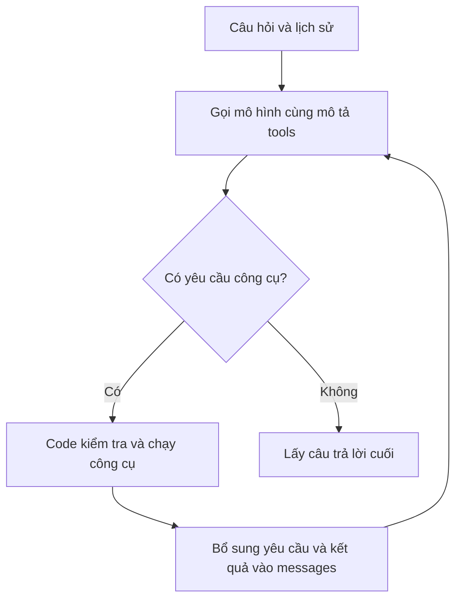

# Day 5 — Giảng lại bài 020–024: Xây dựng trợ lý AI có công cụ, hình ảnh và giọng nói

> **Mục tiêu của cả phần:** hiểu cách biến một chatbot trả lời bằng chữ thành ứng dụng có thể tra dữ liệu, trả lời dựa trên kết quả tra cứu, tạo ảnh minh họa và đọc câu trả lời. Bài 024 là phần mở rộng: dùng cùng một bài toán SVG để thử nhiều mô hình.
>
> Tài liệu được viết lại từ toàn bộ phụ đề tiếng Anh của 5 bài, có kiểm tra một số khung hình code ở bài 020 và 022. Đây là bài giảng diễn giải, không phải bản dịch từng câu hay bản chép đầy đủ notebook. Các mục “Giải thích bổ sung” và mã giả do tôi biên soạn để làm rõ kiến thức.
>
> Tên mô hình, giá API và kết quả thử nghiệm được nhắc đến trong video thuộc thời điểm ghi hình; tài liệu này không xác nhận chúng còn áp dụng hiện nay.

## 1. Trước hết: giảng viên đang muốn bạn làm được điều gì?

Hãy tưởng tượng bạn xây một website tư vấn chuyến bay. Người dùng hỏi:

> “Đi Paris hay Tokyo rẻ hơn?”

Một chatbot chỉ có khả năng sinh văn bản có thể viết câu trả lời rất trôi chảy, nhưng chưa có dữ liệu giá vé của hệ thống bạn. Ứng dụng trong phần này bổ sung các khả năng sau:

1. **Nhận biết cần tra cứu:** mô hình yêu cầu gọi công cụ lấy giá cho Paris và Tokyo.
2. **Lấy dữ liệu:** code Python thực thi công cụ, truy vấn SQLite và gửi kết quả cho mô hình.
3. **Diễn đạt:** mô hình dùng kết quả để so sánh hai giá vé.
4. **Đọc thành tiếng:** một API Text-to-Speech chuyển câu trả lời thành âm thanh.
5. **Minh họa:** một API tạo ảnh vẽ hình du lịch cho một thành phố.
6. **Hiển thị:** Gradio đưa đoạn hội thoại, âm thanh và ảnh lên giao diện.

**Bạn đang học cách xây ứng dụng sử dụng mô hình có sẵn.** Trong nhóm bài này, bạn không huấn luyện mô hình từ đầu, không thay đổi trọng số của mô hình và cũng chưa xây một hệ thống đặt vé thật hoàn chỉnh.

### Bản đồ 5 bài

| Bài | Câu hỏi bài này giải quyết | Điều cần hiểu sau khi học |
|---|---|---|
| **020 — Agentic AI và Multi-Tool Workflows** | Vì sao chatbot có công cụ có thể tiến gần tới agent? | Mô hình đề xuất bước tiếp theo; chương trình thực thi công cụ và điều khiển vòng lặp |
| **021 — How Gradio Works** | Vì sao viết Python lại xuất hiện giao diện web? | Gradio kết nối khai báo UI, web server và callback Python |
| **022 — Multi-Modal Apps** | Làm sao thêm ảnh và giọng nói vào chatbot? | Ghép nhiều API; trả nhiều đầu ra; dùng Blocks để bố trí và nối sự kiện |
| **023 — Running the Assistant** | Các thành phần có chạy cùng nhau được không? | Theo dõi một lượt hỏi đáp thật; phân biệt demo với chức năng nghiệp vụ hoàn chỉnh |
| **024 — OpenRouter và SVG** | Làm sao thử nhiều mô hình trên cùng một nhiệm vụ? | Gửi cùng prompt qua một cổng API; so sánh SVG, thời gian và lỗi |

## 2. Bài 020 — Agentic AI: AI “tự làm việc” thực chất là gì?

### Mục tiêu và nội dung bài

Giảng viên giới thiệu hai cách hiểu về agent, rồi ôn lại trợ lý hàng không có công cụ `get_ticket_price` dùng SQLite. Đây là nền để thêm ảnh và âm thanh ở bài 022.

Hai cách hiểu được trình bày là:

- **Mô hình tham gia quyết định luồng công việc:** cần làm gì tiếp theo, gọi công cụ nào, với tham số nào.
- **Mô hình sử dụng công cụ trong vòng lặp để đạt mục tiêu:** nhận kết quả, quyết định có cần hành động tiếp hay đã đủ thông tin để trả lời.

Giảng viên cũng nhắc đến memory, planning, autonomy và orchestration. Đó là các đặc điểm thường gặp, không phải một bộ điều kiện mà mọi agent đều phải có đầy đủ.

| Thuật ngữ | Hiểu đơn giản trong ngữ cảnh bài |
|---|---|
| **Agent — tác nhân** | Hệ thống dùng mô hình để quyết định một phần hành động hoặc các bước xử lý |
| **Workflow — luồng công việc** | Thứ tự và điều kiện để các bước được thực hiện |
| **Tool — công cụ** | Hàm hoặc dịch vụ mà chương trình có thể chạy: tra DB, gọi API, ghi dữ liệu… |
| **Autonomy — tính tự chủ** | Mức độ hệ thống được phép tự chọn hành động trong phạm vi bạn thiết kế |
| **Orchestration — điều phối** | Tổ chức các bước, chuyển dữ liệu và xử lý kết quả giữa các thành phần |
| **Memory — bộ nhớ** | Thông tin được giữ để sử dụng lại; lịch sử chat là một dạng ngữ cảnh, chưa mặc nhiên là trí nhớ lâu dài |
| **Planning — lập kế hoạch** | Chia mục tiêu thành các bước cần thực hiện |

### Giải thích bổ sung: mô hình quyết định, nhưng code mới thực thi

Khi bạn hỏi giá vé London, mô hình có thể sinh một yêu cầu mang ý nghĩa:

```json
{
  "name": "get_ticket_price",
  "arguments": {
    "destination_city": "London"
  }
}
```

Đây là minh họa nội dung yêu cầu, không phải toàn bộ response của một API cụ thể. Yêu cầu này **chưa phải truy vấn SQL đã chạy**.

Chương trình phải đọc tên công cụ và tham số, kiểm tra chúng, gọi hàm tương ứng rồi gửi kết quả trở lại mô hình. Mô hình không tự có kết nối tới file cơ sở dữ liệu của bạn.



Điều đáng chú ý trong bài là **vòng `while`**, vì một lần mô hình trả về chưa chắc đã kết thúc công việc. Nó có thể cần dữ liệu từ công cụ trước khi viết câu trả lời.

### Các thành phần của phần ôn tập

| Thành phần | Vai trò |
|---|---|
| `prices.db` | File SQLite chứa dữ liệu giá của bài thực hành trước |
| `get_ticket_price(city)` | Chạy `SELECT` để lấy giá theo thành phố |
| Mô tả tool bằng JSON | Cho mô hình biết tên, mục đích và tham số của công cụ |
| `tools=tools` khi gọi mô hình | Cung cấp danh sách công cụ có thể yêu cầu |
| `handle_tool_calls(...)` | Duyệt yêu cầu công cụ và thực thi hàm tương ứng |
| `messages` | Gồm chỉ dẫn, hội thoại và các thông điệp liên quan đến công cụ |

Giảng viên thử chatbot chưa gắn tools, rồi gắn tools để cho thấy sự khác biệt. Nếu chưa tạo DB từ bài trước, ông đề xuất dùng một dictionary làm dữ liệu thay thế để tiếp tục học luồng xử lý.

**Giải thích bổ sung:** giá trong SQLite ở đây là dữ liệu demo. Việc truy vấn đúng DB không biến dữ liệu đó thành giá vé ngoài thị trường theo thời gian thực.

### Có nhiều API call là đã thành agent chưa?

Chưa đủ để kết luận. So sánh:

| Trường hợp | Ai quyết định các bước? |
|---|---|
| Luôn gọi mô hình viết bài, rồi mô hình dịch bài | Code định sẵn toàn bộ chuỗi |
| Mô hình chọn có cần tra giá và tra thành phố nào | Mô hình quyết định một phần luồng |
| Mô hình lặp qua nhiều công cụ cho tới khi đạt mục tiêu | Có tính agentic rõ hơn, trong giới hạn ứng dụng cho phép |

Bản thân giảng viên nói đây là bước đầu theo hướng agentic, chưa phải hệ thống có tất cả khả năng của một agent nâng cao.

**Điểm cần hiểu đúng:** tool calling và structured output đều có thể dùng đầu ra có cấu trúc để điều khiển code. Tuy nhiên, một JSON đúng định dạng chưa tự động là một lần thực thi công cụ; tool calling còn có quy trình trao đổi yêu cầu và kết quả.

## 3. Bài 021 — Gradio: từ Python tới giao diện web

### Mục tiêu và nội dung bài

Bài này giải thích “phần nối dây” của ứng dụng. Bạn viết Python nhưng người dùng vẫn đang tương tác với một trang web trong trình duyệt.

Giảng viên chia Gradio thành ba công việc:

1. **Tạo giao diện từ khai báo Python:** textbox, chatbot, dropdown, image…
2. **Khởi chạy web server khi gọi `launch()`:** phục vụ ứng dụng qua một địa chỉ và cổng.
3. **Nối sự kiện với callback:** người dùng submit, backend gọi hàm Python, kết quả được cập nhật vào đúng component.

Video nhắc frontend Svelte và phần server liên quan đến Starlette. Để hiểu bài, bạn chỉ cần nắm ranh giới: **giao diện ở trình duyệt; callback và code gọi API chạy ở server Python**. Mô tả “Python được dịch thành JavaScript” trong lời giảng là cách nói đơn giản hóa cơ chế khai báo và dựng UI, không có nghĩa toàn bộ logic Python được chuyển sang chạy trong trình duyệt.

### Liên hệ với React/Next.js

| Khi tự xây bằng React/Next.js | Trong bài dùng Gradio |
|---|---|
| Khai báo input, khung chat, vùng ảnh | Khai báo các component Gradio bằng Python |
| Gắn `onSubmit` | Gắn sự kiện `.submit(...)` |
| Gửi request tới backend | Gradio lo phần kết nối sự kiện tới backend |
| Backend gọi service xử lý | Callback Python thực thi logic |
| Nhận kết quả rồi cập nhật state/UI | Gradio đưa giá trị trả về vào các `outputs` |

Đây là phép đối chiếu để hiểu trách nhiệm, không phải API tương đương từng dòng.

### Vì sao UI xuất hiện cả trong notebook lẫn tab trình duyệt?

Notebook có thể nhúng nội dung web vào ô output. Vì vậy, cùng một ứng dụng có thể hiển thị ngay trong notebook hoặc được mở bằng URL.

Trong demo, server chạy trên localhost và sử dụng một cổng khả dụng. `localhost` là máy đang chạy server; nó không mặc nhiên là một website công khai ai cũng truy cập được.

### Ý nghĩa thực tế

Gradio giúp bạn thử nhanh một ý tưởng AI mà chưa phải viết nhiều code giao diện. Giảng viên cũng gợi ý con đường chuyển sang frontend riêng, chẳng hạn Next.js, trong khi giữ lại phần xử lý Python.

**Giải thích bổ sung:** khả năng chịu tải thực tế còn phụ thuộc callback, cơ sở dữ liệu, hàng đợi, thời gian xử lý và giới hạn API. Việc có web server không tự đảm bảo ứng dụng sẽ phục vụ được số lượng người dùng tùy ý.

## 4. Bài 022 — Multimodal: ghép chữ, ảnh và âm thanh

### Mục tiêu và nội dung bài

Bài này thêm hai hàm vào trợ lý:

- `artist(city)`: tạo ảnh minh họa thành phố.
- `talker(message)`: biến văn bản thành giọng nói.

Sau đó sửa callback `chat` và dùng `gr.Blocks` để đưa ba loại đầu ra lên một giao diện.

**Multimodal — đa phương thức** nghĩa là hệ thống làm việc với nhiều dạng thông tin. Demo này nhận câu hỏi bằng chữ và tạo đầu ra gồm chữ, ảnh, âm thanh. Nó chưa chứng minh chức năng nghe người dùng nói hoặc hiểu ảnh người dùng tải lên.

### 4.1. `artist(city)` — tạo ảnh từ tên thành phố

Luồng xử lý là: lấy thành phố → xây prompt mô tả kỳ nghỉ, địa danh và phong cách pop art → gọi API tạo ảnh → trả ảnh cho UI.

Ví dụ diễn đạt prompt:

> “Tạo ảnh minh họa kỳ nghỉ tại London, có các địa danh và nét đặc trưng của thành phố, theo phong cách pop art rực rỡ.”

Video dùng **DALL-E 3**. Giảng viên nêu chi phí khoảng **0,04 USD mỗi ảnh** theo cấu hình và thời điểm của bài; đây không phải bảng giá hiện hành hay mức giá cố định cho mọi cấu hình.

Ví dụ New York trong bài có chi tiết tưởng tượng như nước chạy qua Times Square. Điều này giúp phân biệt:

- Ảnh tạo ra phục vụ minh họa và cảm xúc.
- Ảnh không phải bằng chứng chính xác về địa điểm hoặc điều kiện chuyến đi.

### 4.2. `talker(message)` — đọc câu trả lời thành tiếng

Hàm này nhận **câu trả lời cuối của chatbot**, gửi tới API Text-to-Speech rồi trả dữ liệu âm thanh. Khung hình code trong video dùng model `gpt-4o-mini-tts` và voice `onyx`; phụ đề nhận dạng tên model không rõ nên không nên chép nguyên tên từ phụ đề.

| Chức năng | Đầu vào | Đầu ra |
|---|---|---|
| **Text-to-Speech — văn bản thành giọng nói** | Văn bản | Âm thanh |
| **Speech-to-Text — giọng nói thành văn bản** | Âm thanh | Văn bản |

Demo dùng chức năng thứ nhất. Chỉ có nút phát âm thanh chưa có nghĩa ứng dụng đã có hội thoại giọng nói hai chiều.

### 4.3. Vì sao `chat` chỉ còn nhận `history`?

Trước đây, giao diện chat dựng sẵn truyền `message` và `history` riêng. Ở giao diện tùy chỉnh này, giảng viên thêm callback `put_message_in_chatbot` trước khi gọi `chat`.

Callback đầu tiên làm hai việc:

1. Thêm tin nhắn mới vào lịch sử để người dùng thấy ngay.
2. Xóa nội dung textbox để sẵn sàng nhập tiếp.

Vì tin nhắn mới đã nằm trong `history`, callback tiếp theo chỉ cần:

```python
# Minh họa chữ ký hàm, không phải ứng dụng hoàn chỉnh.
def chat(history):
    ...
```

Nếu vẫn thêm lại tin nhắn đó trong `chat`, bạn có thể gửi trùng câu hỏi. Ngược lại, nếu chưa thêm mà gọi `chat(history)` luôn, mô hình có thể chỉ thấy lịch sử cũ.

### 4.4. `history` và `messages` không hoàn toàn giống nhau

| Biến | Mục đích trong demo |
|---|---|
| `history` | Hội thoại đưa lên giao diện, gồm user và assistant |
| `messages` | Ngữ cảnh gửi cho API, bổ sung system prompt và trao đổi tool |

Code còn lấy các trường `role` và `content` từ lịch sử trước khi gửi, nhằm tránh mang theo trường phụ của UI gây vấn đề tương thích.

Trong vòng công cụ, cần giữ cả **thông điệp assistant yêu cầu tool** lẫn **thông điệp kết quả tool**. `tool_call_id` giúp ghép kết quả với đúng yêu cầu khi có nhiều công cụ được gọi.

### 4.5. Vì sao sửa thành `handle_tool_calls_and_return_cities`?

Hàm cũ chủ yếu trả kết quả tra giá. Hàm mới trả thêm tên các thành phố được tra:

```python
responses, cities = handle_tool_calls_and_return_cities(message)
```

- `responses`: gửi trở lại mô hình để nó trả lời dựa trên giá.
- `cities`: dùng để biết có thể tạo ảnh cho thành phố nào.

Sau khi có câu trả lời cuối, code gọi `talker(reply)`. Nếu có thành phố, nó gọi `artist(cities[0])`.

**Vậy ai quyết định tạo ảnh?** Trong demo, chính code đã quy định điều đó. Mô hình yêu cầu công cụ tra giá; code thu thập thành phố từ yêu cầu ấy rồi tự gọi hàm tạo ảnh. `artist` và `talker` là các hàm của ứng dụng, không mặc nhiên là tools đã đăng ký cho mô hình tự chọn.

**Chi tiết từ code trong video:** biến `cities` được gán lại sau mỗi lượt xử lý tool. Nếu mô hình cần nhiều vòng công cụ, danh sách dùng để vẽ ảnh là của vòng cuối được xử lý, không chắc chứa mọi thành phố đã tra trong cả lượt chat. Một cách cải tiến là tích lũy và loại trùng tên thành phố qua các vòng.

### 4.6. Chọn kiểu giao diện Gradio nào?

| Kiểu | Phù hợp với | Vì sao xuất hiện trong khóa |
|---|---|---|
| `gr.Interface` | Hàm với các input/output tương đối đơn giản | Dựng giao diện thử nghiệm nhanh |
| `gr.ChatInterface` | Giao diện hội thoại dựng sẵn | Nhanh chóng có một chatbot |
| `gr.Blocks` | Tự bố trí component và nhiều sự kiện | Cần chat, ảnh và âm thanh trong cùng ứng dụng |

Bố cục ở bài 022–023 gồm:

- Hàng trên: khung chat và ảnh.
- Hàng giữa: trình phát âm thanh.
- Hàng dưới: ô nhập câu hỏi.

Callback trả:

```python
return history, voice, image
```

Sự kiện ánh xạ theo cùng thứ tự:

```python
outputs=[chatbot, audio_output, image_output]
```

**Thứ tự này là hợp đồng dữ liệu giữa callback và UI.** Trả thiếu giá trị, sai kiểu hoặc đảo vị trí sẽ gây lỗi hoặc cập nhật sai component.

### 4.7. Mã giả để đọc hiểu toàn bộ luồng

Đây là mã giả Python do tôi biên soạn, không dùng trực tiếp để chạy. Các hàm `call_model`, `execute_allowed_tools`… biểu diễn trách nhiệm; chúng không phải tên API của SDK. So với demo, ví dụ bổ sung giới hạn vòng lặp và tích lũy thành phố.

```python
def chat(history):
    # Tin nhắn mới đã được callback giao diện thêm vào history.
    messages = [system_message] + clean_history(history)
    all_cities = []

    for step in range(MAX_TOOL_ROUNDS):
        response = call_model(messages, tools=available_tools)

        if not response.tool_calls:
            reply = response.text
            break

        # Giữ yêu cầu tool của assistant để ghép với kết quả.
        messages.append(response.assistant_message)

        tool_results, cities = execute_allowed_tools(response.tool_calls)
        messages.extend(tool_results)
        all_cities.extend(cities)
    else:
        reply = "Tôi chưa hoàn tất tra cứu. Bạn hãy thu hẹp yêu cầu."

    updated_history = history + [assistant_message(reply)]
    voice = talker(reply)
    image = artist(all_cities[0]) if all_cities else None

    return updated_history, voice, image
```

Bạn chỉ cần nhớ ba giai đoạn: **lấy câu trả lời có dữ liệu → tạo đầu ra phụ → trả kết quả cho UI**. Code thực tế còn cần kiểm tra tham số, xử lý lỗi và chính sách chọn thành phố phù hợp.

## 5. Bài 023 — Chạy thử và hiểu ứng dụng thực sự làm được gì

### Mục tiêu và nội dung bài

Giảng viên chạy giao diện có đăng nhập demo và thử hai tình huống chính:

| Tình huống | Hành vi quan sát trong video |
|---|---|
| Muốn đến London | Tra DB, trả giá 799 USD, tạo ảnh London và đọc câu trả lời |
| So sánh Paris với Tokyo | Tra cả hai thành phố; trả Paris 899 USD và Tokyo 1.420 USD; hiển thị ảnh Paris |

Các con số trên là dữ liệu của demo. Phụ đề bài 020 có chỗ ghi giá London thành “7.99”; ở phần chạy hoàn chỉnh bài 023, câu trả lời thể hiện **799 USD**.

### Một câu hỏi có thể tạo ra bao nhiêu lời gọi?

Trong trường hợp đơn giản, mô hình yêu cầu tra giá trong một lượt, rồi trả lời ở lượt tiếp theo:

| Bước | Thành phần được gọi | Có phải lời gọi mô hình/API AI? |
|---|---|---|
| 1 | Mô hình chat xác định cần công cụ | Có |
| 2 | Hàm Python truy vấn SQLite | Không |
| 3 | Mô hình chat đọc kết quả và trả lời | Có |
| 4 | API TTS đọc câu trả lời | Có |
| 5 | API tạo ảnh thành phố | Có |

Như vậy có thể có **4 lời gọi AI**, cộng với truy vấn DB. Đây là số đếm của một luồng cụ thể, không phải quy luật cho mọi tin nhắn.

Nếu mô hình yêu cầu hai lần tra giá trong cùng một response, chương trình có thể thực hiện hai truy vấn DB trước khi gọi mô hình trở lại. **Hai tool call không bắt buộc đồng nghĩa hai lượt gọi mô hình riêng.** Nếu công việc cần thêm vòng lặp, số lần gọi mô hình sẽ tăng.

### Vì sao ảnh Paris xuất hiện khi so sánh hai thành phố?

Code chọn `cities[0]`, không chọn bằng cách tính thành phố rẻ nhất. Trong ví dụ, thành phố đầu tiên trùng với lựa chọn rẻ hơn nên kết quả có vẻ rất hợp lý.

**Giải thích bổ sung:** muốn ảnh luôn đại diện cho chuyến đi được đề xuất, cần thiết kế rõ cách chọn: theo lựa chọn người dùng, theo kết quả so sánh đã kiểm tra, hoặc theo đầu ra có cấu trúc chỉ định thành phố được đề xuất.

### Câu “Bạn có muốn đặt vé không?” có đặt vé thật chưa?

Chưa. Câu đó chỉ là văn bản. Demo cho thấy công cụ **tra giá**, không cho thấy một giao dịch đặt vé đã hoàn tất.

Giảng viên đề xuất bài tập mở rộng: thêm công cụ cập nhật giá, tạo bản ghi booking giả lập trong DB, hoặc kết nối dịch vụ bên ngoài. Đây là ý tưởng phát triển tiếp, không phải chức năng mặc định đã có trong app.

Muốn làm đặt vé thật, cần nghiệp vụ rõ ràng: kiểm tra thông tin hành khách, khả dụng, xác nhận giao dịch và lưu trạng thái kết quả. Công cụ ghi dữ liệu cũng cần kiểm tra quyền và tham số; mô tả tool không thay thế các bước này.

### Bài học về độ trễ và khả năng hoàn thiện

Trong video, tạo ảnh có lúc mất khoảng 17–20 giây. Code đang đợi các bước tạo đầu ra trước khi trả toàn bộ kết quả nên UI có thể phải chờ.

**Giải thích bổ sung — các cải tiến có mục đích cụ thể:**

| Vấn đề | Hướng cải tiến |
|---|---|
| Chờ ảnh khiến câu trả lời bị chậm theo | Hiện chữ trước, cập nhật ảnh/âm thanh sau |
| Hai đầu ra phụ có thể xử lý độc lập | Sau khi có đủ dữ liệu, cân nhắc chạy TTS và tạo ảnh đồng thời |
| Tạo lại ảnh cùng thành phố nhiều lần | Cache theo thành phố, prompt và cấu hình ảnh |
| API ảnh bị lỗi làm hỏng cả lượt chat | Vẫn giữ câu trả lời chữ, báo ảnh chưa tạo được |
| Model yêu cầu tool lặp kéo dài | Giới hạn số vòng, thời gian và chi phí |
| Không có giá trong DB | Trả trạng thái không có dữ liệu để mô hình nói rõ giới hạn |

Một system prompt “không biết thì nói không biết” giúp định hướng hành vi nhưng không bảo đảm tuyệt đối rằng mô hình không bịa. Dữ liệu công cụ và kiểm tra của ứng dụng vẫn rất quan trọng.

Cuối bài, giảng viên hướng người học áp dụng mô hình này vào công việc riêng và giới thiệu phần tiếp theo: chạy mô hình qua hệ sinh thái Hugging Face, tìm hiểu tokenizer, inference và GPU. Đây là phần giới thiệu chương sau, chưa được triển khai trong nhóm bài này.

## 6. Bài 024 — OpenRouter và thử thách vẽ SVG

### Mục tiêu và nội dung bài

Bài mở rộng chuyển từ “ghép API thành ứng dụng” sang “thử nhiều mô hình để xem chúng làm một nhiệm vụ cụ thể ra sao”.

Giảng viên yêu cầu các mô hình tạo SVG của **một con gấu trúc đi giày trượt patin đến chỗ làm**. Ông dùng OpenRouter để gửi yêu cầu tới nhiều mô hình, đo thời gian rồi hiển thị kết quả.

### SVG khác ảnh ở bài 022 như thế nào?

| Ảnh tạo bằng API ảnh ở bài 022 | SVG sinh bằng mô hình văn bản ở bài 024 |
|---|---|
| Đầu ra là ảnh do mô hình tạo ảnh sinh ra | Đầu ra là văn bản XML mô tả hình vector |
| Prompt mô tả cảnh và phong cách | Prompt yêu cầu mô hình viết cấu trúc SVG |
| Ứng dụng hiển thị dữ liệu ảnh | Trình hiển thị diễn giải SVG để vẽ hình |
| Đánh giá bố cục và chất lượng ảnh | Có thể đánh giá cả cấu trúc, hình học và mức bám đề |

Ví dụ SVG rất nhỏ, do tôi bổ sung để minh họa:

```svg
<svg xmlns="http://www.w3.org/2000/svg" viewBox="0 0 100 100">
  <circle cx="50" cy="50" r="30" fill="white" stroke="black" />
  <circle cx="40" cy="45" r="5" fill="black" />
  <circle cx="60" cy="45" r="5" fill="black" />
</svg>
```

Mô hình chỉ cần sinh đúng chuỗi văn bản mô tả các hình và tọa độ; phần mềm hiển thị mới biến chuỗi đó thành hình nhìn thấy.

Giảng viên dùng bài toán này để thăm dò khả năng dựng một cảnh bằng hình học và code. Đây là một phép thử thú vị cho nhiệm vụ SVG, không phải phép đo toàn diện “trí thông minh” của mô hình.

### OpenRouter làm gì trong bài?

OpenRouter đóng vai trò cổng tiếp nhận và định tuyến yêu cầu tới nhiều mô hình. Trong notebook, giảng viên cấu hình client Python theo endpoint và API key của OpenRouter, rồi thay model đích khi gửi yêu cầu.

Đừng nhầm:

- **OpenRouter** là dịch vụ trung gian định tuyến.
- **Model** là mô hình thực hiện nhiệm vụ sinh SVG.
- **Client SDK** là thư viện Python dùng để gửi request.

Dùng SDK có tên OpenAI không đủ để kết luận request đang gửi đến OpenAI; endpoint đã cấu hình mới cho biết nó đi tới dịch vụ nào.

### Luồng thử nghiệm

1. Chọn một đề bài giống nhau cho các model.
2. Yêu cầu “chỉ trả về SVG”.
3. Hàm `artist(model)` gửi prompt, kèm cấu hình trong notebook.
4. Đo thời gian và lưu kết quả.
5. Chạy lần lượt qua danh sách model.
6. Dùng hàm `revealer` hiển thị SVG theo cách vẽ dần.
7. Nhìn kết quả để so sánh mức độ bám đề và chất lượng hình.

Tên `artist` được dùng lại trong bài này, nhưng ý nghĩa khác bài 022: ở đây hàm nhận **model** và xin **văn bản SVG**, thay vì nhận **thành phố** và xin ảnh từ API tạo ảnh.

**Hiệu ứng SVG xuất hiện dần là cách trình bày kết quả.** Không nên hiểu nó là đang xem trực tiếp suy nghĩ bên trong mô hình.

### Giảng viên đã quan sát điều gì?

Video thử nhiều mô hình, gồm các biến thể được giới thiệu là GPT-OSS 120B, GPT-5 nano, DeepSeek 3.2, Kimi K2 Thinking, Grok 4.1 Fast, Claude Opus 4.5, GPT-5.2 và Gemini 3 Pro Preview. Đây là tên được đề cập trong bài, không phải danh sách khuyến nghị hiện hành hay các model ID để sao chép vào code.

Trong lần chạy được trình bày:

- GPT-5 nano gặp vấn đề khi tạo kết quả.
- Các mô hình còn lại cho ra những SVG khác nhau.
- Giảng viên thích kết quả Gemini 3 Pro nhất.
- Tổng thời gian thực tế khoảng 12,5 phút, lâu hơn dự đoán ban đầu của ông.

**Giải thích bổ sung:** một lần lỗi không chứng minh model luôn không làm được nhiệm vụ. Nhận xét “đẹp nhất” cũng là đánh giá của giảng viên cho đề bài và lần chạy đó. Cấu hình reasoning khác nhau, độ trễ dịch vụ và biến thiên kết quả đều ảnh hưởng so sánh.

### Nếu muốn thử nghiệm bài bản hơn

| Tiêu chí | Câu hỏi nên đặt |
|---|---|
| Bám đề | Có đúng gấu trúc, giày patin và bối cảnh đi làm không? |
| SVG hợp lệ | Có render được không, có lẫn văn bản ngoài SVG không? |
| Chất lượng hình | Bố cục rõ không, các bộ phận có hợp lý không? |
| Độ ổn định | Chạy nhiều lần có thường thành công không? |
| Thời gian | Mất bao lâu để nhận đủ kết quả? |
| Chi phí | Một kết quả đạt yêu cầu tốn bao nhiêu? |
| Điều kiện thử | Prompt, giới hạn đầu ra và cấu hình có được ghi lại không? |

Giảng viên nói có thể chuyển sang xử lý bất đồng bộ để các request chạy đồng thời. Về nguyên tắc, cách này có thể giảm thời gian chờ của cả nhóm, nhưng không làm từng mô hình suy luận nhanh hơn và vẫn cần tôn trọng giới hạn dịch vụ.

Nếu đưa SVG do mô hình sinh vào một website thật, nên kiểm tra và làm sạch nội dung trước khi nhúng; prompt “chỉ trả SVG” không phải bước kiểm tra an toàn.

## 7. Ghép cả ngày học thành một cách hiểu thống nhất

Bạn có thể chia ứng dụng thành bốn phần:

| Phần | Trong demo | Trách nhiệm |
|---|---|---|
| **Giao diện** | Gradio | Nhận câu hỏi, hiển thị lịch sử, ảnh và âm thanh |
| **Điều phối** | Callback `chat`, vòng tools | Chuẩn bị ngữ cảnh, chạy các bước, gom kết quả |
| **Nghiệp vụ và dữ liệu** | `get_ticket_price`, SQLite | Cung cấp thông tin từ hệ thống của bạn |
| **Mô hình AI** | Chat, image generation, TTS | Hiểu yêu cầu, diễn đạt, tạo nội dung |

Với nền tảng frontend, bạn có thể thay lớp giao diện bằng React/Next.js mà vẫn giữ cách chia trách nhiệm này. Phần mới đáng học nhất là **hợp đồng giữa mô hình và code**: mô hình yêu cầu hành động bằng dữ liệu có cấu trúc; chương trình quyết định có thực thi hay không, rồi trả kết quả.

### Ví dụ áp dụng vào website học tiếng Anh — phần tôi bổ sung

Người dùng hỏi: “Giải thích từ airport và cho tôi nghe cách đọc.”

- Công cụ tra cứu lấy nghĩa, cấp độ và ví dụ từ kho bài học.
- Mô hình diễn giải bằng tiếng Việt phù hợp trình độ.
- TTS đọc từ hoặc câu ví dụ tiếng Anh.
- API ảnh tạo một hình sân bay nếu người học cần minh họa.
- Giao diện hiển thị các phần tương ứng.

Không cần bật mọi khả năng cho mọi câu hỏi. Ví dụ, câu hỏi ngữ pháp đơn giản có thể chỉ cần chữ và ví dụ; tạo ảnh tự động mỗi lần sẽ tăng thời gian chờ và chi phí mà chưa chắc giúp học tốt hơn.

## 8. Cách học lại để hiểu mà không bị ngợp

Hãy làm từng nấc, chỉ thêm bước tiếp theo khi đã hiểu đầu vào và đầu ra của bước trước:

1. **Chat bằng chữ:** xác định rõ tin nhắn mới nằm ở đâu trong history.
2. **Một tool tra giá:** kiểm tra được lúc nào model yêu cầu tool và kết quả DB đi đâu.
3. **Hai thành phố:** theo dõi hai tool call, tránh nhầm chúng với số lượt gọi model.
4. **Thêm TTS:** đọc đúng câu trả lời cuối.
5. **Thêm ảnh:** chỉ rõ thành phố được chọn bằng quy tắc nào.
6. **Dùng Blocks:** ghép đúng ba output với ba component.
7. **Thử SVG:** gửi một đề bài tới vài model và ghi lại cả kết quả lẫn lỗi.

### Tự kiểm tra nhanh

| Câu hỏi | Đáp án cần nắm |
|---|---|
| Ai thật sự chạy SQL? | Hàm Python, không phải mô hình trực tiếp truy cập DB |
| Vì sao gọi model lần nữa sau tool? | Để model nhận kết quả và quyết định bước tiếp hoặc trả lời |
| Vì sao `chat(history)` vẫn thấy câu hỏi mới? | Callback trước đã thêm câu hỏi vào history |
| Trong demo, ai kích hoạt tạo ảnh? | Code dựa trên thành phố lấy từ tool call |
| Ảnh đầu tiên luôn là thành phố rẻ nhất? | Không; code dùng phần tử đầu của danh sách thành phố |
| Có âm thanh nghĩa là nghe được người dùng? | Không; demo dùng Text-to-Speech cho đầu ra |
| Model nói “đặt vé” nghĩa là đã có booking? | Không; cần công cụ và nghiệp vụ thực thi riêng |
| Bài 024 có dùng cách tạo ảnh như bài 022? | Không; model sinh văn bản SVG để phần mềm render |

## 9. Nguồn và vị trí xem lại

Các khoảng thời gian dưới đây xấp xỉ theo phụ đề, giúp tìm lại ý chính:

| File nguồn | Vị trí nên xem lại |
|---|---|
| `020 Day 5 - Introduction to Agentic AI and Building Multi-Tool Workflows.srt` | 00:00–04:35: agent và hướng mở rộng; khoảng 04:35–08:29: DB, tool schema và vòng xử lý |
| `021 Day 5 - How Gradio Works Building Web UIs from Python Code.srt` | 00:00–06:40: ba công việc của Gradio; 06:40–07:56: ý nghĩa thực tế và hướng frontend riêng |
| `022 Day 5 - Building Multi-Modal Apps with DALL-E 3, Text-to-Speech, and Gradio Bloc.srt` | 00:00–03:30: ảnh và TTS; 03:30–06:15: callback và cities; 06:15–10:42: Interface, ChatInterface, Blocks và sự kiện |
| `023 Day 5 - Running Your Multimodal AI Assistant with Gradio and Tools.srt` | 00:00–03:55: London và Paris/Tokyo; 03:55–08:21: bài tập, tổng kết và chương tiếp theo |
| `024 Day 5 Extra - Compare Frontier LLMs with OpenRouter Generate SVG Art in Python.srt` | 00:00–03:20: SVG và OpenRouter; 03:20–05:55: thiết lập thử; 05:55–08:37: xem và nhận xét kết quả |

Phần quảng bá khóa học, lời kêu gọi đánh giá và lời chúc được lược bỏ. Các điểm phụ đề dễ nhận dạng sai như “radio”, “gray box”, “a genetic AI” được diễn giải theo ngữ cảnh thành Gradio, Blocks và Agentic AI. Tài liệu tập trung vào nội dung cần học, không cung cấp notebook đã kiểm thử hay hướng dẫn cài đặt API theo phiên bản hiện hành.
