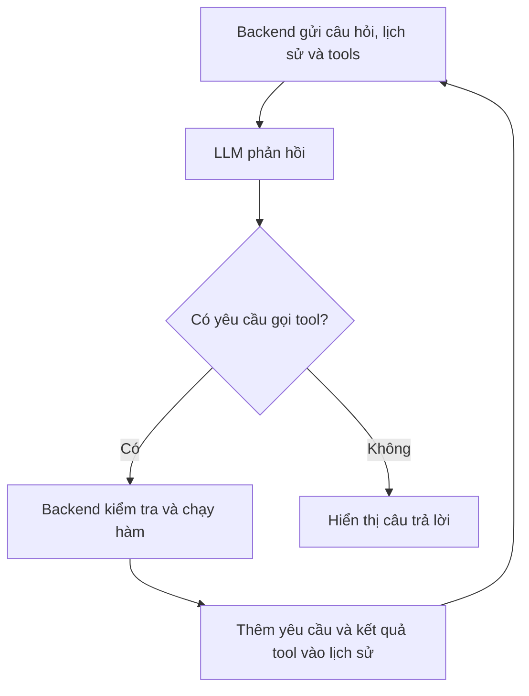

# Ngày 4 — Tool Calling: từ chatbot trò chuyện đến trợ lý dùng dữ liệu thật

> Bản giảng giải đầy đủ cho video 015–019, tuần 2. Biên soạn từ toàn bộ phụ đề tiếng Anh đính kèm, diễn giải lại bằng tiếng Việt; không phải bản chép lời hay bản sao nguyên mã nguồn trên màn hình. Các ví dụ và phần «Bổ sung» được viết thêm để làm rõ kiến thức. Giá vé trong tài liệu chỉ là dữ liệu học tập.

## 1. Cả phần này thực sự muốn dạy bạn điều gì?

**Bạn đang học cách xây dựng một ứng dụng trong đó LLM hiểu yêu cầu bằng ngôn ngữ tự nhiên, đề nghị sử dụng chức năng phù hợp, rồi dựa vào kết quả chức năng đó để trả lời.**

Chatbot thông thường có thể trò chuyện về chuyến đi. Nhưng nếu bạn hỏi «Giá vé hiện tại trong hệ thống của hãng là bao nhiêu?», kiến thức có sẵn của mô hình không đủ. Bạn cần cho ứng dụng một hàm tra giá và một cơ chế để LLM yêu cầu ứng dụng gọi hàm ấy.

Ví dụ xuyên suốt là trợ lý hãng hàng không. Kết quả thực hành của 5 video là chatbot tra giá vé từ SQLite, xử lý được nhiều yêu cầu tra cứu trong một lần trả lời và qua nhiều vòng. Việc đặt vé thật là khả năng mở rộng được giảng viên gợi ý, chưa phải chức năng đã hoàn thành trong demo.

| Video | Vấn đề cần giải quyết | Điều bạn cần hiểu sau bài |
|---|---|---|
| 015 — How LLM Tool Calling Really Works | Mô hình sinh token thì làm sao gọi được hàm? | Mô hình sinh yêu cầu gọi hàm; ứng dụng thực thi và gửi lại kết quả. |
| 016 — Common Use Cases for LLM Tools and Agentic AI Workflows | Công cụ dùng để làm gì ngoài tra cứu? | Đọc dữ liệu, thực hiện hành động, tính toán, chạy mã, cập nhật UI, điều phối LLM và kế hoạch. |
| 017 — Building an Airline AI Assistant | Ghép công cụ vào chatbot bằng cách nào? | Viết hàm, mô tả bằng schema, gửi `tools`, nhận yêu cầu, gọi hàm và gửi kết quả về. |
| 018 — Handling Multiple Tool Calls | Vì sao hỏi hai thành phố hoặc hỏi có điều kiện lại lỗi? | Cần xử lý toàn bộ tool calls trong một phản hồi và hỗ trợ nhiều vòng phản hồi. |
| 019 — SQLite Database Integration | Làm sao dùng dữ liệu lưu thật và tiến gần ứng dụng thực tế? | Đổi phần tra dictionary thành SQL; nhận ra giới hạn về lịch sử, streaming và quyền cập nhật. |

Đây là học **xây ứng dụng dùng LLM có sẵn**. Các bài này không thay đổi trọng số hay huấn luyện một mô hình mới.

## 2. Video 015 — LLM gọi công cụ như thế nào?

### 2.1. Phân chia đúng trách nhiệm

Hãy tưởng tượng LLM là nhân viên tư vấn, còn chương trình của bạn là người có quyền sử dụng hệ thống tra cứu. Nhân viên nói: «Tôi cần giá vé London». Chương trình truy vấn dữ liệu rồi đưa kết quả lại cho nhân viên trả lời khách.

Trong custom function calling của bài này, LLM không tự kết nối vào máy bạn để chạy Python. Nó trả về dữ liệu thể hiện **tên hàm muốn gọi và các tham số**. Backend của bạn nhận dữ liệu ấy và quyết định thực thi.

| Thành phần | Trách nhiệm |
|---|---|
| Người dùng | Nêu nhu cầu bằng ngôn ngữ tự nhiên. |
| LLM | Hiểu nhu cầu, đề xuất tool và tham số, diễn giải kết quả. |
| Tool schema — mô tả công cụ | Cho LLM biết công cụ làm gì và nhận tham số nào. |
| Backend / mã điều phối | Kiểm tra yêu cầu, chạy hàm, quản lý lịch sử và các vòng gọi. |
| Hàm công cụ | Làm công việc thật: đọc DB, gọi API, tính toán… |
| Gradio | Hiển thị giao diện và gọi callback xử lý chat. |

### 2.2. Một câu hỏi nhưng thường có hai lần gọi LLM

Ví dụ người dùng hỏi: «Vé đi London bao nhiêu?»

1. Ứng dụng gửi câu hỏi, lịch sử, chỉ dẫn và mô tả công cụ đến LLM.
2. LLM trả về yêu cầu `get_ticket_price` với `destination_city = "London"`.
3. Ứng dụng kiểm tra rồi chạy `get_ticket_price("London")`.
4. Hàm trả về giá, ví dụ 799 USD.
5. Ứng dụng gửi lại lịch sử, yêu cầu gọi công cụ và kết quả công cụ đến LLM.
6. LLM tạo câu trả lời: «Giá vé khứ hồi đi London là 799 USD».

Lần gọi LLM thứ nhất chọn công cụ; lần thứ hai sử dụng kết quả. Một câu chào có thể không cần tool và chỉ cần một lần gọi. Một yêu cầu phức tạp có thể cần nhiều vòng hơn.



### 2.3. Vì sao giảng viên nói «No Magic, Just Prompts»?

Trong video, giảng viên thử mô tả bằng văn bản rằng nếu cần giá vé thì mô hình hãy trả lời theo một mẫu yêu cầu dùng tool. Khi hỏi giá Paris, mô hình trả về mẫu ấy. Ví dụ này chứng minh rằng mô hình vẫn đang sinh đầu ra theo chỉ dẫn.

Khi lập trình, thay vì tự nhận diện một câu văn như «hãy tra giá Paris», API cung cấp cấu trúc tool calling để chương trình xử lý rõ ràng hơn. Mô hình đã được huấn luyện để hiểu định dạng công cụ; không phải cứ đưa bất kỳ JSON nào là mọi mô hình đều gọi tool tốt.

**Bổ sung:** Hãy hiểu «LLM gọi tool» là cách nói ngắn cho cả quá trình trên. Khả năng thực thi nằm ở hệ thống tích hợp với mô hình.

## 3. Video 016 — Tool dùng vào những việc gì? Liên quan gì đến Agentic AI?

| Nhóm ứng dụng trong bài | Ví dụ dễ hình dung | Phần làm việc thật |
|---|---|---|
| Tra cứu dữ liệu | Xem giá vé, trạng thái đơn hàng | Hàm đọc DB hoặc gọi API. |
| Thực hiện hành động | Đặt lịch, đặt vé | Hàm ghi dữ liệu hoặc gọi dịch vụ nghiệp vụ. |
| Tính toán | Tính tổng tiền, thống kê | Mã tính toán có quy tắc xác định. |
| Chạy chương trình | Dùng Python phân tích dữ liệu | Môi trường thực thi có kiểm soát. |
| Tương tác UI | Tạo biểu đồ để người dùng xem | Ứng dụng dựng biểu đồ từ kết quả. |
| Gọi LLM khác | Nhờ một mô hình phân tích, một mô hình đánh giá | Tool bọc một lần gọi LLM khác. |
| Quản lý kế hoạch | Lập danh sách việc, đánh dấu hoàn thành, đánh giá lại | Công cụ giữ trạng thái kế hoạch và kết quả. |

Trong ví dụ về coder agent, giảng viên nhấn mạnh khả năng **thực thi mã để hoàn thành nhiệm vụ**; không nhất thiết chỉ là chatbot viết mã cho người đọc.

Hai ý nối sang Agentic AI:

- **Điều phối:** một LLM lựa chọn tool mà bên trong là một lời gọi LLM khác để xử lý phần việc chuyên biệt.
- **Vòng lặp hành động:** hệ thống lập kế hoạch, dùng công cụ, quan sát kết quả rồi chọn bước tiếp theo cho đến khi đạt điều kiện hoàn thành.

**Bổ sung để tránh nhầm:** Có tool là một nền tảng quan trọng, nhưng một lần tra DB chưa nói lên rằng bạn đã xây được một agent tự chủ phức tạp. Mức độ «agentic» liên quan đến việc mô hình được quyết định bao nhiêu bước và hệ thống theo dõi mục tiêu, kết quả ra sao.

Ví dụ: nếu người dùng hỏi «London dưới 1.000 USD thì kiểm tra Paris», hệ thống phải xem kết quả London trước khi quyết định bước tiếp. Đây là dạng điều phối nhỏ sẽ được làm ở video 018.

## 4. Video 017 — Xây trợ lý hàng không từng lớp

### 4.1. Lớp giao diện và chỉ dẫn

Giảng viên bắt đầu với chatbot Gradio quen thuộc: callback nhận tin nhắn và lịch sử, ghép system message, gọi Chat Completions rồi trả nội dung về giao diện.

System prompt yêu cầu trợ lý trả lời ngắn, lịch sự, chính xác và nói không biết khi thiếu thông tin. Mục đích là định hướng cách trả lời. Nó không cung cấp một kết nối DB và không bảo đảm tuyệt đối rằng mô hình sẽ không bịa.

Bài có nhắc thử các mô hình khác, kể cả mô hình chạy local. Ý cần nhớ là **mô hình cần hỗ trợ và thực hiện tool calling đủ tốt**; không cần học thuộc danh sách tên model trong video.

### 4.2. Viết chức năng thật trước

Ví dụ Python tự viết lại, rút gọn theo bài:

```python
ticket_prices = {"london": 799, "paris": 899}

def get_ticket_price(destination_city):
    city = destination_city.strip().lower()
    price = ticket_prices.get(city)
    if price is None:
        return {"city": city, "available": False}
    return {
        "city": city,
        "available": True,
        "price": price,
        "currency": "USD",
    }
```

Chưa có AI ở đoạn này. Nó chỉ lấy giá từ dictionary — có thể hình dung tương tự object/map trong JavaScript. Việc chuẩn hóa chữ giúp `London` và `london` tra cùng một khóa; không tự giải quyết mọi biệt danh hoặc cách viết khác của thành phố.

Trả về dữ liệu có cấu trúc là lựa chọn bổ sung trong tài liệu; video dùng câu văn thông báo giá. Cả hai đều có thể được chuyển thành nội dung kết quả tool.

### 4.3. Mô tả chức năng cho LLM biết

Ví dụ schema theo cấu trúc Chat Completions được dùng trong bài:

```python
tools = [{
    "type": "function",
    "function": {
        "name": "get_ticket_price",
        "description": "Get the return ticket price for a destination city.",
        "parameters": {
            "type": "object",
            "properties": {
                "destination_city": {
                    "type": "string",
                    "description": "The city the customer wants to travel to."
                }
            },
            "required": ["destination_city"],
            "additionalProperties": False
        }
    }
}]
```

| Trường | Ý nghĩa |
|---|---|
| `name` | Tên mà backend dùng để tìm hàm cần thực thi. |
| `description` | Giúp mô hình hiểu mục đích và lúc nên dùng công cụ. |
| `parameters` | Mô tả cấu trúc đối số. |
| `properties` | Danh sách tham số và kiểu dữ liệu. |
| `required` | Các tham số cần có. |
| `additionalProperties: False` | Khai báo không nhận thêm thuộc tính ngoài danh sách; tài liệu bổ sung trường này. |

Schema là **hợp đồng mô tả**, không phải phần thân hàm. Đưa schema vào `tools` cũng không tự đăng ký một hàm Python trên máy chủ của nhà cung cấp. Bạn vẫn phải viết phần nhận và thực thi yêu cầu.

**Liên hệ TypeScript:** schema giống việc công bố một contract cho bên gọi, nhưng tồn tại lúc runtime và được gửi đến mô hình. Một `interface` TypeScript đơn thuần bị loại khi biên dịch nên không thay thế được phần này.

### 4.4. Nhận tool call và trả kết quả đúng chỗ

Trong bài, chương trình kiểm tra `finish_reason == "tool_calls"`, lấy thông tin hàm, giải mã chuỗi JSON trong `arguments`, rồi gọi hàm tương ứng.

Ví dụ dữ liệu minh họa cho một yêu cầu và kết quả:

```json
[
  {
    "role": "assistant",
    "tool_calls": [{
      "id": "call_01",
      "type": "function",
      "function": {
        "name": "get_ticket_price",
        "arguments": "{\"destination_city\":\"London\"}"
      }
    }]
  },
  {
    "role": "tool",
    "tool_call_id": "call_01",
    "content": "{\"city\":\"london\",\"price\":799,\"currency\":\"USD\"}"
  }
]
```

Đây chỉ là hai message được thêm vào sau câu hỏi, không phải toàn bộ request. Sau đó ứng dụng gửi lịch sử đã mở rộng về LLM để lấy câu trả lời cuối.

Nhớ ba điểm:

- Yêu cầu dùng công cụ thuộc `role: "assistant"`: mô hình là bên yêu cầu.
- Kết quả thực thi thuộc `role: "tool"`: chương trình cung cấp kết quả.
- `tool_call_id` phải khớp `id` của yêu cầu để ghép đúng kết quả, nhất là khi có nhiều lần gọi.

Định dạng trên được đối chiếu với [hướng dẫn Function calling của OpenAI](https://developers.openai.com/api/docs/guides/function-calling). Tài liệu này giữ cách tiếp cận Chat Completions của video; các API khác có thể biểu diễn những bước tương tự bằng trường khác.

### 4.5. Tại sao phải gửi lại lịch sử?

Với cách gọi Chat Completions trong bài, ứng dụng cung cấp ngữ cảnh qua `messages`. Lần request tiếp theo không tự biết toàn bộ lần trước chỉ vì dùng cùng API key.

Nó cần thấy: người dùng hỏi gì, trợ lý yêu cầu tool nào, tool trả kết quả gì. Lịch sử đầy đủ giúp mô hình tiếp tục đúng mạch và đáp ứng định dạng của API.

## 5. Video 018 — Hai loại «nhiều tool call» khác nhau

### 5.1. Nhiều yêu cầu trong cùng một phản hồi

Người dùng hỏi: «London hay Paris rẻ hơn?» Mô hình có thể trả về hai yêu cầu cùng lúc:

- `get_ticket_price("London")`
- `get_ticket_price("Paris")`

Code ban đầu chỉ lấy `message.tool_calls[0]`, nên bỏ sót yêu cầu thứ hai. Cách sửa là lặp qua toàn bộ `message.tool_calls`, thực thi từng yêu cầu và thêm một kết quả tương ứng với từng ID.

**Đừng nhầm với `response.choices[0]`:** đây là chọn phương án phản hồi đầu tiên. Một phương án phản hồi vẫn có thể chứa nhiều tool calls. Giảng viên cũng phân biệt điểm này khi sửa lỗi.

**Bổ sung:** Nhiều tool calls trong một phản hồi không đồng nghĩa code chạy đồng thời. Vòng `for` thông thường vẫn có thể thực thi chúng lần lượt. Chạy song song là lựa chọn triển khai riêng, phù hợp khi các tác vụ độc lập.

### 5.2. Nhiều vòng gọi phụ thuộc kết quả trước

Người dùng hỏi: «Tra London trước. Chỉ khi dưới 1.000 USD mới tra Paris».

| Vòng | LLM có thông tin gì? | Bước tiếp |
|---|---|---|
| 1 | Chưa biết giá London | Yêu cầu tra London. |
| 2 | Đã nhận giá London là 799 | Điều kiện đúng, yêu cầu tra Paris. |
| 3 | Đã có cả hai giá | Trả lời người dùng. |

Một `if` chỉ xử lý một đợt rồi kết thúc sẽ không đủ. Video chuyển thành `while` và tiếp tục truyền `tools` ở những lần gọi sau, cho phép LLM yêu cầu thêm công cụ.

Như vậy, có hai tầng lặp: **vòng ngoài cho các lượt phản hồi của LLM; vòng trong cho mọi tool call của một lượt**.

### 5.3. Khung điều phối dễ đọc

Đoạn dưới là **mã giả để học luồng xử lý**, không phải chương trình có thể chạy nguyên khối. `call_llm`, `execute_validated_tool` và `tool_result_message` là các hàm đại diện bạn cần triển khai.

```python
MAX_TOOL_ROUNDS = 5
rounds = 0

while True:
    response = call_llm(messages=messages, tools=tools)
    messages.append(response)

    if not response.tool_calls:
        return response.content

    if rounds >= MAX_TOOL_ROUNDS:
        # Kết thúc lượt này có kiểm soát; không tiếp tục gửi
        # một lịch sử còn tool call chưa có kết quả lên API.
        return "Yêu cầu cần quá nhiều bước, vui lòng thu hẹp phạm vi."

    for call in response.tool_calls:
        result = execute_validated_tool(call)
        messages.append(tool_result_message(call.id, result))

    rounds += 1
```

**Bổ sung:** Cần giới hạn số vòng, thời gian và chi phí khi triển khai thực tế. Giảng viên có đề cập giới hạn vòng lặp; không nên dựa vào giả định «mô hình thường tự dừng». Khi đạt giới hạn, ứng dụng phải đóng lượt hợp lệ hoặc xử lý riêng các yêu cầu đang chờ trước khi tái sử dụng lịch sử.

## 6. Video 019 — Thay dictionary bằng SQLite

### 6.1. Mục đích của thay đổi

Dictionary là dữ liệu trong bộ nhớ chương trình. SQLite cho phép lưu dữ liệu trong một file, ở bài này là `prices.db`. Khởi động lại ứng dụng vẫn có thể đọc dữ liệu đã ghi nếu file còn tồn tại.

Điều quan trọng về kiến trúc: **giữ cùng chức năng `get_ticket_price`, thay phần thực thi phía sau**. LLM vẫn yêu cầu tên hàm và đối số như trước; nó không cần biết dữ liệu đến từ dictionary, SQLite, PostgreSQL hay một API.

SQLite được chọn để giảm công sức cấu hình trong bài thực hành. Tool calling không đòi hỏi SQLite; bạn có thể bọc một truy vấn MongoDB hoặc service khác bằng cùng kiểu hàm.

### 6.2. Tạo bảng, đọc giá, cập nhật giá

Ví dụ tự viết lại để minh họa ba thao tác, dùng Python và SQL cơ bản:

```python
import sqlite3
from contextlib import closing

DB = "prices.db"

# Quy ước bài tập: giá là số USD nguyên, không phải mô hình tiền tệ đầy đủ.
with closing(sqlite3.connect(DB)) as conn:
    conn.execute("""
        CREATE TABLE IF NOT EXISTS prices (
            city TEXT PRIMARY KEY,
            price INTEGER NOT NULL CHECK (price >= 0)
        )
    """)
    conn.commit()


def get_ticket_price(destination_city):
    city = destination_city.strip().lower()
    with closing(sqlite3.connect(DB)) as conn:
        row = conn.execute(
            "SELECT price FROM prices WHERE city = ?",
            (city,),
        ).fetchone()
    if row is None:
        return {"city": city, "available": False}
    return {
        "city": city, "available": True,
        "price": row[0], "currency": "USD",
    }


def set_ticket_price(destination_city, price):
    city = destination_city.strip().lower()
    if not city or type(price) is not int or price < 0:
        raise ValueError("Thành phố và giá vé không hợp lệ")
    with closing(sqlite3.connect(DB)) as conn:
        conn.execute("""
            INSERT INTO prices (city, price) VALUES (?, ?)
            ON CONFLICT(city) DO UPDATE SET price = excluded.price
        """, (city, price))
        conn.commit()


set_ticket_price("London", 799)
print(get_ticket_price("London"))
```

| Câu lệnh / khái niệm | Hiểu đơn giản |
|---|---|
| `CREATE TABLE IF NOT EXISTS` | Tạo bảng nếu chưa có. |
| `PRIMARY KEY` | Dùng thành phố làm khóa duy nhất trong dữ liệu demo. |
| `SELECT ... WHERE` | Tìm giá của thành phố được yêu cầu. |
| `?` và bộ tham số | Truyền dữ liệu riêng khỏi câu SQL. |
| `fetchone()` | Lấy một dòng; không có thì nhận `None`. |
| `INSERT ... ON CONFLICT ... UPDATE` | Thêm mới hoặc sửa giá nếu thành phố đã tồn tại — upsert. |
| `commit()` | Xác nhận lưu thay đổi. |

Video nhấn mạnh truy vấn có tham số để tránh ghép đầu vào trực tiếp thành SQL. Trong demo này **LLM chỉ đưa tên thành phố; câu SQL do lập trình viên viết sẵn**. Đây chưa phải bài text-to-SQL, nơi mô hình tự sinh câu truy vấn.

Khi bảng mới tạo còn trống, tra cứu phải báo không có dữ liệu. Sau khi ghi giá, cùng câu hỏi sẽ nhận giá từ DB. Đổi giá trong DB rồi hỏi lại là cách quan sát rằng chatbot đang sử dụng nguồn dữ liệu ngoài mô hình.

**Bổ sung:** Dữ liệu giá theo mỗi thành phố chỉ là mô hình học tập. Giá vé thực tế còn phụ thuộc nơi đi, ngày đi, loại vé, thuế… Đổi DB không tự làm dữ liệu demo trở thành giá thị trường.

### 6.3. Vì sao định nghĩa lại hàm mà chatbot dùng được ngay?

Trong notebook của bài, phần xử lý gọi tên `get_ticket_price` khi thực thi. Khi tên đó được gán cho định nghĩa mới dùng SQLite, lời gọi sau sẽ sử dụng định nghĩa mới.

**Bổ sung:** Không nên khái quát thành «mọi nơi đều tự đổi». Nếu bạn đã lưu đối tượng hàm cũ trong một registry, phải cập nhật registry để nó trỏ đến hàm mới.

## 7. Những giới hạn giảng viên nêu và cách hiểu đúng

### 7.1. Lịch sử giao diện khác với lịch sử thực thi

Trong demo, callback nhận `history` từ phần trò chuyện hiển thị trên Gradio. Những message tool thêm vào bên trong một lượt không nhất thiết được giữ lại ở lượt sau.

Chatbot có thể còn thấy câu «London giá 799 USD» trong câu trả lời cũ, nhưng mất dữ liệu chính xác về công cụ đã gọi, tham số và kết quả. Giảng viên thừa nhận đây là điểm cần cải thiện cho hệ thống bền vững hơn.

**Bổ sung:** Backend nên quản lý lịch sử theo phiên/người dùng, lưu cả assistant tool calls và tool results. Giao diện chỉ hiển thị phần phù hợp; không dùng một danh sách toàn cục chung cho mọi người. Có thể dùng DB hoặc cơ chế lưu trạng thái khác tùy nhu cầu.

### 7.2. Vì sao bài này không streaming?

Video cố ý dùng câu trả lời hoàn chỉnh để tránh làm phức tạp phần cốt lõi. Khi streaming, thông tin tool và chuỗi JSON đối số có thể đến thành nhiều mảnh; ứng dụng phải ghép đủ trước khi phân tích và thực thi.

Không phải tool calling không hỗ trợ streaming. Giảng viên nhắc rằng framework/SDK có thể xử lý bớt schema, điều phối và streaming; tự làm trước giúp bạn hiểu những lớp trừu tượng ấy đang làm gì.

### 7.3. Bài tập thêm `set_ticket_price` và bỏ chuỗi `if`

Giảng viên đề nghị đưa hàm cập nhật giá thành tool: mô tả thêm schema, đưa vào danh sách `tools`, rồi bổ sung xử lý. Sau đó chatbot có thể ghi giá và các lượt sau đọc được giá đã cập nhật.

Để thay chuỗi `if` bằng cách rõ ràng, có thể dùng registry cho các hàm được phép:

```python
TOOL_REGISTRY = {
    "get_ticket_price": get_ticket_price,
    # Chỉ đưa tool ghi vào ngữ cảnh đã kiểm tra quyền phù hợp.
}
```

Backend tra tên trong registry, từ chối tên không có, kiểm tra đối số rồi gọi hàm. Không dùng `eval` để thực thi chuỗi do mô hình tạo ra hay mở toàn bộ hàm trong chương trình cho mô hình lựa chọn.

**Bổ sung cho ứng dụng thật:** Tool ghi giá cần kiểm tra quyền từ phiên đăng nhập ở backend; câu «tôi là admin» trong chat không phải bằng chứng quyền. Các thao tác như đặt vé, thanh toán cần thêm bước xác nhận theo nghiệp vụ và chống thực thi trùng. Đây là phần mở rộng thực tế, không phải cơ chế mà demo đã triển khai.

## 8. Liên hệ với công việc frontend và backend

Với ứng dụng web bạn quen làm, có thể ánh xạ như sau:

| Trong bài | Trong ứng dụng React / Next.js + backend |
|---|---|
| Gradio chat UI | Component chat hiển thị tin nhắn, loading và kết quả. |
| Callback `chat` | Endpoint nhận yêu cầu chat và service điều phối phía server. |
| `tools` schema | Contract mô tả các thao tác backend có thể cung cấp cho LLM. |
| `get_ticket_price` | Service tra dữ liệu nghiệp vụ. |
| `prices.db` | DB của ứng dụng hoặc một nguồn dữ liệu bên ngoài. |
| Vòng lặp tool calls | Backend nhận đề xuất, kiểm tra, gọi service và gửi kết quả về LLM. |

Khác với nút bấm cố định gọi một endpoint, ở đây LLM giúp chuyển một yêu cầu tự nhiên thành lựa chọn hàm và tham số. Phần nghiệp vụ và quyền truy cập vẫn do backend giữ. API key của nhà cung cấp mô hình cũng phải nằm phía server.

**Phân biệt thêm với RAG:** Tool calling là cơ chế yêu cầu sử dụng chức năng. RAG là cách truy xuất thông tin liên quan rồi dùng thông tin đó để hỗ trợ sinh câu trả lời. Một tool có thể làm bước truy xuất trong RAG; không phải mọi tool đều là RAG, vì tool còn có thể ghi dữ liệu, tính toán hoặc tạo UI. Bài này không cần vector database hay embeddings để tra giá theo tên thành phố.

## 9. Cách tự học lại mà không bị ngợp

Làm theo thứ tự và quan sát kết quả trước khi thêm bước mới:

1. **Gọi hàm bằng tay:** thử thành phố có dữ liệu và không có dữ liệu. Hiểu hàm trước khi gắn AI.
2. **Đọc schema:** tự nói được mỗi trường dùng làm gì và hàm nhận tham số nào.
3. **Một tool call:** hỏi giá London; in tên hàm, đối số, kết quả và ID liên kết.
4. **Hai tool calls:** hỏi London hay Paris rẻ hơn; kiểm tra cả hai yêu cầu đều có kết quả.
5. **Hai vòng phụ thuộc:** thử điều kiện dưới 1.000 USD với giá London nằm ở cả hai phía ngưỡng.
6. **Đổi sang SQLite:** sửa giá, hỏi lại và quan sát giá mới; giữ lại file DB để kiểm tra sau khi khởi động lại.
7. **Bài mở rộng:** thêm tool ghi giá cho phiên có quyền, kiểm tra đầu vào sai và tên tool không tồn tại.

Khi debug, đọc log ở backend, không chỉ thông báo lỗi Gradio. Trong môi trường học có thể in `messages`; trong ứng dụng thật cần tránh ghi API key và dữ liệu nhạy cảm vào log.

### Tự kiểm tra hiểu bài

| Câu hỏi | Đáp án cốt lõi |
|---|---|
| Ai chạy hàm Python? | Chương trình của bạn. |
| Gửi schema có gửi luôn phần thân hàm không? | Không; đó là mô tả chức năng và đối số. |
| Vì sao cần lần gọi LLM tiếp theo? | Để mô hình sử dụng kết quả vừa tra được. |
| Tại sao có `tool_call_id`? | Để ghép kết quả với đúng yêu cầu. |
| `for` và vòng lặp ngoài giải quyết gì? | `for` xử lý mọi call trong một phản hồi; vòng ngoài xử lý các đợt tiếp theo. |
| Thay dictionary bằng SQL có huấn luyện lại model không? | Không; chỉ thay nguồn dữ liệu sau hàm. |
| Tool calling có bắt buộc Python/SQLite không? | Không; đó là lựa chọn triển khai của bài. |
| Chatbot báo «đã đặt vé» đã đủ chứng minh đặt thành công chưa? | Chưa; phải có kết quả xác nhận từ nghiệp vụ thực sự. |

## 10. Nguồn và phạm vi

Nguồn chính đã đọc đầy đủ là 5 phụ đề tiếng Anh đính kèm, tương ứng video:

- 015 — How LLM Tool Calling Really Works (No Magic, Just Prompts).
- 016 — Common Use Cases for LLM Tools and Agentic AI Workflows.
- 017 — Building an Airline AI Assistant with Tool Calling in OpenAI and Gradio.
- 018 — Handling Multiple Tool Calls with OpenAI and Gradio.
- 019 — Building Tool Calling with SQLite Database Integration.

Phụ đề có lỗi nhận dạng như «a genetic AI»/«a gigantic AI» khi nói về Agentic AI và một số cách đọc số tiền thiếu nhất quán. Tài liệu chuẩn hóa thuật ngữ theo ngữ cảnh, dùng số tiền minh họa rõ ràng và không coi phụ đề là bản chép chính xác code trên màn hình.

Phần đối chiếu định dạng API: [OpenAI — Function calling](https://developers.openai.com/api/docs/guides/function-calling), truy cập ngày 10/09/2026. Ví dụ code được viết lại để học; tài liệu không kèm một ứng dụng Gradio hoàn chỉnh đã kiểm thử với API thật.
