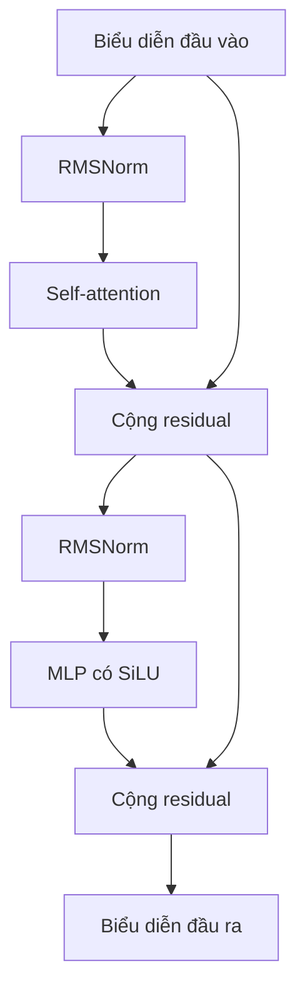

# Ngày 4 — Tự chạy LLM và hiểu cấu trúc bên trong

**Bản giảng giải đầy đủ • Video 015–019 • Tuần 3**

## 1. Phần này thực sự muốn dạy bạn điều gì?

**Mục tiêu là chuyển từ “biết gọi AI” sang “biết tự nạp, chạy và giải thích sơ bộ một mô hình AI”.** Giảng viên dùng việc yêu cầu các mô hình kể chuyện cười để minh họa. Chuyện cười chỉ là dữ liệu thử; kỹ năng cần học là điều khiển quá trình suy luận và hiểu những thành phần tham gia.

Sau phần này, bạn nên trả lời được bốn câu hỏi:

1. Làm sao chạy một mô hình tải từ Hugging Face bằng Python?
2. Vì sao mô hình chiếm nhiều bộ nhớ và quantization giúp được gì?
3. Token ID đi qua mạng neural như thế nào để trở thành token tiếp theo?
4. Khi đổi mô hình, cần kiểm tra những gì ngoài tên model?

Bạn chưa cần tự viết Transformer hoặc huấn luyện LLM từ đầu. Phần này chủ yếu là **inference — suy luận bằng trọng số đã được huấn luyện**.

### Bản đồ 5 video

| Video | Nội dung chính | Mục đích của bài |
| --- | --- | --- |
| 015 | Quantization, mạng neural, giới thiệu buổi thực hành | Hiểu vì sao có thể giảm bộ nhớ bằng cách giảm độ chính xác số học |
| 016 | Transformers cấp thấp, tokenizer, GPU, nạp model | Biết tự nối các bước mà `pipeline` thường làm giúp |
| 017 | Cấu trúc LLaMA, embedding, các tầng và LM head | Đọc được ý nghĩa cơ bản của `print(model)` |
| 018 | Attention, MLP, normalization, phi tuyến | Hiểu vai trò các bộ phận trong một decoder layer |
| 019 | Sinh văn bản, streaming, thử nhiều model | Vận hành mô hình và quan sát khác biệt thực tế |

**Cách biên soạn:** Nội dung bài học được tổng hợp từ toàn bộ phụ đề tiếng Anh của 5 video bạn gửi. Tài liệu viết lại theo mạch dễ học, không dịch từng câu. Các ví dụ giải thích, lưu ý sửa hiểu nhầm và bài tập là phần bổ sung. Mình không đối chiếu từng khung hình video; do đó không coi tên repository không được nói rõ trong phụ đề là thông tin đã xác nhận. Các API và điểm kỹ thuật cần làm rõ được đối chiếu với tài liệu chính thức liên kết tại phần liên quan.

## 2. Nắm vai trò từng công cụ trước khi đọc code

Với nền tảng lập trình web, bạn có thể hình dung ứng dụng gọi một hàm xử lý; bên trong hàm đó, tokenizer chuẩn bị dữ liệu và model thực hiện tính toán. Tuy nhiên, gọi model tại máy khác với gọi một dịch vụ AI qua HTTP: chính máy chạy Python phải chứa và tính toán với trọng số.

| Thành phần | Vai trò |
| --- | --- |
| Hugging Face Hub | Nơi cung cấp checkpoint, tokenizer, cấu hình và thông tin mô hình |
| `transformers` | Thư viện cung cấp các lớp model và công cụ dùng chúng |
| `pipeline` | Giao diện tiện dụng đóng gói nhiều bước xử lý |
| `AutoTokenizer` | Nạp tokenizer tương ứng với model |
| `AutoModelForCausalLM` | Nạp lớp mô hình dự đoán token tiếp theo cùng trọng số |
| PyTorch | Thư viện tensor và tính toán mạng neural |
| CUDA | Nền tảng tính toán GPU của NVIDIA |
| `accelerate` | Hỗ trợ nạp và phân bố mô hình lên thiết bị |
| `bitsandbytes` | Cung cấp các phép toán/lớp phục vụ lượng tử hóa |

**“Low-level API” ở đây là thấp hơn `pipeline`.** Bạn vẫn sử dụng thư viện dựng sẵn, không phải tự lập trình phép nhân ma trận bằng CUDA.

## 3. Video 015 — Quantization: làm mô hình gọn hơn

### 3.1. Parameter — tham số là gì?

Một mạng neural có rất nhiều giá trị số được học trong quá trình training. Những giá trị này điều chỉnh cách thông tin đầu vào được biến đổi. Trong bài học, giảng viên so sánh chúng với các núm chỉnh âm lượng trên bàn trộn âm thanh.

- Training: điều chỉnh các giá trị để mô hình làm tốt hơn trên dữ liệu huấn luyện.
- Inference: dùng các giá trị đã học để tính câu trả lời.

Ví dụ, “1B parameters” nghĩa là khoảng một tỷ tham số. **Không có nghĩa là một tỷ từ, một tỷ tài liệu hay dung lượng đúng 1 GB.**

### 3.2. Vì sao mô hình tốn bộ nhớ?

Công thức ước lượng phần trọng số:

**Số byte ≈ số tham số × số bit cho mỗi tham số ÷ 8.**

Ví dụ lý tưởng với đúng một tỷ tham số:

| Cách biểu diễn | Byte/tham số | Dung lượng trọng số lý tưởng |
| --- | ---: | ---: |
| FP32 — 32 bit | 4 | 4 GB |
| FP16/BF16 — 16 bit | 2 | 2 GB |
| 8 bit | 1 | 1 GB |
| 4 bit | 0,5 | 0,5 GB |

Đây là GB thập phân và chỉ là phép tính phần trọng số. Bộ nhớ thực còn có metadata lượng tử hóa, các tầng giữ độ chính xác cao hơn, tensor trung gian, KV cache và chi phí runtime. Vì vậy **không được lấy 0,5 GB làm yêu cầu VRAM chắc chắn cho mọi model 1B chạy 4 bit**.

### 3.3. Lượng tử hóa thay đổi điều gì?

Giả sử một núm chỉnh có rất nhiều mức nhỏ. Nếu chỉ giữ một tập mức đại diện, giá trị thực phải được ánh xạ về mức gần phù hợp. Bạn mất một phần độ chính xác nhưng giảm lượng dữ liệu cần lưu.

Ví dụ minh họa: `0.123456` được biểu diễn gần đúng bằng một mức như `0.12`. Đây chỉ là ví dụ làm tròn để hình dung; NF4 không đơn giản là cắt chữ số thập phân.

Điểm cốt lõi: **giảm số bit biểu diễn trọng số không đồng nghĩa xóa bớt số trọng số**. Với nhiều mô hình và phương pháp phù hợp, chất lượng có thể giữ được khá tốt; mức ảnh hưởng phải kiểm tra trên tác vụ thực tế. Không có bảo đảm rằng mọi mô hình đều chỉ giảm chất lượng rất ít.

### 3.4. NF4 và double quantization

NF4 là một cách mã hóa 4 bit với các mức đại diện phù hợp cho trọng số có phân bố gần chuẩn. Bốn bit có 16 mã, nhưng không có nghĩa mọi trọng số trong model chỉ được dùng cùng 16 số nguyên từ 0 đến 15. Còn có cơ chế scale theo nhóm. Double quantization lượng tử hóa thêm các hằng số lượng tử hóa để giảm phần phụ trợ; compute dtype có thể vẫn là FP16. [Tài liệu bitsandbytes](https://huggingface.co/docs/transformers/quantization/bitsandbytes).

**Điều cần nhớ:** 16 → 4 bit giảm khoảng 4 lần dữ liệu trọng số trong mô hình tính toán lý tưởng. Nó không bảo đảm tổng VRAM giảm đúng 4 lần hoặc tốc độ tăng 4 lần. Tốc độ còn tùy GPU, kernel và chi phí giải lượng tử.

## 4. Video 016 — Tự điều khiển đường đi từ câu hỏi đến model

### 4.1. Quy trình thực hành

1. Chuẩn bị runtime có GPU tương thích.
2. Cài thư viện và đăng nhập nếu model yêu cầu quyền truy cập.
3. Chọn đúng model và tokenizer.
4. Chuyển messages thành token IDs theo chat template.
5. Nạp model, chọn cách biểu diễn trọng số và thiết bị.
6. Chạy `generate`, rồi giải mã kết quả thành chữ.

Trong video, môi trường là Colab với GPU T4. Dung lượng trống, thời gian tải và khả năng được cấp GPU là quan sát của buổi quay, không phải thông số cố định cho mọi lần chạy.

### 4.2. Tokenizer và chat template khác nhau thế nào?

Ví dụ dữ liệu ứng dụng:

```python
messages = [
    {"role": "user", "content": "Explain an API in one sentence."}
]
```

Chat template định dạng cuộc hội thoại theo quy ước của model: đâu là lượt user, đâu là lượt assistant, đâu là phần bắt đầu trả lời. Tokenization biến chuỗi đã định dạng thành ID. `apply_chat_template` có thể làm cả hai; `add_generation_prompt=True` yêu cầu thêm phần mở đầu câu trả lời khi template hỗ trợ. [Chat templates](https://huggingface.co/docs/transformers/chat_templating).

**Không dùng tokenizer của model A tùy tiện cho model B.** ID giống nhau có thể mang ý nghĩa khác nhau trong hai bộ từ vựng.

### 4.3. Tensor và GPU

Tensor là mảng nhiều chiều, không chỉ riêng ma trận hai chiều.

| Ví dụ | Shape minh họa | Ý nghĩa |
| --- | --- | --- |
| Token IDs của một prompt | `[1, 20]` | Một chuỗi có 20 token |
| Biểu diễn sau embedding | `[1, 20, 2048]` | Mỗi token có vector 2048 số |
| Logits cho mỗi vị trí | `[1, 20, 128256]` | Điểm số cho từng token trong vocabulary |

Các số 20 chỉ là ví dụ. `return_tensors="pt"` yêu cầu tensor PyTorch; `.to("cuda")` chuyển tensor sang GPU NVIDIA. Model và dữ liệu cần được bố trí trên thiết bị tương thích.

### 4.4. Causal LM và autoregressive generation

**Causal**: khi dự đoán tại một vị trí, mô hình không được nhìn các token tương lai.

**Autoregressive**: sinh một token, đưa token đó vào ngữ cảnh, rồi tiếp tục sinh token kế tiếp.

Ví dụ minh họa, không phải cách chia token thực tế:

- Ngữ cảnh: “Bầu trời có màu” → chọn “ xanh”.
- Ngữ cảnh mới: “Bầu trời có màu xanh” → chọn “.”.
- Sau đó có thể sinh token kết thúc.

`generate()` quản lý vòng lặp đó. Khi có KV cache, hệ thống tái sử dụng một phần kết quả cũ để giảm việc tính lại; không nhất thiết tính lại toàn bộ prompt từ đầu cho từng token.

### 4.5. PAD, EOS và attention mask

- **PAD**: token đệm để các chuỗi có thể cùng chiều dài trong một batch.
- **EOS**: dấu kết thúc chuỗi; không đơn thuần là dấu chấm cuối câu.
- **Attention mask** đầu vào: thông thường `1` cho token thật, `0` cho padding.
- **Causal mask**: chặn nhìn token tương lai. Nó có vai trò khác padding mask.

Nếu tokenizer không có PAD, một cách thường gặp khi inference là dùng EOS làm PAD. Chỉ làm khi cần và truyền attention mask rõ ràng. Không nên hiểu câu lệnh trong video là quy tắc bắt buộc cho mọi tokenizer hoặc mọi tình huống training.

## 5. Video 017 — Đọc cấu trúc LLaMA

### 5.1. `print(model)` cho bạn thấy gì?

Nó hiển thị cây module, tên lớp và một số kích thước của mạng. Nó không hiển thị toàn bộ dữ liệu huấn luyện hoặc toàn bộ giá trị của hàng tỷ tham số.

Trong mô hình LLaMA 3.2 1B đang được mô tả ở video, các kích thước được nhắc đến là:

| Thành phần | Kích thước trong bài | Ý nghĩa |
| --- | --- | --- |
| Token embedding | `128256 × 2048` | 128256 hàng tương ứng token IDs; mỗi hàng có 2048 số |
| Decoder blocks | 16 | Các block được đánh số 0 đến 15 |
| Hidden size | 2048 | Độ dài vector biểu diễn mỗi token trong mạng |
| Chiều mở rộng MLP | 8192 | Không gian trung gian lớn hơn trong MLP |
| LM head | `2048 → 128256` | Biến biểu diễn thành điểm số trên vocabulary |

Đây là kích thước của biến thể đang học, không phải mọi LLaMA. Khi thử model khác, đọc `model.config` để biết cấu hình thực.

### 5.2. Embedding là tra bảng vector đã học

Hãy tưởng tượng một bảng có 128256 hàng. Token ID là chỉ số để chọn hàng; hàng lấy ra gồm 2048 số.

Ví dụ giả định:

```python
# Chỉ minh họa ý tưởng, các ID và vector không phải dữ liệu thật.
token_id = 42
vector = embedding_table[token_id]  # một vector gồm 2048 số
```

2048 là **số thành phần trong vector**, không phải 2048 nghĩa tiếng Việt đã được gắn nhãn. Vector được học để giúp những tầng sau xử lý thông tin.

Token cũng không nhất thiết là một từ hoàn chỉnh: nó có thể là một phần từ, dấu câu hoặc ký hiệu đặc biệt.

### 5.3. Token embedding khác RoPE

Cần tách hai việc mà lời giảng lướt khá nhanh:

- Token embedding: chuyển ID thành vector nội dung ban đầu.
- RoPE — Rotary Position Embedding: đưa thông tin vị trí vào cơ chế attention thông qua phép biến đổi query/key.

Embedding đầu vào cũng không phải một Transformer encoder block. LLaMA trong bài là kiến trúc decoder-only. [Mã nguồn LLaMA trong Transformers](https://github.com/huggingface/transformers/blob/main/src/transformers/models/llama/modeling_llama.py).

### 5.4. LM head dự đoán token kế tiếp

Sau các decoder block, mỗi vị trí đã có biểu diễn chứa thông tin ngữ cảnh. LM head biến biểu diễn này thành **logits — điểm số chưa chuẩn hóa** trên vocabulary. Có thể chuyển logits thành xác suất bằng softmax. Hệ thống chọn token theo chiến lược giải mã; không phải lúc nào cũng chọn token có xác suất lớn nhất.

Ví dụ tự tạo:

| Token ứng viên | Xác suất minh họa |
| --- | ---: |
| “ xanh” | 0,60 |
| “ xám” | 0,25 |
| “ đỏ” | 0,10 |
| Những token khác | 0,05 |

Không có một “câu trả lời hoàn chỉnh” nằm sẵn ở LM head. Nó cung cấp cơ sở chọn token, và quá trình được lặp lại để tạo cả câu.

## 6. Video 018 — Một decoder layer làm gì?

### 6.1. Attention: lấy thông tin từ các vị trí liên quan

Ví dụ: “Lan đưa sách cho Mai vì cô ấy cần đọc.” Muốn xử lý “cô ấy”, mô hình cần kết hợp thông tin từ phần câu trước; bản thân câu cũng có thể mơ hồ. Attention không bảo đảm hiểu đúng, nhưng tạo cơ chế cho các vị trí trao đổi thông tin.

Ba vai trò dễ hình dung:

| Thành phần | Câu hỏi gợi nhớ |
| --- | --- |
| Query — Q | Vị trí hiện tại đang tìm loại thông tin gì? |
| Key — K | Mỗi vị trí cung cấp dấu hiệu gì để được tìm thấy? |
| Value — V | Nếu chú ý đến vị trí đó, lấy thông tin gì từ nó? |

Các projection tạo Q/K/V từ biểu diễn đầu vào. Độ phù hợp giữa Q và K quyết định cách kết hợp V; output projection đưa kết quả trở lại không gian biểu diễn cần dùng.

Đây là cách giải thích trực giác. Attention kết hợp thông tin **giữa các vị trí token** dựa trên biểu diễn từ tầng trước, không chỉ chọn xem tầng nào quan trọng.

### 6.2. MLP: biến đổi đặc trưng của từng vị trí

Trong bài, vector 2048 chiều được mở rộng lên 8192 rồi đưa về 2048. Không gian trung gian lớn hơn tạo điều kiện biểu diễn các biến đổi phong phú hơn.

LLaMA dùng MLP có hai nhánh gate và up chạy từ cùng đầu vào, rồi kết hợp:

```text
MLP(x) = down_proj(SiLU(gate_proj(x)) * up_proj(x))
```

Dấu `*` là nhân theo từng phần tử. Công thức này làm rõ rằng gate không đơn thuần là một bước nối sau up theo một chuỗi duy nhất.

### 6.3. Vì sao cần phi tuyến?

Giả sử bạn ghép hai phép biến đổi tuyến tính:

```text
y = 2x
z = 3y
```

Khi đó `z = 6x`. Hai bước có thể gộp thành một bước. Nhiều phép tuyến tính nối tiếp vẫn có thể gộp thành một phép tuyến tính; thêm bias thì trở thành phép affine và cũng có tính chất tương tự.

Bây giờ thêm ReLU:

```text
y = max(0, 2x)
z = 3y
```

Với `x < 0`, kết quả bằng 0; với `x > 0`, kết quả bằng `6x`. Không thể biểu diễn toàn bộ quan hệ này bằng một đường thẳng duy nhất.

**Phi tuyến giúp mạng biểu diễn quan hệ phức tạp hơn việc trộn đầu vào theo các tỷ lệ cố định.** Đây là lý do giảng viên kể ví dụ nhiều bàn trộn âm thanh: nếu tất cả chỉ tăng giảm âm lượng tuyến tính thì cả chuỗi vẫn chỉ là một phép trộn tương đương.

Trong LLaMA ở bài này, tên đúng là **SiLU**, không phải SELU như phụ đề có thể khiến bạn hiểu:

```text
SiLU(x) = x * sigmoid(x)
```

ReLU là ví dụ dễ học; SiLU là activation đang được nói tới. Không cần học thuộc đồ thị để tiếp tục chạy model.

Lưu ý bổ sung: không được suy rộng rằng “bỏ SiLU thì toàn bộ Transformer trở thành một lớp tuyến tính”. Attention và normalization vẫn chứa những phép toán phi tuyến.

### 6.4. Normalization và residual connection

Normalization giúp giữ thang giá trị ổn định hơn; residual connection cộng lại đầu vào của nhánh biến đổi để giữ đường truyền thông tin. Đây là hai chi tiết lời giảng nói nhanh hoặc không triển khai đầy đủ.

Sơ đồ minh họa một decoder block LLaMA:



LLaMA dùng RMSNorm. Các nhánh residual và phép chuẩn hóa là thành phần quan trọng của block, không chỉ là phần trang trí. [Mã nguồn decoder LLaMA](https://github.com/huggingface/transformers/blob/main/src/transformers/models/llama/modeling_llama.py).

## 7. Video 019 — Sinh văn bản và thử nhiều mô hình

### 7.1. Tại sao kết quả ban đầu toàn số?

`generate()` thường trả về token IDs. Với decoder-only model và cách gọi thông thường trong bài, kết quả gồm prompt cùng các token mới. Muốn chỉ lấy câu trả lời, cắt bỏ phần đầu có độ dài bằng input rồi decode.

`max_new_tokens=80` đặt trần số token mới, không phải 80 từ và không bắt buộc sinh đủ 80 token. Model có thể dừng sớm hoặc bị cắt giữa câu.

### 7.2. Streaming giúp gì?

Streaming đưa văn bản ra dần khi model sinh. `TextStreamer` hỗ trợ in kết quả tăng dần; nó không tự tạo giao diện chat hoặc luồng HTTP tới trình duyệt. Trong ứng dụng web, bạn còn cần lớp server và cách truyền dữ liệu như SSE hoặc WebSocket.

Streaming cải thiện cảm giác chờ; nó không tự làm mô hình thông minh hơn. [Công cụ generation và streamer](https://huggingface.co/docs/transformers/internal/generation_utils).

### 7.3. Giảng viên quan sát được gì?

| Model/biến thể được mô tả trong phụ đề | Quan sát trong buổi chạy | Điều nên rút ra |
| --- | --- | --- |
| LLaMA 3.2 1B | Chạy 4 bit, tạo được chuyện cười; giảng viên thích kết quả này nhất | Mô hình nhỏ vẫn có thể thực hiện yêu cầu đơn giản |
| Phi, khoảng 4B tham số | Tải khá lâu, sau đó sinh được câu trả lời | Tách thời gian tải khỏi tốc độ inference |
| Gemma 3 270M | Giảng viên tắt quantization sau lỗi; câu đùa dừng ở phần mở đầu | Ghi nhận giới hạn và lỗi cụ thể của lần chạy |
| Qwen3 4B Instruct, bản được nói tới là 2507 | Sinh được chuyện cười, bị giới hạn ở 80 token | Ngân sách token có thể cắt phần còn lại |
| DeepSeek-R1-Distill-Qwen-1.5B | Sinh đoạn reasoning dài, hết 500 token mà chưa có câu đùa cuối | Token reasoning cũng tiêu tốn ngân sách sinh |

Tên Phi trong phụ đề nhận dạng không ổn định và không đủ xác nhận repository chính xác. Tài liệu giữ ở mức họ model và quy mô được giảng viên mô tả, không gán nhầm cho một bản Phi-4 khác.

Một prompt kể chuyện cười **không phải benchmark tổng quát**. Những quan sát này không chứng minh LLaMA luôn tốt nhất hoặc Gemma luôn không thể hoàn thành câu trả lời.

### 7.4. Distillation khác quantization

| Kỹ thuật | Thay đổi chính | Ví dụ trực giác |
| --- | --- | --- |
| Quantization — lượng tử hóa | Cách biểu diễn số của trọng số | Cùng bản đồ nhưng lưu tọa độ với ít độ chính xác hơn |
| Distillation — chưng cất | Huấn luyện model khác học từ đầu ra/tín hiệu của model mạnh hơn | Học sinh học từ lời giải của giáo viên |

DeepSeek-R1-Distill-Qwen-1.5B là model dựa trên Qwen được tinh chỉnh bằng dữ liệu từ DeepSeek-R1; không phải lấy nguyên trọng số model R1 lớn rồi nén thành 1,5 GB. **1.5B là số tham số, không phải dung lượng file.** [Model card DeepSeek](https://huggingface.co/deepseek-ai/DeepSeek-R1-Distill-Qwen-1.5B).

Trong video, giảng viên diễn giải các từ như “wait” là được chèn vào để ép tự suy xét. Chỉ nhìn đầu ra không đủ kết luận hệ thống đang chèn token bằng code ở từng bước. Chúng có thể là văn bản model tự sinh từ hành vi đã học. Văn bản reasoning được phát ra cũng không phải bản ghi đầy đủ mọi phép tính bên trong.

## 8. Code thực hành có giải thích

**Phạm vi:** Ví dụ bổ sung cho notebook Colab có GPU NVIDIA, một model nằm trọn trên một GPU. Không phải bản chép nguyên notebook trong video; chưa chạy inference trong phiên biên soạn này. Cần môi trường thư viện tương thích và quyền truy cập checkpoint đã chọn.

### 8.1. Cài đặt và đăng nhập

Chạy trong một cell notebook:

```python
%pip install -U transformers accelerate bitsandbytes huggingface_hub
```

Dùng Colab Secrets để lưu `HF_TOKEN` nếu checkpoint cần xác thực, rồi chạy:

```python
from google.colab import userdata
from huggingface_hub import login

login(token=userdata.get("HF_TOKEN"))
```

Quyền truy cập model và đăng nhập là hai việc khác nhau. Với model bị giới hạn truy cập, tài khoản gắn với token phải được chấp thuận điều khoản/quyền truy cập tương ứng.

### 8.2. Nạp, sinh và giải mã

```python
import torch
from transformers import AutoTokenizer, AutoModelForCausalLM
from transformers import BitsAndBytesConfig, TextStreamer

if not torch.cuda.is_available():
    raise RuntimeError("Ví dụ này cần runtime GPU NVIDIA/CUDA.")

model_id = "meta-llama/Llama-3.2-1B-Instruct"

tokenizer = AutoTokenizer.from_pretrained(model_id)
if tokenizer.pad_token_id is None:
    tokenizer.pad_token = tokenizer.eos_token

quant_config = BitsAndBytesConfig(
    load_in_4bit=True,
    bnb_4bit_quant_type="nf4",
    bnb_4bit_use_double_quant=True,
    bnb_4bit_compute_dtype=torch.float16,
)

model = AutoModelForCausalLM.from_pretrained(
    model_id,
    quantization_config=quant_config,
    dtype=torch.float16,
    device_map={"": 0},
)
model.eval()

messages = [
    {"role": "user", "content": "Explain an API in one short sentence."}
]
inputs = tokenizer.apply_chat_template(
    messages,
    tokenize=True,
    add_generation_prompt=True,
    return_tensors="pt",
    return_dict=True,
)
inputs = {name: tensor.to("cuda:0") for name, tensor in inputs.items()}
prompt_length = inputs["input_ids"].shape[1]

streamer = TextStreamer(
    tokenizer, skip_prompt=True, skip_special_tokens=True
)

with torch.inference_mode():
    output_ids = model.generate(
        **inputs,
        max_new_tokens=80,
        do_sample=False,
        pad_token_id=tokenizer.pad_token_id,
        streamer=streamer,
    )

new_ids = output_ids[0, prompt_length:]
answer = tokenizer.decode(new_ids, skip_special_tokens=True)
# answer là chuỗi để lưu hoặc trả về ứng dụng.
# Streamer đã in câu trả lời, nên không cần print(answer) thêm lần nữa.
```

`device_map={"": 0}` được chọn có chủ ý để ví dụ dùng một GPU. Trong video có cách dùng `device_map="auto"`; chế độ tự phân bố có thể dùng nhiều thiết bị tùy tài nguyên, không đồng nghĩa luôn đặt toàn bộ model lên GPU.

Cấu hình 4 bit và các tham số nạp tham khảo [hướng dẫn bitsandbytes](https://huggingface.co/docs/transformers/quantization/bitsandbytes); định dạng messages tham khảo [chat templates](https://huggingface.co/docs/transformers/chat_templating).

### 8.3. Đọc code theo mục đích

| Đoạn code | Vì sao cần |
| --- | --- |
| `from_pretrained(model_id)` | Nạp tài nguyên và trọng số đã có; không huấn luyện từ đầu |
| `BitsAndBytesConfig` | Chỉ định cách lượng tử hóa lúc nạp |
| `apply_chat_template` | Đưa hội thoại về đúng định dạng model |
| `return_dict=True` | Giữ các trường đầu vào, gồm attention mask khi tokenizer cung cấp |
| `model.eval()` | Chuyển các module có hành vi phụ thuộc chế độ sang evaluation |
| `torch.inference_mode()` | Tắt theo dõi gradient và giảm chi phí không cần thiết khi suy luận |
| `do_sample=False` | Dùng lựa chọn tham lam trong cấu hình ví dụ để dễ quan sát |
| Cắt tại `prompt_length` | Chỉ decode phần model mới sinh |

Để xem cấu trúc, chạy thêm:

```python
print(model)
print(model.config)
print("Model footprint (GiB):", model.get_memory_footprint() / 2**30)
```

Footprint của model không bằng toàn bộ VRAM tiến trình đang sử dụng.

### 8.4. Đổi model và dọn bộ nhớ

Đổi model phải nạp lại cả tokenizer lẫn model. Kiểm tra model card về template, phiên bản thư viện, dtype và tham số generation; không giả định một cấu hình hoạt động tối ưu với cả năm họ model.

Khi hoàn tất ví dụ và muốn nạp model khác:

```python
import gc

del model, inputs, output_ids, new_ids, streamer
# Không còn dùng tokenizer cũ thì xóa luôn.
del tokenizer
gc.collect()
torch.cuda.empty_cache()
```

`empty_cache()` không xóa tensor vẫn còn được tham chiếu. Trong notebook, biến khác hoặc lịch sử output cũng có thể giữ chúng; khởi động lại runtime là cách đưa phiên làm việc về trạng thái sạch khi cần.

## 9. Những chỗ cần hiểu chính xác hơn lời giảng

| Cách hiểu dễ mắc | Cách hiểu đúng hơn |
| --- | --- |
| “4 bit thì toàn mạng chỉ còn 16 giá trị số” | Có mã 4 bit, scale theo nhóm và các thành phần có thể giữ độ chính xác khác |
| “Quantization là xóa bớt tham số” | Chủ yếu giảm độ chính xác biểu diễn trọng số |
| “Model 1B là file 1 GB” | B là billion parameters; dung lượng còn phụ thuộc dtype và cách lưu |
| “Embedding chính là RoPE” | Token embedding và biểu diễn vị trí là hai vai trò khác nhau |
| “Embedding là encoder của LLaMA” | Lớp embedding không biến decoder-only thành encoder–decoder |
| “LM head trả xác suất trực tiếp” | LM head tạo logits; softmax chuyển thành xác suất |
| “Activation của LLaMA là SELU” | Ở đây là SiLU |
| “Tắt SiLU thì toàn Transformer tuyến tính” | Những bộ phận khác vẫn có phép phi tuyến |
| “Gemma 270M không thể lượng tử hóa” | Video chỉ cho thấy lỗi của một lần chạy/cấu hình |
| “Reasoning luôn tốt hơn” | Nó có thể dài, sai hoặc hết token trước câu trả lời cuối |
| “Open source nghĩa là hoàn toàn miễn phí và không điều kiện” | Phân biệt open weights và giấy phép; tự chạy vẫn cần tài nguyên tính toán |

## 10. Nếu chạy lỗi, nên kiểm tra gì?

| Hiện tượng | Hướng kiểm tra |
| --- | --- |
| 401/403 hoặc gated repo | Đúng tài khoản, token, quyền truy cập và model ID chưa? |
| Không thấy GPU | Runtime có GPU không, `torch.cuda.is_available()` trả gì? |
| CUDA out of memory | Có model cũ còn trong RAM không; prompt/batch quá lớn không? |
| Chờ rất lâu ở lần đầu | Đang tải checkpoint hay đã bước vào generation? |
| Báo tensor khác thiết bị | Model và inputs có đúng GPU theo ví dụ không? |
| Câu trả lời lẫn prompt | Đã cắt output theo độ dài input chưa? |
| Dừng giữa câu | Đã chạm `max_new_tokens`, sinh EOS hay dùng template sai? |
| Reasoning dài mà chưa trả lời | Kiểm tra ngân sách và cấu hình được model card hướng dẫn |
| Lỗi khi nạp 4 bit | Kiểm tra tương thích thư viện/model/GPU; thử không lượng tử hóa nếu đủ bộ nhớ |

## 11. Bài tập để biết mình đã hiểu

### Bài 1 — Giải thích bằng lời của bạn

**Câu hỏi:** Tokenizer có tạo câu trả lời không?

**Đáp án:** Không. Tokenizer chuyển đổi giữa chữ và ID; model tính điểm và sinh token IDs; tokenizer giải mã các ID thành chữ.

### Bài 2 — Tính dung lượng

**Câu hỏi:** Model đúng 4 tỷ tham số, toàn bộ trọng số biểu diễn 16 bit hoặc 4 bit thì dung lượng lý tưởng là bao nhiêu?

**Đáp án:** 16 bit: 8 GB. 4 bit: 2 GB. Cả hai đều chưa tính bộ nhớ phụ trợ và runtime.

### Bài 3 — Đọc shape

**Câu hỏi:** `[1, 30, 2048]` sau embedding nghĩa là gì?

**Đáp án:** Một chuỗi gồm 30 token; mỗi token có vector 2048 thành phần. Không phải 2048 token.

### Bài 4 — Thử tác vụ gần công việc web

Chạy cùng một model với hai giới hạn 30 và 120 token, dùng prompt: “Explain the difference between a React prop and state in two short sentences.” Ghi lại câu nào hoàn chỉnh, số token mới và thời gian sinh. Không tính thời gian tải model vào tốc độ trả lời.

Sau đó đổi model và giữ prompt/cấu hình tương đương. Bạn đang học cách so sánh **độ đúng, độ đầy đủ, tốc độ và bộ nhớ**, thay vì chỉ nhận xét câu trả lời có vẻ hay.

### Bài 5 — Tự kiểm tra mức độ cần nắm

Bạn có thể chuyển sang bài tiếp theo khi giải thích được: quantization tiết kiệm gì; tokenizer làm gì; embedding khác attention thế nào; `generate` làm gì; tại sao reasoning có thể hết token. Chưa cần thuộc công thức attention hoặc tự cài đặt từng decoder block.
