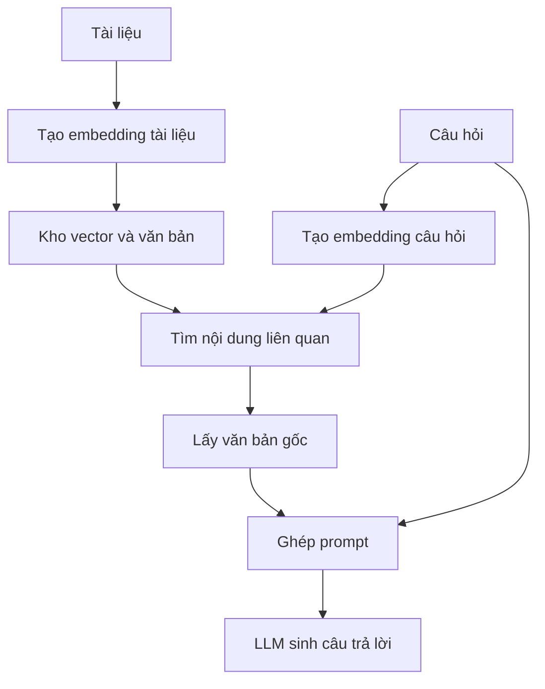

# RAG Day 1 — Hiểu mục đích và cách hoạt động của RAG

> Giảng lại bằng tiếng Việt từ phụ đề tiếng Anh của 6 video 001–006, có đối chiếu bản dịch ở phần cần làm rõ. Đây là bài học được tổ chức lại theo mạch kiến thức, không phải bản chép lời. Các ví dụ bổ sung và lưu ý kỹ thuật được đánh dấu riêng; mã minh họa được viết lại, không phải mã nguồn trích từ màn hình video.

## 1. Cả phần này thực sự muốn dạy bạn điều gì?

**Mục tiêu là xây dựng một trợ lý có thể tìm thông tin trong tài liệu riêng rồi dùng thông tin đó để trả lời câu hỏi.** Ví dụ: hỏi về nhân viên, sản phẩm hoặc chính sách của một công ty mà mô hình chưa từng được học.

Hãy tưởng tượng bạn tuyển một người giỏi đọc hiểu nhưng chưa biết công ty của bạn. Bạn không thể chỉ nói “hãy trở thành chuyên gia công ty” rồi mong họ biết mọi thứ. Bạn cần cho họ tra đúng hồ sơ trước khi trả lời. RAG làm điều tương tự với LLM.

**RAG — Retrieval Augmented Generation (Sinh câu trả lời có bổ sung thông tin truy xuất)** gồm ba việc:

1. **Retrieval — Truy xuất:** tìm tài liệu liên quan đến câu hỏi.
2. **Augmented — Bổ sung:** đưa tài liệu tìm được vào ngữ cảnh gửi cho mô hình.
3. **Generation — Sinh nội dung:** mô hình dựa vào câu hỏi và ngữ cảnh để viết câu trả lời.

Phần này dạy cách xây ứng dụng quanh một mô hình có sẵn. Bạn chưa huấn luyện một ChatGPT mới, cũng chưa thay đổi trọng số của mô hình.

### Vì sao giảng viên chia thành “ý tưởng nhỏ” và “ý tưởng lớn”?

| Cách gọi trong video | Hiểu đơn giản | Vấn đề được giải quyết |
| --- | --- | --- |
| Small idea — Ý tưởng nhỏ | Tra dữ liệu rồi đưa vào prompt | Mô hình thiếu thông tin riêng của doanh nghiệp |
| Big idea — Ý tưởng lớn | Dùng vector để tìm dữ liệu theo ý nghĩa | Người hỏi diễn đạt khác từ ngữ trong tài liệu |

**Vector cải tiến bước tìm kiếm. Phần “đọc tài liệu rồi trả lời” vẫn giữ cùng nguyên lý.**

## 2. Mỗi video đóng góp gì vào bài học?

| Video | Nội dung chính | Điều bạn cần hiểu sau khi học |
| --- | --- | --- |
| 001 — Introduction to RAG Retrieval Augmented Generation Fundamentals | Giải thích nhu cầu cung cấp kiến thức riêng; ví dụ tra thông tin chuyến bay; giới thiệu công ty bảo hiểm giả lập | RAG bắt đầu từ việc cung cấp thêm dữ liệu liên quan vào prompt |
| 002 — Building a Simple RAG Knowledge Assistant with GPT-4-1 Nano | Đọc tài liệu Markdown vào Python dictionary; tìm hồ sơ bằng từ khóa | Chương trình của bạn có trách nhiệm lấy dữ liệu trước khi gọi mô hình |
| 003 — Building a Simple RAG System Dictionary Lookup and Context Retrieval | Ghép context, gọi mô hình, tạo giao diện Gradio; thử các câu hỏi thành công và thất bại | Phân biệt lỗi truy xuất, câu trả lời cuối và ảnh hưởng của lịch sử chat |
| 004 — Vector Embeddings and Encoder LLMs The Foundation of RAG | Phân biệt mô hình sinh văn bản với mô hình embedding; giải thích token và vector | Biết hai vai trò mô hình trong một hệ thống RAG dùng vector |
| 005 — How Vector Embeddings Represent Meaning From word2vec to Encoders | Giải thích sự gần nhau về ngữ nghĩa và ví dụ phép toán với vector | Biết tại sao số có thể hỗ trợ tìm nội dung liên quan |
| 006 — Understanding the Big Idea Behind RAG and Vector Data Stores | Ghép embedding, kho vector, truy xuất văn bản và mô hình trả lời | Hình dung được toàn bộ luồng RAG dùng vector |

Ngày 1 chủ yếu xây trực giác và làm bản tra cứu đơn giản. LangChain và Chroma chỉ được giới thiệu là nội dung tiếp theo; 6 video này chưa triển khai đầy đủ pipeline vector.

## 3. Bài toán thực tế: trợ lý hiểu tài liệu công ty

Trong video, giảng viên dùng một công ty công nghệ bảo hiểm giả lập, tên được phụ đề phiên âm không nhất quán; ở đây gọi thống nhất là **InsureLLM**.

Knowledge base — kho kiến thức — là tập tài liệu để tra cứu. Nó có thể là các file Markdown, tài liệu trên ổ đĩa chung hoặc dữ liệu trong database; không bắt buộc phải là một cơ sở dữ liệu chuyên dụng.

Kho của bài học có bốn nhóm: `company`, `contracts`, `employees`, `products`. Bản demo đọc nhóm nhân viên và sản phẩm vào dictionary. Avery Lancaster là nhân vật CEO trong dữ liệu giả lập.

Nếu người dùng hỏi “Avery Lancaster là ai?”, một mô hình thông thường không có cơ sở đáng tin cậy để biết hồ sơ nội bộ đó. Ứng dụng sẽ:

1. Tìm hồ sơ Avery Lancaster.
2. Lấy văn bản mô tả chức vụ và thông tin liên quan.
3. Gửi văn bản cùng câu hỏi cho mô hình.
4. Trả câu trả lời do mô hình tổng hợp.

Mô hình có thông tin để trả lời **trong lần gọi này**. Đưa tài liệu vào prompt không tự động làm mô hình ghi nhớ vĩnh viễn hoặc cập nhật trọng số.

Giảng viên dùng GPT-4.1 nano trong demo nhằm hướng đến phản hồi nhanh và chi phí thấp tại thời điểm ghi hình. Đây là lựa chọn minh họa của video, không phải yêu cầu bắt buộc hay bảng so sánh model hiện tại.

**Bài học phụ về dữ liệu giả lập:** giảng viên dùng LLM tạo hồ sơ nhân viên và nhận thấy các đánh giá đều quá tích cực. Ông phải sửa prompt để có nhiều mức hiệu suất khác nhau. Dữ liệu do AI tạo ra cũng cần được kiểm tra; một bộ dữ liệu quá đồng đều dễ làm bản demo có vẻ tốt hơn thực tế.

## 4. Bản RAG đơn giản: tìm bằng từ khóa

### Dictionary đang làm nhiệm vụ gì?

Python dictionary tương tự một object hoặc `Map` trong JavaScript: dùng khóa để lấy giá trị. Trong demo, khóa là họ của nhân viên hoặc tên sản phẩm; giá trị là nội dung tài liệu.

Ví dụ minh họa:

| Khóa | Văn bản lưu phía sau khóa |
| --- | --- |
| `lancaster` | Hồ sơ Avery Lancaster |
| `thompson` | Hồ sơ Maxine Thompson |
| Tên một sản phẩm | Tài liệu mô tả sản phẩm đó |

Hàm tìm kiếm làm bốn việc: bỏ dấu câu, chuyển chữ thường, tách thành các từ, rồi tra từng từ trong dictionary. Những tài liệu tìm thấy được ghép thành **context — ngữ cảnh bổ sung**.

Giảng viên cũng viết lại vòng lặp bằng **list comprehension — cú pháp tạo danh sách ngắn gọn**. Hai cách làm cùng một việc; cú pháp ngắn hơn không khiến thuật toán tìm kiếm thông minh hơn.

### Ví dụ Python viết lại để hiểu cơ chế

Đoạn dưới chạy độc lập bằng Python, không cần API. Nó chỉ mô phỏng bước truy xuất và tạo thông điệp gửi cho mô hình.

```python
knowledge = {
    "lancaster": "Avery Lancaster là đồng sáng lập và CEO của InsureLLM.",
    "thompson": "Maxine Thompson là Senior Data Engineer tại InsureLLM.",
}


def get_relevant_context(message):
    clean = "".join(
        ch for ch in message if ch.isalpha() or ch.isspace()
    )
    words = clean.lower().split()
    return [knowledge[word] for word in words if word in knowledge]


def build_messages(question):
    documents = get_relevant_context(question)
    context = "\n\n".join(documents) or "Không tìm thấy tài liệu liên quan."
    return [
        {
            "role": "system",
            "content": (
                "Trả lời ngắn gọn dựa trên tài liệu được cung cấp. "
                "Nếu thiếu thông tin, hãy nói rõ."
            ),
        },
        {
            "role": "user",
            "content": f"Tài liệu tham khảo:\n{context}\n\nCâu hỏi: {question}",
        },
    ]


print(get_relevant_context("Who is Lancaster?"))  # Tìm được hồ sơ
print(get_relevant_context("Who is Avery?"))      # []
print(build_messages("Who is Lancaster?"))
```

**Ranh giới quan trọng:** dictionary, vòng lặp và ghép chuỗi đều là code thông thường. LLM chỉ tham gia khi ứng dụng gửi các thông điệp đi để sinh câu trả lời.

Trong video, giảng viên ghép context vào phần system prompt, rồi gửi kèm lịch sử hội thoại và câu hỏi mới. Ví dụ viết lại ở trên tách chỉ dẫn cố định khỏi tài liệu tham khảo và bỏ lịch sử để bạn quan sát riêng việc truy xuất. Cả hai đều thể hiện nguyên lý bổ sung tài liệu vào đầu vào mô hình.

### Vì sao cách này dễ thất bại?

| Câu hỏi | Kết quả truy xuất | Nguyên nhân |
| --- | --- | --- |
| `Who is Lancaster?` | Tìm được Avery Lancaster | Có khóa `lancaster` |
| `Who is lancaster?` | Vẫn tìm được | Đã chuyển về chữ thường |
| `Who is Avery?` | Không tìm được | Không có khóa `avery` |
| `Who is Alex Lancaster?` | Vẫn lấy hồ sơ Avery | Chỉ khớp họ, không xác minh toàn bộ danh tính |
| `Who is the CEO?` | Không tìm được với dictionary này | Không có khóa `ceo` |

Hai vấn đề khác nhau xuất hiện: **bỏ sót tài liệu đúng** và **lấy nhầm tài liệu**. Thêm khóa tên riêng có thể vá một trường hợp, nhưng không xử lý hết cách diễn đạt, lỗi chính tả hay người trùng tên.

Giảng viên gọi đây là “fake RAG” để nhấn mạnh mức đơn giản. Hiểu chính xác hơn: nó vẫn có truy xuất, bổ sung context và sinh câu trả lời, nên vẫn thể hiện nguyên lý RAG. RAG không bắt buộc dùng vector.

## 5. Bẫy khi kiểm tra: trả lời đúng chưa chắc truy xuất đúng

Đây là một thí nghiệm quan trọng trong video 003:

1. Hỏi “Avery Lancaster là ai?” → truy xuất được hồ sơ và trả lời đúng.
2. Trong cùng cuộc chat, hỏi “Avery là ai?” → chatbot vẫn trả lời đúng.
3. Mở cuộc chat mới, hỏi lại “Avery là ai?” → không có thông tin.

Vì sao? Ở bước 2, thông tin về Avery đã nằm trong **conversation history — lịch sử hội thoại** gửi cùng yêu cầu. Hàm truy xuất vẫn không tìm thấy khóa `avery`, nhưng mô hình đọc được câu trả lời trước đó.

**Cách kiểm tra giảng viên muốn bạn tập:** in tài liệu truy xuất và prompt thực tế; thử trong phiên mới khi cần đánh giá riêng retrieval.

Gợi ý bổ sung: tách hai câu hỏi khi debug: “Đã lấy đúng nguồn chưa?” và “Mô hình đã sử dụng nguồn đúng chưa?”. Một câu trả lời trôi chảy không thay thế được việc kiểm tra nguồn.

## 6. Vector embedding: biến ý nghĩa thành dữ liệu có thể so sánh

### Vector là gì?

Trong bài này, **vector** là một danh sách số, ví dụ `[0.12, -0.37, 0.81]`. Ba số có thể được hình dung như ba tọa độ của một điểm. Vector hàng trăm hoặc hàng nghìn chiều cũng là một danh sách, chỉ dài hơn; không cần vẽ được không gian đó để sử dụng nó.

**Embedding — biểu diễn nhúng** là biểu diễn bằng số mà mô hình tạo ra cho đầu vào. Với tìm kiếm văn bản, mục tiêu là tạo ra các biểu diễn giúp so sánh mức liên quan về ngữ nghĩa.

Các con số không được lập trình viên tự gán theo kiểu “nói về bảo hiểm thì cho số 10”. Mô hình embedding đã được huấn luyện để tạo biểu diễn có ích. Khi dùng nó trong bài này, bạn gọi mô hình có sẵn để biến văn bản thành vector.

### “Số biểu diễn ý nghĩa” nghĩa là gì?

Ví dụ trong video:

- “Giá vé từ New York đến London là bao nhiêu?”
- “Bay từ JFK đến Heathrow mất bao nhiêu tiền?”

Hai câu dùng từ khác nhau nhưng có ý định liên quan. Một mô hình embedding phù hợp có thể đặt chúng gần nhau theo thước đo tương đồng. Nhờ vậy, hệ thống tìm kiếm không chỉ dựa vào chữ giống hệt.

Bổ sung để tránh hiểu quá mức: hai câu trên không hoàn toàn đồng nhất — câu sau chỉ rõ sân bay. Tìm được tài liệu liên quan chưa chứng minh mọi chi tiết trong đó trả lời đúng yêu cầu. Với dữ liệu giá vé thực, vẫn phải kiểm tra tuyến, ngày và điều kiện áp dụng.

Trong tìm kiếm hỏi–đáp, câu hỏi và đoạn trả lời cũng không cần “cùng nghĩa” tuyệt đối. Ta muốn tìm **đoạn có khả năng trả lời câu hỏi**. Đây là dạng tìm kiếm bất đối xứng được giải thích trong [tài liệu Semantic Search của Sentence Transformers](https://sbert.net/examples/sentence_transformer/applications/semantic-search/README.html).

### Token khác vector như thế nào?

| Khái niệm | Bản chất | Vai trò |
| --- | --- | --- |
| Token | Một đơn vị văn bản do tokenizer phân chia, có thể là từ, mảnh từ hoặc dấu câu | Chia văn bản thành các đơn vị mô hình xử lý |
| Token ID | Số nguyên định danh token trong bộ từ vựng | Mã hóa token thành chỉ số đầu vào |
| Vector embedding | Danh sách số biểu diễn đầu vào trong một không gian học được | Hỗ trợ so sánh, tìm kiếm và các tác vụ khác |

Hai token ID gần nhau về số học không có nghĩa chúng gần nhau về ý nghĩa. Ngược lại, so sánh vector embedding bằng thước đo phù hợp là một cách ước lượng quan hệ ngữ nghĩa.

Câu “token là đầu vào, vector là đầu ra” trong video giúp nhập môn. Đừng hiểu đó là định nghĩa tuyệt đối: mô hình sinh văn bản cũng dùng vector ở bên trong, và đầu ra văn bản của nó được tạo từ token.

### Cosine similarity — độ tương đồng cosine

Video nhắc đến cosine similarity như một cách xác định các vector có “gần nhau” không. Bạn chỉ cần hiểu: nó so sánh **hướng của hai vector**, không đơn giản là nhìn xem từng số có gần bằng nhau hay không.

Điểm tương đồng hỗ trợ xếp hạng tài liệu; nó không phải xác suất câu trả lời đúng. Không cần học công thức để nắm luồng RAG ngày 1.

## 7. word2vec và ví dụ “king − man + woman” muốn minh họa gì?

Video 005 giới thiệu **word2vec**, một phương pháp biểu diễn từ bằng vector có trước làn sóng Transformer. Ví dụ nổi tiếng là:

`vector(king) − vector(man) + vector(woman) ≈ vector(queen)`

Giảng viên còn dùng ví dụ Paris, France, England và London để mô tả quan hệ thành phố–quốc gia.

**Mục đích của ví dụ:** cho thấy không gian vector có thể phản ánh một số quan hệ giữa các khái niệm, chứ không phải tập số ngẫu nhiên không liên quan đến ngôn ngữ.

**Lưu ý bổ sung:** đây là trực giác minh họa, không phải quy luật luôn đúng với mọi từ hoặc mọi mô hình. Không nên từ đó suy ra rằng cộng trừ embedding của bất kỳ đoạn văn nào cũng sẽ chỉnh sửa ý nghĩa chính xác. Bạn không cần làm phép toán kiểu này để xây RAG cơ bản; việc chính là so sánh vector nhằm lấy tài liệu liên quan.

## 8. Hai vai trò mô hình: một bên tìm, một bên viết

| Thành phần | Nhận gì? | Trả gì? | Làm nhiệm vụ gì? |
| --- | --- | --- | --- |
| Embedding model — mô hình tạo biểu diễn nhúng | Văn bản câu hỏi hoặc tài liệu | Vector | Giúp tìm kiếm theo ngữ nghĩa |
| Generative LLM — mô hình sinh ngôn ngữ | Câu hỏi, tài liệu đã lấy, chỉ dẫn và có thể có lịch sử | Câu trả lời | Đọc và tổng hợp nội dung |

Video nói đến **autoregressive — tự hồi quy**: mô hình sinh token tiếp theo dựa trên ngữ cảnh và các token đã sinh. Quá trình lặp lại tạo thành câu trả lời.

Ở phía embedding, video nhắc BERT, các model OpenAI `text-embedding-3-small` / `text-embedding-3-large`, và `all-MiniLM-L6-v2`. Đây là tên được chuẩn hóa từ phụ đề, không phải danh sách khuyến nghị model hiện tại.

**Lưu ý thuật ngữ:** video gom “encoder”, “autoencoder” và “embedding model” để giải thích nhanh. Chúng không phải ba tên luôn thay thế cho nhau: encoder mô tả một vai trò/kiến trúc mã hóa, còn embedding model nhấn mạnh đầu ra dùng làm biểu diễn. BERT là ví dụ về biểu diễn ngôn ngữ bằng Transformer hai chiều; không nên hiểu mọi encoder đều tự động là một model tìm kiếm câu tối ưu. Tên đầy đủ là **Bidirectional Encoder Representations from Transformers**. Xem [bài báo BERT](https://aclanthology.org/N19-1423/).

Điều cần nhớ nhất là **hai vai trò có thể dùng các model khác nhau**. Model tạo vector không cần cùng hãng với model viết câu trả lời.

## 9. Ghép lại thành RAG dùng vector

### Giai đoạn A — Chuẩn bị tài liệu

Thực hiện trước khi phục vụ câu hỏi, rồi cập nhật khi dữ liệu thay đổi:

1. Đọc văn bản trong kho kiến thức.
2. Tạo embedding cho các đơn vị văn bản cần tìm kiếm.
3. Lưu vector cùng văn bản tương ứng hoặc tham chiếu để lấy lại văn bản.

**Bổ sung để hình dung bước triển khai tiếp theo:** tài liệu dài thường được chia thành **chunk — đoạn nhỏ** trước khi tạo embedding. Chunking giúp lấy phần liên quan thay vì luôn gửi cả file. Đây chưa phải nội dung được triển khai đầy đủ trong 6 video ngày 1.

### Giai đoạn B — Khi người dùng hỏi

1. Tạo embedding của câu hỏi.
2. So sánh với các vector đã lưu để tìm nội dung liên quan.
3. Lấy lại **văn bản** của các kết quả được chọn.
4. Ghép văn bản với câu hỏi và chỉ dẫn.
5. Gọi LLM để viết câu trả lời.



Nếu trình đọc Markdown không hiển thị sơ đồ: nhánh tài liệu xây kho tra cứu trước; nhánh câu hỏi dùng kho đó lấy văn bản, rồi mới gọi LLM.

**Quy tắc quan trọng:** trong cách làm của video, dùng cùng model embedding và cấu hình nhất quán cho tài liệu và câu hỏi. Tổng quát hơn, hai phía phải tạo vector trong cùng không gian tương thích; chỉ có cùng số chiều là chưa đủ. [Tài liệu Semantic Search](https://sbert.net/examples/sentence_transformer/applications/semantic-search/README.html) cũng mô tả việc nhúng câu hỏi vào cùng không gian với kho văn bản.

### Vector data store thực sự lưu gì?

Có thể hình dung một bản ghi như sau; các giá trị dưới đây chỉ là minh họa:

| Trường | Ví dụ | Mục đích |
| --- | --- | --- |
| `id` | `employee-001` | Định danh bản ghi |
| `text` | `Avery Lancaster là ...` | Nội dung để đưa vào prompt |
| `embedding` | `[0.12, -0.37, ...]` | Dùng tìm kiếm |
| `metadata` | Tên file, loại tài liệu | Truy nguồn và lọc dữ liệu |

Vector giúp tìm vị trí của tài liệu. **Trong luồng RAG văn bản này, thứ gửi cho LLM trả lời là văn bản lấy được, không phải dãy số embedding.** Không có bước “giải mã vector” để khôi phục hồ sơ; hệ thống lấy văn bản đã lưu hoặc được tham chiếu.

## 10. Những điều nên hiểu đúng trước khi học tiếp

Phần này bổ sung để tránh biến các cách nói đơn giản trong video thành kết luận tuyệt đối.

| Dễ hiểu nhầm | Cách hiểu đúng |
| --- | --- |
| RAG luôn cần vector database | Có thể truy xuất bằng từ khóa, SQL hoặc cách khác; vector là một lựa chọn |
| Có RAG là AI không bịa nữa | Lấy sai nguồn hoặc diễn giải sai vẫn tạo câu trả lời sai |
| Vector search tự sửa mọi lỗi tên riêng | Nó có thể hỗ trợ, nhưng không bảo đảm phân biệt đúng người, mã hàng hoặc lỗi chính tả |
| Càng nhét nhiều tài liệu càng tốt | Context dài, nhiễu hoặc mâu thuẫn có thể gây khó cho việc trả lời |
| Lưu tài liệu vào vector store là fine-tuning | Việc này xây kho tìm kiếm; fine-tuning cập nhật tham số mô hình |
| Kết quả gần nhất chắc chắn là phù hợp | Kết quả cao nhất vẫn có thể không chứa câu trả lời |

Ở cuối video, giảng viên gọi RAG là một tập hợp “hack”. Ý chính là **phải thử nghiệm cách chọn context và kiểm tra chất lượng thực tế**, chứ không phải cứ nối đúng các thành phần là có hệ thống tốt.

Khi nâng cấp demo, bạn sẽ cần quan tâm đến cách chia tài liệu, chọn số kết quả, lọc nguồn và đánh giá câu trả lời. Với dữ liệu nội bộ, quyền đọc tài liệu cũng cần được áp dụng trước khi đưa tài liệu vào context. Đây là bước phát triển tiếp theo, không cần ôm hết để hiểu ngày 1.

## 11. Ví dụ bổ sung gần với công việc web

Giả sử bạn làm trợ lý trả lời câu hỏi về một dự án web. Tài liệu ghi:

> “Liên kết đặt lại mật khẩu có hiệu lực trong 15 phút.”

Người dùng hỏi: “Link lấy lại mật khẩu dùng được bao lâu?”

Tìm kiếm ngữ nghĩa có thể giúp lấy đoạn trên dù câu hỏi dùng cách diễn đạt khác. LLM đọc đoạn đó và trả lời “15 phút”. Con số đến từ tài liệu; model không cần được huấn luyện lại để học riêng chính sách này.

Với nền tảng React/Node.js, hãy hình dung: giao diện chat gửi câu hỏi cho backend; backend tìm tài liệu, dựng prompt rồi gọi model. Python trong video là công cụ triển khai, không phải điều kiện định nghĩa RAG.

## 12. Tự kiểm tra xem bạn đã hiểu chưa

1. **Vì sao model biết hồ sơ nội bộ?** Vì ứng dụng tìm và gửi hồ sơ trong context.
2. **Ai thực hiện truy xuất trong demo?** Code của ứng dụng, không phải model trả lời tự mở thư mục.
3. **Embedding model có viết câu trả lời không?** Vai trò của nó ở đây là tạo vector để tìm kiếm.
4. **LLM nhận vector hay tài liệu?** Nhận văn bản tài liệu đã lấy được trong luồng đang học.
5. **Vì sao phải thử lại với cuộc chat mới?** Để lịch sử cũ không che lấp lỗi truy xuất.
6. **Nếu nguồn không chứa đáp án thì sao?** Hệ thống cần thừa nhận thiếu thông tin thay vì suy đoán thành sự thật.

Nếu giải thích được sáu câu này, bạn đã nắm mục tiêu ngày 1: **RAG là tìm đúng thông tin để đưa vào ngữ cảnh; embedding là công cụ giúp bước tìm kiếm linh hoạt hơn.**

## Nguồn và phạm vi

Nguồn chính là sáu file `.srt` tiếng Anh 001–006 có tên đầy đủ ở bảng mục 2, tổng thời lượng theo phụ đề khoảng 54 phút. Bài này dựa trên lời giảng, không khẳng định đã kiểm tra toàn bộ mã hiển thị trong `.mp4` hoặc chạy notebook gốc. Các phụ đề có lỗi phiên âm như “rag”, “Gradio” và tên model; tài liệu giữ nguyên thuật ngữ kỹ thuật đúng thay vì dịch các lỗi đó theo nghĩa đen.

Các liên kết chính thức trong bài chỉ dùng để làm rõ phần kiến thức bổ sung. Ví dụ web, bảng diễn giải và mã Python là nội dung viết lại phục vụ học tập; không phải kết quả benchmark hay dữ liệu doanh nghiệp thật.
