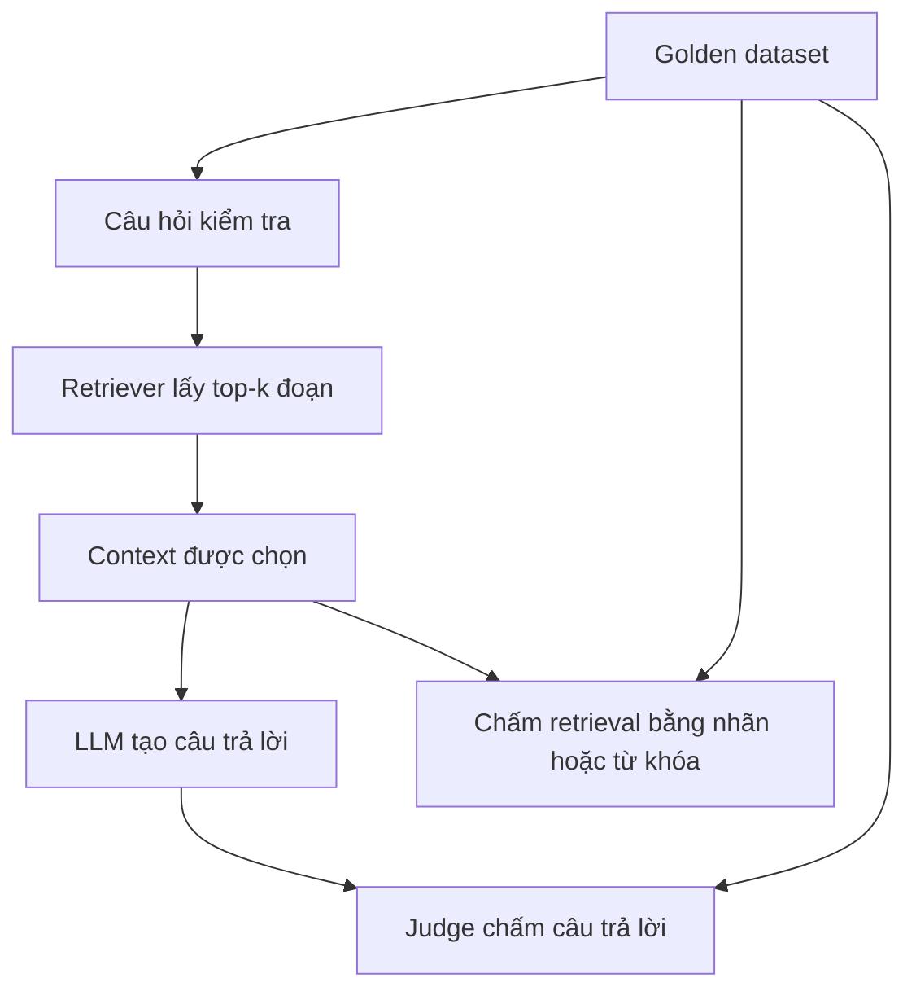

# Day 4 — RAG Evaluations: Đánh giá và cải thiện hệ thống RAG

> Bản giảng giải đầy đủ cho 7 video 017–023. Nội dung được tổng hợp từ toàn bộ phụ đề tiếng Anh, có đối chiếu khung hình kết quả trong video 023. Đây là bài giảng viết lại theo mạch học, không phải bản dịch từng câu hay bản chép mã nguồn. Những mục ghi **Bổ sung** là giải thích và hướng dẫn thêm.

## 1. Cả phần này thực sự muốn dạy bạn điều gì?

**Bạn đã làm được chatbot tìm tài liệu rồi trả lời. Bây giờ cần biết nó làm tốt đến đâu, sai ở đâu và mỗi lần sửa có thực sự tốt hơn không.**

Giả sử chatbot trả lời đúng một câu bạn vừa thử. Điều đó chỉ chứng minh nó xử lý được câu ấy trong lần chạy ấy. Nó có thể vẫn sai nhiều câu khác. Tương tự, đổi sang embedding model lớn hơn rồi thấy một câu trả lời hay hơn chưa đủ để kết luận cả hệ thống đã tiến bộ.

Giảng viên muốn bạn chuyển từ cách làm “thử rồi thấy có vẻ ổn” sang một quy trình có bằng chứng:

1. Chuẩn bị bộ câu hỏi và đáp án chuẩn.
2. Đo chất lượng cấu hình hiện tại, gọi là **baseline — mốc ban đầu**.
3. Thay đổi cấu hình có chủ đích.
4. Chạy lại cùng bộ đánh giá.
5. So sánh, xem câu nào tiến bộ hoặc bị lỗi mới, rồi quyết định giữ thay đổi nào.

Bạn đang cải thiện **ứng dụng dùng LLM**, không huấn luyện lại trọng số của LLM. Trong phần này, những thay đổi chính nằm ở cách chia tài liệu, số đoạn được lấy và mô hình tạo embedding.

### Bản đồ 7 video

| Video | Nội dung bề mặt | Điều thực sự cần hiểu |
| --- | --- | --- |
| 017 | Ưu, nhược điểm RAG; lý do cần evals | Một cấu hình hợp lý về trực giác vẫn có thể trả lời sai; phải đo |
| 018 | Golden data, retrieval metrics, LLM as a Judge | Chuẩn bị đề và đáp án, rồi chấm riêng khâu tìm kiếm và khâu trả lời |
| 019 | JSONL, Pydantic, MRR, nDCG | Biến bộ kiểm tra và cách chấm thành dữ liệu, hàm có thể chạy tự động |
| 020 | Chấm câu trả lời bằng LLM và Structured Outputs | Cho AI so đáp án theo tiêu chí, trả kết quả có cấu trúc để chương trình xử lý |
| 021 | Chạy đánh giá bằng Gradio | Lấy baseline và xác định nhóm câu hỏi yếu |
| 022 | Thử chunk size, top-k, Markdown splitter | Dùng thực nghiệm để chọn cách đưa tài liệu vào context |
| 023 | Thử OpenAI embeddings và chấm lại câu trả lời | Kiểm tra cải thiện retrieval có đi kèm cải thiện đầu ra hay không |

## 2. Hình dung RAG bằng một kỳ thi mở tài liệu

Hãy tưởng tượng có hai người phối hợp:

- **Người tìm tài liệu — retriever:** chọn vài trang trong một kho hồ sơ.
- **Người viết đáp án — LLM:** đọc những trang được chọn rồi trả lời.

Nếu chọn sai trang, người viết có thể không đủ dữ kiện. Nếu chọn đúng trang mà người viết hiểu sai, đáp án vẫn sai. Bởi vậy, bạn cần hai bảng điểm.



**Top-k** là số đoạn kết quả đầu tiên bạn lấy. **Context** là thông tin được đưa vào đầu vào của LLM để hỗ trợ trả lời. **Chunk** là một đoạn được tách từ tài liệu.

Ví dụ xuyên suốt video: câu hỏi ai nhận giải thưởng năm 2023 có đáp án là **Maxine Thompson**. Hệ thống lấy được đoạn nói Maxine nhận giải, nhưng thiếu phần chứa họ Thompson. Nó có thể trả lời đúng người theo tên gọi, song câu trả lời chưa đầy đủ theo đáp án chuẩn.

Lỗi này cho thấy “kho tài liệu có đáp án” và “LLM đã được cung cấp đủ đáp án” là hai việc khác nhau.

### Tại sao chunk lớn hay nhỏ đều có thể gây lỗi?

| Lựa chọn | Lợi ích có thể có | Vấn đề có thể gặp |
| --- | --- | --- |
| Chunk nhỏ | Tập trung một ý, dễ khớp với câu hỏi cụ thể | Mất tên người, tiêu đề, điều kiện hoặc thông tin ở đoạn trước |
| Chunk lớn | Giữ nhiều ngữ cảnh liên quan trong cùng đoạn | Nhiều chủ đề trộn vào nhau, phần cần tìm bị loãng |
| Tăng overlap — phần chồng lặp | Giảm nguy cơ đứt thông tin ở ranh giới đoạn | Tăng trùng lặp, số vector và công xử lý |
| Tăng k | Có cơ hội lấy đủ bằng chứng từ nhiều đoạn | Context dài hơn, nhiều thông tin thừa hơn |

Giảng viên gọi RAG là một “hack” để nhấn mạnh tính gần đúng của việc chọn thông tin. Nên hiểu đây là cách nói tu từ về sự đánh đổi, không phải kết luận RAG là kỹ thuật sai hay chỉ dùng được cho demo.

## 3. Golden dataset — Bộ đề và đáp án chuẩn

**Golden dataset là tập ví dụ bạn đã kiểm tra, dùng làm chuẩn đánh giá.** Chất lượng của nó quyết định điểm số có đáng tin hay không.

Trong video 019, bộ dữ liệu có **150 câu hỏi**, mỗi câu có bốn trường:

| Trường | Vai trò |
| --- | --- |
| `question` | Câu hỏi gửi vào hệ thống |
| `keywords` | Những từ hoặc cụm từ mong đợi xuất hiện trong các đoạn được lấy |
| `reference_answer` | Đáp án chuẩn để đánh giá câu trả lời |
| `category` | Nhóm câu hỏi, giúp biết hệ thống yếu ở đâu |

Ví dụ minh họa cùng ý với bài học, không chép nguyên bản ghi của khóa học:

```json
{
  "question": "Ai nhận giải Innovator of the Year năm 2023?",
  "keywords": ["Maxine", "Thompson", "2023"],
  "reference_answer": "Maxine Thompson nhận giải Innovator of the Year năm 2023.",
  "category": "direct_fact"
}
```

### Tại sao có nhiều loại câu hỏi?

| Nhóm trong video | Nghĩa | Ví dụ minh họa bổ sung |
| --- | --- | --- |
| `direct_fact` | Tra một sự kiện trực tiếp | Ai nhận giải năm 2023? |
| `temporal` | Thời gian, trình tự | Nhân viên A làm ở bộ phận này từ khi nào? |
| `comparative` | So sánh | A hay B có thâm niên lâu hơn? |
| `numerical` | Số liệu, tính toán | Mức lương ghi trong hồ sơ A là bao nhiêu? |
| `relationship` | Quan hệ giữa các đối tượng | A báo cáo công việc cho ai? |
| `spanning` | Cần tổng hợp nhiều tài liệu | Có bao nhiêu nhân viên đáp ứng điều kiện X? |
| `holistic` | Cần hiểu toàn cảnh | Công ty có những thế mạnh chung nào? |

`spanning` và `holistic` khó vì top-k có thể chỉ chứa một phần bằng chứng. Tìm được vài người đáp ứng điều kiện không đủ để đếm tất cả nhân viên trong công ty.

Trong demo, một số câu `numerical` làm tốt; điều đó không có nghĩa mọi bài toán số học hoặc tổng hợp số liệu đều dễ với RAG.

### Tạo bộ đề từ đâu?

Video ưu tiên câu hỏi thực của người dùng và đáp án từ người có chuyên môn. Giảng viên cũng dùng Claude để hỗ trợ tạo dữ liệu tổng hợp.

**Bổ sung:** AI có thể viết bản nháp câu hỏi nhanh, nhưng bạn cần đối chiếu đáp án với tài liệu. Nếu đáp án chuẩn sai, hệ thống trả lời đúng vẫn có thể bị trừ điểm. Thêm trường nguồn và đoạn bằng chứng sẽ giúp kiểm tra dễ hơn.

Nên bổ sung các câu hệ thống từng trả lời sai. Đồng thời giữ một tập câu hỏi chưa dùng để chọn cấu hình, nhằm kiểm tra khả năng xử lý câu mới. Đừng chỉ điều chỉnh đến khi thuộc một bộ đề cố định.

### JSONL và Pydantic có tác dụng gì?

**JSONL — JSON Lines:** mỗi dòng là một đối tượng JSON hoàn chỉnh. Toàn bộ file không cần dấu `[` và `]` bao ngoài; cũng không có dấu phẩy ngăn cách các dòng.

```jsonl
{"question":"Ai nhận giải?","keywords":["Maxine"],"reference_answer":"Maxine Thompson.","category":"direct_fact"}
{"question":"Giải được trao năm nào?","keywords":["2023"],"reference_answer":"Năm 2023.","category":"temporal"}
```

Nó tiện để thêm bản ghi hoặc đọc từng dòng. Đây là lựa chọn lưu trữ của bài học, không phải định dạng bắt buộc cho mọi hệ thống eval.

**Pydantic:** trong demo, dùng lớp `TestQuestion` để mô tả cấu trúc bản ghi, rồi `load_tests()` nạp dữ liệu thành các đối tượng có trường như `test.question`.

Với nền tảng frontend, bạn có thể hình dung vai trò này gần với khai báo schema và kiểm tra dữ liệu đầu vào bằng Zod. TypeScript `interface` riêng lẻ không kiểm tra dữ liệu JSON lúc chương trình chạy. Pydantic giúp kiểm tra cấu trúc và kiểu; nó không chứng minh đáp án trong dữ liệu là đúng sự thật.

## 4. Chấm retrieval — Hệ thống tìm được gì?

Trước khi tính điểm, phải xác định thế nào là một kết quả **relevant — có liên quan**. Bài học dùng từ khóa như một cách kiểm tra tự động, rẻ và dễ hiểu. Một hệ thống khác có thể dùng nhãn đoạn tài liệu do con người xác nhận.

### 4.1. Keyword Coverage — Độ bao phủ từ khóa

Với một câu hỏi:

`Coverage = số từ khóa mong đợi đã tìm thấy / tổng số từ khóa mong đợi`

Nếu mong đợi ba từ khóa `Maxine`, `Thompson`, `IOTY`, nhưng các đoạn được lấy chỉ có `Maxine` và `IOTY`, coverage là `2/3 ≈ 66,7%`.

Các từ khóa có thể nằm ở những chunk khác nhau. Một từ xuất hiện nhiều lần không có nghĩa bạn đã tìm thêm nhiều từ khóa khác nhau.

**Nó trả lời:** trong những dấu hiệu cần thiết đã định nghĩa, hệ thống tìm được bao nhiêu?

**Nó không chứng minh:** các đoạn đã thể hiện đúng quan hệ giữa những từ đó. Chẳng hạn, tên Maxine và tên Thompson xuất hiện trong hai hồ sơ khác nhau vẫn có thể làm phép kiểm tra từ khóa đạt điểm cao.

### 4.2. MRR — Mean Reciprocal Rank: Trung bình nghịch đảo thứ hạng

Trước hết hiểu **RR — Reciprocal Rank** cho một câu hỏi:

| Vị trí kết quả liên quan đầu tiên | RR |
| --- | --- |
| 1 | 1 |
| 2 | 1/2 = 0,5 |
| 3 | 1/3 ≈ 0,333 |
| 4 | 1/4 = 0,25 |
| Không có trong phạm vi đã lấy | 0 |

MRR theo định nghĩa thông dụng là trung bình RR trên các câu hỏi. Ví dụ ba câu có kết quả đúng đầu tiên ở vị trí 1, 2 và không tìm thấy:

`MRR = (1 + 0,5 + 0) / 3 = 0,5`

**Điểm càng cao, kết quả hữu ích đầu tiên càng thường nằm gần đầu danh sách.**

**Điểm cần phân biệt trong khóa học:** ở video 019, giảng viên mô tả cách lấy trung bình nghịch đảo thứ hạng tìm thấy **từng từ khóa** trong một test. Vì thế, chỉ số mang tên MRR trên dashboard là một cách chấm theo từ khóa, rồi tổng hợp các test; không nên mặc định nó giống hệt MRR dùng nhãn tài liệu liên quan trong hệ thống khác.

Ví dụ bổ sung: ba từ khóa lần đầu xuất hiện ở hạng 1, hạng 3 và không có. Điểm trung bình theo từ khóa sẽ là `(1 + 1/3 + 0)/3 ≈ 0,444`. Trong khi nếu chunk hạng 1 đã được gán nhãn liên quan, RR thông dụng của câu hỏi đó là 1.

**MRR 0,79 không có nghĩa 79% câu trả lời đúng.** Đây là điểm về thứ hạng truy xuất theo quy tắc đang dùng.

### 4.3. nDCG — Normalized Discounted Cumulative Gain

Hiểu nôm na: **chấm cả danh sách, thưởng cho việc xếp nội dung hữu ích lên đầu, rồi so với thứ tự lý tưởng**.

Ví dụ tự tạo với nhãn 1 là liên quan, 0 là không liên quan:

| Danh sách | Nhãn ở các hạng 1, 2, 3 | RR | nDCG@3, khi biết có hai đoạn liên quan |
| --- | --- | --- | --- |
| A | 1, 1, 0 | 1 | 1 |
| B | 1, 0, 1 | 1 | Khoảng 0,920 |

Cả hai có kết quả hữu ích đầu tiên ở hạng 1, nên RR như nhau. nDCG phân biệt được vì A đưa đoạn hữu ích thứ hai lên sớm hơn.

Công thức minh họa cho nhãn nhị phân, hạng bắt đầu từ 1:

`DCG@k = tổng rel_i / log2(i + 1)`

`nDCG@k = DCG@k / IDCG@k`

`IDCG` là DCG của thứ tự lý tưởng theo bộ nhãn chuẩn. Khi không có mục liên quan, cần quy ước xử lý trường hợp mẫu số bằng 0. Khái niệm giảm trọng số theo hạng và chuẩn hóa được mô tả trong [tài liệu nDCG của scikit-learn](https://scikit-learn.org/stable/modules/generated/sklearn.metrics.ndcg_score.html).

**Bổ sung:** cách gán mức liên quan và cách xây thứ tự lý tưởng ảnh hưởng điểm. Nếu chỉ lấy những mục đã truy xuất để lập thứ tự lý tưởng, điểm có thể không phản ánh đầy đủ các mục bị bỏ sót. Vì vậy, phải đọc cùng coverage/recall và biết rõ cách triển khai trước khi so với dashboard khác.

### 4.4. Recall, Precision và Hit Rate — Chỗ dễ hiểu nhầm

Định nghĩa cơ bản: precision là tỷ lệ kết quả lấy về có liên quan; recall là tỷ lệ nội dung liên quan đã được lấy về trong tổng nội dung liên quan. Xem [giáo trình Information Retrieval của Stanford](https://nlp.stanford.edu/IR-book/html/htmledition/evaluation-of-unranked-retrieval-sets-1.html).

Ví dụ bổ sung: với một câu hỏi, kho có 4 đoạn liên quan; lấy top-5 và tìm được 2 đoạn liên quan:

| Chỉ số | Cách tính | Giá trị |
| --- | --- | --- |
| Precision@5 | 2 đoạn đúng / 5 đoạn đã lấy | 40% |
| Recall@5 | 2 đoạn đúng / 4 đoạn đúng trong kho | 50% |
| Hit@5 của câu hỏi | Có ít nhất một đoạn đúng hay không? | 1, tức có |

**Video 018 mô tả Recall@k là tỷ lệ test có ít nhất một hit trong top-k. Cách nói đó tương ứng Hit Rate@k trong trường hợp tổng quát.** Khi mỗi câu chỉ có đúng một mục liên quan, hai cách đo mới trùng nhau. Đừng nhầm với keyword coverage, vốn đo theo danh sách từ khóa.

Khi mới học, chỉ cần nhớ: **Coverage/Recall quan tâm có tìm đủ; MRR/nDCG quan tâm thứ hạng; Precision quan tâm có lấy nhiều thứ không cần thiết hay không.**

## 5. Chấm answer — Tìm được rồi, trả lời có tốt không?

### 5.1. LLM as a Judge — Dùng LLM làm người chấm

Video 020 thực hiện hai bước sinh nội dung khác nhau:

1. Gọi `answer_question()` để hệ thống RAG tạo câu trả lời.
2. Đưa câu hỏi, câu trả lời vừa tạo và đáp án chuẩn cho LLM chấm.

Người chấm và người trả lời là hai **vai trò**. Chúng có thể dùng cùng hoặc khác loại model. Trong demo, judge là GPT-4.1 nano; đó là lựa chọn của bài học, không phải yêu cầu bắt buộc.

Ba tiêu chí, mỗi tiêu chí chấm từ 1 đến 5:

| Tiêu chí | Câu hỏi của người chấm | Lỗi ví dụ |
| --- | --- | --- |
| Accuracy — Độ chính xác | Các thông tin đã nêu có đúng không? | Nói nhầm người nhận giải |
| Completeness — Độ đầy đủ | Có đủ phần thông tin cần trả lời không? | Chỉ nói Maxine, thiếu họ Thompson |
| Relevance — Độ liên quan | Có tập trung trả lời điều được hỏi không? | Kể thêm nhiều chi tiết hồ sơ không cần thiết |

Ví dụ thực tế trong video 020: câu trả lời thiếu họ Thompson được judge chấm **Accuracy 5, Completeness 4, Relevance 5**. Điều này minh họa vì sao nên chấm nhiều chiều: một câu trả lời có thể đúng phần đã nói nhưng vẫn thiếu ý.

### 5.2. Structured Outputs — Đầu ra có cấu trúc

Nếu AI chỉ nói “đáp án khá tốt, hơi thiếu”, chương trình khó vẽ biểu đồ hay tính trung bình. Bài học yêu cầu kết quả theo schema `AnswerEval`, gồm `feedback`, `accuracy`, `completeness`, `relevance`.

Ví dụ minh họa:

```json
{
  "feedback": "Xác định đúng người theo tên, nhưng thiếu họ Thompson.",
  "accuracy": 5,
  "completeness": 4,
  "relevance": 5
}
```

Trong demo, LiteLLM được dùng để gọi model và truyền schema qua `response_format`; Pydantic mô tả cấu trúc đầu ra. Mục tiêu là giúp chương trình đọc được các trường nhất quán.

**Bổ sung:** đúng schema không đồng nghĩa đúng nội dung. Chấm sai nhưng trả JSON hợp lệ vẫn là chấm sai. Khi triển khai, phải kiểm tra model/API hỗ trợ cơ chế schema nào, ràng buộc khoảng điểm và xử lý lỗi, thay vì mặc định mọi model nhận cùng cấu hình.

### 5.3. Vì sao không xem judge như đáp án tuyệt đối?

Judge cũng là LLM nên điểm có thể dao động hoặc bị ảnh hưởng bởi cách viết đáp án chuẩn. Để phép đo hữu ích hơn, giữ ổn định model chấm, prompt và tiêu chí khi so sánh cấu hình; đọc feedback của những câu bị điểm thấp hoặc thay đổi bất thường.

**Bổ sung:** nên chấm tay một mẫu để xem judge có phù hợp cách đánh giá của bạn không. Có thể bổ sung tiêu chí **groundedness/faithfulness — mức bám sát bằng chứng** bằng cách cho judge xem context. So với đáp án chuẩn thôi chưa đủ xác nhận mọi khẳng định trong câu trả lời đều có tài liệu hỗ trợ.

Điểm Accuracy `4,21/5` là **trung bình điểm judge**, không phải tỷ lệ chính xác 84,2%.

## 6. Vai trò của các file và giao diện trong demo

| Thành phần được giới thiệu | Trách nhiệm |
| --- | --- |
| `evaluation/tests.jsonl` | Lưu câu hỏi, từ khóa, đáp án, nhóm |
| `evaluation/test.py` | Mô hình dữ liệu test và nạp bộ test |
| `evaluation/eval.py` | `evaluate_retrieval()` và `evaluate_answer()` |
| `implementation/ingest.py` | Đọc, chia, embedding và lưu tài liệu vào vector store |
| `implementation/answer.py` | Truy xuất context và sinh câu trả lời |
| `evaluator.py` | Gradio UI để chạy và hiển thị đánh giá |

Đây là sơ đồ trách nhiệm theo bài giảng; các tệp mã nguồn gốc không được đính kèm cùng bộ video này.

Nếu liên hệ frontend: Gradio giống phần màn hình dashboard, còn `eval.py` chứa logic tính điểm. Việc dashboard đẹp không làm bộ test đáng tin hơn. Giảng viên nhấn mạnh giá trị nằm ở bộ câu hỏi đại diện và cách đo gắn với nhu cầu thực tế.

Retrieval evaluation thường nhanh hơn vì chủ yếu lấy đoạn và tính điểm. Answer evaluation còn phải gọi LLM trả lời rồi gọi judge, nên mất thêm thời gian. Chi phí vài cent giảng viên nêu là ước lượng cho lần demo, không phải giá cố định cho mọi hệ thống.

## 7. Thực nghiệm trong video đã diễn ra như thế nào?

### 7.1. Đo baseline trước

Video 021 chạy 150 test trên cấu hình ban đầu: chunk khoảng **1.000 ký tự**, `k = 5`, embedding `all-MiniLM-L6-v2`.

Các con số ban đầu và cuối được tập hợp ở bảng bên dưới. Các ngưỡng màu đỏ/vàng/xanh của giao diện do giảng viên đặt để minh họa; không phải tiêu chuẩn chất lượng bắt buộc cho ngành.

### 7.2. Thử kích thước chunk cùng top-k

Video 022 cố giữ lượng context danh nghĩa xấp xỉ nhau:

| Phương án | Chunk size | k | Tích chunk size × k |
| --- | --- | --- | --- |
| Ban đầu | 1.000 ký tự | 5 | Khoảng 5.000 ký tự |
| Chunk nhỏ | 500 ký tự | 10 | Khoảng 5.000 ký tự |
| Chunk lớn | 1.667 ký tự | 3 | Khoảng 5.001 ký tự |

Ý tưởng: nếu giảm chunk xuống một nửa mà vẫn chỉ lấy 5 chunk, lượng thông tin đưa cho LLM cũng giảm. Giảng viên tăng k để so các phương án với ngân sách context gần nhau.

**Bổ sung:** đây là so sánh **cặp cấu hình chunk size và k**, không tách riêng tác động của chunk size. Số ký tự là ước lượng; token thực tế, overlap, chunk ngắn ở cuối tài liệu và metadata khiến lượng context không hoàn toàn bằng nhau. Khi k thay đổi, phạm vi tìm hit của phép đo cũng thay đổi. Vì vậy hãy ghi cả k, không chỉ ghi chunk size.

### 7.3. Thử Markdown splitter

Giảng viên thử `MarkdownTextSplitter` với kho tài liệu Markdown và giữ `k = 3`. Lần này tạo 109 vector, so với 970 vector ở cấu hình chunk 500 ký tự. MRR khoảng `0,738`, thấp hơn hai cấu hình chunk mới vừa thử.

Kết luận hợp lý: **cấu hình Markdown splitter trong lần thử đó chưa tốt bằng cấu hình tốt nhất hiện có**. Không thể kết luận mọi cách chia theo Markdown đều kém. Chính giảng viên nhận định các chunk lần này quá lớn.

### 7.4. Thử embedding model

Sau khi quay về cấu hình chunk nhỏ tốt nhất, giảng viên lần lượt thử `text-embedding-3-small` và `text-embedding-3-large`.

Điểm kỹ thuật quan trọng: đổi embedding ở **cả ingest và truy vấn**, rồi tạo lại vector store. Vector câu hỏi và vector tài liệu cần dùng cùng không gian biểu diễn tương thích. Chỉ đổi model phía truy vấn sẽ không biến vector cũ thành vector của model mới.

Trong quy trình demo, sau khi xây lại dữ liệu, giảng viên dừng rồi mở lại ứng dụng đánh giá để nó sử dụng cấu hình/database mới.

### 7.5. Kết quả các cấu hình

**Đây là số liệu quan sát trong khóa học, không phải benchmark tôi tự chạy lại.** Giá trị của nhánh 500 ký tự được nhắc lại ở video 023, khoảng 01:29.

| Cấu hình | k | MRR hiển thị |
| --- | --- | --- |
| MiniLM, chunk 1.000 ký tự | 5 | 0,7298 |
| MiniLM, chunk 500 ký tự | 10 | 0,7604 |
| MiniLM, chunk 1.667 ký tự | 3 | 0,7475 |
| MiniLM, Markdown splitter trong demo | 3 | Khoảng 0,738 |
| OpenAI small, quay về cấu hình chunk 500 | 10 theo cấu hình được khôi phục | 0,7849 |
| OpenAI large, giữ cấu hình chunk 500 | 10 theo cấu hình được khôi phục | 0,7903 |

Video mô tả quay về cấu hình tốt nhất khi đổi embedding. Bảng ghi k theo cấu hình đó, không coi đây là kết quả độc lập của một thí nghiệm chỉ đổi số chiều vector.

### 7.6. Câu trả lời cuối cùng có tốt hơn không?

Có, theo bộ test và judge của demo. Video 023 chạy lại answer evaluation và đối chiếu với baseline:

| Chỉ số | Ban đầu | Cuối demo | Thay đổi |
| --- | --- | --- | --- |
| MRR | 0,7298 | 0,7903 | +0,0605 |
| nDCG | 0,7387 | 0,7901 | +0,0514 |
| Keyword coverage | 83,8% | 92,5% | +8,7 điểm phần trăm |
| Accuracy | 3,99/5 | 4,21/5 | +0,22 điểm |
| Completeness | 3,85/5 | 4,05/5 | +0,20 điểm |
| Relevance | 4,57/5 | 4,71/5 | +0,14 điểm |

Nguồn: phần tổng kết video 023, khoảng 04:05–05:09; nDCG cuối được đọc trực tiếp trên dashboard khoảng 04:48.

Điều đáng học là mối nối: **đổi cách chuẩn bị/truy xuất thông tin, đo thấy retrieval tốt hơn, rồi kiểm tra thấy câu trả lời cũng tốt hơn**.

**Bổ sung:** large chỉ hơn small `0,0054` MRR trong lần thử này. Muốn quyết định dùng model nào thực tế, cần xem thêm chi phí, độ trễ, kết quả trên câu mới và mức dao động của đánh giá. Số chiều lớn hơn và model đắt hơn không tự bảo đảm mọi bộ dữ liệu đều tốt hơn.

## 8. Áp dụng quy trình này vào dự án của bạn

Ví dụ bổ sung: bạn xây chatbot trả lời về tài liệu kỹ thuật của một ứng dụng web.

### Bước 1 — Viết điều kiện thành công bằng câu cụ thể

Thay vì “chatbot thông minh”, hãy xác định: trả lời đúng quy trình đăng nhập, chỉ ra tài liệu liên quan, không bỏ sót điều kiện và nhận biết khi tài liệu không có câu trả lời.

### Bước 2 — Chuẩn bị một bộ test nhỏ nhưng đa dạng

Bắt đầu với khoảng 20–30 câu đã kiểm tra kỹ để học quy trình; đây là gợi ý thực hành, không phải cỡ mẫu đủ cho mọi sản phẩm. Có câu tra cứu trực tiếp, cần kết hợp nhiều tài liệu, câu dùng cách diễn đạt khác và câu không có đáp án trong kho.

### Bước 3 — Ghi baseline

Lưu phiên bản bộ test, tài liệu, chunk size, overlap, k, embedding model, model trả lời, judge và prompt chấm. Lưu kết quả từng câu, không chỉ trung bình.

### Bước 4 — Đọc lỗi để chọn thứ cần sửa

| Quan sát | Nơi nên kiểm tra trước |
| --- | --- |
| Không lấy được đoạn có đáp án | Ingest, cách chia đoạn, embedding, truy vấn, k |
| Có đoạn nói sự kiện nhưng thiếu chủ thể | Ranh giới chunk, tiêu đề và metadata |
| Đủ bằng chứng nhưng đáp án sai | Prompt trả lời, cách ghép context, model sinh |
| Đúng nhưng thiếu ý | Có đủ mọi bằng chứng không; yêu cầu đầu ra có rõ không |
| Câu đếm toàn bộ hồ sơ thường sai | Top-k có đủ bao phủ không; có cần truy vấn dữ liệu có cấu trúc không |
| Điểm judge không hợp lý | Đáp án chuẩn, tiêu chí chấm, feedback và năng lực judge |

Với câu đếm toàn bộ dữ liệu, có thể cần truy vấn cơ sở dữ liệu hoặc quy trình duyệt đầy đủ, thay vì kỳ vọng lấy vài đoạn gần nhất sẽ bao phủ toàn bộ.

### Bước 5 — Thử, đo, giữ cấu hình có lợi

Ghi mỗi thí nghiệm như sau:

| Lần thử | Điều thay đổi | Giả thuyết | Điều cần quan sát |
| --- | --- | --- | --- |
| A | Baseline | Lấy mốc so sánh | Điểm và các câu lỗi |
| B | Điều chỉnh cách chia đoạn | Giảm mất tên/điều kiện | Coverage, completeness và context thực tế |
| C | Đổi embedding, giữ cấu hình B | Khớp tốt hơn với câu hỏi diễn đạt khác | Retrieval, chi phí, độ trễ |
| D | Điều chỉnh prompt trả lời | Giảm bỏ sót khi context đã đủ | Answer scores và đối chiếu thủ công |

Khi thay cách chia đoạn hoặc embedding, xây lại chỉ mục tương ứng. Khi chỉ đổi prompt trả lời, thông thường không cần tạo lại embedding tài liệu.

### Bước 6 — Kiểm tra nhóm yếu và câu mới

Điểm trung bình có thể tăng nhưng nhóm câu quan trọng lại giảm. Nếu chatbot dùng chủ yếu để so sánh chính sách, điểm tốt ở tra tên nhân viên không bù được việc thường xuyên so sánh sai.

Bạn đã hiểu phần này khi tự giải thích được: “Tôi sửa X vì thấy lỗi Y; trên cùng bộ đánh giá, chỉ số Z thay đổi thế này; tôi còn kiểm tra các câu bị giảm điểm trước khi giữ thay đổi.”

## 9. Tự kiểm tra hiểu bài

1. Coverage 100% có bảo đảm câu trả lời đúng không? **Không; chỉ xác nhận đủ các từ khóa theo cách chấm.**
2. Vì sao phải chấm cả retrieval và answer? **Để vừa tìm nguyên nhân lỗi, vừa kiểm tra đầu ra người dùng nhận được.**
3. MRR 0,79 có phải trả lời đúng 79% câu hỏi? **Không; đó là điểm thứ hạng.**
4. Structured Outputs có làm judge luôn đúng không? **Không; nó giúp chuẩn hóa cấu trúc kết quả.**
5. Đổi embedding model cần làm gì? **Đổi nhất quán cho tài liệu và truy vấn, xây lại vector tương ứng.**
6. Bài học quan trọng nhất của việc thử nhiều cấu hình? **Chọn bằng kết quả đánh giá phù hợp mục tiêu, không chỉ bằng trực giác.**

## 10. Mốc xem lại nguồn

| Video | Mốc gần đúng | Nội dung nên xem lại |
| --- | --- | --- |
| 017 — RAG Evaluations Measuring Performance and Iterating on Your Pipeline | 07:23–10:25 | Đánh đổi chunk lớn/nhỏ và lý do cần đo |
| 018 — Evaluating RAG Systems Retrieval Metrics, LLM as Judge, and Golden Data | 00:10–03:00; 08:10–13:43 | Golden dataset; diễn giải các metric |
| 019 — Evaluating RAG Systems MRR, NDCG, and Test Data with Pydantic | Toàn bài | JSONL, Pydantic, 150 test, các nhóm và hàm đánh giá |
| 020 — LLM as a Judge Evaluating RAG Answers with Structured Outputs | 00:50–02:13; 04:24–07:23 | Hai lần gọi model, ba tiêu chí và schema kết quả |
| 021 — Running RAG Evaluations with Gradio MRR, nDCG, and Test Results | 01:34–05:18; từ 07:02 | Baseline; giá trị thật nằm ở bộ test |
| 022 — Experimenting with Chunking Strategies and Embedding Models in RAG | 00:14–05:48; 06:02–09:44 | Chunk size/k, Markdown splitter và đổi embedding |
| 023 — Testing OpenAI Embeddings and Evaluating RAG Performance Gains | 01:29–03:42; 04:05–05:09 | So model và bảng kết quả cuối |

Phụ đề tự động có các tên bị nhận sai như “MRI”, “pedantic”, “light LM”; tài liệu đã chuẩn hóa thành **MRR**, **Pydantic**, **LiteLLM** theo ngữ cảnh. Các kỹ thuật reranking và query preprocessing chỉ được giới thiệu cho buổi tiếp theo, chưa phải nội dung triển khai chính của 7 video này.
