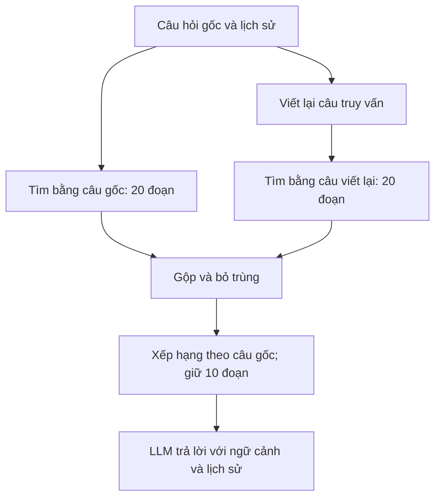

# Day 5 — Advanced RAG (RAG nâng cao): từ tìm được tài liệu đến trả lời đáng tin cậy

> Bản giảng giải đầy đủ cho các bài 024–032. Được biên soạn từ toàn bộ 9 phụ đề tiếng Anh đi kèm; không phải bản dịch từng câu hay bản chép mã nguồn trên màn hình. Ví dụ bổ sung và lưu ý kỹ thuật được ghi rõ để phân biệt với nội dung bài học.

## 1. Cả phần này thực sự muốn dạy bạn điều gì?

**Bạn đã có chatbot biết tìm tài liệu. Bây giờ cần làm cho nó tìm đúng hơn, trả lời đủ hơn và chứng minh được sự cải thiện bằng số liệu.**

Hãy hình dung một nhân viên được giao trả lời câu hỏi bằng hồ sơ công ty. Người đó có thể trả lời sai vì:

- Hồ sơ bị cắt rời khiến thông tin mất ngữ cảnh.
- Câu hỏi dùng cách diễn đạt khác với hồ sơ.
- Tìm được hồ sơ đúng nhưng để nó quá sâu trong danh sách.
- Chỉ đọc một số hồ sơ trong khi câu hỏi cần tổng hợp toàn bộ.
- Có đủ dữ liệu nhưng viết câu trả lời thiếu ý.

Advanced RAG xử lý những điểm yếu này. Nó không phải một model mới, cũng không phải một nút bật khiến chatbot tự nhiên thông minh hơn.

**Mục tiêu cuối cùng:** xây dựng một Knowledge Worker — trợ lý khai thác kiến thức từ tài liệu — có quy trình nhập dữ liệu, tìm kiếm, trả lời và đánh giá rõ ràng.

Thông điệp xuyên suốt của giảng viên là: **đặt tiêu chí → đo bản hiện tại → tìm lỗi → thử thay đổi → đo lại**. Không có kỹ thuật nào chắc chắn tốt nhất cho mọi bộ dữ liệu.

## 2. Bản đồ 9 video

| Bài | Mục tiêu | Điều cần hiểu sau khi học |
|---|---|---|
| 024 | Ôn RAG và các chỉ số đánh giá | Phải đo cả tìm kiếm lẫn câu trả lời |
| 025 | Giới thiệu 5 hướng cải thiện đầu tiên | Chất lượng phụ thuộc tài liệu, cách chia đoạn, embedding và cách đặt câu hỏi |
| 026 | Giới thiệu 5 hướng tiếp theo | Có thể tìm nhiều lần, xếp hạng lại, dùng phân cấp, quan hệ hoặc agent |
| 027 | Xây dựng bước nhập dữ liệu không dùng LangChain | Dùng LLM chia tài liệu theo ý nghĩa và tạo đầu ra có cấu trúc |
| 028 | Tạo embedding, lưu Chroma, trực quan hóa và bắt đầu reranking | Tách rõ model tạo vector với cơ sở dữ liệu lưu vector |
| 029 | Ghép tìm kiếm, reranking, rewriting và trả lời | Query rewriting có thể giúp nhưng cũng có thể làm hỏng tìm kiếm |
| 030 | Đưa notebook vào module và bổ sung query expansion | Tìm bằng cả câu gốc lẫn câu viết lại, gộp kết quả rồi chọn lọc |
| 031 | Thay implementation và chạy lại bộ đánh giá | Cải thiện phải được kiểm chứng với cùng phương pháp chấm |
| 032 | Giao bài tập cải tiến và xây trợ lý cá nhân | Tiếp tục xử lý nhóm câu hỏi còn yếu và áp dụng vào dữ liệu của mình |

Bài 025–026 giới thiệu **10 hướng**, nhưng bài thực hành không triển khai đầy đủ cả 10. Hierarchical RAG, GraphRAG và Agentic RAG chủ yếu là phần định hướng, mở rộng và bài tập.

## 3. Nhắc lại RAG bằng một ví dụ

RAG là **Retrieval-Augmented Generation — sinh câu trả lời có bổ sung thông tin được truy xuất**.

Người dùng hỏi: “Ai từng học ở Manchester University?”

Hệ thống tìm trong hồ sơ nhân viên, lấy đoạn nói rằng Jessica Liu học tại University of Manchester, đưa đoạn đó cho LLM rồi yêu cầu trả lời.

Trong cách làm của khóa học:

| Thành phần | Vai trò dễ hiểu |
|---|---|
| Document — tài liệu | Toàn bộ một hồ sơ hoặc trang kiến thức |
| Chunk — đoạn dữ liệu | Một phần tài liệu đủ gọn để tìm và đưa vào prompt |
| Embedding model / Encoder — mô hình mã hóa | Biến văn bản thành vector biểu diễn ý nghĩa |
| Chroma — kho dữ liệu vector | Lưu vector, nội dung, metadata và tìm các vector gần nhau |
| Retriever — bộ truy xuất | Điều phối việc tìm các đoạn liên quan |
| LLM tạo câu trả lời | Đọc câu hỏi cùng các đoạn tìm được rồi viết đáp án |
| Evaluator — bộ đánh giá | Đo xem tìm kiếm và trả lời tốt đến đâu |

**Lưu ý:** LLM tạo câu trả lời và embedding model có vai trò khác nhau. Trong hệ thống này, lưu tài liệu vào Chroma không phải huấn luyện lại trọng số của LLM.

## 4. Tách hệ thống thành hai giai đoạn

### 4.1. Ingestion — nhập và chuẩn bị dữ liệu

Thực hiện khi thêm hoặc cập nhật tài liệu:

1. Đọc tài liệu.
2. Chia thành các đoạn có ý nghĩa.
3. Thêm tiêu đề và tóm tắt hỗ trợ tìm kiếm.
4. Tạo embedding cho nội dung đã chuẩn bị.
5. Lưu vector, văn bản và metadata vào Chroma.

### 4.2. Answering — xử lý mỗi câu hỏi

Thực hiện khi người dùng hỏi:

1. Tạo câu truy vấn viết lại, có thể sử dụng lịch sử hội thoại.
2. Tìm bằng câu gốc và câu viết lại.
3. Gộp các đoạn, bỏ trùng.
4. Xếp hạng lại theo câu hỏi gốc.
5. Giữ các đoạn phù hợp nhất.
6. Đưa chúng cùng câu hỏi và lịch sử cho LLM trả lời.

**Điểm cần nhớ:** không chia lại và embedding lại toàn bộ tài liệu mỗi lần chat. Hai giai đoạn này có chi phí và thời điểm chạy khác nhau.

## 5. Mười hướng cải thiện RAG, hiểu theo vấn đề cần giải quyết

### 5.1. Chunking R&D — thử nghiệm cách chia đoạn

**Vấn đề:** chia quá nhỏ thì thiếu ngữ cảnh; chia quá lớn thì thông tin cần tìm bị lẫn vào nhiều chủ đề.

Ví dụ bổ sung: hồ sơ có thông tin học vấn, dự án và lương. Nếu cắt cố định ở giữa câu “Jessica tốt nghiệp…”, đoạn tiếp theo chỉ còn tên trường mà thiếu tên người.

Cách thử: thay kích thước, độ chồng lấn hoặc chia theo tiêu đề/chủ đề. Sau đó kiểm tra câu hỏi từng thất bại và chạy lại bộ đánh giá.

Không có kích thước chunk lý tưởng dùng chung cho mọi tài liệu. Khi đọc cấu hình, cần phân biệt đơn vị ký tự, từ hay token; phụ đề không đủ để xác nhận đơn vị của mọi tham số trên màn hình.

### 5.2. Encoder selection — lựa chọn mô hình embedding

**Vấn đề:** mô hình biểu diễn ý nghĩa chưa phù hợp ngôn ngữ hoặc lĩnh vực dữ liệu.

Giảng viên đề xuất thử encoder khác bằng cùng bộ câu hỏi. Với dữ liệu ảnh, bài học nêu hai hướng: embedding đa phương thức, hoặc tạo mô tả ảnh rồi embedding phần mô tả.

Với PDF/Word, bài học ưu tiên trích xuất nội dung bằng phần mềm rồi chuyển sang văn bản/Markdown để xử lý.

**Bổ sung:** PDF có lớp chữ khác PDF scan. File scan cần OCR hoặc khả năng đọc ảnh; chuyển đổi đơn thuần chưa chắc giữ đúng bảng biểu và bố cục. Mô tả ảnh cũng có thể bỏ sót chi tiết quan trọng.

Đổi model embedding thường cần tạo lại vector cho kho dữ liệu. Vector truy vấn và vector tài liệu phải thuộc không gian biểu diễn tương thích; cùng số chiều chưa đủ để bảo đảm điều đó.

### 5.3. Prompt improvement — cải thiện chỉ dẫn

**Vấn đề:** đã có dữ liệu nhưng model trả lời lan man, thiếu ý hoặc hiểu sai vai trò.

Trong bài học, prompt nhấn mạnh ba tiêu chí: **accuracy — chính xác, relevance — đúng trọng tâm, completeness — đầy đủ**. Có thể bổ sung thông tin nền cố định hoặc lịch sử hội thoại khi phù hợp.

Ví dụ chỉ dẫn bổ sung:

> Trả lời câu hỏi dựa trên ngữ cảnh được cung cấp. Nêu đủ các ý người dùng hỏi. Nếu ngữ cảnh chưa đủ, nói rõ phần chưa xác định. Gắn nguồn cho những thông tin lấy từ tài liệu.

Nhắc rằng câu trả lời sẽ được chấm điểm chỉ là một lựa chọn prompt cần thử nghiệm, không bảo đảm model sẽ chính xác.

### 5.4. Document preprocessing — chuẩn bị lại tài liệu

**Vấn đề:** tài liệu phù hợp cho người đọc nhưng khó tìm bằng ngữ nghĩa, chẳng hạn bảng giá chỉ chứa các con số và tiêu đề cột ngắn.

Ví dụ bổ sung:

| Tuyến | Giá |
|---|---:|
| Hà Nội → Đà Nẵng | 1.200.000 đồng |

Có thể thêm câu hỗ trợ tìm kiếm: “Giá vé từ Hà Nội đến Đà Nẵng là 1.200.000 đồng.”

Trong thực hành, giảng viên kết hợp tiền xử lý với **semantic chunking — chia đoạn theo ý nghĩa**, đồng thời tạo tiêu đề và tóm tắt cho từng đoạn.

**Bổ sung:** nội dung do LLM viết lại có thể sai. Nên giữ văn bản gốc cùng nguồn; phần tóm tắt hỗ trợ tìm kiếm không được coi là bằng chứng đáng tin hơn bản gốc.

### 5.5. Query rewriting — viết lại câu truy vấn

**Vấn đề:** câu hỏi quá ngắn hoặc phụ thuộc câu trước.

Ví dụ bổ sung:

- Câu trước: “Cho tôi biết về Jessica Liu.”
- Câu tiếp: “Cô ấy học ở đâu?”
- Truy vấn độc lập: “Jessica Liu học tại trường đại học nào?”

LLM sử dụng lịch sử để biến câu hỏi thành dạng phù hợp tìm kiếm. Bước này tạo **truy vấn**, chưa tạo **đáp án**.

Trong video 029, rewriting đôi khi tự thêm tên công ty. Điều này kéo tìm kiếm sang các tài liệu chung về công ty, làm hồ sơ cần tìm tụt hạng. Đó là ví dụ cụ thể cho thấy thêm một bước AI có thể làm kết quả kém hơn.

### 5.6. Query expansion — mở rộng truy vấn

**Vấn đề:** một cách diễn đạt có thể bỏ sót dữ liệu.

Ý tưởng chung là tạo nhiều truy vấn, tìm riêng từng truy vấn rồi gộp kết quả.

**Cách triển khai cụ thể của video 030:** giữ cả câu hỏi gốc lẫn một câu viết lại. Mỗi câu tìm 20 đoạn; kết quả gộp có tối đa 40 đoạn trước khi loại trùng. Không phải video đã triển khai việc sinh hàng loạt truy vấn khác nhau — đó là gợi ý mở rộng.

Lợi ích là vẫn giữ cơ hội tìm đúng của câu gốc khi rewriting lệch hướng. Đổi lại, phải tìm nhiều lần và đưa nhiều ứng viên hơn vào reranker.

### 5.7. Re-ranking — xếp hạng lại

**Vấn đề:** tìm được đoạn đúng nhưng nó nằm quá thấp trong danh sách.

Vector search chọn ứng viên bằng độ tương đồng vector. Reranker đọc câu hỏi cùng các ứng viên để sắp xếp lại mức liên quan.

Trong video 029, đoạn chứa Manchester nằm ở vị trí thứ 5, tức index 4 nếu đếm từ 0. Sau reranking, nó lên đầu.

Video dùng LLM trả về danh sách ID theo thứ tự phù hợp, rồi chương trình sắp lại các chunk. Sau khi gộp truy vấn, hệ thống chỉ giữ **10 đoạn đứng đầu** cho bước trả lời.

**Giới hạn cần hiểu:** reranker chỉ sắp lại những đoạn đã nhận. Nếu tìm kiếm không lấy được đoạn chứa đáp án, reranking không thể tự làm đoạn đó xuất hiện.

### 5.8. Hierarchical RAG — RAG phân cấp

**Vấn đề:** câu hỏi cần cái nhìn tổng thể nhưng truy xuất thông thường chỉ lấy vài mảnh nhỏ.

Ví dụ trong bài: “Có bao nhiêu nhân viên nhận lương dưới mức X?” Một số hồ sơ riêng lẻ không đủ để đếm cả công ty.

Cách đề xuất: tạo tài liệu tổng hợp ở nhiều cấp, tìm trong bản tổng hợp rồi đi sâu vào chi tiết khi cần.

**Bổ sung:** bản tóm tắt có thể bỏ sót dữ kiện hoặc lỗi thời. Với phép đếm cần chính xác trên dữ liệu có cấu trúc, công cụ truy vấn và tính toán trực tiếp trên dữ liệu đầy đủ thường là hướng phù hợp hơn việc để model đoán từ một ít chunk.

### 5.9. GraphRAG — truy xuất có khai thác quan hệ

**Vấn đề:** đáp án nằm trong quan hệ giữa các thực thể.

Ví dụ bổ sung: Jessica thuộc nhóm A; nhóm A do Minh quản lý. Khi hỏi quản lý của Jessica, cần nối hai thông tin.

Bài học giới thiệu cách lưu quan hệ trong metadata hoặc graph database, rồi lấy thêm các dữ liệu liên quan cách một hoặc hai liên kết. Đây là cách giải thích nhập môn về truy xuất theo quan hệ, không phải mô tả đầy đủ mọi kiến trúc mang tên GraphRAG.

Một vài liên kết đơn giản có thể biểu diễn bằng metadata. Không phải cứ xây RAG là phải cài thêm graph database.

### 5.10. Agentic RAG — để agent điều phối việc tìm kiếm

**Vấn đề:** một quy trình cố định chưa đáp ứng được mọi loại câu hỏi.

Thay vì luôn tìm vector rồi trả lời, cấp công cụ cho LLM để nó quyết định: tìm vector, tìm từ khóa, đọc file, truy vấn dữ liệu có cấu trúc hoặc tìm tiếp khi còn thiếu thông tin.

Điểm khác biệt nằm ở **ai quyết định các bước**: chương trình quy định sẵn hay model lựa chọn qua tool calling.

Agentic RAG vẫn bổ sung dữ liệu truy xuất cho việc sinh câu trả lời, nên vẫn thuộc tinh thần RAG. Nó linh hoạt hơn nhưng có thể tốn thời gian, chi phí và khó lặp lại kết quả ổn định hơn.

## 6. Thực hành ingestion không dùng LangChain — bài 027–028

### 6.1. Tại sao bỏ LangChain trong bài này?

Giảng viên muốn cho thấy bạn hiểu và tự điều phối được các bước RAG. LangChain là công cụ hỗ trợ; không phải điều kiện bắt buộc để RAG hoạt động.

Với nền tảng frontend, có thể hình dung việc này như viết lớp gọi API bằng `fetch` trực tiếp thay vì nhờ thư viện bao bọc. Bạn phải quản lý nhiều chi tiết hơn nhưng nhìn rõ luồng dữ liệu hơn.

### 6.2. Các cấu trúc dữ liệu cần hiểu

| Cấu trúc | Trường chính | Mục đích |
|---|---|---|
| `Result` | `page_content`, `metadata` | Giữ hình dạng dữ liệu tương tự `Document` trước đó để các phần khác tiếp tục dùng được |
| `Chunk` | `headline`, `summary`, `original_text` | Biểu diễn một đoạn có tiêu đề, tóm tắt và nguyên văn |
| `Chunks` | Danh sách `Chunk` | Dạng đầu ra yêu cầu từ LLM khi chia một tài liệu |
| `RankOrder` | `order`: danh sách số nguyên | Dạng đầu ra khi LLM xếp hạng các ứng viên |

**Structured outputs — đầu ra có cấu trúc** giúp model trả dữ liệu theo schema thay vì đoạn văn tùy ý. Pydantic được dùng để mô tả/kiểm tra cấu trúc.

Bổ sung: schema đúng không đồng nghĩa dữ kiện đúng. Chuỗi `original_text` vẫn cần kiểm tra có thực sự khớp nguồn; danh sách ID vẫn cần kiểm tra trùng, thiếu hoặc ngoài phạm vi.

### 6.3. Các bước cụ thể

1. Đọc 76 tài liệu Markdown trong knowledge base.
2. Với mỗi tài liệu, tạo prompt yêu cầu chia thành các đoạn có ý nghĩa và có chồng lấn.
3. Yêu cầu mỗi đoạn có tiêu đề, tóm tắt và nguyên văn.
4. Chuyển các kết quả sang dạng `Result`.
5. Gọi embedding model để biến văn bản thành vector.
6. Dùng Chroma trực tiếp lưu vector, văn bản, metadata và ID.

Trong lần demo đầu, bước chia đoạn cho ra 400 chunk và mất gần 10 phút. Đây là kết quả của lần chạy được kể trong bài, không phải số chunk cố định.

LLM được dùng cho nhiều vai trò: tổ chức tài liệu, viết truy vấn, xếp hạng và trả lời. **Chúng là những lời gọi riêng với nhiệm vụ khác nhau**, dù có thể dùng cùng tên model.

### 6.4. t-SNE để làm gì?

Mỗi vector có nhiều chiều nên không thể vẽ trực tiếp như tọa độ 2D. t-SNE tạo biểu diễn thấp chiều để quan sát, rồi giảng viên tô màu các nhóm tài liệu và xem ở 2D/3D.

**Bổ sung:** biểu đồ giúp khám phá dữ liệu; các cụm nhìn đẹp không chứng minh retrieval tốt hơn. t-SNE là công cụ trực quan hóa, không phải điểm đánh giá RAG. Xem [tài liệu t-SNE của scikit-learn](https://scikit-learn.org/stable/modules/generated/sklearn.manifold.TSNE.html).

## 7. Luồng trả lời hoàn chỉnh — bài 029–030

Sơ đồ dưới đây tập trung vào điểm quan trọng nhất: tìm bằng cả hai truy vấn rồi gộp lại.



### 7.1. Mã giả để hiểu luồng

Đây là mã giả do tôi viết lại, không phải mã nguồn trích từ video và chưa phải chương trình chạy độc lập:

```python
def fetch_context(question, history):
    rewritten = rewrite_query(question, history)

    original_hits = vector_search(question, limit=20)
    rewritten_hits = vector_search(rewritten, limit=20)

    candidates = deduplicate_by_id(original_hits + rewritten_hits)
    ranked = rerank(question=question, chunks=candidates)
    return ranked[:10]


def answer_question(question, history):
    context = fetch_context(question, history)
    messages = make_rag_messages(question, history, context)
    response = generate_answer(messages)
    return response, context
```

Cả reranking và câu trả lời đều hướng về **ý định gốc**. Câu viết lại chỉ hỗ trợ tìm kiếm. Với câu hỏi phụ thuộc hội thoại, phải bảo đảm ngữ cảnh hội thoại cũng đến được các bước cần nó; tránh để reranker chỉ thấy một câu mơ hồ như “Cô ấy thì sao?”.

### 7.2. Tại sao bỏ trùng?

Nếu cả hai truy vấn cùng tìm thấy hồ sơ Jessica thì không cần gửi hai bản giống nhau vào reranker. Bản trùng chiếm chỗ và tăng lượng dữ liệu phải xử lý.

Mã giả dùng ID ổn định để loại trùng. Video mô tả hàm gộp bỏ trùng nhưng phụ đề không cung cấp đầy đủ chi tiết định danh trong mã thực tế.

### 7.3. Ba phép thử minh họa trong video

| Câu hỏi | Kết quả được trình bày | Ý nghĩa |
|---|---|---|
| “Who is Avery?” | Thông tin Avery Lancaster, đồng sáng lập và CEO trong dữ liệu demo | Kiểm tra câu hỏi hồ sơ thông thường |
| “Who won the … award?” | Maxine Thompson, năm 2023 | Kiểm tra tìm chi tiết cụ thể; tên giải bị phụ đề ghi không nhất quán |
| “Who went to Manchester University?” | Jessica Liu, hồ sơ ghi University of Manchester | Kiểm tra thông tin khó tìm và khác cách diễn đạt |

Những câu trả lời này thuộc **knowledge base minh họa của khóa học**, không phải khẳng định về người hay doanh nghiệp ngoài đời.

## 8. Đưa vào module và tăng tốc — bài 030

Giảng viên tạo `pro_implementation` với `ingest.py` và `answer.py`, giữ giao diện gọi hàm tương thích với bản trước.

| Phần | Vai trò |
|---|---|
| `ingest.py` | Đọc, chia đoạn, tạo embedding và lưu dữ liệu |
| `answer.py` | Tìm ngữ cảnh và trả lời |
| `app.py` | Giao diện Gradio gọi hàm trả lời |
| Phần evaluation | Gọi cùng lớp xử lý để chạy bộ đánh giá |

Nhờ vậy, UI và evaluator chỉ cần đổi nơi import. Đây là bài học về tách giao diện với logic xử lý, rất gần cách frontend gọi một service qua interface ổn định.

### 8.1. Multiprocessing — xử lý bằng nhiều tiến trình

Bản đầu xử lý tài liệu tuần tự. Bản sau dùng pool nhiều worker để xử lý nhiều tài liệu đồng thời.

Trong demo, giảng viên thử 10 worker; lần chạy mất khoảng 1 phút 20 giây và tạo 534 chunk. Tuy nhiên, ông cũng đổi tham số kích thước chunk từ 500 xuống 100. Vì thế đây **không phải phép so sánh hiệu năng chỉ thay số worker**.

Không nên hiểu 534 là 534 tài liệu nguồn mới. Trong ngữ cảnh này, đó là các đoạn/kết quả sau xử lý từ kho tài liệu.

Bổ sung: 10 worker không bảo đảm nhanh đúng 10 lần. Tốc độ phụ thuộc API, hạn mức, thời gian từng tác vụ và overhead. Video cũng nhắc các hướng khác như futures hoặc async.

### 8.2. Retry và exponential backoff — thử lại với thời gian chờ tăng dần

Giảng viên thêm Tenacity để thử lại khi lời gọi thất bại, đặc biệt khi gặp rate limit. Ông thừa nhận bản minh họa chưa lọc loại lỗi kỹ.

Ví dụ bổ sung: gặp lỗi tạm thời thì đợi 1 giây, rồi 2 giây, rồi 4 giây trước các lần thử tiếp theo. Cần giới hạn số lần thử; lỗi cấu hình hay schema không nên bị lặp vô hạn.

### 8.3. Những chi tiết không nên hiểu thành cam kết

- Chi phí khoảng 0,50 USD là lời kể về lần chạy của giảng viên, không phải báo giá hiện tại hay ngân sách đảm bảo cho bạn.
- Tên video có chữ “Production” nhưng bài học không phải checklist hoàn chỉnh để vận hành sản phẩm thực tế.
- Bản demo tái tạo collection để làm thí nghiệm. Khi áp dụng thật cần có cách cập nhật, version và khôi phục phù hợp.
- Dùng model mở qua dịch vụ cloud vẫn gửi dữ liệu tới dịch vụ đó; model mở không đồng nghĩa chạy local.

## 9. Đọc kết quả đánh giá cho đúng — bài 024 và 031

### 9.1. Hai nhóm đánh giá độc lập

**Retrieval evaluation:** các đoạn được tìm có chứa dữ liệu cần thiết không, và chúng ở vị trí nào?

**Answer evaluation:** câu trả lời có đúng, đúng trọng tâm và đầy đủ không?

Có thể tìm đúng mà trả lời thiếu; cũng có thể trả lời có vẻ hợp lý dù truy xuất thiếu bằng chứng. Vì thế cần xem cả hai nhóm.

### 9.2. MRR — Mean Reciprocal Rank

Mỗi câu hỏi được chấm theo nghịch đảo thứ hạng của kết quả liên quan đầu tiên. Không tìm thấy trong phạm vi đánh giá thì tính 0. Sau đó lấy trung bình trên các câu hỏi.

Ví dụ bổ sung:

| Câu hỏi | Vị trí kết quả đúng đầu tiên | Điểm |
|---|---:|---:|
| A | 1 | 1 |
| B | 2 | 0,5 |
| C | 5 | 0,2 |
| D | Không có | 0 |

MRR = (1 + 0,5 + 0,2 + 0) / 4 = **0,425**.

**MRR 0,9116 không đồng nghĩa chính xác 91,16% câu hỏi có đáp án ở vị trí đầu.** Nó là trung bình nghịch đảo thứ hạng; các vị trí 2, 3… cũng đóng góp điểm.

### 9.3. nDCG — chất lượng thứ tự của nhiều kết quả

MRR chú ý kết quả liên quan đầu tiên. nDCG xem mức liên quan của nhiều kết quả và giảm trọng số ở vị trí thấp.

Nếu có ba đoạn liên quan, đưa chúng lên các vị trí đầu sẽ tốt hơn để chúng rải ở cuối. Điểm được chuẩn hóa bằng thứ tự lý tưởng theo cách gán mức liên quan của phép đánh giá.

Không cần học thuộc công thức ngay; trước hết hãy hiểu: **các thông tin hữu ích có được ưu tiên ở đầu danh sách không?**

### 9.4. Precision, Recall, Hit rate và Keyword coverage

Phụ đề bài 024 dùng từ “recall” khi mô tả tỷ lệ câu hỏi có ít nhất một kết quả đúng trong top-k. Để học chính xác, nên phân biệt:

| Chỉ số | Câu hỏi nó trả lời |
|---|---|
| Precision@k | Trong k kết quả lấy về, bao nhiêu kết quả liên quan? |
| Recall@k | Trong toàn bộ kết quả liên quan đã biết, lấy về được bao nhiêu? |
| Hit rate@k | Bao nhiêu câu hỏi có ít nhất một kết quả liên quan trong top-k? |
| Keyword coverage | Ngữ cảnh tìm được chứa bao nhiêu từ khóa kỳ vọng, theo quy tắc của evaluator? |

Ví dụ bổ sung: có 4 đoạn liên quan trong kho; lấy 3 đoạn nhưng chỉ 2 đoạn liên quan. Precision@3 = 2/3; Recall@3 = 2/4; câu hỏi này có hit. Nếu mỗi câu hỏi chỉ có đúng một kết quả liên quan thì recall và hit có thể trùng nhau.

Khái niệm recall cần hướng đến lượng thông tin liên quan đã thu hồi; các bộ đánh giá có thể định nghĩa theo tài liệu hoặc theo các ý trong đáp án chuẩn. Xem [tài liệu Context Recall của Ragas](https://docs.ragas.io/en/stable/concepts/metrics/available_metrics/context_recall/).

Keyword coverage là tín hiệu thuận tiện nhưng không chứng minh đã hiểu đúng nội dung: đoạn có từ khóa vẫn có thể sai quan hệ hoặc nói về đối tượng khác.

### 9.5. LLM as a Judge — dùng LLM chấm câu trả lời

Trong bài, một LLM chấm ba tiêu chí:

- **Accuracy:** thông tin đúng đến đâu?
- **Relevance:** có trả lời điều người dùng hỏi không?
- **Completeness:** đã trả lời đủ các ý cần thiết chưa?

Giảng viên giữ cùng model chấm và phương pháp đánh giá khi đổi implementation. Nếu vừa đổi hệ thống vừa đổi người chấm thì rất khó diễn giải khác biệt.

Bổ sung: điểm của LLM judge là phép đánh giá có sai số, không phải sự thật tuyệt đối. Cần đọc một số ca cụ thể, nhất là ca điểm cao nhưng bằng chứng yếu.

### 9.6. Kết quả được báo trong bài 031

| Chỉ số | Bản đầu | Bản nâng cao | Mức tăng tuyệt đối |
|---|---:|---:|---:|
| MRR | 0,7298 | 0,9116 | +0,1818 |
| nDCG | 0,7387 | 0,9025 | +0,1638 |
| Keyword coverage | 83,8% | Khoảng 96% | Khoảng +12,2 điểm phần trăm |
| Accuracy, thang 5 | 3,99 | 4,62 | +0,63 |
| Relevance, thang 5 | 4,57 | 4,84 | +0,27 |
| Completeness, thang 5 | 3,85 | 4,35 | +0,50 |

Nguồn: phần giảng viên đọc kết quả trong phụ đề 031. Tên nDCG và completeness được xác định theo mạch các chỉ số ông đang so sánh; không chép thêm số lẻ không được phụ đề cung cấp. MRR từng có các mốc trung gian 0,7475 sau thay đổi chunk và 0,7903 sau đổi embedding.

**Cách hiểu:** bản nâng cao cải thiện rõ trên bộ test được trình bày. Nhưng vì thay đổi nhiều thành phần, gồm cả model xử lý, không thể quy toàn bộ mức tăng cho riêng reranking hay semantic chunking.

Giảng viên cũng nói kết quả dao động giữa các lần chạy. Các màu đỏ/vàng/xanh là ngưỡng do ông đặt cho dashboard, không phải chuẩn chung của ngành.

**Tên video 031 nhắc GPT-4o, trong khi phụ đề mô tả bản trả lời dùng GPT-OSS và judge dùng GPT-4.1 nano.** Vì vậy tài liệu không quy kết các số liệu này là thành tích riêng của GPT-4o. Muốn tái lập chính xác cần kiểm tra cấu hình mã nguồn của lần chạy.

## 10. Vì sao vẫn yếu với câu hỏi tổng hợp và số liệu?

Trong kết quả cuối, giảng viên nhận thấy nhóm numerical và holistic còn vấn đề, đồng thời completeness chưa cao bằng các tiêu chí khác.

Ví dụ bổ sung: “Ai học ở Manchester?” có thể trả lời bằng một hồ sơ. “Có bao nhiêu nhân viên tốt nghiệp ở Anh?” cần biết tất cả nhân viên phù hợp, không chỉ vài người được retrieval ưu tiên.

**Top-10 liên quan nhất không đồng nghĩa toàn bộ dữ liệu cần thiết.** Đây là lý do tăng chất lượng embedding hay reranking chưa đủ để giải quyết mọi câu hỏi.

Hướng thử theo bài học: tạo bản tổng hợp phân cấp, mở rộng truy vấn hoặc cấp thêm công cụ cho agent. Với số liệu có cấu trúc, phần bổ sung của tài liệu này là thực hiện phép lọc/đếm bằng code hoặc truy vấn dữ liệu đầy đủ, rồi để LLM giải thích kết quả.

## 11. Bài tập cuối phần và cách thực hiện vừa sức

### 11.1. Bài tập giảng viên giao

1. Cải thiện kết quả RAG bằng việc tiếp tục đo và thử các thay đổi.
2. Thử xử lý nhóm câu hỏi tổng hợp còn yếu.
3. Nếu muốn đi sâu, thêm công cụ tìm file hoặc vector cho agent.
4. Bài mở rộng: xây Knowledge Worker từ dữ liệu cá nhân hoặc doanh nghiệp.

Giảng viên còn gợi ý vòng lặp tạo câu trả lời → chấm → sửa lại. Đây là **ý tưởng thử nghiệm**, không phải cam kết chạy đủ lâu sẽ đạt đáp án đúng hoàn toàn.

### 11.2. Những điểm cần bổ sung cho thử nghiệm agent

- Giới hạn số vòng lặp, thời gian và chi phí.
- Khi chạy thực tế thường không có đáp án chuẩn; không thể mặc nhiên dùng cùng evaluator có reference answer như lúc thử nghiệm.
- Không đưa đáp án chuẩn của bộ test vào agent rồi coi điểm tăng là khả năng tổng quát hóa.
- Chấm lặp bằng cùng judge có thể tối ưu theo sở thích của judge; cần dữ liệu kiểm tra riêng.
- Vẫn có thể đánh giá retrieval của agent nếu định nghĩa rõ đo theo từng lần gọi, tập kết quả tổng hợp hay ngữ cảnh cuối. Không nên hiểu rằng Agentic RAG hoàn toàn không đo được retrieval.

### 11.3. Ví dụ thực hành phù hợp với nền tảng web của bạn

Tạo trợ lý đọc một nhóm tài liệu kỹ thuật do bạn chọn, chẳng hạn ghi chú React/NestJS.

| Loại câu hỏi | Ví dụ tự tạo |
|---|---|
| Tra cứu trực tiếp | “Tài liệu này định nghĩa middleware như thế nào?” |
| So sánh | “Trong tài liệu, guard khác middleware ở điểm nào?” |
| Hội thoại tiếp nối | Sau khi hỏi guard: “Nó chạy trước hay sau interceptor?” |
| Tổng hợp | “Các phần nào cùng đề cập xác thực người dùng?” |
| Thiếu dữ liệu | Hỏi thông tin không có trong bộ tài liệu để kiểm tra khả năng nhận biết giới hạn |

Bắt đầu bằng một bản đơn giản và một bộ câu hỏi có đáp án kiểm tra được. Sau đó thay một yếu tố mỗi lần để biết điều gì tạo ra khác biệt.

Mẫu nhật ký thử nghiệm:

| Lần thử | Thay đổi | MRR | Chất lượng đáp án | Thời gian | Chi phí | Ca lỗi đáng chú ý |
|---|---|---|---|---|---|---|
| A | Bản cơ sở | Tự đo | Tự đo | Tự đo | Tự đo | Ghi lại |
| B | Thêm semantic chunking | Tự đo | Tự đo | Tự đo | Tự đo | Ghi lại |
| C | Thêm reranking | Tự đo | Tự đo | Tự đo | Tự đo | Ghi lại |
| D | Câu gốc + câu viết lại | Tự đo | Tự đo | Tự đo | Tự đo | Ghi lại |

Nếu làm trợ lý cá nhân local, phải xét toàn bộ đường đi dữ liệu: chia đoạn, embedding, trả lời và chấm điểm. Chỉ dùng model mở cho một bước chưa bảo đảm mọi dữ liệu đều ở máy. Chạy local cũng vẫn có chi phí phần cứng và điện.

## 12. Tự kiểm tra xem đã hiểu chưa

**1. Chroma có tự tạo câu trả lời cho người dùng không?**  
Không trong kiến trúc bài này. Chroma lưu và truy xuất; LLM sinh câu trả lời.

**2. Tại sao giữ câu hỏi gốc khi đã có câu viết lại?**  
Vì câu viết lại có thể lệch ý và làm tìm kiếm kém đi.

**3. Reranking có sửa được trường hợp không lấy về đoạn chứa đáp án không?**  
Không. Cần sửa truy vấn, dữ liệu hoặc bước truy xuất để đưa đoạn đó vào tập ứng viên.

**4. Có phải 40 đoạn đều được gửi cho model trả lời?**  
Không. Hai lần tìm lấy tối đa 40 ứng viên trước bỏ trùng; bản thực hành giữ 10 đoạn sau reranking.

**5. Bỏ LangChain có phải nguyên nhân trực tiếp làm MRR tăng?**  
Không có bằng chứng cho kết luận đó. Bài thay nhiều kỹ thuật và model; bỏ thư viện chủ yếu minh họa khả năng tự điều phối.

**6. Hình t-SNE đẹp hoặc MRR cao có bảo đảm mọi đáp án đúng không?**  
Không. Phải đánh giá câu trả lời và đọc các trường hợp lỗi.

**Điều quan trọng nhất cần mang theo:** Advanced RAG là cải thiện cách chuẩn bị, tìm, chọn và sử dụng bằng chứng. Kỹ năng cốt lõi là biết hệ thống đang sai ở đâu, chọn thử nghiệm phù hợp và đo xem thay đổi có thực sự giúp ích.

## Nguồn và cách biên soạn

- Nguồn chính: toàn bộ 9 file `.srt` bài 024–032 do bạn cung cấp, được đối chiếu theo thứ tự bài học.
- Tài liệu gộp các ý lặp, bỏ lời dẫn và thao tác giao diện không cần thiết, giữ mục tiêu, kỹ thuật, luồng xử lý, ví dụ và số liệu có ý nghĩa.
- Phụ đề có lỗi nhận dạng như “MRI” thay cho MRR, “pedantic” thay cho Pydantic và nhiều biến thể của Agentic RAG. Các thuật ngữ được chuẩn hóa theo ngữ cảnh.
- Ví dụ bổ sung, mã giả và lưu ý kỹ thuật là phần giảng giải của tài liệu; không được coi là mã nguồn hoặc nguyên văn video.
- Nguồn ngoài chỉ dùng bổ trợ khái niệm, không dùng xác nhận kết quả thực nghiệm của khóa học: [scikit-learn: t-SNE](https://scikit-learn.org/stable/modules/generated/sklearn.manifold.TSNE.html), [Ragas: Context Recall](https://docs.ragas.io/en/stable/concepts/metrics/available_metrics/context_recall/).
