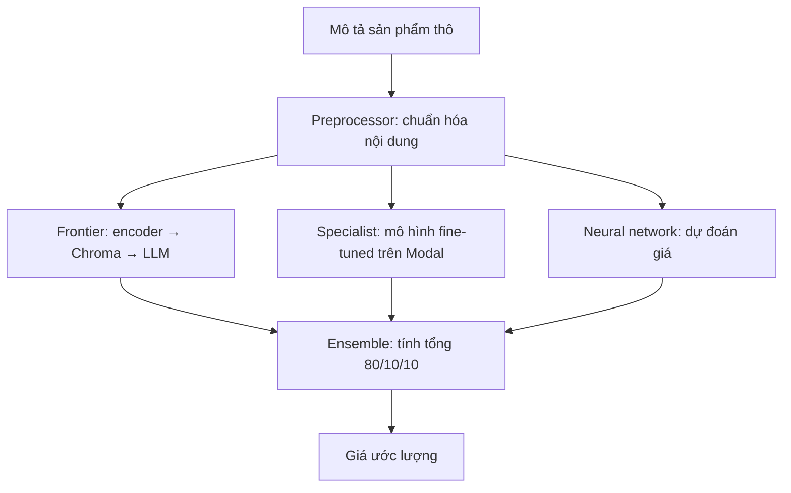

# Day 2 — Hiểu và xây bộ định giá bằng RAG và Ensemble

> Bản giảng đầy đủ cho video 007–011. Tài liệu dựa trên toàn bộ 5 file phụ đề bạn cung cấp; không phải bản chép lời. Những ví dụ tự đặt và lưu ý mở rộng được ghi rõ để phân biệt với nội dung bài học.

## 1. Cả phần này thực sự muốn dạy điều gì?

**Mục tiêu là xây một bộ phận nhận mô tả sản phẩm và trả về giá ước lượng, bằng cách kết hợp nhiều cách dự đoán.**

Hãy tưởng tượng bạn thấy một chiếc micro được rao bán giá 180 USD. Bạn cần biết: “Giá này có hời không?”. Chỉ biết giá người bán đưa ra thì chưa đủ; bạn cần một mức giá tham khảo độc lập. Bộ định giá trong bài học làm nhiệm vụ ước lượng mức đó.

Dự án lớn hơn là hệ thống tìm ưu đãi: phát hiện sản phẩm đang được rao bán, ước lượng giá trị, rồi thông báo cơ hội tốt. Nhưng **5 video này tập trung vào bộ định giá**, chưa hoàn thiện phần quét tin, gửi thông báo hay bộ điều phối tự chủ.

Giảng viên đưa ba cách định giá vào cùng một hệ thống:

| Thành phần | Cách đưa ra giá | Hình dung dễ hiểu |
|---|---|---|
| Frontier Agent | LLM mạnh nhận thêm ví dụ sản phẩm tương tự qua RAG | Người có kiến thức rộng, được đưa thêm bảng giá tham khảo |
| Specialist Agent | Mô hình đã fine-tune cho bài toán giá, được gọi qua Modal | Người đã luyện rất nhiều bài tập định giá |
| Neural Network Agent | Mạng nơ-ron dự đoán giá đã huấn luyện trước đó | Một công cụ tính toán đã học quan hệ giữa thông tin sản phẩm và giá |
| Ensemble Agent | Gọi ba thành phần trên và kết hợp kết quả | Người tổng hợp ba ý kiến thành một con số |

**Bạn không đang tự huấn luyện một ChatGPT từ đầu.** Bạn đang xây ứng dụng AI từ mô hình, dữ liệu, truy xuất và mã điều phối. Trong phần này, mô hình specialist và mạng nơ-ron đã được chuẩn bị từ các bài trước.

## 2. Từng video đóng vai trò gì?

| Video | Câu hỏi cần giải quyết | Việc được thực hiện | Điều cần hiểu sau bài |
|---|---|---|---|
| 007 — ChromaDB, không dùng LangChain | Lấy ví dụ sản phẩm tương tự ở đâu? | Mã hóa mô tả sản phẩm thành vector và lưu vào Chroma | Encoder tạo vector; Chroma lưu và tìm kiếm |
| 008 — t-SNE và RAG pipeline | Tìm được sản phẩm tương tự rồi dùng thế nào? | Quan sát vector, tìm 5 sản phẩm gần nhất, ghép mô tả và giá vào prompt | RAG là truy xuất thông tin phù hợp rồi đưa cho mô hình |
| 009 — RAG và ensemble | RAG có tốt không? Kết hợp mô hình có ích gì? | Đánh giá RAG, giải thích ensemble, đặt trọng số 80/10/10 | Đo trên nhiều mẫu; sai số khác nhau có thể bù trừ |
| 010 — Kết quả và đóng gói | Biến thử nghiệm thành thành phần ứng dụng ra sao? | Đánh giá ensemble, chuyển logic sang các lớp agent | Tách trách nhiệm và chuẩn hóa đầu vào |
| 011 — Chạy toàn bộ | Một yêu cầu định giá thực sự đi qua những bước nào? | Khởi tạo, tiền xử lý, gọi các mô hình, xem log và giá cuối | Một câu trả lời có thể cần nhiều lượt suy luận |

Cách đọc thuận lợi: nắm mục 3–5 để hiểu RAG, đọc mục 6–8 để hiểu ensemble, sau đó mới xem cách tổ chức chương trình.

## 3. RAG: đưa bảng giá tham khảo cho người định giá

### 3.1. Tại sao không hỏi thẳng LLM?

Bạn có thể hỏi: “Chiếc pedal hiệu ứng guitar này giá bao nhiêu?”. LLM có thể trả lời bằng những gì đã học. Nhưng kiến thức đó có thể thiếu chi tiết về mẫu sản phẩm, hoặc không phản ánh đúng bộ dữ liệu giá đang xét.

Bài học bổ sung ngữ cảnh trước khi hỏi:

> Đây là sản phẩm cần định giá. Đây là một số sản phẩm gần giống, kèm giá đã biết. Hãy dùng chúng để ước lượng.

Đó là **RAG — Retrieval-Augmented Generation, sinh câu trả lời có bổ sung thông tin truy xuất**.

Trong ví dụ này, thông tin được lấy từ kho dữ liệu sản phẩm có sẵn. **RAG không đồng nghĩa với lên Internet tìm giá mới nhất.** Nếu dữ liệu trong kho cũ, giá tham khảo cũng có thể cũ.

### 3.2. Tách hai giai đoạn để khỏi bị rối

**Giai đoạn A — Chuẩn bị kho tham khảo:** lấy mô tả sản phẩm đã biết giá, tạo vector, lưu vector cùng mô tả và thông tin giá.

**Giai đoạn B — Định giá một sản phẩm mới:** tạo vector cho mô tả mới, tìm sản phẩm tương tự trong kho, đưa thông tin tìm được vào prompt, rồi gọi LLM.

Giai đoạn A tương đối nặng nhưng có thể tái sử dụng kết quả. Giai đoạn B diễn ra khi có yêu cầu định giá.

Một hiểu nhầm cần tránh: khi xử lý một sản phẩm mới, hệ thống **không tạo lại vector cho toàn bộ 800.000 sản phẩm**.

### 3.3. Vector, embedding, encoder và Chroma khác nhau thế nào?

Ví dụ tự đặt: kho có các mô tả “micro USB để thu podcast”, “micro thu âm cho máy tính”, “bàn phím cơ”. Hai mô tả đầu khác chữ nhưng gần nghĩa. Tìm kiếm ngữ nghĩa giúp chúng được xem là gần nhau.

| Thuật ngữ | Ý nghĩa trong bài |
|---|---|
| Encoder / embedding model | Mô hình chuyển văn bản thành dãy số biểu diễn đặc điểm ngữ nghĩa |
| Embedding | Biểu diễn mà encoder tạo ra cho một đoạn văn bản |
| Vector | Dãy số dùng để biểu diễn embedding trong trường hợp này |
| Vector database / vector store | Nơi lưu và tìm các vector gần nhau |
| ChromaDB | Công cụ vector database được sử dụng |
| Document | Nội dung mô tả gốc để đưa lại cho LLM đọc |
| Metadata | Thông tin đi kèm bản ghi, chẳng hạn giá sản phẩm |

Trong bài, encoder là `sentence-transformers/all-MiniLM-L6-v2`, tạo vector **384 chiều**. Có thể hình dung mỗi mô tả được chuyển thành một dãy gồm 384 số. Không nên diễn giải rằng từng số là một thuộc tính rõ ràng như “thương hiệu”, “giá”, “kích thước”; ý nghĩa được biểu diễn phân tán trong cả dãy.

**Encoder quyết định biểu diễn đầu vào; Chroma tổ chức lưu và truy vấn biểu diễn đó.** Đổi chỗ lưu không tự động làm vector hiểu ngữ nghĩa tốt hơn.

Lưu ý bổ sung: chất lượng truy xuất còn phụ thuộc dữ liệu, cách chuẩn hóa văn bản, cách đo độ gần và cấu hình tìm kiếm. Mô tả cần tìm và mô tả trong kho phải được mã hóa bằng cùng encoder tương thích.

### 3.4. Tại sao có 800.000 và 20.000 sản phẩm?

Giảng viên dùng lại dữ liệu sản phẩm Amazon đã phục vụ các phần trước:

- Chế độ đầy đủ: khoảng 800.000 sản phẩm.
- Light mode: khoảng 20.000 sản phẩm để giảm tài nguyên và thời gian.

Cùng dữ liệu có thể phục vụ hai mục đích khác nhau: trước đây dùng để huấn luyện, còn ở đây dùng làm kho thông tin được tra cứu khi dự đoán.

Việc tạo vector hàng loạt có thể mất nhiều thời gian. Giảng viên kể lần chạy trên GPU của mình mất khoảng 30 phút, đồng thời lưu ý máy khác có thể lâu hơn nhiều. Đây là trải nghiệm của lần chạy trong bài, không phải thời gian bảo đảm.

Đoạn xây kho chạy gần như tức thì trên màn hình vì chương trình nhận ra kho đã có và bỏ qua bước làm lại. Chroma persistent client giúp dữ liệu được lưu bền trên đĩa để lần sau tiếp tục sử dụng.

## 4. t-SNE: xem bản đồ dữ liệu để hiểu, không phải để định giá

Vector có 384 chiều nên không thể vẽ trực tiếp như tọa độ trên trang giấy. Giảng viên lấy **10.000 điểm**, dùng **t-SNE — kỹ thuật giảm chiều phục vụ trực quan hóa** để biểu diễn trong 2D hoặc 3D.

Mục đích là quan sát: những sản phẩm có nội dung gần nhau có nằm thành vùng tương tự không?

Ví dụ trong bài: đồ chơi có thể nằm gần nhóm phụ tùng xe, bởi đó là phụ tùng của xe đồ chơi. Nhãn danh mục bán hàng khác nhau không có nghĩa mô tả chắc chắn xa nhau về ngữ nghĩa.

Có một chi tiết dễ bỏ sót: màu trên đồ thị biểu diễn danh mục Amazon và được gán sau khi tạo vector. Tuy vậy, văn bản đầu vào đã qua tiền xử lý có thể chứa một danh mục do LLM suy ra. Vì vậy, không nên nói encoder hoàn toàn không được thấy bất kỳ dấu hiệu phân loại nào.

**Phần bổ sung để đọc biểu đồ đúng:** t-SNE là bản đồ rút gọn, có thể làm biến dạng quan hệ giữa các điểm. Không thể nhìn khoảng cách giữa hai cụm trên hình rồi suy ra chính xác độ giống nhau, giá tiền hay chất lượng mô hình. Trong luồng được mô tả, Chroma tìm kiếm trên vector gốc; tọa độ t-SNE chỉ dùng để xem.

Bạn có thể bỏ qua bước vẽ biểu đồ mà bộ định giá vẫn hoạt động.

## 5. Từ vector lookup đến một RAG pipeline hoàn chỉnh

### 5.1. Các bước của một lần định giá bằng RAG

1. Nhận mô tả sản phẩm cần định giá.
2. Dùng encoder tạo vector cho mô tả.
3. Gửi vector vào Chroma, yêu cầu **5 kết quả tương tự**.
4. Lấy mô tả và giá của 5 sản phẩm đó.
5. Ghép chúng vào prompt cùng sản phẩm cần định giá.
6. Gọi LLM và đọc giá mà mô hình trả về.

Trong video, các hàm được tách theo trách nhiệm: tạo vector, tìm sản phẩm tương tự (`find_similars`), tạo ngữ cảnh (`make_context`), xây messages, rồi gọi mô hình.

### 5.2. Ví dụ prompt dễ hiểu

Ví dụ tự đặt, giá chỉ để minh họa:

```text
Hãy ước lượng giá của sản phẩm sau bằng USD.
Chỉ trả về giá.

Sản phẩm cần định giá:
Micro USB dùng thu podcast, có chân đế và cổng tai nghe.

Sản phẩm tham khảo:
- Micro USB A, có chân đế: 120 USD.
- Micro USB B, có cổng tai nghe: 150 USD.
- Micro thu podcast C: 135 USD.
```

LLM không bắt buộc lấy trung bình ba giá. Nó dùng mô tả và kiến thức sẵn có để cân nhắc khác biệt giữa sản phẩm cần đoán với sản phẩm tham khảo.

Trong ví dụ thực tế của bài, hệ thống truy xuất pedal cùng thương hiệu hoặc cùng nhóm hiệu ứng âm thanh, nhưng không nhất thiết cùng model hoặc cùng chức năng. Đây là **sản phẩm có khả năng liên quan**, không phải bằng chứng chúng có giá bằng nhau.

### 5.3. Không có LangChain thì RAG có hoạt động không?

Có. Trong bài, Python trực tiếp kết nối encoder, Chroma và API mô hình. RAG là một quy trình; LangChain là công cụ có thể hỗ trợ tổ chức quy trình ấy, không phải điều kiện bắt buộc.

Với tư duy phát triển web, bạn có thể hình dung đây là một service gọi một bộ tìm kiếm, xây payload rồi gọi dịch vụ AI.

### 5.4. RAG và fine-tuning khác nhau ở đâu?

| Khía cạnh | RAG | Fine-tuning |
|---|---|---|
| Tác động chính | Bổ sung thông tin vào lúc xử lý yêu cầu | Điều chỉnh tham số được huấn luyện, có thể qua adapter |
| Hình dung | Cho xem tài liệu trước khi trả lời | Luyện nhiều bài tập để thay đổi cách làm bài |
| Trong phần này | Frontier model nhận sản phẩm tương tự và giá | Specialist dùng kết quả fine-tune từ phần trước |
| Cập nhật thông tin tham khảo | Cập nhật kho dữ liệu và vector liên quan | Muốn học từ dữ liệu mới thường cần thêm bước huấn luyện |
| Quan hệ giữa hai cách | Có thể kết hợp với mô hình fine-tuned | Có thể dùng cùng một hệ thống RAG |

Không có quy tắc rằng RAG luôn thắng fine-tuning hay ngược lại. Chúng xử lý những nhu cầu khác nhau và cần được đo trên bài toán cụ thể.

## 6. Đọc kết quả thử nghiệm cho đúng

Trong video 009, pedal có giá tham chiếu **219 USD**, RAG dự đoán **229 USD**, lệch **10 USD**. Đây mới là một mẫu; cần chạy bộ đánh giá để biết kết quả tổng thể.

Những số được giảng viên báo cáo trong video 009–010:

| Phương pháp | Sai số trung bình được báo cáo, USD |
|---|---:|
| Frontier model GPT-5.1, chưa thêm RAG | 44,74 |
| Deep neural network | 46,49 |
| Specialist fine-tuned | 39,85 |
| Frontier model GPT-5.1 + RAG | 30,19 |
| Ensemble 80/10/10 | 29,90 |

Đây là **kết quả trong thí nghiệm của khóa học**, không phải bảng xếp hạng chung cho mọi sản phẩm, mọi bộ dữ liệu hoặc mọi thời điểm. Tài liệu không chạy lại thí nghiệm để xác minh các số này.

Để hiểu “sai số trung bình”, hãy lấy ví dụ tự đặt: ba sản phẩm bị đoán lệch lần lượt 10, 20 và 60 USD. Trung bình độ lệch tuyệt đối là `(10 + 20 + 60) / 3 = 30 USD`. Con số đó không có nghĩa mọi dự đoán đều lệch đúng 30 USD, cũng không phải cam kết sai số tối đa 30 USD. Phụ đề không chứa toàn bộ mã hàm `evaluate`; cần mã nguồn nếu muốn kiểm tra chính xác cách tính từng chỉ số.

Giảng viên còn báo cáo **R² khoảng 0,87**. Hiểu đơn giản: đây là thước đo mức độ dự đoán giải thích biến thiên giá trong tập đánh giá, so với mốc dự đoán bằng giá trung bình. **Không phải “87% sản phẩm được đoán đúng giá”.**

Từ 39,85 xuống 30,19 là giảm 9,66 USD, khoảng 24,2%. Từ 30,19 xuống 29,90 chỉ giảm 0,29 USD, khoảng 1%. Phần cải thiện lớn ở đây đến từ RAG; ensemble tạo thêm một cải thiện nhỏ trong lần chạy được trình bày.

Giảng viên cũng thừa nhận kết quả có dao động giữa các lần chạy. Vì thế, chênh lệch nhỏ không đủ để khẳng định hệ thống luôn tốt hơn trong thực tế.

## 7. Ensemble: tại sao phối hợp các dự đoán có thể tốt hơn?

**Ensemble là kết hợp nhiều mô hình thành một phương án dự đoán chung.** Trong bài này, các mô hình không tranh luận hay tự thỏa thuận. Chương trình lấy ba con số rồi tính tổng có trọng số.

### 7.1. Ví dụ bù trừ sai số

Giá thật là 100 USD:

| Mô hình | Giá dự đoán | Lệch so với giá thật |
|---|---:|---:|
| A | 90 | Thấp hơn 10 |
| B | 110 | Cao hơn 10 |
| Trung bình A và B | 100 | 0 |

Hai mô hình đều sai, nhưng trung bình của chúng đúng trong ví dụ này. Lý do là chúng sai ở hai phía khác nhau.

Nếu cả hai đều đoán 110, trung bình vẫn là 110. Nếu A đoán 100 và B đoán 200, trung bình là 150, tệ hơn A. **Ensemble không bảo đảm tốt hơn mô hình tốt nhất.**

Việc dùng những phương pháp khác nhau — RAG, fine-tuning và mạng dự đoán giá — tạo cơ hội cho sai số không hoàn toàn giống nhau. Nhưng phải đánh giá mới biết cơ hội đó có thành kết quả hay không.

### 7.2. Công thức thực sự được dùng

```text
Giá ensemble = 0,8 × giá RAG
             + 0,1 × giá specialist
             + 0,1 × giá neural network
```

Ví dụ tự đặt:

```text
RAG:               200 USD
Specialist:        180 USD
Neural network:    220 USD

Giá ensemble = 0,8 × 200 + 0,1 × 180 + 0,1 × 220
             = 200 USD
```

**80/10/10 là lựa chọn thủ công để minh họa**, không phải bộ trọng số tối ưu đã được học từ dữ liệu. Con số 80% cũng không có nghĩa “RAG có xác suất đúng 80%”. Nó là tỷ lệ đóng góp vào phép tính.

### 7.3. Nếu muốn học cách phối hợp từ dữ liệu

Giảng viên nhắc tới **linear regression — hồi quy tuyến tính**: dùng các dự đoán thành phần làm đầu vào, học hệ số phối hợp sao cho phù hợp với giá thật trên dữ liệu dành cho việc xây bộ kết hợp.

Phần bổ sung về cách đánh giá đúng:

- Train: huấn luyện các mô hình thành phần và xây kho tham khảo phù hợp.
- Validation hoặc dự đoán out-of-fold: học hay chọn trọng số phối hợp.
- Test: giữ riêng để đánh giá cuối cùng.

Không liên tục nhìn kết quả test rồi điều chỉnh trọng số cho đến khi số đẹp; như vậy test đã tham gia vào quá trình lựa chọn. Cũng cần tránh để chính sản phẩm test hoặc bản sao chứa giá đáp án lọt vào kho tham khảo.

Hai phát biểu trong video cần hiểu thận trọng: thêm nhiều mô hình **không tự động** làm tốt hơn; hồi quy tuyến tính thông thường cũng **không bảo đảm** tự loại mô hình vô ích bằng cách cho hệ số bằng 0. Có thể cần chọn đặc trưng, regularization và kiểm chứng trên dữ liệu chưa dùng để học.

## 8. Đưa các phần lại thành một luồng hoàn chỉnh



Các nhánh trong sơ đồ thể hiện phụ thuộc dữ liệu, không khẳng định chương trình trong video chạy song song.

### 8.1. Preprocessor làm gì?

Văn bản lấy từ Internet có thể dài, lộn xộn hoặc khác cấu trúc dữ liệu mà các mô hình quen xử lý. Preprocessor dùng một mô hình để viết lại nội dung thành mô tả phù hợp trước khi đưa tới ba bộ định giá.

Ví dụ tự đặt:

```text
Đầu vào: “HOT!!! Mic USB model X, thu podcast, có jack tai nghe,
chân đế để bàn, giao nhanh...”

Sau chuẩn hóa: “Micro USB model X dùng thu podcast,
có cổng tai nghe và chân đế để bàn.”
```

Mục tiêu là giữ đặc điểm cần thiết và làm đầu vào nhất quán. Phần bổ sung: bước này cũng có thể làm mất thông tin hoặc thêm chi tiết sai; cần giữ đúng model, cấu hình, tình trạng và số lượng. Khi xây bài đánh giá giá độc lập, phải tránh đưa luôn giá đáp án vào phần mô tả.

### 8.2. Một giá cuối cùng cần bao nhiêu mô hình?

Theo cách đếm trong video 011, có năm thành phần mô hình tham gia:

| Thành phần | Nhiệm vụ | Có phải LLM sinh câu trả lời không? |
|---|---|---|
| Preprocessor | Viết lại mô tả | Có dùng mô hình ngôn ngữ sinh văn bản |
| Encoder | Tạo embedding để tìm kiếm | Là mô hình mã hóa văn bản, không phải chatbot sinh giá |
| Frontier model | Định giá với ngữ cảnh RAG | Có |
| Specialist model | Định giá bằng mô hình fine-tuned | Có |
| Deep neural network | Dự đoán giá bằng mạng đã huấn luyện | Không phải LLM sinh văn bản |

Giảng viên sửa lời thành “bốn lần gọi language model và một lần gọi neural network”, tính cả encoder vào nhóm mô hình ngôn ngữ. Cách dễ tránh nhầm là nhớ **năm thành phần suy luận**, không phải năm lượt gọi chatbot trả phí. Encoder và mạng nơ-ron có thể chạy tại máy; specialist được gọi qua Modal; số lượt API và chi phí tùy triển khai.

Về mặt kỹ thuật, LLM cũng là mạng nơ-ron. Ở đây tên `NeuralNetworkAgent` chỉ riêng mô hình dự đoán giá được dùng trong nhánh thứ ba.

### 8.3. Vì sao phải chờ Modal khoảng 30 giây?

Trong lần chạy minh họa, dịch vụ specialist đang ở trạng thái nghỉ nên phải khởi động và chuẩn bị mô hình trước. Đó là **cold start — khởi động nguội**. Sau khi sẵn sàng, các lượt gọi tiếp theo nhanh hơn.

Khoảng 30 giây là thời gian được quan sát trong bài, không phải độ trễ cố định của mọi lần gọi Modal. Giữ dịch vụ hoạt động có thể giảm chờ, đồng thời ảnh hưởng chi phí tài nguyên.

### 8.4. Được gọi là agent có đồng nghĩa tự chủ không?

Không. Chính giảng viên nói rõ đây là một **workflow cố định do Python điều phối**: chuẩn hóa đầu vào, gọi ba nhánh, cộng theo trọng số và trả về giá.

Ensemble Agent trong phần này không tự quyết định hôm nay nên gọi mô hình nào, tự thay đổi kế hoạch hay tự mua hàng. Tên “agent” ở đây chủ yếu giúp chia các vai trò trong kiến trúc dự án.

## 9. Từ notebook sang các module Python

Notebook phù hợp để thử ý tưởng, chạy từng bước và xem biểu đồ. Khi logic đã tương đối ổn, giảng viên chuyển nó thành các lớp trong thư mục `agents`, thêm type hints, docstrings và logging.

| Thành phần | Trách nhiệm |
|---|---|
| `FrontierAgent` | Truy xuất, tạo ngữ cảnh và gọi frontier model |
| `SpecialistAgent` | Gọi mô hình chuyên biệt đã triển khai |
| `NeuralNetworkAgent` | Nạp và sử dụng mạng dự đoán giá |
| `EnsembleAgent` | Tiền xử lý, gọi các thành phần, kết hợp giá |

Nếu quen frontend/backend, có thể xem đây là cách tách service: mỗi service giữ một trách nhiệm, còn service tổng hợp điều phối chúng.

Mã giả minh họa, không phải mã nguồn chép từ video và không phải chương trình chạy độc lập:

```python
def estimate_price(raw_description):
    description = preprocessor.rewrite(raw_description)

    rag_price = frontier.price(description)
    specialist_price = specialist.price(description)
    neural_price = neural_network.price(description)

    return (
        0.8 * rag_price
        + 0.1 * specialist_price
        + 0.1 * neural_price
    )
```

Trong `frontier.price`, phần RAG có thể được hình dung như sau:

```python
def rag_price(description):
    vector = encoder.encode(description)
    examples = vector_store.find_similar(vector, limit=5)
    prompt = build_prompt(description, examples)
    response = language_model.generate(prompt)
    return parse_price(response)
```

Type hints và docstrings giúp bảo trì nhưng chưa đủ để bảo đảm sẵn sàng vận hành thực tế. Phần bổ sung cần cân nhắc là xử lý timeout, đầu ra giá không hợp lệ, lỗi một nhánh, chi phí, log và kiểm thử. Bộ đọc giá từ văn bản cũng phải chú ý dấu phân cách và đơn vị tiền tệ.

Nếu một mô hình quá nặng hoặc lỗi, giảng viên cho phép đơn giản hóa bằng cách chỉ dùng một nhánh. Khi chỉ dùng RAG thì trả giá RAG; **không tiếp tục nhân 0,8** rồi bỏ phần còn lại, vì như vậy làm giá thấp đi không có căn cứ.

## 10. Những chỗ trong nguồn dễ khiến bạn hiểu sai

| Chi tiết | Cách đọc trong tài liệu này |
|---|---|
| Tên video 009 nói GPT-4o, lời giảng lặp lại GPT-5.1 | Ưu tiên nội dung phụ đề; bảng kết quả ghi GPT-5.1 theo lời giảng. Muốn biết model ID chính xác cần xem mã/cấu hình |
| Phụ đề 010 có một câu “129 .90” | Ngữ cảnh và nhiều câu khác nhất quán với 29,90; không xem câu lỗi đó là kết quả mới |
| Phụ đề micro có “2.99” | Không chốt giá thực tế từ dòng này vì khả năng nhận dạng sai dấu/số; trọng tâm là specialist có thể thắng ensemble ở một mẫu |
| Lời bình “mạnh nhất hành tinh” | Là phát biểu hứng khởi của giảng viên, không phải kết luận từ so sánh toàn bộ hệ thống trên thế giới |
| “RAG tốt hơn fine-tuning” | Chỉ mô tả kết quả thí nghiệm đang trình bày |
| “Giá trị thật” | Đọc là giá tham chiếu/giá ước lượng trong bài toán, không phải chân lý về giá thị trường |

Tài liệu dùng phụ đề làm nguồn nội dung; các chi tiết chỉ hiện trên màn hình nhưng không được nói ra không được xem là đã xác minh.

## 11. Học phần này thế nào để không bị ngợp?

Hãy đi theo bốn mức, không cần ôm cả hệ thống ngay:

1. **Hiểu một lần hỏi có tài liệu:** tự viết prompt có mô tả sản phẩm và vài giá tham khảo. Nắm tác dụng của ngữ cảnh trước.
2. **Hiểu truy xuất:** dùng kho nhỏ và tìm sản phẩm gần nghĩa. Đọc kết quả để biết chúng có thực sự liên quan không.
3. **Hiểu đánh giá:** so sánh hỏi trực tiếp với hỏi có RAG trên cùng các mẫu chưa biết đáp án ở đầu vào.
4. **Hiểu ensemble:** chỉ thêm các nhánh còn lại sau khi một nhánh chạy được; đo xem lợi ích có đáng với thời gian và chi phí tăng thêm không.

Bạn đã hiểu phần này nếu tự trả lời được:

- Ai tạo vector? **Encoder.**
- Ai tìm các bản ghi gần nhau? **Chroma, dựa trên vector và cách truy vấn.**
- Ai dùng dữ liệu truy xuất để tạo giá? **Frontier model.**
- Ai tính 80/10/10? **Mã điều phối trong Ensemble Agent.**
- Có huấn luyện lại LLM trong mỗi lần RAG không? **Không.**
- Một mẫu specialist đúng hơn ensemble có phủ nhận ensemble không? **Không; cần xét kết quả trên nhiều mẫu, nhưng ensemble cũng không được bảo đảm tốt hơn.**

**Ý chính cần giữ lại:** chất lượng ứng dụng AI đến từ cả hệ thống — dữ liệu phù hợp, truy xuất đúng, mô hình thích hợp, cách kết hợp và đánh giá — chứ không chỉ từ việc chọn một LLM lớn.

## Nguồn đối chiếu

Toàn bộ phụ đề của năm tệp đính kèm:

1. `007 Day 2 - Building Advanced RAG with ChromaDB and Vector Stores (No LangChain).srt`: kiến trúc, dữ liệu, encoder, Chroma.
2. `008 Day 2 - Visualizing Chroma Vectors with t-SNE and Building a RAG Pipeline.srt`: biểu đồ, truy xuất 5 sản phẩm, xây prompt.
3. `009 Day 2 - RAG with GPT-4o vs Fine-Tuned Models Building an Ensemble.srt`: kết quả RAG, nguyên lý ensemble, trọng số thủ công.
4. `010 Day 2 - Ensemble Model Success Combining RAG, Neural Networks & Modal.srt`: kết quả ensemble, module và agent, tiền xử lý.
5. `011 Day 2 - Building and Testing an Ensemble Agent with Multiple LLM Calls.srt`: chạy xuyên suốt, cold start, số thành phần mô hình tham gia.

Các phần ghi “bổ sung”, ví dụ tự đặt và mã giả là phần giảng giải thêm, không phải khẳng định giảng viên đã triển khai đầy đủ những nội dung đó.
