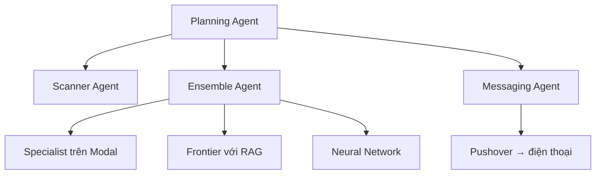
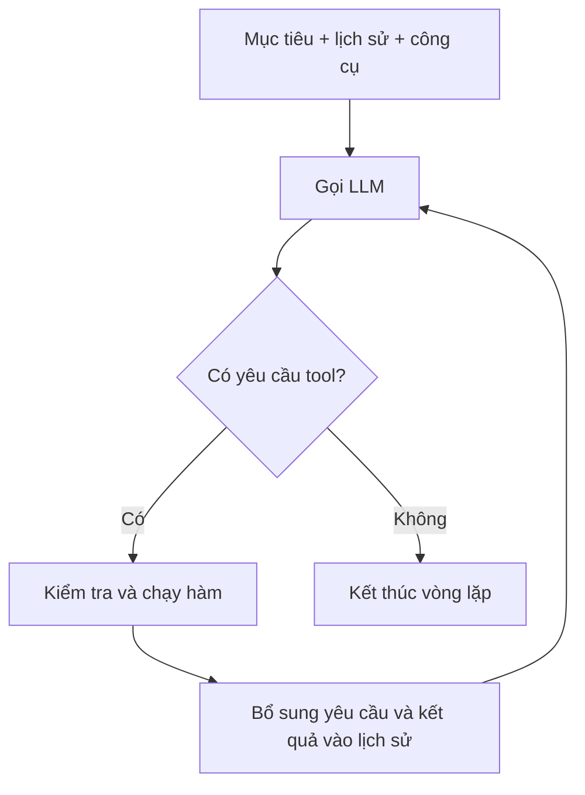

# Day 4 — Hiểu và xây dựng hệ thống AI nhiều agent

> Tài liệu giảng lại bằng tiếng Việt từ toàn bộ 4 phụ đề SRT của bài 015–018 bạn cung cấp. Đây là bản tổng hợp và giải thích, không phải bản dịch từng câu hoặc bản chép mã nguồn trên màn hình. Ví dụ số liệu và mã giả bên dưới được bổ sung để dễ học, không phải kết quả đo trong video.

## 1. Cả phần này thực sự muốn dạy điều gì?

**Bạn đã có các bộ phận biết tìm sản phẩm, ước tính giá và gửi thông báo. Bây giờ cần một bộ phận điều phối biết gọi đúng bộ phận, nhận kết quả rồi quyết định bước tiếp theo.**

Đó là mục tiêu của Day 4: xây dựng **Planning Agent — agent lập kế hoạch/điều phối** bằng **Tool Calling — cơ chế yêu cầu gọi công cụ** và **Agent Loop — vòng lặp hoạt động của agent**.

Bài toán xuyên suốt là: tìm một sản phẩm đang được bán rẻ hơn mức giá hệ thống ước tính, rồi gửi ưu đãi đáng chú ý nhất đến điện thoại người dùng.

Ví dụ dễ hình dung: bạn nhờ một trợ lý tìm laptop giá tốt. Trợ lý cần lấy danh sách đang bán, hỏi bên định giá xem từng máy đáng giá bao nhiêu, so sánh rồi nhắn cho bạn. Trong ứng dụng này, các công việc ấy được thực hiện bằng phần mềm và các mô hình.

**Kết quả cần hiểu sau khi học:** vì sao một yêu cầu ban đầu có thể dẫn đến nhiều lượt gọi mô hình, nhiều lần chạy hàm và cuối cùng tạo ra hành động thực tế.

### Mục tiêu riêng của từng bài

| Bài | Nội dung chính | Điều bạn cần rút ra |
| --- | --- | --- |
| 015 | Giới thiệu Agentic AI và kiến trúc điều phối | Hiểu bài toán, vai trò các agent và lý do cần vòng lặp |
| 016 | Tạo ba hàm giả, mô tả chúng bằng JSON và xử lý yêu cầu gọi hàm | Hiểu cơ chế Tool Calling trước khi nối các dịch vụ thật |
| 017 | Thêm prompt, chạy vòng lặp, thay hàm giả bằng agent thật | Biến những bộ phận rời rạc thành một quy trình hoàn chỉnh |
| 018 | Tổng kết lần chạy và số lượt gọi mô hình | Nhìn được độ phức tạp phía sau một thông báo đơn giản |

Tên file 016 có “GPT-4”, nhưng lời giảng ở khoảng 00:15–00:17 nói dùng GPT-5.1. Tài liệu ưu tiên nội dung phụ đề; không coi tên file là cấu hình chính xác. Tên model trong bài phản ánh bản ghi của khóa học, không phải hướng dẫn chọn model hiện tại.

## 2. Hiểu các khái niệm bằng một ví dụ chung

### LLM — mô hình ngôn ngữ lớn

LLM nhận thông tin đầu vào và sinh đầu ra. Đầu ra có thể là câu trả lời hoặc một yêu cầu có cấu trúc như “hãy gọi công cụ định giá với mô tả sản phẩm này”.

**LLM không tự chạy hàm Python chỉ vì nó viết ra tên hàm.** Chương trình bên ngoài đọc yêu cầu đó, kiểm tra rồi thực thi hàm tương ứng.

### Tool — công cụ

Tool là một khả năng ứng dụng cung cấp cho mô hình, chẳng hạn đọc danh sách ưu đãi, định giá sản phẩm hoặc gửi thông báo.

Hãy tưởng tượng bạn đưa cho trợ lý một danh mục dịch vụ: tên dịch vụ, dùng để làm gì, cần thông tin gì. Trợ lý chọn dịch vụ; hệ thống thực sự thực hiện công việc.

Một tool có thể chứa phép tính thông thường, gọi API, truy vấn dữ liệu hoặc gọi một agent khác. **Tool không nhất thiết phải dùng AI.**

### Agent — thành phần thực hiện nhiệm vụ

Trong ngữ cảnh bài học, agent là một thành phần phần mềm đảm nhận một nhiệm vụ và có thể sử dụng mô hình hoặc công cụ để hoàn thành nhiệm vụ đó.

Tên “agent” không có nghĩa mỗi thành phần là một thực thể có ý thức, cũng không có nghĩa mỗi agent tương ứng đúng một LLM. Chẳng hạn Ensemble Agent sử dụng nhiều bộ phận định giá, còn Neural Network Agent dùng mạng nơ-ron dự đoán giá.

### Planning Agent — agent điều phối

Nó nhìn mục tiêu, kết quả đã có và các công cụ được phép dùng để chọn hành động tiếp theo.

Trong video, nó không nhất thiết viết một bản kế hoạch dài trước khi làm. Việc lập kế hoạch thể hiện qua chuỗi quyết định: quét ưu đãi → yêu cầu định giá → chọn ưu đãi → yêu cầu thông báo.

### Orchestration — điều phối

Đây là việc tổ chức thứ tự chạy, chuyển dữ liệu và nhận kết quả giữa các bộ phận. Có thể điều phối bằng mã cố định hoặc cho LLM tham gia quyết định bước tiếp theo.

### Agent Loop — vòng lặp của agent

Quy trình lặp lại: hỏi mô hình → thực hiện công cụ nó yêu cầu → đưa kết quả trở lại → hỏi mô hình tiếp. Khi không còn yêu cầu công cụ, vòng lặp minh họa kết thúc.

**Một vòng `while` đơn thuần chưa đủ tạo nên agent.** Ý chính là mô hình có công cụ, nhận phản hồi từ công cụ và dùng phản hồi đó để tiếp tục hướng tới mục tiêu.

## 3. Kiến trúc: ai phụ trách việc gì?

| Thành phần | Nhiệm vụ | Kết quả chủ yếu |
| --- | --- | --- |
| Planning Agent | Điều phối quy trình bằng ba công cụ | Quyết định gọi công cụ nào tiếp theo |
| Scanner Agent | Lấy nội dung ưu đãi từ nguồn web/RSS và chọn ứng viên | Danh sách sản phẩm, mô tả, giá, liên kết theo cấu trúc |
| Ensemble Agent | Phối hợp các bộ phận định giá | Giá trị ước tính cho một sản phẩm |
| Messaging Agent | Soạn lời thông báo rồi gửi qua Pushover | Thông báo trên điện thoại |
| Specialist Agent | Dùng mô hình đã fine-tune chạy trên Modal | Một dự đoán giá |
| Frontier Agent | Dùng RAG lấy sản phẩm tương tự rồi nhờ mô hình định giá | Một dự đoán giá có dữ liệu tham khảo |
| Neural Network Agent | Dùng mạng nơ-ron đã xây trước đó | Một dự đoán giá khác |

Ba dòng cuối nằm phía sau Ensemble Agent. Planner không cần trực tiếp biết chi tiết cách từng mô hình hoạt động.

Trong sơ đồ dưới đây, mũi tên biểu diễn quan hệ gọi. Kết quả được trả lại cho thành phần gọi nó.



### Ensemble Agent làm gì bên trong?

Theo lời giảng, nó có bước chuẩn hóa mô tả sản phẩm trước khi định giá. Ví dụ, mô tả rối được viết lại có tiêu đề, danh mục và đặc điểm rõ hơn. Cấu hình trình diễn dùng GPT-OSS 20B cho bước này qua LiteLLM.

Sau đó nó sử dụng các bộ phận định giá. Nhánh Frontier mã hóa mô tả thành embedding, tìm sản phẩm tương tự trong Chroma rồi đưa dữ liệu tham khảo cho mô hình.

Cách hiểu RAG ở đây: trước khi hỏi “món này đáng giá bao nhiêu?”, hãy lấy thông tin các món tương tự cho mô hình tham khảo. Embedding là cách biểu diễn nội dung bằng dãy số phục vụ tìm kiếm tương đồng.

Day 4 dùng lại những thành phần đã xây trước đó. Phụ đề bốn bài này không trình bày lại đầy đủ công thức kết hợp giá của Ensemble, nên không nên mặc định đó là trung bình cộng.

## 4. Bài 015 — Vì sao cần agent điều phối?

Giảng viên mô tả Agentic AI theo cách thực dụng: **LLM sử dụng công cụ trong một vòng lặp để đạt mục tiêu.** Đồng thời, ông nhấn mạnh thuật ngữ này được dùng khá rộng, không phải mọi sản phẩm mang tên “agentic” đều có kiến trúc giống nhau.

Các dấu hiệu được nhắc đến gồm chia bài toán thành bước nhỏ, sử dụng công cụ, trao đổi dữ liệu có cấu trúc, có môi trường phối hợp, có bộ phận lập kế hoạch và có mức độ tự chủ.

### “Agentic trap” — bẫy chia quá nhiều agent

Đừng bắt đầu bằng việc đặt tên “giám đốc AI”, “trưởng nhóm AI”, “nhân viên AI” rồi tạo một agent cho từng vai trò. Hãy bắt đầu bằng công việc thật sự cần giải quyết.

Trong bài toán này, tìm ưu đãi, định giá và gửi thông báo là ba việc khác nhau, có đầu vào và đầu ra tương đối rõ. Việc tách chúng giúp thay thế và kiểm tra từng phần.

**Nhiều agent không tự động đồng nghĩa với hệ thống tốt hơn.** Mỗi lớp phối hợp có thể làm tăng số lượt gọi, độ trễ và cơ hội xảy ra lỗi.

### Structured Outputs có liên quan gì đến Tool Calling?

- **Structured Outputs — đầu ra có cấu trúc:** yêu cầu dữ liệu theo khuôn dạng để chương trình đọc được, chẳng hạn danh sách ưu đãi có giá dạng số.
- **Tool Calling — yêu cầu gọi công cụ:** mô hình chọn một công cụ và cung cấp các đối số theo cấu trúc.

Điểm chung là cả hai hỗ trợ giao tiếp giữa mô hình và chương trình. Điểm khác là Tool Calling còn biểu đạt một yêu cầu thực hiện hành động.

Video đề cập sự gần gũi giữa hai cơ chế. Không nên từ đó suy ra mọi nhà cung cấp đều triển khai Structured Outputs bằng cùng một cơ chế tool hoặc JSON đúng cấu trúc thì dữ liệu chắc chắn đúng sự thật.

## 5. Bài 016 — Tại sao bắt đầu bằng ba hàm giả?

Nếu nối tất cả ngay từ đầu, lỗi có thể đến từ nguồn RSS, API, model định giá, máy chủ Modal hoặc dịch vụ thông báo. Khi đó rất khó biết Planner có hoạt động đúng không.

Giảng viên tạm thay các phụ thuộc bằng hàm giả:

| Hàm | Bản giả làm gì? | Điều đang được kiểm tra |
| --- | --- | --- |
| `scan_the_internet_for_bargains` | Trả danh sách ưu đãi cố định | Planner có bắt đầu bằng việc lấy danh sách không? |
| `estimate_true_value` | Luôn trả 300 USD | Planner có gọi định giá và truyền mô tả không? |
| `notify_user_of_deal` | In thông tin và trả trạng thái giả | Planner có yêu cầu gửi thông báo với đủ dữ liệu không? |

Dữ liệu quét thử lấy từ một lần thu thập trước đó. Trong lần kiểm tra này, đó là dữ liệu cố định, không phải kết quả đang quét web trực tiếp.

**Giá 300 USD dùng để thử luồng hoạt động, không dùng để đánh giá chất lượng định giá.** Hàm thông báo giả cũng không chứng minh điện thoại đã nhận thông báo thật.

### Mô tả tool là một “hợp đồng sử dụng”

Chương trình phải nói cho mô hình biết tên công cụ, chức năng và những tham số cần truyền. Bài 016 tự viết mô tả JSON để nhìn rõ cơ chế vốn thường được framework hỗ trợ tạo tự động.

Ví dụ minh họa giản lược, không phải cấu hình SDK để chép chạy:

```json
{
  "name": "estimate_true_value",
  "description": "Ước tính giá trị của sản phẩm từ mô tả",
  "parameters": {
    "type": "object",
    "properties": {
      "description": { "type": "string" }
    },
    "required": ["description"]
  }
}
```

Công cụ thông báo trong bài cần bốn thông tin: mô tả sản phẩm, giá đang bán, giá trị ước tính và URL.

Nếu quen frontend, bạn có thể hình dung mô tả tool gần với hợp đồng API: phía gọi biết gửi trường nào, nhưng không cần biết bên trong service triển khai ra sao.

### Ai thực thi hàm?

1. Chương trình gửi mục tiêu và danh sách công cụ cho LLM.
2. LLM trả yêu cầu gọi một công cụ kèm đối số.
3. Chương trình đọc tên, kiểm tra đối số và tìm hàm được phép gọi.
4. Chương trình chạy hàm.
5. Kết quả được đưa vào lịch sử để LLM sử dụng trong lượt tiếp theo.

Trong bản thử, giảng viên dùng `globals()` để tìm hàm theo tên. Sang bài 017, ông chuyển sang một dictionary ánh xạ tên tool đến hàm. Cách thứ hai làm danh sách được phép gọi rõ ràng hơn.

Ví dụ khái niệm:

```python
allowed_tools = {
    "scan_the_internet_for_bargains": scan,
    "estimate_true_value": estimate,
    "notify_user_of_deal": notify,
}
```

Bản thân bảng ánh xạ chưa kiểm tra được giá, URL hoặc nội dung. Đó vẫn là trách nhiệm của chương trình khi nhận đối số.

## 6. Bài 017 — Prompt kết hợp với Agent Loop

### Prompt giao nhiệm vụ gì?

System message giao vai trò tìm ưu đãi bằng công cụ và thông báo ưu đãi tốt nhất. User message chỉ dẫn cụ thể:

1. Quét các ưu đãi.
2. Ước tính giá trị cho từng ưu đãi.
3. Chọn một ưu đãi nổi bật có giá bán thấp hơn đáng kể so với giá ước tính.
4. Gửi thông báo.
5. Trả lời “OK” khi hoàn thành.

Vì chỉ dẫn khá cụ thể, đây là mức tự chủ trong phạm vi nhiệm vụ đã giao. Nó không có nghĩa hệ thống được tự đặt mọi mục tiêu hoặc tự truy cập mọi công cụ.

### Vòng lặp giữ cho công việc tiếp tục như thế nào?



Mỗi lượt gọi mô hình cần được cung cấp trạng thái hội thoại phù hợp. Chương trình giữ lại yêu cầu gọi tool và kết quả tương ứng để mô hình biết chuyện gì vừa xảy ra. Nếu không đưa kết quả quét trở lại, mô hình không có danh sách thực tế để chọn sản phẩm.

**Kết thúc vòng lặp không tự động chứng minh nhiệm vụ đã thành công.** Trong minh họa, không còn tool call là dấu hiệu dừng. Với ứng dụng thật, cần kiểm tra điều kiện hoàn thành, ví dụ dịch vụ thông báo đã trả thành công và dữ liệu đã được xử lý đủ.

### Một lượt chạy minh họa bằng số dễ hiểu

Giả sử Scanner trả về:

| Sản phẩm | Giá bán | Giá ước tính | Chênh lệch |
| --- | ---: | ---: | ---: |
| Tai nghe A | 60 USD | 90 USD | 30 USD |
| Màn hình B | 170 USD | 240 USD | 70 USD |
| Laptop C | 650 USD | 850 USD | 200 USD |

Planner lấy danh sách, yêu cầu định giá rồi so sánh. Nếu tiêu chí là chênh lệch tiền tuyệt đối lớn nhất, laptop C đứng đầu.

Nhưng nếu dùng tỷ lệ chênh lệch trên giá ước tính, tai nghe A đạt khoảng 33,3%, màn hình B khoảng 29,2%, laptop C khoảng 23,5%. Hai cách xếp hạng cho kết quả khác nhau.

Đây là phần giải thích bổ sung: prompt “ưu đãi hấp dẫn nhất” chưa tự định nghĩa một công thức duy nhất. Khi cần kết quả nhất quán, hãy quy định tiêu chí rõ hoặc tính điểm bằng code.

Và “true value” trong tên hàm vẫn chỉ là **giá trị do mô hình ước tính**. Không nên hiểu chênh lệch trên là khoản tiền chắc chắn tiết kiệm được hoặc lợi nhuận chắc chắn có thể thu về.

### Một chi tiết quan trọng ở lần chạy giả

Khoảng 03:30 của bài 017, giảng viên nhận xét có vẻ lấy được năm ưu đãi nhưng chỉ định giá bốn. Ông dùng điều này để nói về tính tự chủ.

Về yêu cầu phần mềm, nếu nhiệm vụ bắt buộc là định giá mọi ưu đãi, việc bỏ sót vẫn cần được phát hiện. Bài học nên rút ra là: **LLM có thể lựa chọn hành động không hoàn toàn khớp chỉ dẫn; cần kiểm tra tính đầy đủ khi điều đó quan trọng.**

Không nên diễn giải mọi sai khác so với prompt thành một quyết định thông minh.

### Thay hàm giả bằng chức năng thật

Planner vẫn thấy ba công cụ có cùng vai trò. Thay đổi nằm ở phần triển khai:

| Công cụ | Chức năng thật phía sau |
| --- | --- |
| Quét ưu đãi | Gọi `scanner.scan()` |
| Ước tính giá trị | Gọi `ensemble.price()` |
| Thông báo ưu đãi | Gọi `messenger.notify()` |

Đây là ý tưởng kỹ thuật rất quan trọng: **giữ giao diện ổn định, thay phần thực hiện bên trong.** Planner không cần “biết” rằng tool định giá gọi tiếp nhiều mô hình.

Trong lần chạy thật được kể ở cuối bài 017, Scanner lấy nội dung RSS, chọn năm ưu đãi theo Structured Outputs, các sản phẩm được định giá và cuối cùng điện thoại nhận thông báo về một chiếc Dell 16 Plus Ultra. Specialist chạy trên Modal có thời gian khởi động được giảng viên mô tả khoảng 30 giây trong lần chạy đó; đây không phải độ trễ cố định cho mọi lần sử dụng.

## 7. Mã giả để hiểu cơ chế, không phụ thuộc SDK

Đoạn dưới là **mã giả Python**: tên hàm, thuộc tính phản hồi và các hàm kiểm tra được đặt để diễn đạt ý tưởng, chưa phải chương trình có thể chạy trực tiếp. Giới hạn số lượt và kiểm tra đầu vào là phần bổ sung cho việc học.

```python
history = [system_instruction, user_goal]
max_rounds = 10

for _ in range(max_rounds):
    reply = call_model(history, tool_definitions)
    history.append(reply)

    if not reply.tool_calls:
        return check_task_outcome(reply, run_state)

    for request in reply.tool_calls:
        function = allowed_tools.get(request.name)
        if function is None:
            raise ValueError("Công cụ không được phép")

        arguments = parse_and_validate(request.arguments)
        result = function(**arguments)
        history.append(tool_result(request.id, result))

raise RuntimeError("Đã đạt giới hạn lượt xử lý")
```

Bạn chỉ cần đọc theo nghĩa: hỏi mô hình, lưu phản hồi, thực thi từng yêu cầu hợp lệ, lưu kết quả rồi hỏi tiếp.

Một phản hồi có thể yêu cầu nhiều công cụ. Vòng `for` minh họa xử lý từng yêu cầu; điều này không chứng minh các công cụ thực thi song song. Muốn chạy song song cần cơ chế thực thi riêng và phải xét các bước có phụ thuộc nhau hay không.

## 8. Bài 018 — Vì sao một thông báo cần 34 lượt gọi?

Giảng viên tự tổng kết lần chạy là **34 lượt gọi mô hình**, gồm **29 lượt được ông gọi là LLM và 5 lượt mạng nơ-ron**. Ông cũng diễn đạt đây là phép đếm của mình, không cung cấp trong phụ đề một bảng log đầy đủ để tái tính độc lập.

Hãy hiểu đây là con số của lần trình diễn, không phải công thức cố định. Không nên tự dựng một bảng phân bổ chính xác 29 lượt khi nguồn chưa có đủ dữ liệu.

Số lượt tăng vì:

- Planner phải gọi lại mô hình sau khi nhận kết quả công cụ.
- Scanner dùng mô hình để chọn và cấu trúc dữ liệu.
- Mỗi sản phẩm có bước tiền xử lý và nhiều nhánh định giá.
- Nhánh RAG có bước tạo embedding và dùng mô hình với dữ liệu truy xuất.
- Messaging Agent dùng mô hình soạn thông báo.

### Phân biệt các đơn vị đang được đếm

| Khái niệm | Ý nghĩa |
| --- | --- |
| Một model | Một mô hình cụ thể được sử dụng |
| Một model call | Một lần thực hiện suy luận với mô hình |
| Một agent | Thành phần phụ trách nhiệm vụ; có thể gọi model nhiều lần |
| Một tool call | Yêu cầu chạy công cụ; công cụ có thể không dùng model hoặc gọi nhiều model |

**34 lượt gọi không phải 34 agent hoặc 34 mô hình khác nhau.**

Video nhắc các mô hình dịch vụ như GPT-5, GPT-5.1, Claude; đồng thời nhắc mô hình specialist đã fine-tune, encoder `all-MiniLM-L6-v2`, GPT-OSS 20B và mạng nơ-ron định giá. Encoder tạo embedding có vai trò khác mô hình hội thoại sinh văn bản; vì vậy cần thận trọng với cách gọi gộp mọi lượt là “LLM”.

Một hệ thống nhiều model vẫn có thể chỉ giải quyết một bài toán hẹp. Số lượng model không chứng minh chất lượng vượt trội. Muốn biết cấu hình có đáng dùng không phải đo độ chính xác, thời gian xử lý, chi phí và tỷ lệ thông báo hữu ích.

Giảng viên cũng khuyên giảm độ phức tạp nếu có lỗi: tạm dùng một model định giá rồi mở rộng dần.

## 9. Tự chủ tới mức nào? Đã có memory chưa?

Ở Day 4, bạn thấy một lượt thực hiện nhiệm vụ trong đó mô hình chọn các công cụ để tiếp tục công việc. Đó là khả năng tự chủ trong một lần chạy có mục tiêu và công cụ giới hạn.

Cần phân biệt:

| Thành phần | Mục đích |
| --- | --- |
| Lịch sử trong vòng lặp | Giúp mô hình biết yêu cầu và kết quả các bước của lần chạy hiện tại |
| Memory qua nhiều lần chạy | Ghi nhớ thông tin lâu hơn, chẳng hạn ưu đãi đã thông báo |
| Scheduler — bộ lập lịch | Khởi động tác vụ theo giờ hoặc sự kiện |
| Dịch vụ chạy nền | Duy trì khả năng thực hiện tác vụ khi không có cuộc chat trực tiếp |

Có vòng lặp chưa có nghĩa hệ thống tự chạy 24/7. Có database sản phẩm tham khảo cũng chưa chứng minh đã có bộ nhớ ghi nhận các thông báo trước đây.

Cuối bài 018, giảng viên nói memory sẽ được bổ sung ở ngày tiếp theo; bài 015 cũng hẹn phần framework và giao diện. Vì vậy không nên coi các tính năng ấy là đã hoàn tất trong bốn bài này.

## 10. So với một workflow viết bằng code thì khác gì?

| Cách làm | Ai quyết định bước tiếp theo? | Điểm mạnh | Điều phải cân nhắc |
| --- | --- | --- | --- |
| Workflow cố định | Code của lập trình viên | Dễ kiểm soát thứ tự và kiểm tra điều kiện | Kém linh hoạt nếu trường hợp xử lý rất đa dạng |
| Planner bằng LLM | Mô hình chọn tool từ ngữ cảnh | Thích nghi với kết quả trung gian | Có thể bỏ bước, lặp lại hoặc chọn chưa đúng |
| Kết hợp | Code giữ quy tắc bắt buộc, LLM xử lý phần cần diễn giải | Cân bằng kiểm soát và linh hoạt | Cần xác định ranh giới trách nhiệm |

Với nhiệm vụ luôn là quét → định giá hết → tính điểm → gửi một thông báo, code thông thường cũng thực hiện được. Giá trị học tập của video là giúp bạn hiểu cách LLM điều phối qua tools, không phải chứng minh mọi bước phải giao cho LLM.

Phần bổ sung thực tế: để code tính chênh lệch, kiểm tra đã định giá đủ và chống gửi trùng; để mô hình hiểu mô tả, xử lý nội dung không đồng nhất và viết thông báo. Đây là một cách phân chia trách nhiệm hợp lý để thử nghiệm.

## 11. Những kiểm soát liên quan trực tiếp đến bài toán

Các ý dưới đây là bổ sung khi chuyển từ bài demo sang ứng dụng; không phải khẳng định video đã triển khai chúng.

- **Giới hạn lượt chạy:** tránh vòng lặp kéo dài do mô hình tiếp tục yêu cầu tool.
- **Kiểm tra kết quả thực:** phân biệt “mô hình nói OK” với “thông báo gửi thành công”.
- **Kiểm tra dữ liệu:** giá phải hợp lệ, so sánh cùng đơn vị tiền và mô tả đúng sản phẩm/phiên bản.
- **Xử lý không có ưu đãi tốt:** cho phép không gửi thông báo, thay vì ép chọn một món bất kỳ.
- **Chống thông báo trùng:** nếu có retry hoặc nhiều lần chạy, dùng trạng thái lưu bền vững để tránh gửi lại.
- **Giữ nội dung web ở vai trò dữ liệu:** nội dung ưu đãi không được tự biến thành chỉ thị đổi mục tiêu hoặc dùng công cụ ngoài phạm vi.

Mục đích của các kiểm soát này là làm quy trình đáng tin cậy hơn, vì đầu ra ngôn ngữ hợp lý chưa đủ đảm bảo hành động đúng.

## 12. Cách học phần này mà không bị ngợp

Hãy đi qua bốn mức, mỗi mức trả lời một câu hỏi:

1. **Hiểu bài toán:** đầu vào là danh sách ưu đãi; đầu ra là một thông báo hữu ích.
2. **Hiểu ba tool giả:** mô hình yêu cầu gọi hàm thế nào, ai thực thi và kết quả đi đâu?
3. **Hiểu vòng lặp:** tại sao phải gọi mô hình lại sau mỗi đợt thực thi công cụ?
4. **Hiểu tích hợp:** khi thay hàm giả bằng agent thật, phần nào thay đổi và phần nào giữ nguyên?

Chưa cần nhớ tên mọi model, cấu hình cloud hoặc toàn bộ JSON để hiểu được cơ chế. Những chi tiết ấy quan trọng khi triển khai, nhưng không phải ý tưởng trung tâm của Day 4.

### Tự kiểm tra nhanh

**1. LLM có trực tiếp gửi thông báo không?**
Không. Nó yêu cầu tool; chương trình thực thi chức năng gửi thông báo.

**2. Tại sao phải đưa kết quả tool vào lịch sử?**
Để mô hình có thông tin mới mà chọn bước tiếp theo.

**3. Planner có phải biết Ensemble dùng bao nhiêu model không?**
Không nhất thiết. Nó cần biết hợp đồng của tool định giá.

**4. Nếu model trả “OK”, đã chắc tìm được ưu đãi tốt chưa?**
Chưa. Phải kiểm tra dữ liệu, tiêu chí lựa chọn và kết quả hành động.

**5. Đây có phải huấn luyện một ChatGPT mới từ đầu không?**
Không. Day 4 tích hợp các mô hình và thành phần đã có; mô hình specialist được fine-tune từ phần học trước.

## 13. Các mốc để quay lại phụ đề

| Bài và mốc gần đúng | Nội dung nên xem lại |
| --- | --- |
| 015, 00:13–01:19 | Mục tiêu và cách định nghĩa agent bằng vòng lặp công cụ |
| 015, từ 01:45 | Cảnh báo “agentic trap” |
| 016, từ 01:30 | Ba hàm giả để kiểm tra cơ chế |
| 017, từ 01:10 | Vòng lặp `while not done` |
| 017, khoảng 03:30 | Nhận xét về việc không định giá đủ mọi ưu đãi ở lần thử |
| 017, từ 05:45 | Dictionary ánh xạ tool đến hàm |
| 017, từ 08:28 | Lần chạy thật nhận năm ưu đãi được chọn |
| 018, từ 00:08 | Tổng kết 34 lượt gọi mô hình |
| 018, từ 02:35 | Memory được hẹn bổ sung trong bài tiếp theo |

**Ý cần nhớ:** Day 4 dạy cách nối các năng lực AI thành một quy trình có mục tiêu: mô hình chọn công cụ, chương trình chạy công cụ, kết quả quay lại mô hình và chu trình tiếp tục cho tới khi dừng.
